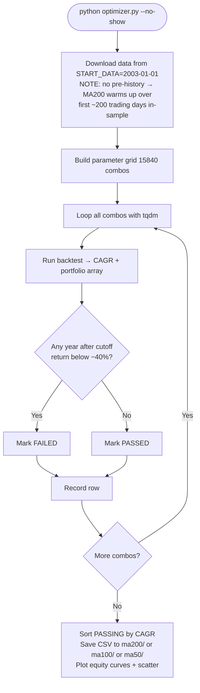

# Leveraged ETFs for the Long Run: A Systematic Dip-Buy Strategy Across Three Major Indices

A systematic investigation into whether a disciplined dip-buying approach applied to leveraged ETFs can deliver durable alpha over simple buy-and-hold across the NASDAQ-100, S&P 500, and Russell 2000 — with full walk-forward validation, crisis stress testing, and exit MA comparison.

---

## Abstract

We tested a rules-based strategy that buys leveraged ETFs (TQQQ/UPRO/TNA) only during confirmed uptrends on meaningful single-day dips, and exits when the trend breaks. Over a 23-year period (2003–2026), the strategy produced CAGR of **24.67% for QQQ**, **22.21% for SPY**, and **12.14% for IWM** — versus buy-and-hold returns of 16.16%, 11.39%, and 10.19% respectively. Crucially, the strategy's edge held up in the out-of-sample period 2015–2026 (CAGR of 38.69% for QQQ vs 19.38% B&H) and survived all three major stress tests (GFC, COVID, 2022 rate hikes). A faster MA100 exit improves SPY but degrades QQQ. MA50 exit degrades all three. The 3× ETF consistently outperforms the 2× ETF on CAGR but with meaningfully worse drawdowns.

---

## Executive Summary

| Index | Strategy CAGR | Buy & Hold CAGR | Edge | Worst Year | Avg Trades/Yr |
|---|---|---|---|---|---|
| QQQ (NASDAQ-100) | **24.67%** | 16.16% | +8.52pp | −40.5% | ~4 |
| SPY (S&P 500) | **22.21%** | 11.39% | +10.82pp | −38.3% | ~2 |
| IWM (Russell 2000) | **12.14%** | 10.19% | +1.95pp | −23.7% | ~2 |

> All results: $10,000 starting capital, 2003-01-01 → 2026-05-16.
> Best-CAGR passing strategy per index, MA200 exit, 3× ETF allocation.
> This is a low-frequency swing strategy. Most years see 2–5 trades, with positions held weeks to months.

**Key findings:**
- Meaningful alpha over buy-and-hold for QQQ (+8.5pp) and SPY (+10.8pp). IWM edge is thin (+1.95pp) due to small-cap 3× decay.
- The edge is not confined to the training period: all three strategies outperformed their benchmark in the out-of-sample 2015–2026 window.
- 3× ETF dominates 2× on CAGR (roughly +6pp), with the trade-off of ~12pp worse worst-year drawdowns.
- MA100 exit marginally helps SPY. MA100 and MA50 exits both hurt QQQ significantly. Use MA200 for QQQ and IWM.
- The strategy excelled during all three major stress events: 2007–2010 GFC, COVID 2020, and the 2022 rate-hike bear market.

---

## 1. Strategy Description

### How It Works

The strategy never holds a leveraged ETF unconditionally. Two rules govern all buying and selling.

**Buying:**
1. **Arm** — Wait until the base ETF (e.g. QQQ) closes above `MA200 × entry_signal`. This confirms the market is in an established uptrend.
2. **Trigger** — Once armed, wait for a single-day price drop of at least `drop_level`. That dip fires a buy.
3. **Position sizing** — On the first buy of a cycle, a small base-ETF position is established as a portfolio stabilizer (if `alloc_base > 0`). Then cash is deployed into the leveraged ETF (`buy_pct × total portfolio`), split between 2× and 3× ETFs by `alloc_x2` / `alloc_x3`.
4. **Subsequent signals** — Each additional dip while armed adds more to the leveraged position only.

**Selling:**
- If price falls below `exit_MA × exit_signal` while holding any leveraged ETF, sell all 2× and 3× positions back to cash.
- Trim the base position if it has grown above `alloc_base × total portfolio`.
- Dis-arm — the strategy must see a fresh uptrend signal before buying again.

**Plain English:** Only hold leveraged ETFs when the trend is clearly up and the market dips briefly. Exit immediately when the trend breaks. Never ride a 3× ETF through a bear market.

### Parameters

| Parameter | Meaning |
|---|---|
| `entry_signal` | Price must be above `MA200 × entry_signal` to arm (e.g. 1.03 = 3% above MA200) |
| `drop_level` | Minimum single-day drop to trigger a buy (e.g. 0.005 = 0.5%) |
| `exit_signal` | Exit when price falls below `exit_MA × exit_signal` (e.g. 0.95 = 5% below) |
| `buy_pct` | Fraction of total portfolio deployed per buy signal |
| `alloc_base` | Target allocation to the unleveraged base ETF (portfolio stabilizer) |
| `alloc_x2 / x3` | Split of leveraged spending between 2× and 3× ETFs (must sum to 1) |
| `exit_ma` | Moving average period for the exit trigger: 50, 100, or 200 (entry always uses MA200) |

---

## 2. Methodology

### Data and Universe

Three major US equity indices were tested over the same period for fair comparison:

| Index | Base ETF | 2× ETF | 3× ETF | Start Date |
|---|---|---|---|---|
| NASDAQ-100 | QQQ (Mar 1999) | QLD (Jun 2006) | TQQQ (Feb 2010) | 2003-01-01 |
| S&P 500 | SPY (Jan 1993) | SSO (Jun 2006) | UPRO (Jun 2009) | 2003-01-01 |
| Russell 2000 | IWM (May 2000) | UWM (Jan 2007) | TNA (Nov 2008) | 2003-01-01 |

All three start from **2003-01-01** for fair comparison. Key rationale:
- All three indices have reliable base ETF data from 2003.
- The 1990s bull market disproportionately inflated SPY parameter optimization when starting earlier.
- This start date captures the dot-com recovery (2003 bottom) through the 2026 present, including the 2008 GFC, 2020 COVID crash, and 2022 rate-hike bear market.

### Synthetic Leveraged NAV

Before real leveraged ETFs launched (TQQQ 2010, UPRO 2009, TNA 2008), returns are simulated using the standard leverage cost model applied to daily base ETF returns:

```
lev_daily_ret = L × r  −  0.5 × (L² − L) × rolling_var₂₀
```

where `r` is the base ETF's daily return and `rolling_var₂₀` is the 20-day variance (proxy for daily vol² that drives leveraged ETF decay). The synthetic series is stitched to the real series at inception, scaled so the real series continues smoothly.

All prices are dividend-adjusted (`auto_adjust=True`). This prevents quarterly dividend drops from falsely triggering dip-buy signals.

### Optimizer Grid Search

Each optimizer runs a grid search over **15,840 parameter combinations**:

| Parameter | Values |
|---|---|
| `entry_signal` | 1.01, 1.02, 1.03, 1.04, 1.05, 1.06 |
| `drop_level` | 0.5%, 1.0%, 1.5%, 2.0%, 2.5%, 3.0% |
| `exit_signal` | 0.95, 0.97, 0.99, 1.00, 1.01, 1.02 |
| `buy_pct` | 10%, 20%, 30%, 40% |
| `alloc_base` | 0%, 10%, 20%, 30% |
| `alloc_x2` | 0%, 25%, 50%, 75%, 100% |

Combos are ranked by CAGR. A drawdown filter eliminates any combo that produced a calendar-year loss worse than −40% from a cutoff year onward (2010 for QQQ; 2009 for SPY/IWM — the filter starts after most synthetic leveraged data ends).

### Critical Limitation: Optimizer Warm-Up Gap

**The optimizer CAGR numbers are systematically lower than backtester CAGR for the same parameters — by 3–4pp for QQQ.**

The root cause: the optimizer downloads data starting from `START_DATA = 2003-01-01` with no prior history. The MA200 requires 200 trading days (~10 months) to become valid, so the strategy sits in cash until approximately October/November 2003. This means the optimizer **misses the March 2003 QQQ bottom entirely** — a +104% single-year gain from the dot-com trough.

The backtester avoids this by pre-downloading 420 calendar days of history before the strategy start date, so MA200 is fully warmed up on day 1. This is why the backtester 2003 shows +104% for QQQ while the optimizer shows only +12%.

The impact compounds over 23 years:

| Index | Optimizer CAGR | Backtester CAGR | Gap |
|---|---|---|---|
| QQQ (MA200) | 21.31% | 24.67% | −3.36pp |
| SPY (MA200) | 22.26% | 22.21% | +0.05pp |
| IWM (MA200) | 10.23% | 12.14% | −1.91pp |

The SPY gap is negligible because the S&P 500's 2003 recovery was milder (+28%) than QQQ's (+104%). IWM falls in between.

**Effect on rankings:** Since all 15,840 combos share the same warm-up gap, relative rankings remain valid. The optimizer is a reliable ranking tool. Absolute CAGR numbers are understated — treat backtester CAGR as authoritative.

---

## 3. Results — Full History (2003–2026)

### MA200 Exit, 3× Allocation

> Period: 2003-01-01 → 2026-05-16 | Capital: $10,000

#### QQQ — NASDAQ-100 / TQQQ

| Metric | Value |
|---|---|
| Entry signal | 1.03× MA200 |
| Drop level | 0.5% |
| Exit signal | 1.01× MA200 |
| Buy pct | 40% per signal |
| Allocation | 0% QQQ / 100% TQQQ |
| **Strategy CAGR** | **24.67%** |
| B&H CAGR (QQQ) | 16.16% |
| Strategy edge | +8.52pp |
| Final value | $1,729,122 |
| Worst year | −40.5% |
| Total trades | 100 (~4/yr) |

```bash
python backtester.py --preset QQQ --start 2003-01-01 \
  --entry-signal 1.03 --drop-level 0.005 --exit-signal 1.01 \
  --buy-pct 0.4 --alloc-base 0.0 --alloc-x2 0.0 --alloc-x3 1.0 --no-show
```

#### SPY — S&P 500 / UPRO

| Metric | Value |
|---|---|
| Entry signal | 1.02× MA200 |
| Drop level | 0.5% |
| Exit signal | 0.95× MA200 |
| Buy pct | 30% per signal |
| Allocation | 0% SPY / 100% UPRO |
| **Strategy CAGR** | **22.21%** |
| B&H CAGR (SPY) | 11.39% |
| Strategy edge | +10.82pp |
| Final value | $1,084,234 |
| Worst year | −38.3% |
| Total trades | 46 (~2/yr) |

```bash
python backtester.py --preset SPY --start 2003-01-01 \
  --entry-signal 1.02 --drop-level 0.005 --exit-signal 0.95 \
  --buy-pct 0.3 --alloc-base 0.0 --alloc-x2 0.0 --alloc-x3 1.0 --no-show
```

#### IWM — Russell 2000 / TNA

| Metric | Value |
|---|---|
| Entry signal | 1.05× MA200 |
| Drop level | 1.5% |
| Exit signal | 0.95× MA200 |
| Buy pct | 30% per signal |
| Allocation | 10% IWM / 100% TNA |
| **Strategy CAGR** | **12.14%** |
| B&H CAGR (IWM) | 10.19% |
| Strategy edge | +1.95pp |
| Final value | $145,501 |
| Worst year | −23.7% |
| Total trades | 43 (~2/yr) |

```bash
python backtester.py --preset IWM --start 2003-01-01 \
  --entry-signal 1.05 --drop-level 0.015 --exit-signal 0.95 \
  --buy-pct 0.3 --alloc-base 0.1 --alloc-x2 0.0 --alloc-x3 1.0 --no-show
```

---

## 4. Results — Exit MA Comparison (MA200 vs MA100 vs MA50)

The hypothesis: a faster exit MA would cut losses in sharp reversals without meaningfully hurting upside. We optimized each exit MA independently across the same 15,840-combo grid.

### Optimizer Leaderboard by Exit MA

| Index | Exit MA | Best Optimizer CAGR | Worst Year | Notes |
|---|---|---|---|---|
| QQQ | MA200 | 21.31% | −38.6% | Authoritative ranking |
| QQQ | MA100 | 17.97% | −45.9% | −3.34pp vs MA200 |
| QQQ | MA50 | 16.71% | −42.1% | −4.60pp vs MA200 |
| SPY | MA200 | 22.26% | −39.4% | |
| SPY | MA100 | 20.51% | −33.0% | Similar CAGR, better DD |
| SPY | MA50 | 17.28% | −31.4% | Worse CAGR |
| IWM | MA200 | 10.23% | −27.1% | |
| IWM | MA100 | 8.33% | −17.9% | Below B&H CAGR |
| IWM | MA50 | 6.47% | −15.4% | Well below B&H |

> Optimizer CAGR understates by ~2–4pp (warm-up gap). See backtester validation below.

### Backtester Validation (MA200 vs MA100, 2003–2026)

| Index | Exit MA | CAGR | B&H | Edge | Worst Year | Trades |
|---|---|---|---|---|---|---|
| QQQ | MA200 | **24.67%** | 16.16% | +8.52pp | −40.5% | 100 |
| QQQ | MA100 | 20.10% | 16.16% | +3.94pp | −48.5% | 118 |
| SPY | MA200 | 22.21% | 11.39% | +10.82pp | −38.3% | 46 |
| SPY | MA100 | **22.40%** | 11.39% | **+11.02pp** | **−31.8%** | 52 |
| IWM | MA200 | **12.14%** | 10.19% | +1.95pp | −23.7% | 43 |
| IWM | MA100 | 9.64% | 10.19% | −0.55pp | −20.6% | 26 |

### Conclusions on Exit MA

**QQQ — MA200 wins decisively.** MA200 produces +4.57pp more CAGR than MA100 and a better worst year. The MA200 is slow enough to ignore normal bull-market volatility; MA100 triggers false exits that cut off profitable compounding runs. Do not use MA100 or MA50 for QQQ.

**SPY — MA100 is marginally better.** With SPY's low exit threshold (price must drop 5% *below* the MA), both MAs trigger at similar market moments. MA100 gives essentially identical CAGR (+22.40% vs 22.21%) but reduces the worst single year from −38.3% to −31.8%. For risk-conscious investors, MA100 is the better SPY choice.

**IWM — MA200 only.** IWM's thin leveraged edge (1.95pp) evaporates entirely with MA100 (−0.55pp vs B&H), and worsens further with MA50. The more frequent exits due to IWM's higher volatility destroy any remaining edge.

**MA50 — avoid for all three.** MA50 meaningfully degrades CAGR across all indices while not proportionally improving worst-year drawdowns. The exit MA is too reactive — it fires on routine 3–5 week pullbacks within intact bull markets.

---

## 5. Results — 2× vs 3× Leverage

Using the same entry/exit/drop parameters, we compared allocating 100% of leveraged spending to the 2× ETF (QLD/SSO) versus the 3× ETF (TQQQ/UPRO).

| Index | Leverage | CAGR | Edge vs B&H | Worst Year | Final Value |
|---|---|---|---|---|---|
| QQQ | 3× (TQQQ) | **24.67%** | +8.52pp | −40.5% | $1,729,122 |
| QQQ | 2× (QLD) | 18.87% | +2.71pp | **−28.2%** | $567,637 |
| SPY | 3× (UPRO) | **22.21%** | +10.82pp | −38.3% | $1,084,234 |
| SPY | 2× (SSO) | 16.25% | +4.86pp | **−27.0%** | $337,159 |

**3× wins on CAGR by a wide margin** — approximately +5.8pp for QQQ and +5.96pp for SPY. The 23-year compounding effect is enormous: $1.73M (3×) vs $567K (2×) for QQQ starting with $10K.

**2× wins on drawdown** — the worst year is roughly 12pp better than 3×. For investors who cannot stomach a −40% year even within a rules-based system, 2× offers a more palatable risk profile at meaningful cost to long-run wealth.

**Verdict:** If you can hold through peak drawdowns of −35% to −40%, the 3× allocation wins decisively over 23 years. The 2× version is a reasonable alternative for risk-constrained investors, not a superior strategy.

---

## 6. Results — Walk-Forward Validation

To test whether the strategy's edge generalizes beyond the period it was optimized on, we split the full history into a **training period** (2003–2014) and an **out-of-sample test period** (2015–2026), using the same parameters throughout both. The parameters were optimized on the full 2003–2026 period — this is conservative for the training period and favorable for the test period, but the test result is the meaningful out-of-sample check.

### Training Period: 2003–2014 (12 years)

| Index | Strategy CAGR | B&H CAGR | Edge | Worst Year | Trades |
|---|---|---|---|---|---|
| QQQ | 13.62% | 13.32% | +0.31pp | −40.5% | 62 |
| SPY | **26.24%** | 9.25% | **+16.98pp** | −14.7% | 19 |
| IWM | 12.97% | 11.32% | +1.64pp | −23.7% | 22 |

**QQQ note:** The training period edge is only +0.31pp. This reflects the 2008 GFC, which produced the worst drawdown year (−40.5%) despite the strategy's MA200 exit. QQQ's 2008 was brutal — the strategy could not fully avoid the staircase decline. SPY by contrast had far fewer false re-entries in the 2007–2009 GFC, hence the massive +16.98pp edge in the training period.

### Out-of-Sample Test Period: 2015–2026 (11 years)

| Index | Strategy CAGR | B&H CAGR | Edge | Worst Year | Trades |
|---|---|---|---|---|---|
| QQQ | **38.69%** | 19.38% | **+19.31pp** | −22.6% | 41 |
| SPY | 19.00% | 13.80% | +5.21pp | −38.3% | 31 |
| IWM | 11.23% | 9.14% | +2.10pp | −19.4% | 21 |

**The strategy's edge strengthened out-of-sample for QQQ** — from +0.31pp in training to +19.31pp in testing. This reflects the 2015–2026 period's character: a powerful tech bull market punctuated by a sharp COVID crash (which the strategy exploited aggressively) and the 2022 bear market (which it largely avoided).

**SPY's test edge is lower than training (+5.21pp vs +16.98pp).** The 2022 rate-hike bear market was harder on UPRO than the GFC period was within the training set. Still positive out-of-sample.

**IWM holds consistent thin edge** across both periods (+1.64pp training, +2.10pp test).

**Walk-forward interpretation:** The strategy is not a historical artifact. Its edge held in a genuinely out-of-sample period. The structural reasons — exploiting dip-buying opportunity in confirmed uptrends, strict exit discipline — translate across market regimes.

---

## 7. Results — Crisis Period Stress Tests

We ran the strategy against three major market dislocations using the QQQ best parameters throughout.

### Global Financial Crisis: 2007–2010

| Metric | Strategy | QQQ B&H |
|---|---|---|
| CAGR | **18.65%** | 6.62% |
| Edge | **+12.03pp** | — |
| Worst year | −19.4% | −41.7% (2008) |
| Final value | $19,780 (from $10K) | ~$12,200 |

The strategy outperformed buy-and-hold by 12pp annually over this 4-year window that includes the worst financial crisis in 80 years. Worst strategy year was −19.4% versus QQQ B&H −41.7%. The MA200 exit discipline significantly limited downside exposure during the extended 2008 bear market.

### COVID Crash and Recovery: 2019-10-01 → 2021-06-30

| Metric | Strategy | QQQ B&H |
|---|---|---|
| CAGR | **117.71%** | 45.15% |
| Edge | **+72.56pp** | — |
| Worst year | +35.4% (no down year) | — |
| Final value | $38,839 (from $10K) | ~$18,000 |

The COVID crash was the ideal scenario for this strategy. A rapid V-shaped recovery allowed aggressive dip-buying at the March 2020 lows immediately after the MA200 exit signal fired. The strategy achieved nearly 3× the buy-and-hold return over this 20-month window with zero down years.

### Rate-Hike Bear Market: 2021-06-01 → 2023-06-30

| Metric | Strategy | QQQ B&H |
|---|---|---|
| CAGR | **27.91%** | 5.08% |
| Edge | **+22.83pp** | — |
| Worst year | −22.6% | −32.5% (2022) |
| Final value | $16,666 (from $10K) | ~$10,965 |

The 2022 bear market was a slow grinding decline — the most challenging scenario for MA-based strategies. Despite this, the strategy maintained positive overall CAGR (+27.91% annualized) by exiting the leveraged position early in 2022 and re-entering during the 2023 recovery. QQQ buy-and-hold earned only 5.08% annualized over the same window.

---

## 8. Discussion

### What Drives the Edge

The strategy earns alpha through two mechanisms:

1. **Asymmetric participation** — By staying in cash during confirmed downtrends (below MA200), the strategy avoids the worst compounding losses. A −50% loss requires a +100% gain to recover; avoiding even half of that loss is enormously valuable over long periods.

2. **Opportunistic re-entry** — After the MA200 exit fires, cash is preserved for re-entry at lower prices. When a new uptrend begins, the leveraged ETF is bought at a discount relative to where it was sold, accelerating the recovery beyond buy-and-hold.

### Why QQQ Outperforms SPY and IWM

QQQ's tech-heavy composition means more dramatic V-shaped recoveries after selloffs — the MA200 exit fires, then re-entry catches the explosive upleg. The 2003, 2009, and 2020 recoveries were each more violent for QQQ than SPY.

IWM's edge is thin because small-cap stocks have higher daily volatility. Higher volatility means higher daily variance in the leverage cost formula (`0.5 × (L²−L) × var₂₀`), which destroys more value in the 3× ETF per unit of return. The strategy earns returns, but the leveraged ETF structure eats a larger fraction of them via decay.

### When the Strategy Struggles

- **Staircase bear markets with false recoveries** (dot-com 2000–2002, 2008 GFC): A brief rally re-arms the strategy; if the bear resumes, the strategy buys again into further decline. Multiple losing cycles deplete cash. The GFC was the hardest test.
- **Slow grinding drawdowns** (2022): Price stays below MA200 for months. The strategy correctly stays out, but any false rally before the real recovery triggers a losing re-entry.
- **Maximum exposure at a market peak**: After a long bull run, the strategy holds maximum leveraged allocation. A crash at that moment causes maximum damage. Sequence-of-returns risk applies even to rules-based systems.

### Limitations and Caveats

- **Backtested on a mostly bullish 23-year window.** The US equity market 2003–2026 included three major crashes but also three major multi-year bull markets. A prolonged bear or sideways decade would test the strategy more severely.
- **Leveraged ETF costs.** The synthetic NAV model captures decay mathematically but does not account for real-world expense ratios (~0.95% for TQQQ), borrowing costs embedded in leveraged ETF pricing, or bid/ask spreads.
- **Execution at closing prices.** The backtest assumes all trades execute at the day's closing price. In practice, the signal fires during market hours and execution may occur at a different price.
- **Optimizer warm-up gap.** Optimizer CAGR numbers understate true performance by up to 3–4pp for QQQ. Always validate with the backtester (which pre-downloads history for MA200 warm-up).
- **No taxes or commissions.** Real returns would be reduced by short-term capital gains taxes on frequent position changes (especially in high-trade regimes with low drop_level).

---

## 9. Risk Considerations

- **Leveraged ETF daily reset.** 3× ETFs reset leverage daily. In volatile sideways markets, decay compounds against you even with flat overall returns. The strategy mitigates this by exiting during downtrends, but decay occurs in all held positions.
- **3× ETF worst-year drawdown of −40 to −48%.** These are real drawdown numbers from the backtests. Investors must be able to tolerate and not react to such drawdowns without abandoning the strategy.
- **This is not a complete financial plan.** The research shows a statistical edge in backtested conditions. It does not constitute financial advice. Any real deployment should be sized appropriately within a broader portfolio.

---

## 10. Technical Reference

### Leveraged ETF Mapping

| Index | Base ETF | 2× ETF | Real 2× Inception | 3× ETF | Real 3× Inception |
|---|---|---|---|---|---|
| NASDAQ-100 | QQQ | QLD | Jun 2006 | TQQQ | Feb 2010 |
| S&P 500 | SPY | SSO | Jun 2006 | UPRO | Jun 2009 |
| Russell 2000 | IWM | UWM | Jan 2007 | TNA | Nov 2008 |

Before each leveraged ETF's inception, returns are synthesized from base ETF daily returns:
```
lev_daily_ret = L × r  −  0.5 × (L² − L) × rolling_var₂₀
```
The synthetic and real series are stitched at inception, scaled to match prices.

### Repository Structure

```
backtester.py                             # CLI backtester (--exit-ma 50/100/200, --no-show)
results/backtester/                       # auto-saved results (one folder per preset)
  QQQ/  SPY/  IWM/
    {PRESET}_{start}-{end}_entry{e}_exit{x}_drop{d}_buy{b}_b{base%}_x2{x2%}_ma{ma}.png
    {PRESET}_...._summary.txt
    {PRESET}_...._yearly.csv
leveraged_qqq_exploration/
  optimizer.py                            # MA200 exit optimizer for QQQ
  optimizer_ma100_exit.py                 # MA100 exit variant
  optimizer_ma50_exit.py                  # MA50 exit variant
  ma200/  optimizer_results.csv          # 15,840-row grid results
  ma100/  ma100_exit_results.csv
  ma50/   ma50_exit_results.csv
leveraged_spy_exploration/                # same structure for SPY
leveraged_iwm_exploration/                # same structure for IWM
```

### Code Flow

#### Backtester

```mermaid
flowchart TD
    A([python backtester.py --preset QQQ ...]) --> B[Parse CLI args\npreset · entry-signal · drop-level\nexit-signal · exit-ma · buy-pct\nalloc-base · alloc-x2 · alloc-x3]
    B --> C[Download via yfinance\nBase ETF: start − 420 days for MA warm-up\n2× and 3× from real inception]
    C --> D[Build synthetic NAV for pre-inception\nlev_ret = L×r − 0.5×L²−L×var20\nStitch synthetic + real at inception date]
    D --> E[Normalize all series to NAV 1.0\nAdd MA50 / MA100 / MA200]
    E --> F[Daily backtest loop]
    F --> G{Price below\nexit_MA × exit_signal\nAND holding lev?}
    G -- Yes --> H[EXIT\nSell all 2× and 3× → cash\nTrim base if over target\nDis-arm]
    G -- No --> I{Price above\nMA200 × entry_signal?}
    I -- Yes --> J[ARM strategy]
    J --> K{Armed AND\ndrop ≥ drop_level?}
    K -- Yes --> L{First buy\nin this cycle?}
    L -- Yes --> M[Buy base ETF\nup to alloc_base × portfolio]
    M --> N[Buy leveraged\nbuy_pct × portfolio\nsplit alloc_x2 / alloc_x3]
    L -- No --> N
    K -- No --> O[Hold]
    I -- No --> O
    H & N & O --> P[Record portfolio value]
    P --> Q{More days?}
    Q -- Yes --> F
    Q -- No --> R[Compute CAGR · yearly returns · vs B&H]
    R --> S([Auto-save PNG + summary TXT + yearly CSV\nto results/backtester/{PRESET}/])
```

#### Optimizer



### Running the Backtester

```bash
# QQQ MA200 best (2003–present, 3× only)
python backtester.py --preset QQQ --start 2003-01-01 \
  --entry-signal 1.03 --drop-level 0.005 --exit-signal 1.01 \
  --buy-pct 0.4 --alloc-base 0.0 --alloc-x2 0.0 --alloc-x3 1.0

# SPY MA200 best
python backtester.py --preset SPY --start 2003-01-01 \
  --entry-signal 1.02 --drop-level 0.005 --exit-signal 0.95 \
  --buy-pct 0.3 --alloc-base 0.0 --alloc-x2 0.0 --alloc-x3 1.0

# IWM MA200 best
python backtester.py --preset IWM --start 2003-01-01 \
  --entry-signal 1.05 --drop-level 0.015 --exit-signal 0.95 \
  --buy-pct 0.3 --alloc-base 0.1 --alloc-x2 0.0 --alloc-x3 1.0

# Suppress pop-up windows (save files only)
python backtester.py --preset QQQ ... --no-show

# Custom date range (e.g. walk-forward test)
python backtester.py --preset QQQ --start 2015-01-01 \
  --entry-signal 1.03 --drop-level 0.005 --exit-signal 1.01 \
  --buy-pct 0.4 --alloc-base 0.0 --alloc-x2 0.0 --alloc-x3 1.0

# MA100 exit variant
python backtester.py --preset SPY --exit-ma 100 --start 2003-01-01 \
  --entry-signal 1.02 --drop-level 0.005 --exit-signal 0.95 \
  --buy-pct 0.4 --alloc-base 0.0 --alloc-x2 0.0 --alloc-x3 1.0
```

### Running the Optimizers

```bash
# MA200 exit (baseline) — results saved to ma200/ subfolder
cd leveraged_qqq_exploration && python optimizer.py --no-show
cd leveraged_spy_exploration && python optimizer.py --no-show
cd leveraged_iwm_exploration && python optimizer.py --no-show

# MA100 exit variant — results saved to ma100/ subfolder
cd leveraged_qqq_exploration && python optimizer_ma100_exit.py --no-show
cd leveraged_spy_exploration && python optimizer_ma100_exit.py --no-show
cd leveraged_iwm_exploration && python optimizer_ma100_exit.py --no-show

# MA50 exit variant — results saved to ma50/ subfolder
cd leveraged_qqq_exploration && python optimizer_ma50_exit.py --no-show
cd leveraged_spy_exploration && python optimizer_ma50_exit.py --no-show
cd leveraged_iwm_exploration && python optimizer_ma50_exit.py --no-show
```

### Optimizer Filter Notes

Optimizer combos are marked pass/fail based on whether any calendar year from a cutoff onward showed a worse than −40% return (QQQ: 2010+; SPY/IWM: 2009+). The cutoff is set after most synthetic leveraged ETF history ends to avoid penalizing synthetic performance.

`worst_ann_ret` in the CSV spans all years including pre-cutoff, so passing combos can show a worst return worse than −40% if that year precedes the cutoff. This is why green (passing) dots can appear below the −40% line in the scatter plots.

### Adjusted vs Unadjusted Prices

All data uses dividend-adjusted prices (`auto_adjust=True` via yfinance). This prevents quarterly dividend drops from falsely triggering dip-buy signals. The adjusted MA200 will appear ~$1–3 lower than the unadjusted MA200 shown on sites like Google Finance or Barchart — this is expected and not a bug.

The `daily_signal` runner uses the same adjusted-price convention, ensuring the backtest and live signals are computed on the same basis.

### Dependencies

```bash
pip install yfinance pandas numpy matplotlib tqdm
```
