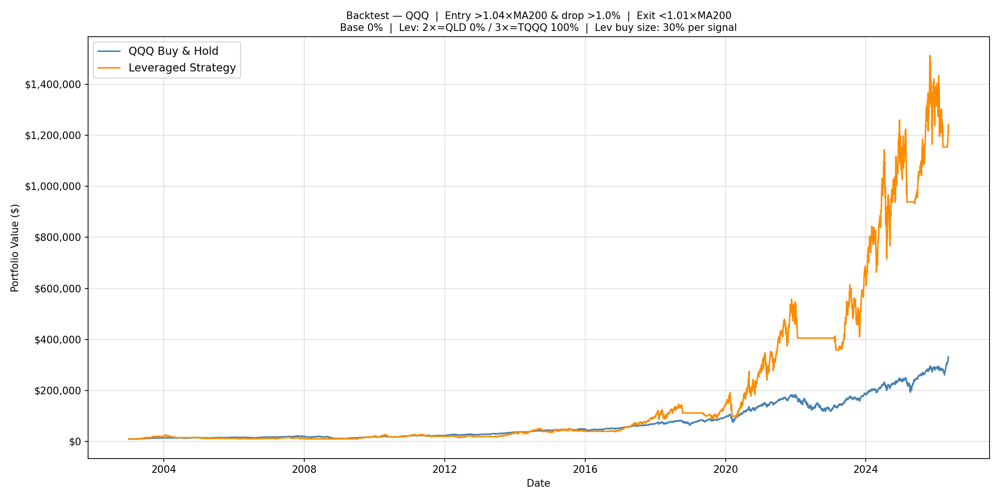
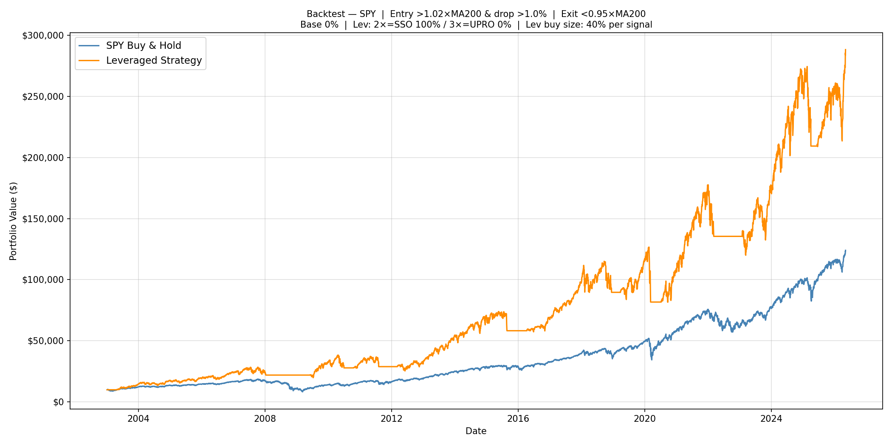
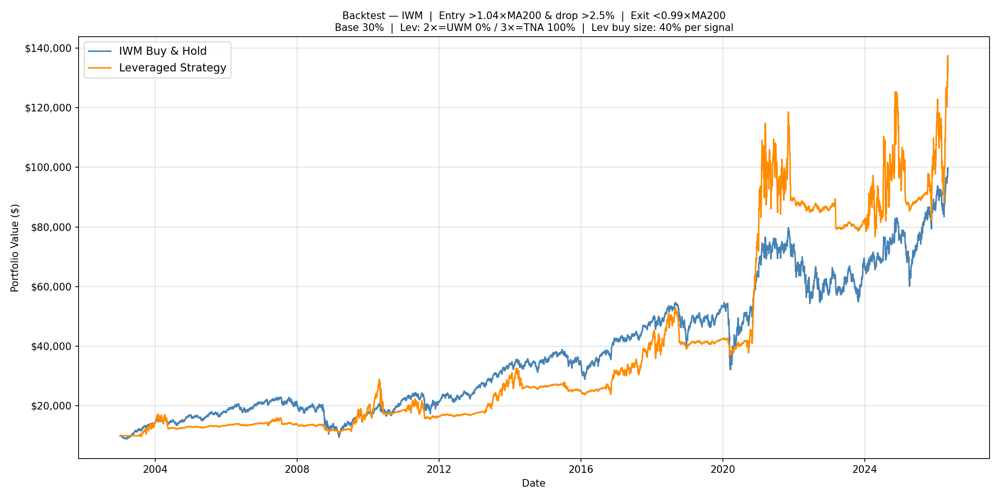

# Leveraged ETF Long-Term Strategy

A trend-following, dip-buying strategy that uses leveraged ETFs (2× and 3×) to amplify returns on QQQ, SPY, and IWM. Includes a full-history optimizer that grid-searches 15,840 parameter combinations per index and ranks them by CAGR with a yearly drawdown filter.

---

## Strategy Logic

### Buy Cycle
1. **Arm** — price closes above `MA200 × entry_signal` (trend confirmed)
2. **Trigger** — while armed, same-day drop ≥ `drop_level` (buy the dip)
3. **First signal in cycle** — buy base ETF up to `alloc_base × portfolio`, then spend `buy_pct × portfolio` on leveraged ETFs split by `alloc_x2` / `alloc_x3`
4. **Subsequent signals** — spend `buy_pct × portfolio` on leveraged ETFs only (base already filled)

### Exit
- Price closes below `MA200 × exit_signal`
- Sell all 2× and 3× holdings → cash
- One-time trim of base if it exceeds `alloc_base × portfolio`
- Dis-arm: next cycle requires a fresh arm signal

### Synthetic Pre-Inception NAV
For dates before a real leveraged ETF existed, the NAV is simulated from the base ETF's daily returns using the standard leverage model:

```
lev_daily_ret = L × r  −  0.5 × (L² − L) × rolling_var20
```

The synthetic and real series are stitched seamlessly at the ETF's inception date.

---

## Repository Structure

```
backtester.py                        # interactive backtester (CLI)
leveraged_qqq_exploration/
    optimizer.py                     # QQQ grid search optimizer
    optimizer_results.csv            # all 15,840 combos, pass/fail
    optimizer_equity.png             # top 5 equity curves
    optimizer_scatter.png            # CAGR vs worst annual return
leveraged_spy_exploration/
    optimizer.py                     # SPY grid search optimizer
    spy_optimizer_results.csv
    spy_optimizer_equity.png
    spy_optimizer_scatter.png
leveraged_iwm_exploration/
    optimizer.py                     # IWM grid search optimizer
    optimizer_results.csv
    optimizer_equity.png
    optimizer_scatter.png
```

---

## ETF Mapping

| Index | Base | 2× | 3× |
|---|---|---|---|
| NASDAQ-100 | QQQ | QLD (inception Jun 2006) | TQQQ (inception Feb 2010) |
| S&P 500 | SPY | SSO (inception Jun 2006) | UPRO (inception Jun 2009) |
| Russell 2000 | IWM | UWM (inception Jan 2007) | TNA (inception Nov 2008) |

---

## Optimizer Results Summary

Each optimizer ran 15,840 parameter combinations over full history (2003-01-01 to 2026-05-08, $10,000 starting capital). A combo **passes** if every calendar year from the filter year onward shows an annual return ≥ −40%.

| Index | Passing combos | Filter start year |
|---|---|---|
| QQQ | 15,817 / 15,840 | 2010 |
| SPY | 15,754 / 15,840 | 2009 |
| IWM | 15,674 / 15,840 | 2009 |

**Note on the scatter plot (green dots below −40%):** The filter only applies from the year listed above onward — years before that cutoff are always treated as passing, because the leveraged ETF data for those years is synthetic (built from base-ETF returns) and penalizing synthetic history would be unfair. However, `worst_ann_ret` in the results is computed across *all* years including the pre-filter period. This means a combo can appear as a green (passing) dot in the scatter plot with a worst annual return worse than −40% if its worst year happened before the filter start — typically 2008, which fell before the cutoff for all three indices.

---

## Best Strategies

> All results are based on the full backtest period **2003-01-02 → 2026-05-07** with $10,000 starting capital.
> CAGR and worst annual return are measured over that entire window.
> Base stock worst annual return is the single worst calendar-year return for buy-and-hold over the same period.

### QQQ — Best CAGR
| Metric | Strategy | QQQ Buy & Hold |
|---|---|---|
| Entry signal | 1.03× MA200 | — |
| Drop level | 0.5% | — |
| Exit signal | 1.01× MA200 | — |
| Buy pct | 40% per signal | — |
| Allocation | 0% QQQ / 0% QLD / 100% TQQQ | — |
| **CAGR** | **21.31%** | 16.07% |
| Worst annual return | −38.58% | −41.73% (2008) |

```
python backtester.py --preset QQQ --entry-signal 1.03 --drop-level 0.005 --exit-signal 1.01 --buy-pct 0.4 --alloc-base 0.0 --alloc-x2 0.0 --alloc-x3 1.0
```

### QQQ — Balanced (CAGR vs drawdown)
| Metric | Strategy | QQQ Buy & Hold |
|---|---|---|
| Entry signal | 1.04× MA200 | — |
| Drop level | 1.0% | — |
| Exit signal | 1.01× MA200 | — |
| Buy pct | 30% per signal | — |
| Allocation | 0% QQQ / 0% QLD / 100% TQQQ | — |
| **CAGR** | **19.51%** | 16.07% |
| Worst annual return | −24.77% | −41.73% (2008) |

```
python backtester.py --preset QQQ --entry-signal 1.04 --drop-level 0.010 --exit-signal 1.01 --buy-pct 0.3 --alloc-base 0.0 --alloc-x2 0.0 --alloc-x3 1.0
```

---

### SPY — Best CAGR
| Metric | Strategy | SPY Buy & Hold |
|---|---|---|
| Entry signal | 1.02× MA200 | — |
| Drop level | 0.5% | — |
| Exit signal | 0.95× MA200 | — |
| Buy pct | 30% per signal | — |
| Allocation | 0% SPY / 0% SSO / 100% UPRO | — |
| **CAGR** | **22.26%** | 11.35% |
| Worst annual return | −39.40% | −36.80% (2008) |

```
python backtester.py --preset SPY --entry-signal 1.02 --drop-level 0.005 --exit-signal 0.95 --buy-pct 0.3 --alloc-base 0.0 --alloc-x2 0.0 --alloc-x3 1.0
```

### SPY — Balanced (CAGR vs drawdown)
| Metric | Strategy | SPY Buy & Hold |
|---|---|---|
| Entry signal | 1.02× MA200 | — |
| Drop level | 1.0% | — |
| Exit signal | 0.95× MA200 | — |
| Buy pct | 40% per signal | — |
| Allocation | 0% SPY / 100% SSO / 0% UPRO | — |
| **CAGR** | **16.13%** | 11.35% |
| Worst annual return | −23.71% | −36.80% (2008) |

```
python backtester.py --preset SPY --entry-signal 1.02 --drop-level 0.010 --exit-signal 0.95 --buy-pct 0.4 --alloc-base 0.0 --alloc-x2 1.0 --alloc-x3 0.0
```

---

### IWM — Best CAGR
| Metric | Strategy | IWM Buy & Hold |
|---|---|---|
| Entry signal | 1.05× MA200 | — |
| Drop level | 1.5% | — |
| Exit signal | 0.95× MA200 | — |
| Buy pct | 30% per signal | — |
| Allocation | 10% IWM / 0% UWM / 100% TNA | — |
| **CAGR** | **10.23%** | 10.28% |
| Worst annual return | −27.13% | −34.14% (2008) |

```
python backtester.py --preset IWM --entry-signal 1.05 --drop-level 0.015 --exit-signal 0.95 --buy-pct 0.3 --alloc-base 0.1 --alloc-x2 0.0 --alloc-x3 1.0
```

### IWM — Balanced (CAGR vs drawdown)
| Metric | Strategy | IWM Buy & Hold |
|---|---|---|
| Entry signal | 1.04× MA200 | — |
| Drop level | 2.5% | — |
| Exit signal | 0.99× MA200 | — |
| Buy pct | 40% per signal | — |
| Allocation | 30% IWM / 0% UWM / 100% TNA | — |
| **CAGR** | **10.21%** | 10.28% |
| Worst annual return | −13.13% | −34.14% (2008) |

```
python backtester.py --preset IWM --entry-signal 1.04 --drop-level 0.025 --exit-signal 0.99 --buy-pct 0.4 --alloc-base 0.3 --alloc-x2 0.0 --alloc-x3 1.0
```

---

## Performance Charts (Balanced Strategies, 2003–2026)

**QQQ / TQQQ — 19.51% CAGR vs 16.07% buy & hold**


**SPY / SSO — 16.13% CAGR vs 11.35% buy & hold**


**IWM / TNA — 10.21% CAGR vs 10.28% buy & hold**


---

## When This Strategy Works — and When It Doesn't

### What it needs to thrive
- **Sustained uptrends with periodic dips.** The MA200 filter keeps the strategy out of bear markets. Dip-buy signals pick up short-lived pullbacks within a broader uptrend, letting leveraged ETFs compound over months or years before an exit is needed.
- **Clean trend reversals.** When a bear market begins and price crosses below the exit threshold quickly, the strategy exits before catastrophic leveraged losses accumulate. The 2020 COVID crash is a good example — sharp drop, fast recovery, the strategy exited and re-entered cleanly.
- **A good entry point in the cycle.** Starting the strategy in cash during or just after a bear market (e.g. early 2009, early 2020) means the first buy signals coincide with a genuine recovery, and the leveraged ETF compounds from a low base.

### What hurts it
- **Fast waterfall declines with multiple dips before the exit fires.** The MA200 reacts slowly. If the market drops sharply in stages, each dip can trigger a buy signal while the strategy is still armed — accumulating 3× exposure just before the worst leg down. The 2008 GFC is the clearest example.
- **Staircase-down bear markets with false recoveries.** After an exit, a brief rally above the entry threshold re-arms the strategy. If the bear resumes, the strategy buys again into another decline. Multiple losing buy-exit cycles deplete cash, and smaller capital means slower recovery. The 2000–2002 dot-com crash had this structure.
- **Slow, grinding drawdowns (e.g. 2022).** Sustained rate-driven selloffs keep the market below MA200 for months. The strategy sits out, which is correct — but any false rallies that cross the entry threshold and trigger buys before the trend resumes will result in small but repeated losses.
- **Sequence-of-returns risk.** After a long bull run, the strategy has built up maximum leveraged exposure. That is exactly when a crash causes the most damage. Starting right before a market peak is the worst possible timing.

### Index comparison
| | QQQ | SPY | IWM |
|---|---|---|---|
| Balanced CAGR | 19.51% | 16.13% | 10.21% |
| Base B&H CAGR | 16.07% | 11.35% | 10.28% |
| Strategy edge | +3.4pp | +4.8pp | −0.1pp |
| Worst year (strategy) | −24.77% | −23.71% | −13.13% |
| Worst year (base B&H) | −41.73% | −36.80% | −34.14% |

QQQ and SPY gain meaningfully over buy-and-hold while reducing tail risk versus buy-and-hold. IWM shows almost no edge — small-cap volatility causes more decay in the leveraged ETF than it creates opportunity. The 3× ETF dominates top combos for all three indices; the 2× ETF almost never appears in top-ranked results.

---

## MA100 Exit Research

A variant optimizer (`optimizer_ma100_exit.py` in each exploration folder) tests splitting the moving-average logic:
- **Arm / Buy** — MA200 unchanged (slow trend filter)
- **Exit** — MA100 instead of MA200 (faster reaction to trend breaks)

### Head-to-head results (same parameters, only exit MA changes)

| Index | Params | MA100 exit CAGR | MA200 exit CAGR | MA100 worst yr | MA200 worst yr |
|---|---|---|---|---|---|
| QQQ | best-CAGR (exit=0.95) | 17.97% | 17.49% (FAIL) | −46.06% | −42.62% |
| QQQ | MA200-baseline (exit=1.01) | 8.51% | **21.31%** | −33.80% | −38.58% |
| QQQ | MA200-balanced (exit=1.01) | 5.99% | **19.51%** | −22.12% | −24.77% |
| SPY | best-CAGR (exit=0.95) | **20.51%** | 20.48% (FAIL) | **−32.95%** | −41.13% |
| SPY | MA200-baseline (exit=0.95) | 19.99% | 20.26% | **−31.44%** | −39.40% |
| SPY | MA200-balanced (exit=0.95) | 13.46% | 14.19% | **−18.74%** | −23.71% |
| IWM | MA100-exit best (exit=0.95) | **8.33%** | 6.40% | **−17.91%** | −22.09% |
| IWM | MA200-baseline (exit=0.95) | 6.69% | **10.23%** | −18.71% | −27.13% |
| IWM | MA200-balanced (exit=0.99) | 5.34% | **10.21%** | −29.10% | −13.13% |

### Conclusions

**The exit_signal value and exit MA are tightly coupled — you cannot swap MA100 for MA200 without re-optimizing the exit_signal threshold.**

- **High exit_signal (1.01–1.02) + MA100 = disastrous.** MA100 sits above MA200 during uptrends, so a signal like `price < 1.01 × MA100` fires constantly during normal bull-market volatility. The QQQ baseline loses 12+ CAGR points (21.31% → 8.51%) just from this swap. The strategy keeps exiting during rallies and misses the compounding.

- **Low exit_signal (0.95) + MA100 = marginal improvement in drawdown, minimal CAGR cost.** SPY is the clearest example: MA100 exit cuts the worst year from −39.40% to −31.44% while barely touching CAGR (20.26% → 19.99%). It also converts a FAIL combo to PASS by keeping worst-year just under the 40% cap.

- **IWM is the exception.** For the MA200-optimized parameters, MA100 exit hurts on both dimensions — lower CAGR and worse drawdown. The frequent exits from a faster MA compound IWM's already-marginal leveraged performance.

**Practical takeaway:** MA100 exit is worth considering for SPY with a low exit_signal (≤ 0.97). It meaningfully caps tail risk with little cost. For QQQ and IWM, stick with MA200 exit and the parameters found by the MA200 optimizer.

---

## Running the Optimizer

```bash
cd leveraged_qqq_exploration && python optimizer.py
cd leveraged_spy_exploration && python optimizer.py
cd leveraged_iwm_exploration && python optimizer.py
```

# MA100 exit variant
```bash
cd leveraged_qqq_exploration && python optimizer_ma100_exit.py
cd leveraged_spy_exploration && python optimizer_ma100_exit.py
cd leveraged_iwm_exploration && python optimizer_ma100_exit.py
```

Outputs per run: `optimizer_results.csv`, `optimizer_equity.png`, `optimizer_scatter.png`.

## Dependencies

```
pip install yfinance pandas numpy matplotlib tqdm
```
