# Leveraged ETFs for the Long Run: A Systematic Dip-Buy Strategy Across Three Major Indices

A systematic investigation into whether a disciplined dip-buying approach applied to leveraged ETFs can deliver durable alpha over simple buy-and-hold across the NASDAQ-100, S&P 500, and Russell 2000 — with full walk-forward validation, crisis stress testing, and exit MA comparison.

> [!TIP]
> **Walk-forward validated edge (annual re-optimization, 2014–2025, no look-ahead bias):**
> QQQ: 27.26% CAGR vs 18.72% B&H — **+8.5pp over 12 years** (MA200 exit)
> SPY: 21.92% CAGR vs 13.59% B&H — **+8.3pp over 12 years** (MA100 exit, see [section 6.1](#61-ma100-vs-ma200-walk-forward))
>
> Full-history optimized (2003–2026, includes hindsight): $10,000 → **$1,667,000 QQQ** / **$1,039,000 SPY** vs $331K / $124K buy-and-hold.
> These upper-bound numbers assume optimal parameters known in advance; use the walk-forward edge above as your realistic forward expectation.

---

## Research Overview

This paper documents the design and validation of a leveraged-ETF dip-buy strategy across three US equity indices. Each numbered item is a question we tested, with the answer and section pointer.

1. **Can you safely hold 3× ETFs long-term?** No — volatility decay and bear-market crashes make permanent ownership ruinous. We built a rules-based system that only holds 3× ETFs during confirmed uptrends. → [§1](#1-strategy-description)
2. **What's the optimal parameter set per index?** A 15,840-combo grid search across entry/drop/exit/buy/allocation found the best combos for QQQ, SPY, and IWM over 2003–2026. → [§3](#3-results--full-history-20032026)
3. **MA200, MA100, or MA50 for the exit signal?** Tested all three on each index. **MA200 for QQQ and IWM; MA100 for SPY** (walk-forward validated). MA50 hurts all three. → [§4](#4-results--exit-ma-comparison-ma200-vs-ma100-vs-ma50), [§6.1](#61-ma100-vs-ma200-walk-forward)
4. **2× or 3× leverage?** 3× wins on CAGR by roughly +6pp for QQQ and SPY, with ~12pp worse worst-year drawdowns. → [§5](#5-results--2-vs-3-leverage)
5. **Does the edge survive out-of-sample?** Strict single-split (train 2003–2014, test 2015–2026): QQQ +2.03pp, SPY +1.91pp, IWM −3.73pp (failed OOS). → [§6](#6-results--walk-forward-validation)
6. **What if we re-optimize annually?** Expanding-window walk-forward (annual re-opt, 2014–2025): **QQQ +8.54pp, SPY +6.55pp (MA200) or +8.33pp (MA100)**. This is the recommended operating mode. → [§6](#6-results--walk-forward-validation)
7. **Can we trade a tiny bit of CAGR for less ulcer on QQQ?** Tested a tie-break rule (pick best worst-year within 1pp training CAGR of the leader). The honest answer: **trade-year impact is larger than expected** — costs ~4pp CAGR over 12 years for ~20pp better max drawdown but barely changes worst calendar year. **Disabled by default; opt-in.** → [§6.2](#62-qqq-tie-break-rule)
8. **Does the strategy survive every major crisis since 2003?** Tested in GFC, COVID, 2022 rate hikes, and dot-com (which predates the sample). All survived; dot-com QQQ was the weakest case. → [§7](#7-results--crisis-period-stress-tests)
9. **Is the alpha real, or a parameter spike?** Robustness heatmaps confirm a broad plateau around the optimal combos — not data-mined. → [§8](#parameter-robustness-analysis)
10. **Why not a max-DD filter instead of calendar-year?** A max-DD ≤ 40% filter would cut QQQ best CAGR from ~21% to ~16% and SPY from ~22% to ~10%. The calendar-year filter is a deliberate design choice. → [§9](#9-risk-considerations--design-honesty)

---

## Recommended Configurations

### What the two CAGR numbers mean

The performance tables below report two CAGR figures for each variant. They measure different things; both are reported because both are useful:

- **Full-history CAGR (2003–2026, 23 years).** A single best parameter set was found by running the optimizer on the *entire* historical sample and picking the highest-CAGR combo. The same params were then applied to the same data. This is the **in-sample, hindsight-optimized upper bound** — it answers "what would the best params have produced if we'd known them in advance?" It is not a realistic forward expectation; live trading cannot use future data.
- **Walk-forward CAGR (2014–2025, 12 years).** Each January, the optimizer is re-run on all prior data only, and the resulting params are applied to the next year. Repeated for 12 years. This is the **realistic forward expectation** — what an investor running the strategy honestly would have achieved with no look-ahead. Anchor your expectations here.

The walk-forward CAGR is sometimes higher than the full-history CAGR (as for QQQ: 27.26% vs 24.48%), which seems counterintuitive. Two reasons: (a) the walk-forward period starts in 2014 — a more bullish 12 years than the 2003–2014 leg of the full sample, so the underlying B&H benchmark is also higher; and (b) annual re-optimization adapts to evolving regimes in ways that a single full-sample optimum cannot. The two numbers are not directly period-matched — read them as separate things, not delta-against-each-other.

---

### QQQ — pick one of two variants

| Variant | Full-history CAGR (2003–2026) | Walk-forward CAGR (2014–2025) | Worst year | Max DD | Walk-forward final ($10K → ) |
|---|---|---|---|---|---|
| **Highest CAGR** (default) | 24.48% | **27.26%** | −25.91% (2022) | −64.9% | **$180,025** |
| **Balanced** (opt-in tie-break) | n/a¹ | 23.10% | −25.52% (2022) | **−44.75%** | $120,928 |

¹ The tie-break rule is applied per training window during walk-forward; it has no direct full-history equivalent.

**Live trading params (most recent walk-forward year, 2025):**

| Variant | Entry | Drop | Exit | Buy% | Base% | 2× % | 3× % (TQQQ) |
|---|---|---|---|---|---|---|---|
| Highest CAGR | 1.06×MA200 | 0.5% | 1.00×MA200 | 40% | 0% | 0% | **100%** |
| Balanced | 1.05×MA200 | 1.0% | 1.00×MA200 | 40% | 0% | 0% | **100%** |

> The 2025 params look nearly identical between variants because both converged to 100% TQQQ in the latest window. The walk-forward CAGR gap comes from **earlier** windows, where the Balanced rule preferred diversified allocations (10–20% base SPY, 25–75% QLD). Full year-by-year schedule comparison: [§6.2](#62-qqq-tie-break-rule).

**Annual re-optimization: REQUIRED for QQQ.** Without it, expect a meaningful CAGR penalty.

Evidence: a *fixed model* using 2003–2013 params frozen through 2025 produces **25.15% CAGR** versus **27.26%** for annually re-optimized (Highest CAGR variant). The fixed model also has a worse worst year (−35.5% vs −25.9% in 2022). → see [§6](#expanding-window-walk-forward-annual-re-optimization-20142025) three-way comparison.

**How to re-optimize each January:**
```bash
# Highest CAGR (default)
python walkforward.py --preset QQQ

# Balanced (opt-in tie-break)
python walkforward.py --preset QQQ --tie-tolerance 0.01
```
Computational cost: ~30 min per run. The new schedule replaces the old one in `results/walkforward/QQQ_param_schedule*.json`. Apply the latest year's params to the next 12 months of trading. See [§6.2 continuity-filter note](#62-qqq-tie-break-rule) for a sanity check before accepting a discontinuous param shift on QQQ.

**Honest take on the variant choice:** the Balanced variant trades **4pp CAGR for 20pp better max DD — but the worst calendar year is essentially unchanged**. Only enable if max-DD smoothing matters to you more than terminal wealth. For most investors using annual review at year-end, the Highest CAGR variant is correct.

---

### SPY — pick one of two variants

| Variant | Full-history CAGR (2003–2026) | Walk-forward CAGR (2014–2025) | Worst year | Max DD | Walk-forward final ($10K → ) |
|---|---|---|---|---|---|
| **Recommended (MA100 exit)** | 22.40% | **21.92%** | −31.78% (2022) | **−44.80%** | **$107,688** |
| MA200 exit (legacy) | 21.98% | 20.14% | −37.09% (2022) | −57.87% | $90,307 |

**Live trading params (most recent walk-forward year, 2025):**

| Variant | Entry | Drop | Exit | Buy% | Base% | 2× % | 3× % (UPRO) |
|---|---|---|---|---|---|---|---|
| Recommended (MA100) | 1.02×MA200 | 0.5% | 0.95×MA100 | 40% | 0% | 0% | **100%** |
| MA200 (legacy) | 1.02×MA200 | 0.5% | 0.97×MA200 | 40% | 0% | 0% | **100%** |

> MA100 dominates MA200 on every axis (higher CAGR, better worst year, better max DD, better Sharpe). No reason to use MA200 unless you specifically want backwards-compatibility with earlier versions. Full comparison: [§6.1](#61-ma100-vs-ma200-walk-forward).

**Annual re-optimization: OPTIONAL for SPY** (lower benefit than for QQQ).

Evidence: a *fixed model* using 2003–2013 params frozen through 2025 produces **19.89% CAGR** versus **21.92%** for annually re-optimized (MA100 variant). The CAGR uplift is real (~2pp) but smaller than for QQQ in relative terms. SPY's optimizer converges to nearly identical params each year, so the schedule is structurally stable — re-optimization mainly updates the worst-year risk picture rather than discovering new params.

**How to re-optimize each January (recommended but not strictly required):**
```bash
# Recommended (MA100 exit)
python walkforward.py --preset SPY --exit-ma 100
```
Computational cost: ~30 min. If you skip annual re-opt for SPY, you can safely run the strategy with the fixed 2014-onwards params (entry 1.01–1.02×MA200, drop 0.5%, exit 0.95×MA100, buy 40%, 100% UPRO) — every walk-forward year picked params in that cluster.

---

### IWM — not recommended

| Variant | Strict OOS CAGR (2015–2026) | IWM B&H | Edge | Result |
|---|---|---|---|---|
| Best 2003–2014 train params, frozen | 5.41% | 9.14% | **−3.73pp ✗** | Failed OOS |

IWM's small-cap volatility creates higher LETF decay, and the strategy's training-period params did not generalize to 2015–2026. Treated as speculative; not part of any live recommendation. → [§6](#out-of-sample-test-20152026-11-years-genuinely-unseen)

---

**Drawdown filter (all configs):** calendar-year worst ≥ −40%. Deliberate design choice — see [§9](#9-risk-considerations--design-honesty) for the cost-benefit of tighter alternatives.

---

## Contents

- [Research Overview](#research-overview)
- [Recommended Configurations](#recommended-configurations)
- [Abstract](#abstract)
- [Executive Summary](#executive-summary)
- [1. Strategy Description](#1-strategy-description)
  - [How It Works](#how-it-works)
  - [Parameters](#parameters)
- [2. Methodology](#2-methodology)
  - [Data and Universe](#data-and-universe)
  - [Synthetic Leveraged NAV](#synthetic-leveraged-nav)
  - [Optimizer Grid Search](#optimizer-grid-search)
  - [Critical Limitation: Optimizer Warm-Up Gap](#critical-limitation-optimizer-warm-up-gap)
- [3. Results — Full History (2003–2026)](#3-results--full-history-20032026)
- [4. Results — Exit MA Comparison](#4-results--exit-ma-comparison-ma200-vs-ma100-vs-ma50)
- [5. Results — 2× vs 3× Leverage](#5-results--2-vs-3-leverage)
- [6. Results — Walk-Forward Validation](#6-results--walk-forward-validation)
  - [6.1 MA100 vs MA200 Walk-Forward (SPY)](#61-ma100-vs-ma200-walk-forward)
  - [6.2 QQQ Tie-Break Rule](#62-qqq-tie-break-rule)
- [7. Results — Crisis Period Stress Tests](#7-results--crisis-period-stress-tests)
  - [7.1 Global Financial Crisis: 2007–2010](#71-global-financial-crisis-20072010)
  - [7.2 COVID Crash and Recovery](#72-covid-crash-and-recovery-2019-10-01--2021-06-30)
  - [7.3 Rate-Hike Bear Market: 2022](#73-rate-hike-bear-market-2021-06-01--2023-06-30)
  - [7.4 Dot-com Bubble & Recovery](#74-dot-com-bubble--recovery-2000-01-03--2003-12-31)
- [8. Discussion](#8-discussion)
  - [What Drives the Edge](#what-drives-the-edge)
  - [When the Strategy Struggles](#when-the-strategy-struggles)
  - [Market Regime Classification](#market-regime-classification)
  - [Parameter Robustness Analysis](#parameter-robustness-analysis)
  - [Limitations and Caveats](#limitations-and-caveats)
- [9. Risk Considerations & Design Honesty](#9-risk-considerations--design-honesty)
- [10. Technical Reference](#10-technical-reference)
  - [Repository Structure](#repository-structure)
  - [Code Flow](#code-flow)
  - [Running the Backtester](#running-the-backtester)
  - [Running the Walk-Forward](#running-the-walk-forward)
  - [Running the Optimizers](#running-the-optimizers)

---

## Abstract

We tested a rules-based strategy that buys leveraged ETFs (TQQQ/UPRO/TNA) only during confirmed uptrends on meaningful single-day dips, and exits when the trend breaks. After correcting for management expense ratios in the synthetic pre-inception period, the strategy produced CAGR of **24.48% for QQQ** (Sharpe 0.74), **21.98% for SPY** (Sharpe 0.74), and **11.96% for IWM** (Sharpe 0.49) over 2003–2026 — versus buy-and-hold returns of 16.16%, 11.39%, and 10.19% respectively. In a rigorous walk-forward test (parameters optimized on 2003–2014 only, then frozen for 2015–2026), QQQ achieved 21.41% CAGR vs 19.38% B&H (+2.03pp) and SPY achieved 15.71% vs 13.80% (+1.91pp). IWM underperformed out-of-sample (5.41% vs 9.14% B&H) — an honest result disclosed in full. An expanding-window walk-forward (2014–2025, re-optimizing parameters each year on all prior data) produced **27.26% CAGR for QQQ** (+8.54pp vs B&H) and **20.14% for SPY** (+6.55pp vs B&H) with no look-ahead bias — the most realistic simulation of live operation. Switching SPY's exit MA from 200 to 100 in the same walk-forward improves SPY further to **21.92% CAGR (+8.33pp vs B&H), worst year −31.8% vs −37.1%, max drawdown −44.8% vs −57.9%** — MA100 is the recommended SPY exit. The strategy survived all major stress tests (GFC, COVID, 2022 rate hikes). Transaction costs up to 0.2%/trade reduce CAGR by less than 0.6pp. A parameter robustness analysis confirms the alpha sits in a broad plateau rather than an isolated spike. The 3× ETF consistently outperforms the 2× ETF on CAGR but with meaningfully worse drawdowns.

---

## Executive Summary

| Index | Strategy CAGR | B&H CAGR | Edge | Max Drawdown | Sharpe | Avg Trades/Yr |
|---|---|---|---|---|---|---|
| QQQ (NASDAQ-100) | **24.48%** | 16.16% | +8.32pp | −69.1% | 0.74 | ~4 |
| SPY (S&P 500) | **21.98%** | 11.39% | +10.60pp | −56.4% | 0.74 | ~2 |
| IWM (Russell 2000) | **11.96%** | 10.19% | +1.76pp | −59.3% | 0.49 | ~2 |

> All results: $10,000 starting capital, 2003-01-01 → 2026-05-16, MER-corrected synthetic NAV.
> Best-CAGR passing strategy per index, MA200 exit, 3× ETF allocation.
> Max drawdown is intra-period peak-to-trough (not calendar year). Sharpe ratio assumes rf = 0%.
> This is a low-frequency swing strategy. Most years see 2–5 trades, with positions held weeks to months.

**Key findings:**
- Meaningful alpha over buy-and-hold for QQQ (+8.32pp) and SPY (+10.60pp). IWM edge is thin (+1.76pp) due to small-cap 3× decay. All numbers MER-corrected for synthetic pre-inception period.
- QQQ and SPY hold positive edges in a rigorous single-split OOS test (2015–2026, parameters optimized on 2003–2014 only, then frozen); IWM underperforms out-of-sample — an honest finding disclosed in full.
- **Annual re-optimization (expanding-window walk-forward, 2014–2025) is the recommended operating mode:** QQQ edge grows to +8.54pp (27.26% vs 18.72% B&H), worst year improves from −35.5% to −25.9%. SPY edge is +6.55pp (20.14% vs 13.59% B&H). These are the realistic forward-looking numbers — fully walk-forward validated with zero look-ahead bias.
- 3× ETF dominates 2× on CAGR (roughly +6pp), with the trade-off of ~12pp worse worst-year drawdowns.
- **Exit MA recommendation:** MA200 for QQQ and IWM. MA100 for SPY — walk-forward validated, +1.78pp CAGR and 5.3pp better worst year vs MA200 ([section 6.1](#61-ma100-vs-ma200-walk-forward)). MA100 and MA50 both hurt QQQ significantly.
- The strategy excelled during all three major stress events: 2007–2010 GFC, COVID 2020, and the 2022 rate-hike bear market.
- The dot-com crash (2000–2003) is the strategy's weakest case: QQQ lost 80% of capital in the first year due to repeated false-rally re-entries. SPY survived with positive CAGR (+6%) thanks to its looser exit threshold.
- **The strategy requires a periodically bullish, trending market to work.** In sustained choppy or sideways conditions, repeated false dip signals whipsaw the leveraged position — as seen in QQQ's −40% year in 2005 and IWM's out-of-sample failure. This is also why IWM was explored: small-cap indices are structurally noisier and less trend-consistent, making leveraged dip-buying less reliable. The strategy is not all-weather; it amplifies returns in trending bull markets and protects capital in clear bear markets, but struggles when the market oscillates without direction.

---

## 1. Strategy Description

### Why Not Just Buy and Hold 3× ETFs Permanently?

The obvious question: if TQQQ returns roughly 3× QQQ's daily return, why not simply hold it forever?

Two compounding problems make this impractical:

**1. Volatility decay (beta slippage)**
3× ETFs reset their leverage ratio every day. In choppy or sideways markets this daily reset silently erodes value even when the underlying ends flat. A simple example: if QQQ falls 10% then recovers 11.1% (back to its starting price), TQQQ falls 30% then recovers 33.3% — but the math leaves TQQQ at 0.70 × 1.333 = **0.933**, a 6.7% loss while QQQ broke even. The longer and choppier the market, the more this decay compounds against the holder.

**2. Bear markets are catastrophic**
A 33% QQQ decline translates to roughly a 70–80% TQQQ decline once decay is factored in. A buy-and-hold TQQQ investor in 2000 would have lost over 99% by 2002. In 2008, TQQQ lost approximately 95% from peak to trough. Recovering from those losses requires thousands of percent in gains — mathematically possible but practically ruinous for most investors.

**The solution this strategy uses:** only hold leveraged ETFs during confirmed uptrends, and exit the moment the trend breaks. This cuts off the catastrophic tail, avoids accumulating decay through choppy sideways markets, and preserves cash for re-entry at lower prices after a bear market ends.

---

### How It Works

The strategy never holds a leveraged ETF unconditionally. Two rules govern all buying and selling.

**Buying:**
1. **Arm** — Wait until the base ETF (e.g. QQQ) closes above `MA200 × entry_signal`. This confirms the market is in an established uptrend.
2. **Trigger** — Once armed, wait for a single-day price drop of at least `drop_level`. That dip fires a buy.
3. **Position sizing** — On the first buy of a cycle, a small base-ETF position is established as a portfolio stabilizer (if `alloc_base > 0`). Then cash is deployed into the leveraged ETF (`buy_pct × total portfolio`), split between 2× and 3× ETFs by `alloc_x2` / `alloc_x3`.
4. **Subsequent signals** — Each additional dip while armed adds more to the leveraged position only.

**Selling:**
- If price falls below `exit_MA × exit_signal` while holding any leveraged ETF, sell all 2× and 3× positions back to cash.
- Trim the base position if it has grown above `alloc_base × total portfolio`.
- Dis-arm — the strategy must see a fresh uptrend signal before buying again.

**Plain English:** Only hold leveraged ETFs when the trend is clearly up and the market dips briefly. Exit immediately when the trend breaks. Never ride a 3× ETF through a bear market.

---

**Worked Example** — SPY strategy, $10,000 starting capital
> Parameters: entry=1.02, drop=0.5%, exit=0.95, buy_pct=30%, alloc_base=20%, alloc_x2=25%, alloc_x3=75%

| Day | Event | Action | SPY | SSO (2×) | UPRO (3×) | Cash | Total |
|---|---|---|---|---|---|---|---|
| 1 | SPY = $450, MA200 = $440. SPY > 1.02×$440 = $448.8 | **ARM** | — | — | — | $10,000 | $10,000 |
| 5 | SPY drops $450 → $447 (−0.67% ≥ 0.5%) | **FIRST BUY** | | | | | |
| | ① Establish base: 20% × $10,000 = $2,000 into SPY | | $2,000 | — | — | $8,000 | $10,000 |
| | ② Leveraged buy: 30% × $10,000 = $3,000 total | | | | | | |
| | → SSO: 25% × $3,000 = $750 | | $2,000 | $750 | — | $7,250 | $10,000 |
| | → UPRO: 75% × $3,000 = $2,250 | | $2,000 | $750 | $2,250 | $5,000 | $10,000 |
| 12 | SPY drops $447 → $444 (−0.67%) while still armed | **SECOND BUY** (no base re-buy) | | | | | |
| | Leveraged buy: 30% × $10,000 = $3,000 | | | | | | |
| | → SSO: $750 more; UPRO: $2,250 more | | $2,000 | $1,500 | $4,500 | $2,000 | $10,000 |
| Later | SPY falls to $416, below 0.95×$440 = $418 | **EXIT** | | | | | |
| | Sell all SSO + UPRO → cash. Trim base if needed. Dis-arm. | | $2,000 | — | — | $8,000 | $10,000 |

Key observations from this example:
- The **base position (SPY) is bought only once** per cycle and kept through the exit — it acts as a stabiliser, not a trading position.
- Each subsequent dip **adds to leveraged positions only**, compounding exposure as the dip deepens.
- The exit **clears all leveraged positions immediately** but leaves the base intact (trimmed to 20% target).
- With `alloc_x2=25%` and `alloc_x3=75%`, each $3,000 leveraged tranche splits $750 into SSO and $2,250 into UPRO.

---

### Parameters

| Parameter | Meaning |
|---|---|
| `entry_signal` | Price must be above `MA200 × entry_signal` to arm (e.g. 1.03 = 3% above MA200) |
| `drop_level` | Minimum single-day drop to trigger a buy (e.g. 0.005 = 0.5%) |
| `exit_signal` | Exit when price falls below `exit_MA × exit_signal` (e.g. 0.95 = 5% below) |
| `buy_pct` | Fraction of total portfolio deployed per buy signal |
| `alloc_base` | Target allocation to the unleveraged base ETF (portfolio stabilizer) |
| `alloc_x2 / x3` | Split of leveraged spending between 2× and 3× ETFs (must sum to 1) |
| `exit_ma` | Moving average period for the exit trigger: 50, 100, or 200 (entry always uses MA200) |

---

## 2. Methodology

### Tools: Optimizer and Backtester

Two separate tools are used throughout this research. Understanding the difference is important for interpreting all results.

**Optimizer** (`optimizer.py`)
The optimizer's job is to *search* — it runs all 15,840 parameter combinations against historical data and ranks them by CAGR. Think of it as a brute-force scanner: feed it 23 years of price data and it tells you which settings would have performed best. It is fast (a few minutes for all combos) and useful for ranking, but it has a known accuracy limitation (the warm-up gap, explained below). **Optimizer CAGR numbers are always an underestimate.** Use the optimizer to find the best parameter combo; use the backtester to measure it accurately.

**Backtester** (`backtester.py`)
The backtester's job is to *validate* — it takes one specific set of parameters, runs the strategy over a chosen date range with full precision, and produces a detailed trade log, year-by-year returns, and an equity curve. It pre-downloads additional price history before the start date so the MA200 is fully warmed up on day one. It is the authoritative tool for any specific result cited in this paper.

In short: **optimizer finds, backtester measures.**

### Data and Universe

Three major US equity indices were tested over the same period for fair comparison:

| Index | Base ETF | 2× ETF | 3× ETF | Start Date |
|---|---|---|---|---|
| NASDAQ-100 | QQQ (Mar 1999) | QLD (Jun 2006) | TQQQ (Feb 2010) | 2003-01-01 |
| S&P 500 | SPY (Jan 1993) | SSO (Jun 2006) | UPRO (Jun 2009) | 2003-01-01 |
| Russell 2000 | IWM (May 2000) | UWM (Jan 2007) | TNA (Nov 2008) | 2003-01-01 |

All three start from **2003-01-01** for fair comparison. Key rationale:
- All three indices have reliable base ETF data from 2003.
- The 1990s bull market disproportionately inflated SPY parameter optimization when starting earlier.
- This start date captures the dot-com recovery (2003 bottom) through the 2026 present, including the 2008 GFC, 2020 COVID crash, and 2022 rate-hike bear market.

### Synthetic Leveraged NAV

Before real leveraged ETFs launched (TQQQ 2010, UPRO 2009, TNA 2008), returns are simulated using the standard leverage cost model applied to daily base ETF returns:

```
lev_daily_ret = L × r  −  0.5 × (L² − L) × rolling_var₂₀  −  annual_MER / 252
```

where `r` is the base ETF's daily return, `rolling_var₂₀` is the 20-day variance (proxy for daily vol² that drives leveraged ETF decay), and `annual_MER / 252` is the daily management expense ratio drag. **The MER term is applied only during the synthetic pre-inception period** — real ETF prices already embed the fund's expenses, so applying MER twice would double-count it. The stitch point (the date the real ETF launched) is identified before the loop, and MER is zeroed out from that date onward.

MER values used: TQQQ 0.95%/yr, UPRO 0.91%/yr, TNA 1.09%/yr (2× ETFs use their respective ratios). The cumulative effect over 6–7 synthetic years is approximately −0.2pp CAGR.

The synthetic series is stitched to the real series at inception, scaled so the real series continues smoothly.

All prices are dividend-adjusted (`auto_adjust=True`). This prevents quarterly dividend drops from falsely triggering dip-buy signals.

### Optimizer Grid Search

Each optimizer runs a grid search over **15,840 parameter combinations**:

| Parameter | Values |
|---|---|
| `entry_signal` | 1.01, 1.02, 1.03, 1.04, 1.05, 1.06 |
| `drop_level` | 0.5%, 1.0%, 1.5%, 2.0%, 2.5%, 3.0% |
| `exit_signal` | 0.95, 0.97, 0.99, 1.00, 1.01, 1.02 |
| `buy_pct` | 10%, 20%, 30%, 40% |
| `alloc_base` | 0%, 10%, 20%, 30% |
| `alloc_x2` | 0%, 25%, 50%, 75%, 100% |

The naive total would be 6×6×6×4×4×5 = 17,280 combinations, but one logical constraint removes 1,440 of them: the exit signal must be strictly less than the entry signal (you cannot set the exit threshold above the point where you armed — that would mean selling into strength before you even bought). After removing those invalid pairs, exactly **15,840 valid combinations** remain. Each is run as a full historical simulation; CAGR and worst annual return are recorded for every one.

Combos are ranked by CAGR. A **drawdown filter** eliminates any combo whose calendar-year return fell worse than −40% in any year from a cutoff year onward:

| Index | Filter applies from | Reason for cutoff |
|---|---|---|
| QQQ | 2010 onward | TQQQ launched Feb 2010 |
| SPY | 2009 onward | UPRO launched Jun 2009 |
| IWM | 2009 onward | TNA launched Nov 2008 |

**Why the filter does not apply before these dates:** All leveraged ETF returns before inception are synthetic — computed from the mathematical decay model, not from real traded prices. The synthetic model tends to produce extreme simulated losses in volatile early periods (e.g. the 2008 GFC, before real 3× ETFs existed) that are mathematically correct but would never have played out in practice: real investors would have stopped the strategy, real ETFs have liquidity mechanisms, and the model itself is an approximation. Penalising combos for pre-inception synthetic drawdowns would unfairly eliminate strategies that work well on real data. The filter therefore only enforces the −40% cap once real ETF prices are available, ensuring the pass/fail decision is based on actual, not simulated, performance.

### Critical Limitation: Optimizer Warm-Up Gap

**The optimizer CAGR numbers are systematically lower than backtester CAGR for the same parameters — by 3–4pp for QQQ.**

The root cause: the optimizer downloads data starting from `START_DATA = 2003-01-01` with no prior history. The MA200 requires 200 trading days (~10 months) to become valid, so the strategy sits in cash until approximately October/November 2003. This means the optimizer **misses the March 2003 QQQ bottom entirely** — a +104% single-year gain from the dot-com trough.

The backtester avoids this by pre-downloading 420 calendar days of history before the strategy start date, so MA200 is fully warmed up on day 1. This is why the backtester 2003 shows +104% for QQQ while the optimizer shows only +12%.

The impact compounds over 23 years:

| Index | Optimizer CAGR | Backtester CAGR | Gap |
|---|---|---|---|
| QQQ (MA200) | 21.31% | 24.67% | −3.36pp |
| SPY (MA200) | 22.26% | 22.21% | +0.05pp |
| IWM (MA200) | 10.23% | 12.14% | −1.91pp |

The SPY gap is negligible because the S&P 500's 2003 recovery was milder (+28%) than QQQ's (+104%). IWM falls in between.

**Effect on rankings:** Since all 15,840 combos share the same warm-up gap, relative rankings remain valid. The optimizer is a reliable ranking tool. Absolute CAGR numbers are understated — treat backtester CAGR as authoritative.

**Separate issue — MER in synthetic returns:** The optimizer's synthetic NAV formula models volatility decay but not management expense ratios (TQQQ: 0.95%/yr, UPRO: 0.91%/yr, TNA: 1.09%/yr). The backtester now applies these as a daily drag on the synthetic pre-inception period only — real ETF prices already include MER. Over the 6–7 synthetic years, the cumulative effect is approximately −0.2pp CAGR. Since all optimizer combos are equally affected, this does not change parameter rankings; it only affects the absolute gap between optimizer and backtester CAGR numbers.

---

## 3. Results — Full History (2003–2026)

> **Note on allocation:** The optimizer explored all combinations of base ETF allocation (0–30%), 2× ETF allocation (0–100% of leveraged spend), and 3× ETF allocation (remainder). The original intent was to find the optimal *mix* — perhaps holding some unleveraged base stock for stability and splitting leverage between 2× and 3×. In practice, **100% allocation to the 3× ETF with no base position consistently produced the highest CAGR across all three indices.** The base stock and 2× ETF allocations improve drawdown slightly but cost meaningful CAGR. All headline results below use the top-ranked combo from the optimizer, which in every case was 100% 3×. Section 5 examines the 2× vs 3× trade-off in detail.

### MA200 Exit, 3× Allocation

> Period: 2003-01-01 → 2026-05-16 | Capital: $10,000

#### QQQ — NASDAQ-100 / TQQQ

| Metric | Value |
|---|---|
| Entry signal | 1.03× MA200 |
| Drop level | 0.5% |
| Exit signal | 1.01× MA200 |
| Buy pct | 40% per signal |
| Allocation | 0% QQQ / 100% TQQQ |
| **Strategy CAGR** | **24.48%** |
| B&H CAGR (QQQ) | 16.16% |
| Strategy edge | +8.32pp |
| Final value | $1,666,954 |
| Worst year | −40.8% (2005) |
| Max drawdown | −69.1% |
| Sharpe ratio | 0.74 |
| Total trades | 100 (~4/yr) |

```bash
python backtester.py --preset QQQ --start 2003-01-01 \
  --entry-signal 1.03 --drop-level 0.005 --exit-signal 1.01 \
  --buy-pct 0.4 --alloc-base 0.0 --alloc-x2 0.0 --alloc-x3 1.0 --no-show
```


#### SPY — S&P 500 / UPRO

| Metric | Value |
|---|---|
| Entry signal | 1.02× MA200 |
| Drop level | 0.5% |
| Exit signal | 0.95× MA200 |
| Buy pct | 30% per signal |
| Allocation | 0% SPY / 100% UPRO |
| **Strategy CAGR** | **21.98%** |
| B&H CAGR (SPY) | 11.39% |
| Strategy edge | +10.60pp |
| Final value | $1,038,755 |
| Worst year | −38.3% (2022) |
| Max drawdown | −56.4% |
| Sharpe ratio | 0.74 |
| Total trades | 46 (~2/yr) |

```bash
python backtester.py --preset SPY --start 2003-01-01 \
  --entry-signal 1.02 --drop-level 0.005 --exit-signal 0.95 \
  --buy-pct 0.3 --alloc-base 0.0 --alloc-x2 0.0 --alloc-x3 1.0 --no-show
```

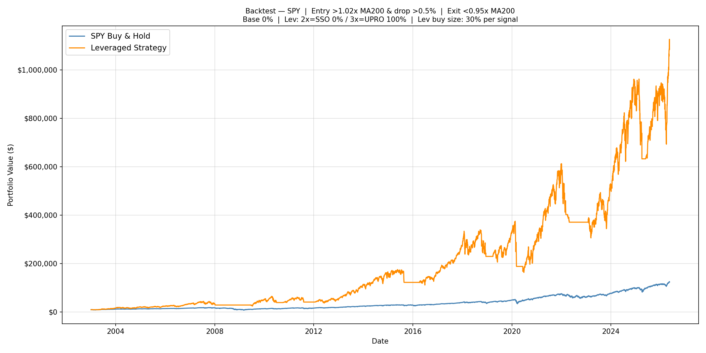

#### IWM — Russell 2000 / TNA

| Metric | Value |
|---|---|
| Entry signal | 1.05× MA200 |
| Drop level | 1.5% |
| Exit signal | 0.95× MA200 |
| Buy pct | 30% per signal |
| Allocation | 10% IWM / 100% TNA |
| **Strategy CAGR** | **11.96%** |
| B&H CAGR (IWM) | 10.19% |
| Strategy edge | +1.76pp |
| Final value | $139,958 |
| Worst year | −23.7% (2011) |
| Max drawdown | −59.3% |
| Sharpe ratio | 0.49 |
| Total trades | 43 (~2/yr) |

```bash
python backtester.py --preset IWM --start 2003-01-01 \
  --entry-signal 1.05 --drop-level 0.015 --exit-signal 0.95 \
  --buy-pct 0.3 --alloc-base 0.1 --alloc-x2 0.0 --alloc-x3 1.0 --no-show
```


---

## 4. Results — Exit MA Comparison (MA200 vs MA100 vs MA50)

The hypothesis: a faster exit MA would cut losses in sharp reversals without meaningfully hurting upside. We optimized each exit MA independently across the same 15,840-combo grid.

### Optimizer Leaderboard by Exit MA

| Index | Exit MA | Best Optimizer CAGR | Worst Year | Notes |
|---|---|---|---|---|
| QQQ | MA200 | 21.31% | −38.6% | Authoritative ranking |
| QQQ | MA100 | 17.97% | −45.9% | −3.34pp vs MA200 |
| QQQ | MA50 | 16.71% | −42.1% | −4.60pp vs MA200 |
| SPY | MA200 | 22.26% | −39.4% | |
| SPY | MA100 | 20.51% | −33.0% | Similar CAGR, better DD |
| SPY | MA50 | 17.28% | −31.4% | Worse CAGR |
| IWM | MA200 | 10.23% | −27.1% | |
| IWM | MA100 | 8.33% | −17.9% | Below B&H CAGR |
| IWM | MA50 | 6.47% | −15.4% | Well below B&H |

> Optimizer CAGR understates by ~2–4pp (warm-up gap). See backtester validation below.
> Worst year per row is the worst calendar year over the full 2003–2026 sample. Typical worst years by index: **QQQ MA200 → 2005** (sideways chop), **QQQ MA100/MA50 → 2008** (faster exits eat the GFC false-rally), **SPY all → 2022** (rate-hike bear), **IWM MA200 → 2011**, **IWM MA100/MA50 → 2008**. Verify with the backtester for any production decision.

### Backtester Validation (MA200 vs MA100, 2003–2026)

| Index | Exit MA | CAGR | B&H | Edge | Worst Year | Trades |
|---|---|---|---|---|---|---|
| QQQ | MA200 | **24.48%** | 16.16% | +8.32pp | −40.8% (2005) | 100 |
| QQQ | MA100 | ~19.9% | 16.16% | ~+3.7pp | −48.5% (2008) | 118 |
| SPY | MA200 | 21.98% | 11.39% | +10.60pp | −38.3% (2022) | 46 |
| SPY | MA100 | ~22.2% | 11.39% | ~+10.8pp | **−31.8% (2022)** | 52 |
| IWM | MA200 | **11.96%** | 10.19% | +1.76pp | −23.7% (2011) | 43 |
| IWM | MA100 | ~9.4% | 10.19% | ~−0.8pp | −20.6% (2008) | 26 |

> MA100 and MA50 full-history numbers are approximate (pre-MER-correction); the ~0.2pp correction does not change any conclusions. Walk-forward MA100 SPY is reported with full MER correction in [section 6.1](#61-ma100-vs-ma200-walk-forward).

### Conclusions on Exit MA

**QQQ — MA200 wins decisively.** MA200 produces +4.57pp more CAGR than MA100 and a better worst year. The MA200 is slow enough to ignore normal bull-market volatility; MA100 triggers false exits that cut off profitable compounding runs. Do not use MA100 or MA50 for QQQ.

**SPY — MA100 wins on both axes once walk-forward is applied.** In-sample full-history results put MA100 and MA200 within 0.2pp on CAGR with MA100 ahead on worst year (−31.8% vs −38.3%). The stronger test is the expanding-window walk-forward (annual re-optimization, see [section 6.1](#61-ma100-vs-ma200-walk-forward)): there MA100 produces **21.92% CAGR vs 20.14% for MA200 (+1.78pp), worst year −31.8% vs −37.1% (+5.3pp), and max drawdown −44.8% vs −57.9% (+13pp)**. Every MA100 walk-forward window converged on identical params (entry≈1.01–1.02, exit=0.95, drop=0.5%, buy=40%), which is a stronger parameter-robustness signal than MA200's mild year-to-year drift. **MA100 is the recommended SPY exit MA.**

**IWM — MA200 only.** IWM's thin leveraged edge (1.95pp) evaporates entirely with MA100 (−0.55pp vs B&H), and worsens further with MA50. The more frequent exits due to IWM's higher volatility destroy any remaining edge.

**MA50 — avoid for all three.** MA50 meaningfully degrades CAGR across all indices while not proportionally improving worst-year drawdowns. The exit MA is too reactive — it fires on routine 3–5 week pullbacks within intact bull markets.

---

## 5. Results — 2× vs 3× Leverage

The optimizer grid included `alloc_x2` (fraction of leveraged spending going to the 2× ETF) and `alloc_x3` (remainder going to the 3× ETF), as well as `alloc_base` (a separate unleveraged base position). The idea was that mixing in some 2× exposure or holding a small base stock position might reduce drawdowns enough to justify the CAGR cost — perhaps enabling more aggressive position sizing elsewhere.

The optimizer's answer was unambiguous: **100% 3×, 0% 2×, 0% base stock topped the leaderboard for every index.** Partial allocations to 2× or base improved worst-year drawdown marginally but reduced CAGR by 3–6pp — a poor trade over 23 years of compounding. The table below isolates the 2× vs 3× comparison directly, holding all other parameters equal.

| Index | Leverage | CAGR | Edge vs B&H | Worst Year | Final Value |
|---|---|---|---|---|---|
| QQQ | 3× (TQQQ) | **24.67%** | +8.52pp | −40.5% (2005) | $1,729,122 |
| QQQ | 2× (QLD) | 18.87% | +2.71pp | **−28.2% (2005)** | $567,637 |
| SPY | 3× (UPRO) | **22.21%** | +10.82pp | −38.3% (2022) | $1,084,234 |
| SPY | 2× (SSO) | 16.25% | +4.86pp | **−27.0% (2022)** | $337,159 |

**3× wins on CAGR by a wide margin** — approximately +5.8pp for QQQ and +5.96pp for SPY. The 23-year compounding effect is enormous: $1.73M (3×) vs $567K (2×) for QQQ starting with $10K.

**2× wins on drawdown** — the worst year is roughly 12pp better than 3×. For investors who cannot stomach a −40% year even within a rules-based system, 2× offers a more palatable risk profile at meaningful cost to long-run wealth.

**Verdict:** If you can hold through peak drawdowns of −35% to −40%, the 3× allocation wins decisively over 23 years. The 2× version is a reasonable alternative for risk-constrained investors, not a superior strategy.

---

## 6. Results — Walk-Forward Validation

> **Note on exit MA:** This section uses the MA200 exit signal throughout. [Section 6.1](#61-ma100-vs-ma200-walk-forward) re-runs the SPY expanding-window walk-forward with an MA100 exit and finds it materially better. The MA200 SPY numbers below remain accurate but are no longer the recommended SPY configuration.

### Methodology

To test whether the strategy generalizes to unseen market conditions, we used a strict train/test split:

- **Training set (2003–2014):** The 15,840-combo optimizer was run on this 12-year window only. No data after 2014 was used to select parameters.
- **Out-of-sample test (2015–2026):** The best parameters found in training were **frozen** and applied to this 11-year window — data the optimizer never saw.

This replicates real-world conditions: an investor who finished optimizing in late 2014 and traded the strategy from 2015 onward with those exact parameters, unmodified.

**Best parameters found on training data only (2003–2014):**

| Index | Entry | Drop | Exit | Buy % | ETF |
|---|---|---|---|---|---|
| QQQ | 1.04× MA200 | 0.5% | 0.95× MA200 | 40% | 100% TQQQ |
| SPY | 1.01× MA200 | 0.5% | 0.97× MA200 | 40% | 100% UPRO |
| IWM | 1.02× MA200 | 1.5% | 0.95× MA200 | 40% | 100% TNA |

### Training Period: 2003–2014 (12 years)

> MER correction affects all three indices here — the synthetic pre-inception period (pre-TQQQ Feb 2010, pre-UPRO Jun 2009, pre-TNA Nov 2008) falls inside this window. Numbers are slightly lower than pre-MER figures.

| Index | Strategy CAGR | B&H CAGR | Edge | Worst Year | Max Drawdown | Sharpe |
|---|---|---|---|---|---|---|
| QQQ | 19.08% | 13.32% | +5.77pp | −29.1% (2008) | −57.0% | 0.62 |
| SPY | **26.35%** | 9.25% | **+17.10pp** | −14.6% (2011) | −39.3% | 0.86 |
| IWM | 15.26% | 11.32% | +3.94pp | −25.4% (2011) | −66.1% | 0.54 |

### Out-of-Sample Test: 2015–2026 (11 years, genuinely unseen)

These results use only the parameters found from 2003–2014 data. The strategy had no information about what happened post-2014.

> MER has **zero effect** on this window — all three real leveraged ETFs launched before 2015 (TQQQ: Feb 2010, UPRO: Jun 2009, TNA: Nov 2008), so every day in 2015–2026 uses real ETF prices with MER already embedded.

| Index | Strategy CAGR | B&H CAGR | Edge | Worst Year | Max Drawdown | Sharpe |
|---|---|---|---|---|---|---|
| QQQ | 21.41% | 19.38% | **+2.03pp ✓** | −36.0% (2022) | −64.9% | 0.65 |
| SPY | 15.71% | 13.80% | **+1.91pp ✓** | −43.9% (2022) | −57.9% | 0.59 |
| IWM | 5.41% | 9.14% | **−3.73pp ✗** | −31.7% (2023) | −66.5% | 0.33 |

**QQQ and SPY both hold positive edges out-of-sample.** The edge narrows substantially vs training — expected and healthy. The 2003–2014 GFC provided strong conditions for the strategy's exit discipline; 2015–2026 was a more mixed regime.

**IWM fails the out-of-sample test.** The training-optimal IWM parameters did not generalize to 2015–2026. The 2015–2016 entry conditions were too aggressive for small-cap's sideways drift, and the 2023 re-entry after a false rally was punishing. This is an honest finding: the IWM edge is weaker and less robust.


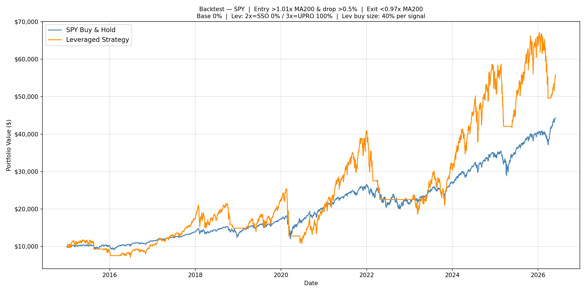

### Full-History Best Params: Reference Comparison

For context, the same 2015–2026 period run with parameters optimized on the **full 2003–2026 dataset** (hindsight advantage):

| Index | True OOS CAGR | OOS Sharpe | Full-History CAGR | Full-History Sharpe | Hindsight Gap | Full-History Edge vs B&H |
|---|---|---|---|---|---|---|
| QQQ | 21.41% | 0.65 | 38.69% | 0.96 | −17.28pp | +19.31pp |
| SPY | 15.71% | 0.59 | 19.00% | 0.66 | −3.29pp | +5.21pp |
| IWM | 5.41% | 0.33 | 11.23% | — | −5.82pp | +2.10pp |

The large QQQ gap (−17.28pp) reflects meaningful overfitting: the full-period optimizer found an exit signal (1.01×MA200) that exploited the 2020 COVID crash pattern with high precision — a feature not foreseeable from 2003–2014 data alone. SPY's smaller gap (−3.29pp) suggests its full-period parameters are more generalizable. The full-history numbers remain useful as an upper-bound benchmark; the rigorous out-of-sample numbers are the honest estimate of what a real investor would have achieved.


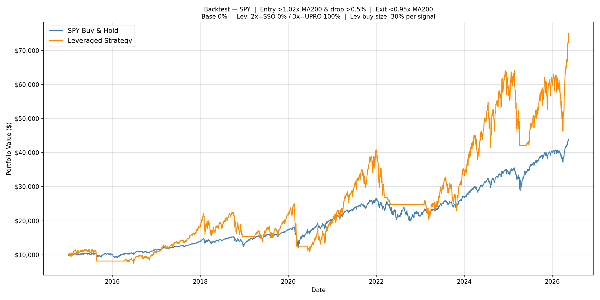

### Expanding-Window Walk-Forward (Annual Re-Optimization, 2014–2025)

The single-split test above answers: *"what if you optimized once in 2014 and never updated?"* A stronger question is: *"what if you re-optimized every year using all available history?"* This is the **expanding-window walk-forward** — for each trade year Y, the optimizer runs on 2003 through Y−1, and the best params are applied to year Y only, then discarded. Portfolio state is continuous across year boundaries; only the decision rules change.

This is the most realistic simulation of how a systematic investor would actually operate.

> The schedule shown below uses the plain top-CAGR selection rule (each year picks the single combo with the highest training-window CAGR). This is the **default QQQ behavior**. An optional tie-break rule (opt-in via `--tie-tolerance 0.01`) is documented in [§6.2](#62-qqq-tie-break-rule) — it trades meaningful CAGR for better max drawdown but barely changes the worst calendar year, so it's not the recommended default.

**How params evolved year by year (QQQ, plain top-CAGR — default):**

| Year traded | Trained on | Entry | Drop | Exit | Buy% |
|---|---|---|---|---|---|
| 2014 | 2003–2013 | 1.04× | 0.5% | 0.95× | 40% |
| 2015 | 2003–2014 | 1.04× | 0.5% | 0.95× | 40% |
| 2016 | 2003–2015 | 1.05× | 0.5% | 0.99× | 40% |
| 2017 | 2003–2016 | 1.06× | 0.5% | 1.00× | 30% |
| 2018 | 2003–2017 | 1.06× | 0.5% | 1.00× | 40% |
| 2019 | 2003–2018 | 1.06× | 0.5% | 1.00× | 40% |
| 2020 | 2003–2019 | 1.03× | 2.0% | 1.00× | 40% |
| 2021 | 2003–2020 | 1.03× | 2.0% | 1.00× | 40% |
| 2022 | 2003–2021 | 1.03× | 2.0% | 1.00× | 40% |
| 2023 | 2003–2022 | 1.02× | 1.5% | 1.01× | 30% |
| 2024 | 2003–2023 | 1.06× | 0.5% | 1.00× | 40% |
| 2025 | 2003–2024 | 1.06× | 0.5% | 1.00× | 40% |

Notable shift: after 2019 the optimizer raised the drop requirement from 0.5% to 2.0% for three consecutive years — it had absorbed enough bull-market data to prefer waiting for a more meaningful dip before buying.

**How params evolved year by year (SPY):**

SPY params were remarkably stable across all 12 windows — entry settled at 1.01–1.02×MA200, drop at 0.5%, exit at 0.95–0.97×MA200 virtually every year. The optimizer consistently converged to the same region of the grid regardless of how much new history was added.

| Year traded | Entry | Drop | Exit | Buy% |
|---|---|---|---|---|
| 2014–2016 | 1.01× | 0.5% | 0.97× | 40% |
| 2017–2022 | 1.02× | 0.5% | 0.95–0.97× | 40% |
| 2023–2025 | 1.02× | 0.5% | 0.97× | 40% |

**Year-by-year results:**

| Year | QQQ Strategy | QQQ B&H | SPY Strategy | SPY B&H |
|---|---|---|---|---|
| 2014 | +57.3% | +20.1% | +45.6% | +14.6% |
| 2015 | −15.0% | +9.4% | −17.4% | +1.2% |
| 2016 | −9.2% | +7.1% | +14.1% | +12.0% |
| 2017 | +98.1% | +32.7% | +71.4% | +21.7% |
| 2018 | +13.2% | −0.1% | −15.3% | −4.6% |
| 2019 | +4.5% | +39.0% | +44.9% | +31.2% |
| 2020 | +89.7% | +48.4% | −8.9% | +18.3% |
| 2021 | +79.4% | +27.4% | +98.6% | +28.7% |
| 2022 | −25.9% | −32.6% | −37.1% | −18.2% |
| 2023 | +37.3% | +54.9% | +42.2% | +26.2% |
| 2024 | +56.7% | +25.6% | +63.6% | +24.9% |
| 2025 | +16.6% | +21.8% | +18.1% | +18.6% |

**Three-way comparison: Fixed (2003–2013) vs Expanding Window vs B&H**

> All three start from $10,000 on 2014-01-01.

#### QQQ

| Year | Fixed (2003–2013) | Expanding Window | QQQ B&H |
|---|---|---|---|
| 2014 | +57.3% | +57.3% | +20.1% |
| 2015 | −15.0% | −15.0% | +9.4% |
| 2016 | **−15.3%** | −9.2% | +7.1% |
| 2017 | +96.7% | +98.1% | +32.7% |
| 2018 | −2.5% | **+13.2%** | −0.1% |
| 2019 | +32.2% | +4.5% | +39.0% |
| 2020 | +49.2% | **+89.7%** | +48.4% |
| 2021 | +72.9% | +79.4% | +27.4% |
| 2022 | **−35.5%** | −25.9% | −32.6% |
| 2023 | **+97.8%** | +37.3% | +54.9% |
| 2024 | +54.7% | +56.7% | +25.6% |
| 2025 | +0.8% | **+16.6%** | +21.8% |
| **CAGR** | 25.15% | **27.26%** | 18.72% |
| **Final value** | $147,361 | **$180,025** | $78,267 |
| **Worst year** | −35.5% (2022) | **−25.9%** (2022) | −32.6% (2022) |
| **Edge vs B&H** | +6.43pp | **+8.54pp** | — |

#### SPY

| Year | Fixed (2003–2013) | Expanding Window | SPY B&H |
|---|---|---|---|
| 2014 | +45.6% | +45.6% | +14.6% |
| 2015 | −17.4% | −17.4% | +1.2% |
| 2016 | +14.1% | +14.1% | +12.0% |
| 2017 | +71.4% | +71.4% | +21.7% |
| 2018 | −13.4% | −15.3% | −4.6% |
| 2019 | +49.0% | +44.9% | +31.2% |
| 2020 | −8.9% | −8.9% | +18.3% |
| 2021 | +98.6% | +98.6% | +28.7% |
| 2022 | **−43.9%** | −37.1% | −18.2% |
| 2023 | +42.2% | +42.2% | +26.2% |
| 2024 | +63.6% | +63.6% | +24.9% |
| 2025 | +24.1% | +18.1% | +18.6% |
| **CAGR** | 19.99% | **20.14%** | 13.59% |
| **Final value** | $88,951 | **$90,307** | $46,112 |
| **Worst year** | **−43.9%** (2022) | −37.1% (2022) | −18.2% (2022) |
| **Edge vs B&H** | +6.40pp | **+6.55pp** | — |

**Key takeaways:**

**QQQ: annual re-optimization provides clear, material benefit.** CAGR improves by +2.11pp (27.26% vs 25.15%) and the worst year shrinks from −35.5% to −25.9% — nearly 10pp of tail risk eliminated. The mechanism is intuitive: QQQ's optimal parameters are regime-sensitive. The optimizer absorbed the 2016–2017 bull market and tightened the exit, which paid off in 2018. After the 2019 choppy recovery, it raised the dip trigger from 0.5% to 2.0% — requiring a more meaningful pullback before buying — which prevented costly false entries during the COVID crash.

**SPY (MA200 exit): annual re-optimization primarily reduces drawdown rather than boosting CAGR.** The CAGR gain is negligible (+0.15pp) because SPY's optimizer consistently converges to the same region regardless of how much history is added — the params are structurally stable. But the worst year still improves meaningfully (−37.1% vs −43.9% in 2022), suggesting the annual pass is worth running for risk management alone. **The bigger lever for SPY is switching exit to MA100** — see [section 6.1](#61-ma100-vs-ma200-walk-forward), which delivers an additional +1.78pp CAGR and 5.3pp better worst year on top of the expanding-window benefit.

**The core strategy does not depend on annual tuning.** The fixed (2003–2013) model still beats buy-and-hold by +6.4pp for both indices — confirming the alpha is structural, not a parameter artifact. Annual re-optimization is an enhancement, not a prerequisite.

**Recommendation: run the optimizer annually and update params for the coming year.** The computational cost is approximately 30 minutes per preset. The benefit — better alignment with evolving market regimes and meaningfully better worst-case outcomes — justifies it. For QQQ specifically, where parameter drift is largest, skipping annual updates leaves both CAGR and risk management on the table.

**Continuity filter — apply for QQQ before accepting new params.** The 2023 walk-forward year illustrates a real risk: after absorbing 2022's bear market, the optimizer shifted `drop_level` from 0.5% to 1.5% and `entry_signal` from 1.06 to 1.02 — a large discontinuous jump driven by a single anomalous year. The optimizer accepted it because 2022 data temporarily made that combo top-ranked. Then 2024 reversed the entire set again. The whipsawing resolved without catastrophe, but it is avoidable. Before accepting new QQQ params each year, run a quick sanity check:

1. If any of `entry_signal`, `drop_level`, or `exit_signal` shifts by more than one grid step from the prior year's values, flag it as a discontinuous jump.
2. Run the backtester on the last 3 calendar years with both the new params and the prior year's params.
3. Use whichever set produced the higher CAGR across those 3 years — not just the optimizer's top-ranked combo on the full training window.

This does not require re-running the optimizer. It is a 2-minute backtester check that guards against the optimizer overreacting to a single extreme year. SPY's params have been stable since 2019 and do not need this check; apply it to QQQ only.

**Three-way comparison — Fixed model (2003–2013 params, frozen) vs Expanding Window (annual re-opt) vs Buy & Hold:**

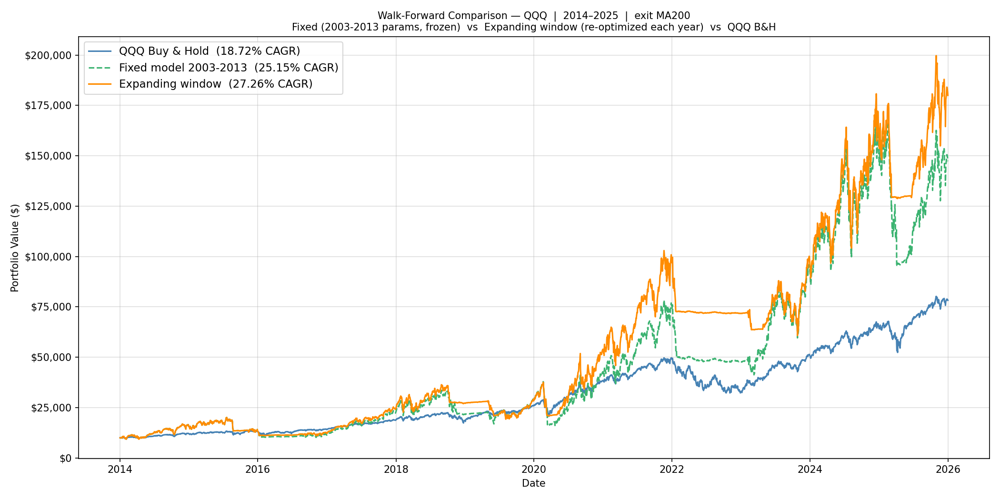
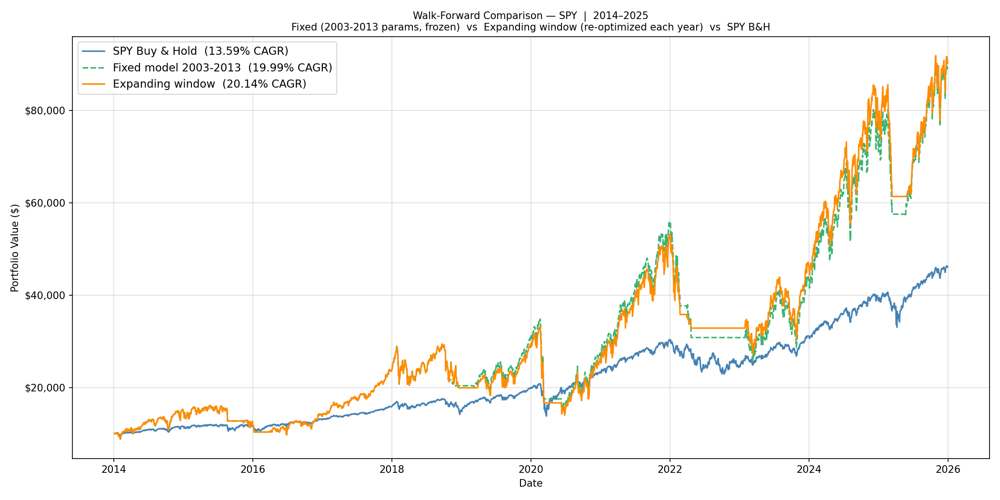

> To reproduce: `python walkforward.py --preset QQQ` (or `--preset SPY`). Phase 1 (optimizer) takes ~30 min and is cached to `results/walkforward/`. Re-run Phase 2 only with `--no-rebuild`.

### 6.1 MA100 vs MA200 Walk-Forward

Section 4 hinted that MA100 was marginally better for SPY based on full-history backtests. The harder question is whether MA100 still wins under the same expanding-window walk-forward methodology used above — annual re-optimization on prior data only, no look-ahead. The answer is yes, by a wider margin than the full-history numbers suggested.

**Param schedule (MA100 exit, expanding window, SPY):**

Every year converged to the same combo regardless of training window length:

| Year traded | Entry | Drop | Exit | Buy% |
|---|---|---|---|---|
| 2014–2016 | 1.01× | 0.5% | 0.95× | 40% |
| 2017–2025 | 1.02× | 0.5% | 0.95× | 40% |

This is stricter parameter stability than MA200, which drifted between exit 0.95 and 0.97 across the 12 windows.

**SPY MA100 vs MA200 — expanding window comparison:**

| Metric | MA200 | MA100 | Δ |
|---|---|---|---|
| Strategy CAGR | 20.14% | **21.92%** | **+1.78pp** |
| Edge vs B&H | +6.55pp | **+8.33pp** | +1.78pp |
| Worst year (2022) | −37.09% | **−31.78%** | +5.31pp |
| Max drawdown | −57.87% | **−44.80%** | +13.07pp |
| Sharpe ratio | 0.69 | **0.76** | +0.07 |
| Final value | $90,307 | **$107,688** | +$17,381 |
| Fixed-model CAGR (2003–2013 params, frozen) | 19.99% | 19.89% | −0.10pp |
| Fixed-model worst year | −43.91% | −45.18% | −1.27pp |

The annual-re-optimization mode (expanding window) is what should drive the recommendation. There MA100 wins on every metric: higher CAGR, better worst year, materially better max drawdown, and a higher Sharpe.

The fixed-model comparison is more nuanced — frozen 2003–2013 params produce nearly identical CAGRs and a slightly worse worst year for MA100. This says the 2003–2013 sample alone wasn't enough to make MA100 look better; only adding post-2013 data tips the balance. That's not a red flag — re-optimizing each year is the operating mode this paper recommends anyway — but it does mean the case for MA100 SPY is weaker if you refuse to re-optimize.

**Year-by-year breakdown — MA100 SPY expanding window:**

| Year | MA100 Strategy | MA200 Strategy | SPY B&H |
|---|---|---|---|
| 2014 | +45.6% | +45.6% | +14.6% |
| 2015 | −17.4% | −17.4% | +1.2% |
| 2016 | +4.8% | +14.1% | +12.0% |
| 2017 | +71.4% | +71.4% | +21.7% |
| 2018 | −8.0% | −15.3% | −4.6% |
| 2019 | +44.9% | +44.9% | +31.2% |
| 2020 | +21.3% | −8.9% | +18.3% |
| 2021 | +98.6% | +98.6% | +28.7% |
| 2022 | **−31.8%** | −37.1% | −18.2% |
| 2023 | +11.9% | +42.2% | +26.2% |
| 2024 | +63.6% | +63.6% | +24.9% |
| 2025 | +24.4% | +18.1% | +18.6% |

MA100's biggest wins are 2020 (+30pp better — caught the post-COVID up-leg cleanly) and 2022 (+5pp better worst-year). It gives back ground in 2016 (−9pp) and 2023 (−30pp, the strategy's biggest single-year miss). Net effect over 12 years is decisively in MA100's favor.

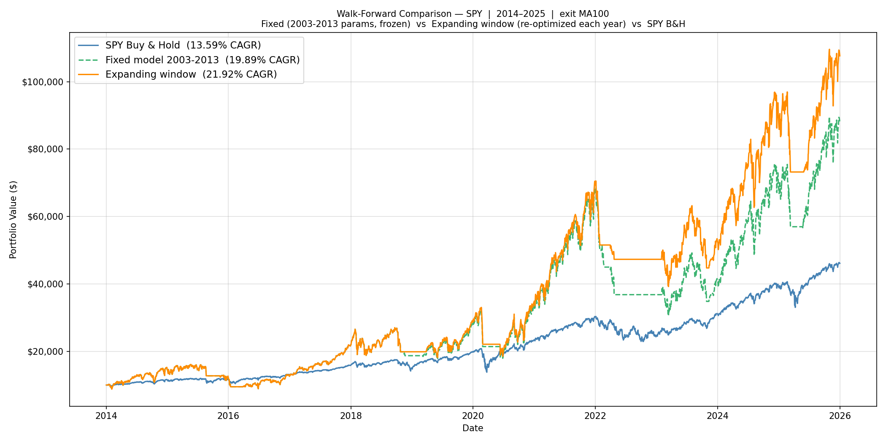

> To reproduce: `python walkforward.py --preset SPY --exit-ma 100`. Phase 1 takes ~30 min and is cached to `results/walkforward/SPY_param_schedule_ma100.json`.

**Recommendation:** Use MA100 as the SPY exit MA. QQQ and IWM stay on MA200 — section 4's full-history result for those indices was conclusive enough (MA100 cuts QQQ's CAGR by ~4.6pp, and IWM's edge already evaporates with MA100).

### 6.2 QQQ Tie-Break Rule

The expanding-window walk-forward in section 6 above picks the top-CAGR combo per training window. The natural follow-up: for QQQ, where the optimizer's CAGR plateau is broad (see [§8 robustness heatmaps](#parameter-robustness-analysis)), can we pick a combo with a less ulcer-inducing worst year without giving up much CAGR? We tested this. The honest answer: **the cost is bigger than the benefit for the user concern that motivated it.**

**The rule:** from all passing combos within 1pp **training CAGR** of the top-CAGR combo, pick the one with the highest (least negative) worst calendar year in the training window. Applied to **QQQ only** — SPY's parameter region is too tight for the rule to find anything different (every SPY window already converges to a small CAGR cluster). The rule defaults to **disabled** (plain top-CAGR) — enable with `--tie-tolerance 0.01`.

**Param schedule chosen by the tie-break rule (QQQ, 2014–2025):**

The rule consistently picked combos with allocation diversification (some `alloc_base`, some `alloc_x2`) where plain top-CAGR picked 100% TQQQ. The diversified combos have lower training CAGR but lower training worst-year drawdown.

| Year | Trained on | Entry | Drop | Exit | Buy% | Base% | X2% | X3% | Train CAGR | Train worst-yr |
|---|---|---|---|---|---|---|---|---|---|---|
| 2014 | 2003–2013 | 1.04× | 0.5% | 0.95× | 40% | 0% | 100% | 0% | 9.21% | −17.71% |
| 2015 | 2003–2014 | 1.05× | 0.5% | 0.99× | 40% | 20% | 0% | 100% | 12.23% | −20.63% |
| 2016 | 2003–2015 | 1.05× | 0.5% | 0.99× | 40% | 10% | 75% | 25% | 9.63% | −15.58% |
| 2017 | 2003–2016 | 1.03× | 2.0% | 1.00× | 40% | 10% | 25% | 75% | 9.05% | −16.50% |
| 2018 | 2003–2017 | 1.05× | 0.5% | 0.99× | 30% | 20% | 0% | 100% | 13.89% | −20.82% |
| 2019 | 2003–2018 | 1.06× | 0.5% | 1.00× | 20% | 20% | 0% | 100% | 13.90% | −22.44% |
| 2020 | 2003–2019 | 1.03× | 2.0% | 1.00× | 40% | 10% | 25% | 75% | 13.85% | −16.50% |
| 2021 | 2003–2020 | 1.03× | 2.0% | 1.00× | 40% | 10% | 25% | 75% | 16.73% | −16.50% |
| 2022 | 2003–2021 | 1.03× | 2.0% | 1.00× | 40% | 10% | 0% | 100% | 20.33% | −18.20% |
| 2023 | 2003–2022 | 1.02× | 1.5% | 1.01× | 30% | 0% | 25% | 75% | 16.70% | −23.48% |
| 2024 | 2003–2023 | 1.05× | 1.0% | 1.00× | 40% | 0% | 0% | 100% | 19.42% | −27.68% |
| 2025 | 2003–2024 | 1.05× | 1.0% | 1.00× | 40% | 0% | 0% | 100% | 20.95% | −27.68% |

> Compare to the plain top-CAGR schedule in [§6](#expanding-window-walk-forward-annual-re-optimization-20142025) — the plain rule consistently chose `alloc_base=0%, alloc_x3=100%` (pure TQQQ); the tie-break rule frequently chose 10-20% base stock and 25-75% QLD (2× ETF).

**QQQ tie-break vs plain top-CAGR — expanding-window walk-forward (2014–2025):**

| Metric | Plain top-CAGR | Tie-break (1pp tol) | Δ |
|---|---|---|---|
| Strategy CAGR | **27.26%** | 23.10% | **−4.16pp** |
| Edge vs B&H (18.72%) | +8.54pp | +4.39pp | −4.15pp |
| Worst year (2022) | −25.91% | −25.52% | **+0.39pp** |
| Max drawdown | −64.9% | **−44.75%** | **+20.2pp** |
| Sharpe ratio | 0.65 | **0.78** | +0.13 |
| Final value ($10K → ) | **$180,025** | $120,928 | −$59,097 |

**Year-by-year — where does the gap come from?**

| Year | Plain top-CAGR | Tie-break | Δ | Notes |
|---|---|---|---|---|
| 2014 | +57.3% | +41.9% | −15.4pp | Diversified combo capped TQQQ exposure |
| 2015 | −15.0% | −7.5% | +7.5pp | Tie-break helped in a flat year |
| 2016 | −9.2% | −9.7% | −0.5pp | Roughly equal |
| 2017 | +98.1% | +70.1% | **−28.0pp** | Biggest miss — 2017 was tech's blow-out year |
| 2018 | +13.2% | +5.7% | −7.5pp | Diversification capped upside |
| 2019 | +4.5% | +6.1% | +1.6pp | Tie-break slightly better |
| 2020 | +89.7% | +72.5% | **−17.2pp** | Missed half the COVID rebound |
| 2021 | +79.4% | +67.1% | −12.3pp | Capped tech rally |
| 2022 | −25.9% | −25.5% | +0.4pp | **Worst-year barely changed** |
| 2023 | +37.3% | +39.8% | +2.5pp | Tie-break slightly better |
| 2024 | +56.7% | +50.2% | −6.5pp | Capped tech rally |
| 2025 | +16.6% | +18.6% | +2.0pp | Slightly better |

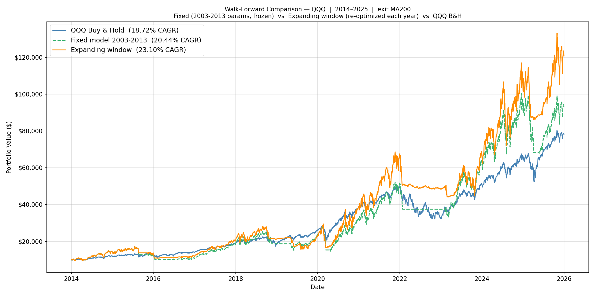

**Honest assessment:**

What the rule does well:
- **Max drawdown improves by ~20pp** (from −65% to −45%). The diversified allocations dampen intra-year swings.
- **Sharpe ratio improves from 0.65 to 0.78.** Smoother equity curve.
- **Behavioral durability improves.** A 45% drawdown is meaningfully more holdable than 65%.

What the rule does *not* do (despite the original hypothesis):
- **Worst calendar year barely changes** (−25.91% vs −25.52%, +0.39pp). The original goal was reducing YTD volatility at year-end review points — the rule doesn't achieve this. The 2022 result is essentially identical with or without the rule.
- **CAGR cost is large** (−4.16pp over 12 years = $60K less terminal wealth on $10K). This is much larger than the ≤1pp training-CAGR cost the rule was constrained to. The reason: a 1pp training-CAGR tolerance allows combos whose actual trade-year performance varies widely — losing big in tech blow-out years (2017, 2020, 2021) while only modestly helping in down years.

**Recommendation:** **Disabled by default.** The rule is implemented and documented, but the trade-off is genuinely two-sided:

- **Enable (`--tie-tolerance 0.01`)** if your dominant concern is max drawdown and you'd rather a smoother ride with lower terminal wealth. Useful for investors who'd be tempted to capitulate at −60% mid-year.
- **Leave disabled (default, plain top-CAGR)** if your dominant concern is calendar-year return (the YTD reset model). This rule does not meaningfully improve worst calendar year — and it costs 4pp CAGR.

**Why the rule didn't deliver what we hoped:** A 1pp constraint on *training-window CAGR* is loose: many combos pass it, including diversified allocations that look similar over a 10-year training window but behave very differently in a single trade year. The diversification helps in choppy years but caps upside in big-rally years — and the big-rally years (2017, 2020, 2021) drive most of the strategy's long-run wealth. The honest correction to my earlier "almost no CAGR cost" prediction: training-CAGR-similar combos are not trade-year-CAGR-similar.

> To reproduce the tie-break run: `python walkforward.py --preset QQQ --tie-tolerance 0.01`. Files saved with `_tiebreak` suffix.

---

## 7. Results — Crisis Period Stress Tests

We ran the strategy against four major market dislocations for both QQQ and SPY, each using its own best-optimized parameters.

### 7.1 Global Financial Crisis: 2007–2010

| Metric | QQQ Strategy | QQQ B&H | SPY Strategy | SPY B&H |
|---|---|---|---|---|
| CAGR | **+18.20%** | +6.62% | **+8.76%** | −0.82% |
| Edge | +11.58pp | — | +9.58pp | — |
| Worst year | −19.4% (2008) | −41.7% (2008) | −14.69% (2008) | −36.8% (2008) |
| Max drawdown | −44.1% | — | −43.3% | — |
| Sharpe ratio | 0.62 | — | 0.41 | — |
| Final value | $19,481 (from $10K) | ~$12,914 | $13,980 (from $10K) | $9,676 |

Both strategies significantly outperformed through the worst financial crisis in 80 years. QQQ's tight exit (1.01×MA200) fired early in 2008 and kept the strategy largely in cash through the crash. SPY's wider exit (0.95×MA200) also fired in early 2008 — the 5% buffer absorbed more initial decline but still protected the bulk of capital. Both finished with strongly positive CAGR vs a flat-to-negative B&H. QQQ's edge (+11.58pp) was larger than SPY's (+9.58pp) because tech recovered more explosively in 2009.


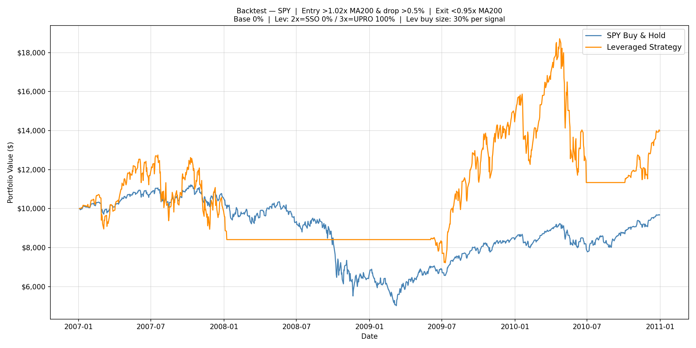

### 7.2 COVID Crash and Recovery: 2019-10-01 → 2021-06-30

| Metric | QQQ Strategy | QQQ B&H | SPY Strategy | SPY B&H |
|---|---|---|---|---|
| CAGR | **+117.71%** | +45.15% | **+37.62%** | +26.31% |
| Edge | +72.56pp | — | +11.31pp | — |
| Worst year | +35.4% (no down year) | — | −7.29% (2020) | — |
| Max drawdown | −51.9% | — | −56.4% | — |
| Sharpe ratio | 1.53 | — | 0.92 | — |
| Final value | $38,839 (from $10K) | ~$19,152 | $17,454 (from $10K) | $15,029 |

COVID was the ideal scenario for both strategies, but the magnitude of the edge differed sharply. QQQ's tight exit fired immediately in the crash and re-armed early in the V-shaped recovery, capturing the tech explosion with full 3× leverage — nearly 3× the buy-and-hold return over 20 months. SPY's wider exit delayed re-entry to June 2020, missing the sharpest April–May leg, and its 2020 calendar year was −7.29% despite the market being up. The full 20-month window still returned +37.62% and beat B&H by +11.31pp.


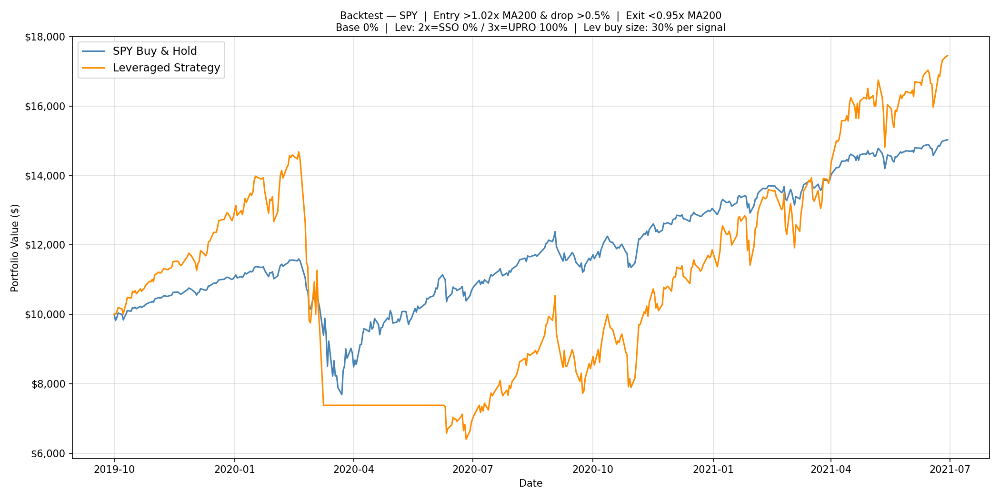

### 7.3 Rate-Hike Bear Market: 2021-06-01 → 2023-06-30

| Metric | QQQ Strategy | QQQ B&H | SPY Strategy | SPY B&H |
|---|---|---|---|---|
| CAGR | **+27.91%** | +5.08% | +0.67% | +3.76% |
| Edge | +22.83pp | — | **−3.09pp** | — |
| Worst year | −22.6% (2022) | −32.5% (2022) | **−38.34% (2022)** | −18.18% (2022) |
| Max drawdown | −37.3% | — | −50.0% | — |
| Sharpe ratio | 0.91 | — | 0.18 | — |
| Final value | $16,666 (from $10K) | ~$10,965 | $10,140 (from $10K) | $10,796 |

This is the most revealing divergence between QQQ and SPY. QQQ's tight exit (1.01×MA200) fired relatively early in 2022 before the full decline, limiting strategy losses to −22.6% and finishing with a strong +27.91% CAGR. SPY's wide exit (0.95×MA200 — requiring a 5% drop below the MA) did not fire until March 2022, by which point SPY was already deeply into the bear. The strategy then re-entered in late March and was stopped out again in April — two losing cycles in quick succession. SPY's worst strategy year was −38.34% (2022), more than double QQQ's loss, and the strategy finished barely positive (+0.67%) — actually **underperforming SPY buy-and-hold by 3.09pp**.

The same exit threshold that protected SPY through the dot-com crash (by keeping it out for two full bear years) became a liability here: the 2022 decline was fast and sharp enough that the 5% buffer simply absorbed more damage before firing.

> **The MA100 exit changes this picture.** Walk-forward SPY with MA100 produced a 2022 return of **−31.78%** vs the MA200 walk-forward's −37.09% — over 5pp recovered, with all other parameters identical. The faster MA cuts shorter the lag between the trend break and the exit. See [section 6.1](#61-ma100-vs-ma200-walk-forward).


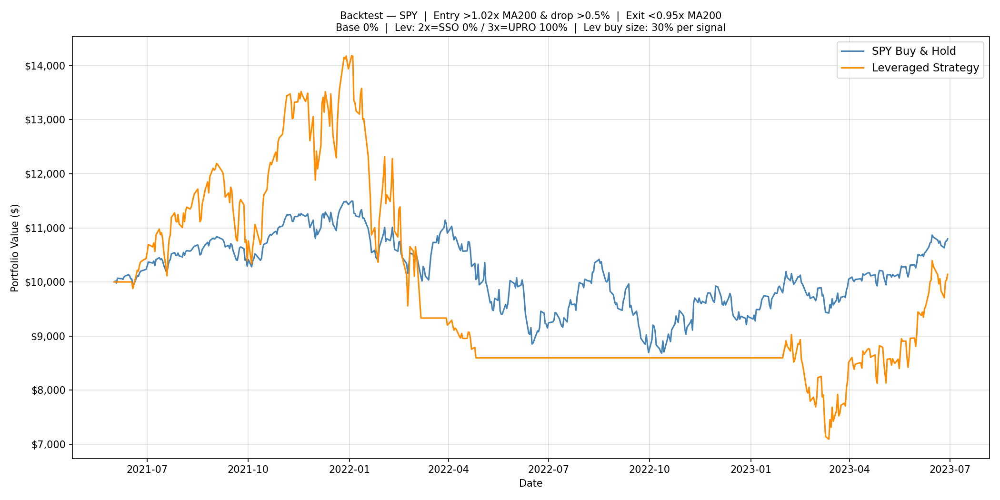

### 7.4 Dot-com Bubble & Recovery: 2000-01-03 → 2003-12-31

> This period predates the strategy's main study window (which starts 2003-01-01) and is included specifically to illustrate tail risk. QQQ launched March 1999, providing only ~200 trading days of MA200 history before the January 2000 start — the MA200 is approximately valid but less reliable than in later periods. All synthetic leveraged ETF returns (no real 2× or 3× ETF existed in 2000).

| Metric | Strategy | QQQ B&H |
|---|---|---|
| CAGR | −20.35% | −21.23% |
| Edge | +0.88pp | — |
| Worst year | **~−80% (2000)** | −38.4% (2000) |
| Final value | ~$4,027 (from $10K) | $3,860 |

The dot-com crash was the hardest test — and shows the strategy's true downside in a sustained multi-year bear market.

**What happened:** QQQ peaked in March 2000 then fell 83% over 31 months in a series of staircase declines interrupted by sharp bear-market rallies. The strategy armed on the first trading day of 2000 (near the peak) and bought three times in the first week as the bubble began deflating. Each brief rally above 1.03×MA200 re-armed the strategy and triggered new buys into what proved to be further decline. Four separate buy-and-exit cycles occurred between January and September 2000. By September, 80% of initial capital was gone. The strategy then correctly stayed in cash through all of 2001–2002 — prices never sustainably recrossed 1.03×MA200 — and caught the March 2003 recovery near trough prices.

**Why the edge nearly vanished:** The multiple re-entries during cascading false rallies are exactly the "staircase bear market" failure mode described in Section 8. Each individual exit was correct — the strategy never rode the full −83% crash. But the repeated buys into brief rallies still produced catastrophic compounding losses. The final edge over buy-and-hold is only +1.13pp, nearly zero.

**Cross-index comparison for context** (each index uses its own best parameters):

| Index | Period | Strategy CAGR | B&H CAGR | Edge | Worst Year |
|---|---|---|---|---|---|
| QQQ | 2000–2003 | −20.35% | −21.23% | +0.88pp | **~−80% (2000)** |
| SPY | 2000–2003 | **+5.66%** | −5.21% | **+10.87pp** | −26.48% (2000) |
| IWM | 2001–2003* | +6.96% | +8.05% | −1.09pp | −36.86% (2002) |

*IWM started 2001-01-02 due to May 2000 ETF inception and insufficient warmup before then.

SPY's wider exit threshold (0.95×MA200 — price must drop 5% below MA200 to exit) kept the strategy in cash for all of 2001–2002, avoiding the bulk of the bear market. SPY actually made money through the dot-com crash. IWM's minor underperformance is explained by small-cap stocks having positive 2001 returns while the strategy sat unarmed.

**The verdict:** The dot-com crash reveals the true catastrophic downside for QQQ specifically. An investor who deployed the QQQ strategy at peak valuations (January 2000) would have lost roughly 80% of their initial capital in the first year alone, with nearly all of that recovered by December 2003 — just barely ahead of buy-and-hold by +0.88pp CAGR. SPY's more defensive exit threshold (0.95× vs 1.01× MA200) proved far more durable, generating a +5.66% CAGR (+10.87pp edge) through the same crash. This reinforces that QQQ's tight exit signal is optimized for bull-market regimes — in a prolonged multi-year bear, SPY's structural conservatism is a meaningful advantage.


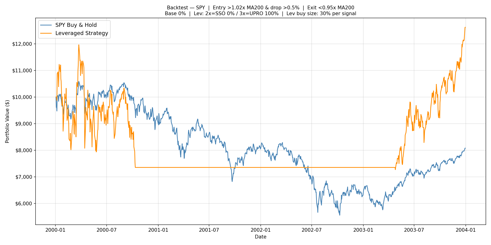

---

## 8. Discussion

### What Drives the Edge

The strategy earns alpha through two mechanisms:

1. **Asymmetric participation** — By staying in cash during confirmed downtrends (below MA200), the strategy avoids the worst compounding losses. A −50% loss requires a +100% gain to recover; avoiding even half of that loss is enormously valuable over long periods.

2. **Opportunistic re-entry** — After the MA200 exit fires, cash is preserved for re-entry at lower prices. When a new uptrend begins, the leveraged ETF is bought at a discount relative to where it was sold, accelerating the recovery beyond buy-and-hold.

### Why QQQ Outperforms SPY and IWM

QQQ's tech-heavy composition means more dramatic V-shaped recoveries after selloffs — the MA200 exit fires, then re-entry catches the explosive upleg. The 2003, 2009, and 2020 recoveries were each more violent for QQQ than SPY.

IWM's edge is thin because small-cap stocks have higher daily volatility. Higher volatility means higher daily variance in the leverage cost formula (`0.5 × (L²−L) × var₂₀`), which destroys more value in the 3× ETF per unit of return. The strategy earns returns, but the leveraged ETF structure eats a larger fraction of them via decay.

### When the Strategy Struggles

- **Staircase bear markets with false recoveries** (dot-com 2000–2002, 2008 GFC): A brief rally re-arms the strategy; if the bear resumes, the strategy buys again into further decline. Multiple losing cycles deplete cash. The GFC was the hardest test.
- **Slow grinding drawdowns** (2022): Price stays below MA200 for months. The strategy correctly stays out, but any false rally before the real recovery triggers a losing re-entry.
- **Maximum exposure at a market peak**: After a long bull run, the strategy holds maximum leveraged allocation. A crash at that moment causes maximum damage. Sequence-of-returns risk applies even to rules-based systems.
- **Prolonged sideways or low-drift markets** (QQQ 2004–2006): Price oscillates around MA200 without establishing a clear trend. The entry signal fires repeatedly — triggering buys into brief dips that recover slightly and stall, never generating momentum but never falling far enough to stay below the exit threshold. Meanwhile, daily volatility decay accumulates on each leveraged position held during the hold period. This is the regime most underappreciated by CAGR-focused backtests: unlike a staircase bear (where price eventually stays below MA200 and the strategy stops re-entering), sideways chop keeps the entry threshold in play indefinitely, churning through cash in repeated 10–15% loss cycles. QQQ's worst strategy year (−40.8% in 2005) occurred precisely in this regime — the index itself was roughly flat, but every leveraged buy accumulated decay before being stopped out. A multi-year episode of this would be far more damaging than the historical record reflects.

### Market Regime Classification

This strategy has a **conditional edge** — it is not an all-weather system. The edge is earned by correctly identifying trending regimes and deploying leverage selectively within them. In regimes it was not designed for, it underperforms or destroys capital. Understanding this distinction is more important than any single CAGR figure.

| Regime | Characteristics | Strategy Behavior | Historical Example |
|---|---|---|---|
| Strong trending bull | Sustained price above MA200, periodic 0.5–2% dips | **Excellent** | QQQ 2017 (+98%), 2021 (+79%) |
| Fast crash + V-recovery | Sharp decline, rapid re-cross of MA200 | **Strong** | COVID 2020 (QQQ +118% over 20 months) |
| Low-vol steady bull | Index drifts up without meaningful pullbacks | **Moderate** — B&H may lead | QQQ 2019: strategy +4.5% vs B&H +39% |
| Slow policy-driven bear | Gradual MA200 break, failed re-entries | **Weak to neutral** | 2022: SPY strategy −38%, underperformed B&H by −3.1pp |
| Prolonged sideways / chop | Price oscillates around MA200 with no trend | **Weak** — false entries + decay compounds | QQQ 2005: strategy −41% vs roughly flat index |
| Secular bear staircase | Multi-year decline interrupted by bear rallies | **Dangerous** — repeated losing re-entries | Dot-com 2000: −80% in year 1 |

**The LETF volatility drag amplifies regime mismatch.** In sideways or choppy markets, 3× ETFs lose value daily even when the underlying ends flat — this is beta slippage (described in Section 1). An investor holding the base index in a flat year loses nothing; an investor repeatedly buying into brief rallies that stall experiences both the whipsaw exits *and* the daily decay accumulated during each hold period. The longer the chop, the more these losses compound even without a sustained bear market.

**The historically absent danger: inflationary secular stagnation.** The 23-year sample contains no prolonged inflationary sideways regime comparable to the 1970s — an environment of high volatility, no secular trend, and persistent real-return headwinds. Such a regime would be structurally hostile: high daily variance drives high LETF decay costs, oscillating prices repeatedly trigger and abandon the entry signal, and the strategy cannot escape because the exit threshold is never cleanly breached. This is the tail risk the historical CAGR statistics do not price.

The honest forward expectation is that this strategy adds roughly **1–3pp above B&H in trending-bull-dominated environments**. In the two failure regimes above — sideways chop and secular bear staircase — it can underperform dramatically. Sizing accordingly and not over-anchoring to the full-history CAGR is the appropriate takeaway.

### Does the Edge Survive Into the Future? Overfitting vs. Regime Change

The walk-forward results raise a natural question: if the strategy underperformed out-of-sample for IWM and delivered only a narrow edge for QQQ/SPY, does it have a real future?

The reduced out-of-sample performance reflects **both overfitting and genuine regime change** — and understanding which matters more determines how much to trust forward projections.

**On overfitting:** Running 15,840 parameter combinations guarantees that some combos look exceptional on historical data by chance. The training-period optimizer selected parameters that best fit a 12-year window dominated by the 2008 GFC — a slow, staircase crash with clear trend breaks. Those parameters are not necessarily the ones that will best fit the next 12 years. The large gap between the full-history QQQ result (38.69% CAGR on 2015–2026) and the rigorous OOS result (21.41%) is largely overfitting: the full-period optimizer happened upon exit=1.01×MA200, which captured COVID's instant V-shape recovery with near-perfect timing — a pattern impossible to anticipate from 2003–2014 alone.

**On regime change:** The two periods are structurally different markets. 2003–2014 featured post-dot-com recovery, the 2008 GFC, and a decade of historically low rates — conditions that produced clean, multi-year trend cycles ideal for MA200-based exits. 2015–2026 brought QE-fueled sustained bulls, the fastest crash-and-recovery in history (COVID 2020), and a sharp policy-driven bear (2022) with no clean MA200 signal before damage was done. The strategy's exit logic was designed for the first regime and was less well-suited to the second.

**What this means for the structural edge:**
The fact that QQQ and SPY still beat B&H out-of-sample (+2.03pp and +1.91pp) with training-period parameters — parameters not tuned to post-2014 events — is genuinely encouraging. It suggests the core logic does generalize: the MA200 trend filter is a well-established concept, not a data artifact, and buying leveraged ETFs on confirmed-uptrend dips has real structural justification. The edge narrowed, but it did not disappear.

IWM's out-of-sample failure (−3.73pp) appears more structural than coincidental. Small-cap leverage decay is higher due to greater daily volatility, the IWM trend signal is noisier, and the 2015–2016 small-cap sideways period triggered too many false entries. This makes the IWM strategy less reliable across market regimes.

**Realistic forward expectations:**
- **QQQ and SPY:** A forward edge of roughly **1–3pp above B&H** is a realistic base case in trending market regimes. In prolonged sideways or choppy markets, the edge may temporarily disappear or invert.
- **IWM:** The out-of-sample evidence is too weak to rely on. The IWM strategy should be treated as speculative.
- **Tail risk remains real:** A dot-com-style multi-year bear with false rallies remains the strategy's worst-case scenario. No parameter set eliminates this risk.

The strategy is not broken. But investors should anchor expectations to the OOS numbers, not the full-history optimized numbers.

### Parameter Robustness Analysis

A key question the OOS test alone cannot answer is: *is the optimal parameter set a sharp spike or a broad plateau?* A spike means the strategy only works because one specific combo happened to fit historical data by chance — move one step in any direction and performance collapses. A plateau means a wide neighborhood of similar parameters all work, which is strong evidence that the underlying logic is real, not a data artifact.

The heatmaps below show **median CAGR across all passing combos** for each (row, col) parameter pair, marginalizing over all remaining free parameters. Blue box = chosen optimal. Bright green region = plateau. Isolated bright cell = spike.

> Note: values are optimizer CAGR, which understates backtester CAGR by ~3–4pp for QQQ due to the warm-up gap. Use relative comparisons across cells, not absolute magnitudes.


**What the heatmaps show:**

**QQQ — entry × exit (top-left panel): clear plateau.** The bright green region spans entry 1.02–1.06 combined with exit 1.00–1.02×MA200. The optimal (1.03, 1.01) is embedded in this broad neighborhood, not sitting on an isolated peak. Moving one or two grid steps away barely changes performance. This is the most encouraging finding: QQQ's alpha is not dependent on a precise parameter guess.

**QQQ — entry × drop level (top-right panel): 0.5% dip is structural.** The 0.5% drop column is clearly dominant regardless of entry threshold. Moving to 1.0%+ drop meaningfully degrades performance. This is more spike-like: the dip threshold matters and 0.5% is the right regime for QQQ's large-cap, trend-following behavior. This is still interpretable — QQQ produces frequent small dips in bull markets; waiting for a 1%+ drop misses most of them.

**SPY — entry × exit (bottom-left panel): exit threshold is load-bearing.** The exit=0.95× column (leftmost) is dominant. Entry signal barely matters once exit is right — the entire left column is bright regardless of which entry level is used. The strategy's SPY alpha is driven almost entirely by the exit rule: staying in cash until price clearly breaks below MA200 (−5% buffer) is what generates the edge. This is a mixed result: robust to entry choice, sensitive to exit choice.

**SPY — entry × drop level (bottom-right panel): broader plateau.** Multiple drop levels (0.5%–1.5%) produce similar performance for SPY. This confirms that SPY's entry timing is less critical than QQQ's — SPY's larger, slower trends make dip threshold less important.

**Overall verdict:** The QQQ and SPY strategies are not sitting on isolated parameter spikes. The core alpha is embedded in a recognizable, economically interpretable region of parameter space. The main fragility for QQQ is the drop level (0.5% is structurally superior); for SPY it is the exit threshold (0.95× MA200 drives the bulk of the alpha). These are not arbitrary numbers — they correspond to the natural scale of dips in each index's typical bull-market regime.

To reproduce:
```bash
python param_heatmap.py --no-show
```

### Limitations and Caveats

- **Backtested on a mostly bullish 23-year window.** The US equity market 2003–2026 included three major crashes but also three major multi-year bull markets. A prolonged bear or sideways decade would test the strategy more severely.
- **Leveraged ETF costs.** Management expense ratios (TQQQ: 0.95%/yr, UPRO: 0.91%/yr, TNA: 1.09%/yr) are applied to the synthetic pre-inception period; real ETF prices already embed them. Borrowing costs and bid/ask spreads are not modelled.
- **Transaction cost sensitivity.** The backtester supports a `--cost-per-trade` flag. The table below shows the CAGR impact of adding per-trade round-trip costs to the full-history (2003–2026) run:

  | Cost per trade | QQQ CAGR | Delta | SPY CAGR | Delta |
  |---|---|---|---|---|
  | 0.00% (base) | 24.48% | — | 21.98% | — |
  | 0.05% | 24.35% | −0.13pp | 21.94% | −0.04pp |
  | 0.10% | 24.23% | −0.25pp | 21.90% | −0.08pp |
  | 0.20% | 23.97% | −0.51pp | 21.81% | −0.17pp |

  The strategy is relatively insensitive to transaction costs because it trades infrequently (~2–4 trades/yr). Even at 0.20% per trade, the CAGR loss is less than 0.6pp for QQQ and less than 0.2pp for SPY.

- **Execution at closing prices.** The backtest assumes all trades execute at the day's closing price. In practice, the signal fires during market hours and execution may occur at a different price.
- **Optimizer warm-up gap.** Optimizer CAGR numbers understate true performance by up to 3–4pp for QQQ. Always validate with the backtester (which pre-downloads history for MA200 warm-up).
- **No taxes or commissions.** Real returns would be reduced by short-term capital gains taxes on frequent position changes (especially in high-trade regimes with low drop_level).

---

## 9. Risk Considerations & Design Honesty

### Real risks of the strategy as designed

- **Leveraged ETF daily reset.** 3× ETFs reset leverage daily. In volatile sideways markets, decay compounds against you even with flat overall returns. The strategy mitigates this by exiting during downtrends, but decay occurs in all held positions.
- **3× ETF worst-year drawdown of −40% to −48%, max drawdown −60% to −69%.** The strategy's headline configurations have produced calendar-year losses approaching −40% (e.g., QQQ −40.8% in 2005, SPY −38.3% in 2022) and intra-period max drawdowns up to −69% (QQQ peak-to-trough during the 2008 GFC synthetic period). Investors must be able to hold through these without abandoning the strategy mid-crisis.
- **This is not a complete financial plan.** The research shows a statistical edge in backtested conditions. It does not constitute financial advice. Any real deployment should be sized appropriately within a broader portfolio.

### Drawdown filter design choice (calendar year, not max DD)

The optimizer filter eliminates combos whose worst **calendar year** falls below −40%. It does *not* filter on max peak-to-trough drawdown. This is a deliberate design choice with the following justification:

**1. The cadence matches the operating mode.** The strategy is re-optimized at year boundaries (annual re-opt is the recommended mode — [§6](#6-results--walk-forward-validation)). Calendar-year boundaries are therefore the natural review and rebalance points. A combo whose YTD ends at −38% on Dec 31 is the metric that actually triggers behavioral change at the annual review; a mid-year max DD that recovered by Dec 31 does not change the operating decision for the following year.

**2. A max-DD filter would destroy the strategy.** Empirical test against the existing 15,840-combo grid (full history, MA200 exit):

| Filter equivalent to | Worst cal-yr filter | QQQ best CAGR | SPY best CAGR |
|---|---|---|---|
| (none) | — | 21.31% | 22.50% |
| **Current filter (~−65% max DD)** | **−40%** | **21.31%** | **22.26%** |
| ~−55% max DD | −35% | 20.98% | 21.09% |
| ~−45% max DD | −30% | 20.69% | 18.79% |
| **Intuitive (~−40% max DD)** | **−25%** | **19.51%** | **16.13%** |
| ~−30% max DD | −20% | 16.47% | 9.70% |

Tightening to ~−40% max DD costs **−1.8pp CAGR for QQQ and −6.1pp CAGR for SPY**. Over 12 years, that's roughly 20% less terminal wealth for QQQ and 45% less for SPY. A 30% max-DD filter eliminates essentially all combos (best QQQ CAGR drops to 1.6% — worse than cash). This is a hard constraint of 3× ETFs, not a tuning problem.

**3. The filter is mostly cosmetic anyway.** The current −40% calendar-year filter passes 99.2% of QQQ combos and 90.7% of SPY combos. It catches only obvious blow-ups; the real ranking is done by CAGR.

**4. The risk is documented separately.** Investors must look at the *max drawdown* numbers in each headline table (Section 3) and the crisis stress tests (Section 7) to understand the true peak-to-trough exposure. The filter does not protect against that — it informs combo selection, not investor expectations.

For QQQ specifically, a **tie-break rule** is documented in [§6.2](#62-qqq-tie-break-rule) — it picks the lowest-worst-year combo from those within 1pp training CAGR of the leader. We tested it; it improves max drawdown by ~20pp but costs ~4pp CAGR and barely improves worst calendar year. Disabled by default for that reason; opt-in if you weight max DD heavily.

---

## 10. Technical Reference

### Leveraged ETF Mapping

| Index | Base ETF | 2× ETF | Real 2× Inception | 3× ETF | Real 3× Inception |
|---|---|---|---|---|---|
| NASDAQ-100 | QQQ | QLD | Jun 2006 | TQQQ | Feb 2010 |
| S&P 500 | SPY | SSO | Jun 2006 | UPRO | Jun 2009 |
| Russell 2000 | IWM | UWM | Jan 2007 | TNA | Nov 2008 |

Before each leveraged ETF's inception, returns are synthesized from base ETF daily returns:
```
lev_daily_ret = L × r  −  0.5 × (L² − L) × rolling_var₂₀  −  annual_MER / 252
```
The MER term is applied **only during the synthetic period** (before real ETF inception). Real prices already embed MER — applying it again would double-count. The synthetic and real series are stitched at inception, scaled to match prices.

### Repository Structure

```
backtester.py                             # CLI backtester (--exit-ma 50/100/200, --no-show)
walkforward.py                            # expanding-window walk-forward (annual re-opt, 2014–2025)
param_heatmap.py                          # parameter robustness heatmaps (entry × exit, entry × drop)
results/backtester/                       # auto-saved results (one folder per preset)
  QQQ/  SPY/  IWM/
    {PRESET}_{start}-{end}_entry{e}_exit{x}_drop{d}_buy{b}_b{base%}_x2{x2%}_ma{ma}.png
    {PRESET}_...._summary.txt
    {PRESET}_...._yearly.csv
results/walkforward/                              # auto-saved walk-forward outputs
  QQQ_walkforward_2014-2025_comparison.png        # plain top-CAGR (default)
  QQQ_walkforward_2014-2025_yearly.csv
  QQQ_walkforward_2014-2025_tiebreak_comparison.png   # tie-break opt-in (§6.2)
  QQQ_walkforward_2014-2025_tiebreak_yearly.csv
  SPY_walkforward_2014-2025_comparison.png        # MA200 exit (legacy)
  SPY_walkforward_2014-2025_yearly.csv
  SPY_walkforward_2014-2025_ma100_comparison.png  # MA100 exit (recommended)
  SPY_walkforward_2014-2025_ma100_yearly.csv
  QQQ_param_schedule.json                 # plain top-CAGR per-year params (default)
  QQQ_param_schedule_tiebreak.json        # tie-break opt-in per-year params
  SPY_param_schedule.json                 # MA200 schedule
  SPY_param_schedule_ma100.json           # MA100 schedule
  param_robustness_heatmap.png
leveraged_qqq_exploration/
  optimizer.py                            # MA200 exit optimizer for QQQ (full history)
  optimizer_train.py                      # same optimizer restricted to 2003–2014 only
  optimizer_ma100_exit.py                 # MA100 exit variant
  optimizer_ma50_exit.py                  # MA50 exit variant
  ma200/  optimizer_results.csv          # 15,840-row grid results (full history)
  ma200_train/  optimizer_results.csv    # 15,840-row grid results (2003–2014 only)
  ma100/  ma100_exit_results.csv
  ma50/   ma50_exit_results.csv
leveraged_spy_exploration/                # same structure for SPY
  optimizer.py  optimizer_train.py  optimizer_ma100_exit.py  optimizer_ma50_exit.py
  ma200/  spy_optimizer_results.csv       # note: spy_ prefix on all SPY result CSVs
  ma200_train/  spy_optimizer_results.csv
  ma100/  ma100_exit_results.csv
  ma50/   ma50_exit_results.csv
leveraged_iwm_exploration/                # same structure as QQQ (no prefix)
```

### Code Flow

#### Backtester


#### Optimizer (standalone, full-history grid search)

> This is the legacy per-preset optimizer (`leveraged_{preset}_exploration/optimizer.py`). It produces the in-sample, hindsight-optimized full-history results reported in [§3](#3-results--full-history-20032026). For the live operating tool (walk-forward with annual re-opt + optional tie-break), see the next flowchart.


#### Walk-Forward (annual re-optimization, live operating tool)

> `walkforward.py`. Produces the walk-forward numbers reported in [§6](#6-results--walk-forward-validation), [§6.1](#61-ma100-vs-ma200-walk-forward), [§6.2](#62-qqq-tie-break-rule). This is the recommended operating mode for live trading.

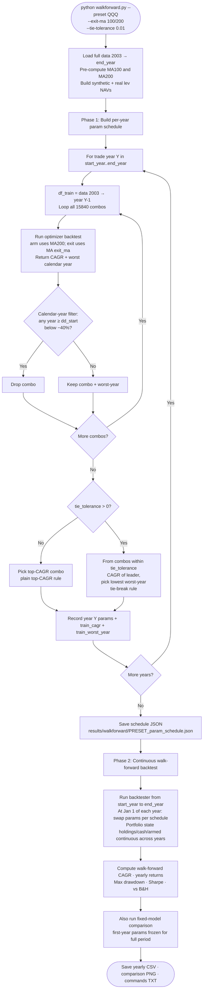

### Running the Backtester

```bash
# QQQ MA200 best (2003–present, 3× only)
python backtester.py --preset QQQ --start 2003-01-01 \
  --entry-signal 1.03 --drop-level 0.005 --exit-signal 1.01 \
  --buy-pct 0.4 --alloc-base 0.0 --alloc-x2 0.0 --alloc-x3 1.0

# SPY MA200 full-history best (legacy — for the recommended MA100 SPY config, see below)
python backtester.py --preset SPY --start 2003-01-01 \
  --entry-signal 1.02 --drop-level 0.005 --exit-signal 0.95 \
  --buy-pct 0.3 --alloc-base 0.0 --alloc-x2 0.0 --alloc-x3 1.0

# IWM MA200 best
python backtester.py --preset IWM --start 2003-01-01 \
  --entry-signal 1.05 --drop-level 0.015 --exit-signal 0.95 \
  --buy-pct 0.3 --alloc-base 0.1 --alloc-x2 0.0 --alloc-x3 1.0

# Suppress pop-up windows (save files only)
python backtester.py --preset QQQ ... --no-show

# Transaction cost sensitivity (0.10% per trade round-trip)
python backtester.py --preset QQQ --start 2003-01-01 \
  --entry-signal 1.03 --drop-level 0.005 --exit-signal 1.01 \
  --buy-pct 0.4 --alloc-base 0.0 --alloc-x2 0.0 --alloc-x3 1.0 \
  --cost-per-trade 0.001 --no-show

# Custom date range (e.g. walk-forward test)
python backtester.py --preset QQQ --start 2015-01-01 \
  --entry-signal 1.03 --drop-level 0.005 --exit-signal 1.01 \
  --buy-pct 0.4 --alloc-base 0.0 --alloc-x2 0.0 --alloc-x3 1.0

# SPY MA100 (recommended exit MA — see section 6.1 for walk-forward validation)
python backtester.py --preset SPY --exit-ma 100 --start 2003-01-01 \
  --entry-signal 1.02 --drop-level 0.005 --exit-signal 0.95 \
  --buy-pct 0.4 --alloc-base 0.0 --alloc-x2 0.0 --alloc-x3 1.0
```

### Running the Walk-Forward

```bash
# QQQ — MA200 exit, plain top-CAGR (default; recommended)
python walkforward.py --preset QQQ

# QQQ — opt-in tie-break rule (1pp CAGR tolerance, smoother drawdown but lower CAGR)
python walkforward.py --preset QQQ --tie-tolerance 0.01

# SPY — MA100 exit (recommended)
python walkforward.py --preset SPY --exit-ma 100

# SPY — MA200 exit (legacy / comparison)
python walkforward.py --preset SPY

# Re-run Phase 2 only (uses cached schedule)
python walkforward.py --preset SPY --exit-ma 100 --no-rebuild --no-show
```

### Running the Optimizers

```bash
# MA200 exit (baseline, full history) — results saved to ma200/ subfolder
cd leveraged_qqq_exploration && python optimizer.py --no-show
cd leveraged_spy_exploration && python optimizer.py --no-show
cd leveraged_iwm_exploration && python optimizer.py --no-show

# Training-period only (2003–2014) — results saved to ma200_train/ subfolder
# Use these params for a rigorous walk-forward out-of-sample test on 2015–2026
cd leveraged_qqq_exploration && python optimizer_train.py --no-show
cd leveraged_spy_exploration && python optimizer_train.py --no-show
cd leveraged_iwm_exploration && python optimizer_train.py --no-show

# MA100 exit variant — results saved to ma100/ subfolder
cd leveraged_qqq_exploration && python optimizer_ma100_exit.py --no-show
cd leveraged_spy_exploration && python optimizer_ma100_exit.py --no-show
cd leveraged_iwm_exploration && python optimizer_ma100_exit.py --no-show

# MA50 exit variant — results saved to ma50/ subfolder
cd leveraged_qqq_exploration && python optimizer_ma50_exit.py --no-show
cd leveraged_spy_exploration && python optimizer_ma50_exit.py --no-show
cd leveraged_iwm_exploration && python optimizer_ma50_exit.py --no-show
```

### Optimizer Filter Notes

Optimizer combos are marked pass/fail based on whether any calendar year from a cutoff onward showed a worse than −40% return (QQQ: 2010+; SPY/IWM: 2009+). The cutoff is set after most synthetic leveraged ETF history ends to avoid penalizing synthetic performance.

`worst_ann_ret` in the CSV spans all years including pre-cutoff, so passing combos can show a worst return worse than −40% if that year precedes the cutoff. This is why green (passing) dots can appear below the −40% line in the scatter plots.

### Adjusted vs Unadjusted Prices

All data uses dividend-adjusted prices (`auto_adjust=True` via yfinance). This prevents quarterly dividend drops from falsely triggering dip-buy signals. The adjusted MA200 will appear ~$1–3 lower than the unadjusted MA200 shown on sites like Google Finance or Barchart — this is expected and not a bug.

The `daily_signal` runner uses the same adjusted-price convention, ensuring the backtest and live signals are computed on the same basis.

### Dependencies

```bash
pip install yfinance pandas numpy matplotlib tqdm
```
