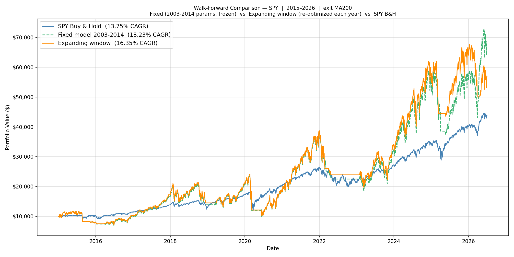
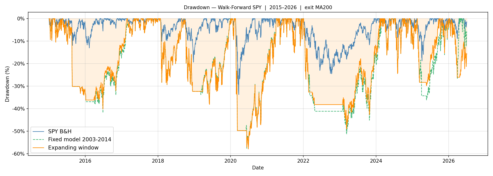
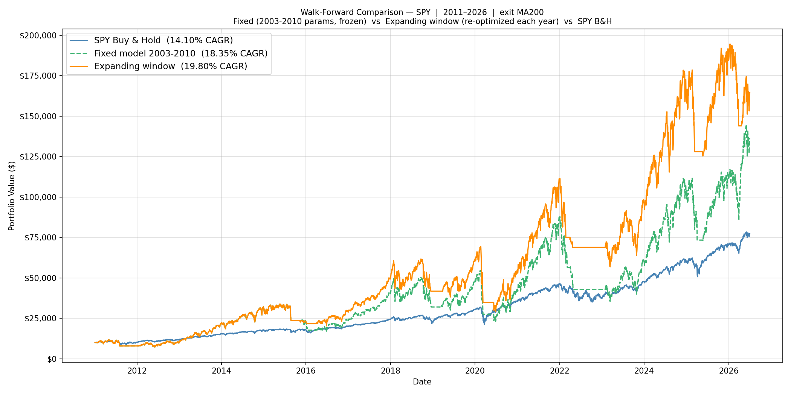
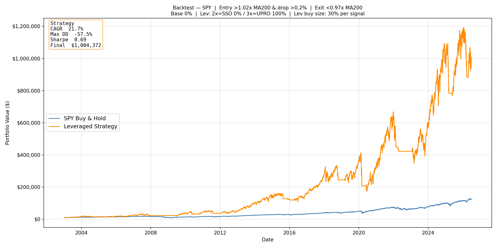
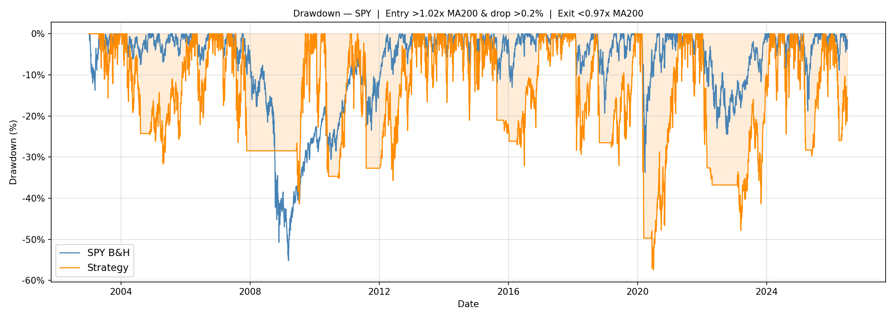

# Leveraged ETFs for the Long Run — A Trend-and-Dip Strategy, Honestly Walk-Forward Tested

A systematic study of whether a disciplined "buy dips only in confirmed uptrends, exit on trend break" rule applied to leveraged ETFs (TQQQ/UPRO, QLD/SSO) can beat buy-and-hold out-of-sample — across the NASDAQ-100, S&P 500, and Russell 2000, with a 61,200-combination grid search, **pre-registered selection rules**, full expanding-window walk-forward validation, and fresh-data confirmation on years no decision ever touched.

> [!IMPORTANT]
> **The honest, out-of-sample headline (annual re-optimization, no look-ahead):**
> - **QQQ works, decisively — and survived a selection-robustness audit.** The recommended **Balanced (DD-capped)** variant earns **34.8% CAGR vs 19.4% buy-and-hold** (2015–2026), worst year −22.6%. A robustness-first selector run as a control independently converges to nearly the same combo (§5) — QQQ's edge is structural, not a lucky pick.
> - **SPY ships one high-risk satellite variant, admitted under documented amendments.** The **Struct-Capped (buy ≤ 40%, dip ≥ 0.25%, MA200 exit)** rule earns **16.4% vs 13.7% B&H** (2015–2026) and **19.8% vs 14.1%** on the extended 2011–2026 window whose first four years were never used in any prior decision (§8) — but it rides **−37% years** and failed one stability gate, disclosed in §7. Read §10 before trading it.
> - **IWM fails** out-of-sample and is not recommended.
>
> Full-history (hindsight-optimized) upper bounds are higher — QQQ $10k→$3.99M — but **anchor on the walk-forward numbers.**

---

## Contents

- [1. Recommendation (start here)](#1-recommendation-start-here)
- [2. Strategy](#2-strategy)
- [3. Methodology](#3-methodology)
- [4. Why naive selection fails — the study's hardest-won lesson](#4-why-naive-selection-fails--the-studys-hardest-won-lesson)
- [5. The selection rules](#5-the-selection-rules)
- [6. Choosing the exit MA — under the rule you actually trade](#6-choosing-the-exit-ma--under-the-rule-you-actually-trade)
- [7. Walk-forward validation (the honest test)](#7-walk-forward-validation-the-honest-test)
- [8. Fresh-data validation](#8-fresh-data-validation)
- [9. Drawdown and tail risk](#9-drawdown-and-tail-risk)
- [10. Risk and design honesty](#10-risk-and-design-honesty)
- [11. Technical reference](#11-technical-reference)

---

## 1. Recommendation (start here)

The strategy never holds a leveraged ETF unconditionally: it buys dips only while the base index is above its 200-day moving average, and sells all leverage the moment price breaks back below the exit MA. Within that fixed premise, a grid search tunes the parameters, and a **selection rule** decides which passing combo to trade. *Which* selection rule matters more than anything else in this study — see §4 for why.

### Trade QQQ. Pick a variant by how much drawdown you can stomach.

| | **Aggressive — Max-CAGR (3×)** | **Balanced — DD-Capped (3×)** (recommended) | **Conservative — Calmar (2×)** |
|---|---|---|---|
| Selection rule | top CAGR among survivors | top CAGR with real-period maxDD ≤ 50% | top Calmar = CAGR / \|maxDD\| |
| Converges to | **3×** (TQQQ), buy 100% | **3×**, buy 90% + 10% base cushion | **2×** (QLD) + 20% base cushion |
| QQQ walk-forward CAGR (2015–2026) | 33.7% | **34.8%** | 27.0% |
| QQQ walk-forward worst year | −22.6% | −22.6% | **−18.4%** |
| QQQ full-history worst year / max DD | −35.0% / −55.9% | −31.9% / −51.8% | **−19.1% / −33.4%** |
| **Trades per year** (full history) | **~1.8** (43 total / 23 yrs) | **~1.8** (43) | **~1.8** (43) |
| Who it's for | max growth, can stomach −30%+ years | **best risk-adjusted growth** | wants the gentlest ride |

> **You barely trade.** All three QQQ variants place the identical **43** orders over 23 years (~2/year, busiest year ever: 4); they fire on the same signals and differ only in sizing. You are in cash or simply holding on ~99% of days. (Computed by [`crisis_analysis.py`](crisis_analysis.py).)

**New since the selection audit (§5):** QQQ's recommendation is now *positively validated*, not just asserted — a robustness-first selector (`plateau`) run as a control lands on essentially the production Balanced combo (33.1% OOS), and even a fully capped conservative selector (`struct`: buy ≤ 40%, dip ≥ 0.25%) still beats QQQ B&H by +8.5pp. QQQ's edge does not depend on how you pick.

### SPY — a high-risk satellite, shipped with disclosures

SPY's variant was produced by a **pre-registered protocol** ([`SPY_FIX_PROTOCOL.md`](SPY_FIX_PROTOCOL.md)) after the previous variant was found to rest on a flawed exit-MA comparison (§4, §6). What survived:

| | **SPY Satellite — Struct-Capped (3×, MA200)** |
|---|---|
| Selection rule | top CAGR with **buy ≤ 40% and dip ≥ 0.25%** (`struct`) |
| Walk-forward CAGR (2015–2026) | **16.4%** vs 13.7% B&H (+2.6pp) |
| Extended walk-forward (2011–2026, fresh early years) | **19.8%** vs 14.1% B&H (+5.7pp) |
| Worst year (walk-forward) | **−37.1%** (2022) |
| Full-history (2003–2026, live params) | 21.7% vs 11.4% B&H · maxDD −57.5% · Sharpe 0.69 |
| Trades per year (full history) | ~2.5 (58 total / 23 yrs) |

> **Read before trading SPY (full detail in §10):** this variant was admitted under **two documented post-hoc amendments** — the worst-year bar was relaxed from −35% to −40% after seeing results, and one stability gate (S1) **failed and ships failed**: the rule re-tunes by micro-steps roughly every two years within one parameter family (entry 1.01–1.02 · dip 0.25–0.5% · exit 0.94–0.97×MA200 · buy 30–40%). Its worst intra-crisis drawdown is **−57.5% (COVID 2020)** — deeper than any QQQ variant. The +2.6pp edge is real across every test we could throw at it, including four never-before-used validation years (§8), but it is thin relative to the ride. **QQQ remains the strategy's real home; treat SPY as an optional satellite and IWM as not recommended.**

### Live parameters for calendar year 2026

Trained on 2003-01-02 → 2025-12-31. A row labeled *year N* was trained on data through Dec 31 of *N−1* and is traded during *N*.

| Index · variant | Entry | Drop | Exit | Buy% | Allocation |
|---|---|---|---|---|---|
| **QQQ · Aggressive — Max-CAGR (3×)** | 1.04×MA200 | 0.0% (any non-up day) | 1.01×MA200 | 100% | 100% TQQQ (3×) |
| **QQQ · Balanced — DD-Capped (3×)** (recommended) | 1.04×MA200 | 0.0% | 1.01×MA200 | 90% | 10% QQQ + TQQQ (3×) |
| **QQQ · Conservative — Calmar (2×)** | 1.04×MA200 | 0.0% | 1.01×MA200 | 80% | 20% QQQ + QLD (2×) |
| **SPY · Satellite — Struct-Capped (3×)** | 1.02×MA200 | 0.25% | 0.97×MA200 | 30% | 100% UPRO (3×) |

### Re-optimize each January

```bash
# QQQ — one grid pass produces all three variants
python walkforward.py --preset QQQ --exit-ma 200 --select cagr,maxdd50,calmar --only-year <year>
# SPY — the pre-registered struct rule on the MA200 exit
python walkforward.py --preset SPY --exit-ma 200 --select struct --only-year <year>
```

Park idle cash in a T-bill ETF (SGOV/BIL): accruing the 13-week T-bill rate added **+0.6pp** to QQQ's walk-forward CAGR with a better worst year, at zero added risk (`--cash-yield`).

---

## 2. Strategy

**Why not just buy and hold a 3× ETF?** Two compounding problems: (1) *volatility decay* — daily leverage reset erodes value in choppy markets (QQQ −10% then +11.1% nets flat; TQQQ −30% then +33.3% nets −6.7%); (2) *bear markets are ruinous* — a buy-and-hold TQQQ investor lost >99% in 2000–2002 and ~95% in 2008. The strategy holds leverage **only during confirmed uptrends** and exits on trend break, cutting the catastrophic tail and avoiding chop.

**Buying.** (1) *Arm* when the base ETF closes above `entry × MA200`. (2) Once armed, a single-day drop of at least `drop_level` fires a buy. (3) On **every buy**, the un-leveraged base sleeve is first topped up to `alloc_base` of the portfolio whenever it has drifted below target; then leverage is deployed, split between 2× and 3× by `alloc_x2 / alloc_x3`. (4) The leverage added in a single buy is `min(buy_pct × total, (1 − alloc_base) × total, cash)` — it can **never exceed `(1 − alloc_base)`** of the portfolio, so the base weight is always reserved. Each further dip while armed re-tops the base if needed and adds more leverage under the same cap.

**Selling.** If price falls below `exit × exit_MA` while holding leverage: sell all 2×/3× to cash, trim the base position back down to `alloc_base` (on **every** exit), and dis-arm until a fresh uptrend signal appears.

> **Premise vs. tunable — read this box.** "Buy the dip in a confirmed uptrend" is the strategy's *premise*; the eight parameters below are *tunables inside that premise*. The grid deliberately probes values that **violate** the premise (`drop_level < 0` = buy even on up days) so §4 can measure what happens when an optimizer is allowed to abandon dip-buying: it does, and it costs dearly out-of-sample. Production selection rules therefore enforce the premise (`drop ≥ 0`; SPY's rule requires ≥ 0.25%).

| Parameter | Meaning |
|---|---|
| `entry_signal` | arm above `MA200 × entry` |
| `drop_level` | min single-day drop to trigger a buy (negative = buy on mildly-up days) |
| `exit_signal` | exit below `exit_MA × exit` |
| `buy_pct` | per-buy lev-deployment ceiling, capped at `(1 − alloc_base)` of total and by cash |
| `alloc_base` | target base-ETF weight, rebalanced to on every buy (up) and every exit (down) |
| `alloc_x2 / alloc_x3` | split of the leveraged tranche between 2× and 3× (sum to 1) |
| `exit_ma` | exit MA period: 50 / 100 / 200 (arming always uses MA200) |

### A worked example (illustrative)

To make the rules concrete, here is a toy run with **made-up parameters and prices** (not the production values — see §1 for those). Suppose the optimizer handed us:

> `entry 1.02 · drop 1.0% · exit 0.97 · buy 30% · base 10% · split 50/50 (2× / 3×)`

and QQQ's 200-day average is sitting flat at **$300**, so the two trigger levels are:
- **Arm threshold** = 1.02 × 300 = **$306** — price must close above this to count as a confirmed uptrend.
- **Exit threshold** = 0.97 × 300 = **$291** — closing below this while holding leverage forces a full exit.

Start with **$10,000 cash**, not armed:

| Day | QQQ close | What the rule sees | Action | Holdings after |
|---|---|---|---|---|
| 1 | **$304** | below $306 | not a confirmed uptrend → **stay in cash** | $10,000 cash |
| 2 | **$315** | closes above $306 | **ARM** — but it's an *up* day, and we only buy dips → no purchase | $10,000 cash |
| 3 | **$313** | −0.6% dip | dip smaller than the 1% `drop` trigger → **wait** | $10,000 cash |
| 4 | **$309.5** | −1.1% dip, still above $306 | **FIRST BUY** → (a) fill base to 10% = **$1,000 QQQ**; (b) deploy 30% of $10k = **$3,000** into leverage, split → **$1,500 QLD + $1,500 TQQQ** | ~$6,000 cash · $1,000 QQQ · $1,500 QLD · $1,500 TQQQ |
| 5 | **$314** | up day | no dip → **hold and let it ride** | (unchanged, values drift with price) |
| 6 | **$310** | −1.3% dip, still above $306 | **ADD** → re-top base if slipped, then deploy another ~30%-of-portfolio tranche into 2×/3× (lev capped at 90% = 1 − base) | ~$3,000 cash · more QLD/TQQQ |
| 7 | **$289** | below $291 exit | **EXIT** → sell *all* QLD + TQQQ to cash, trim QQQ base back to 10%, **dis-arm** | ~mostly cash, awaiting next arm |

The edge lives in steps 4–6: the strategy scales *into* leverage on dips **only while the uptrend is confirmed**, then step 7 dumps everything to safety the instant the trend breaks — which is exactly how it sidesteps the deep bear markets that wipe out a buy-and-hold 3× position.

---

## 3. Methodology

**The whole study in six steps** (so the rest of this section has context):

1. **Search.** Grid-search all 61,200 parameter combos over full history (2003–2026), separately for each candidate exit MA (50 / 100 / 200) and each index — producing the raw return/risk landscape.
2. **Understand how selection fails.** Before trusting any pick, study what a naive argmax does with a wide grid (§4). This step exists because the study got it wrong once and documents the wreckage.
3. **Fix the selection rule.** Choose selection rules that survive §4's failure modes — for SPY under a pre-registered protocol with frozen acceptance gates (§5).
4. **Pick the exit MA — under that rule.** The exit MA and the selection rule cannot be chosen independently; judge each MA by the rule you will actually trade (§6).
5. **Walk forward.** Re-run the full grid search on an **expanding** window each year — train on 2003→2014, then 2003→2015, … (12 windows) — freeze each year's pick, score out-of-sample against B&H, and report stability and fork-sensitivity diagnostics (§7).
6. **Confirm on fresh data.** Extend the walk-forward back to 2011 (four training windows never searched before), and cross-check the rules on the other index as a control (§8). Stress-test tails with crisis backtests (§9).

**Universe and window.** QQQ/QLD/TQQQ, SPY/SSO/UPRO, IWM/UWM/TNA, all from **2003-01-01** (a fair common floor: IWM launched 2000, the real 3× ETFs 2009–2010). The dot-com 2000–2002 period is excluded from optimization because the leveraged series there is 100% synthetic and extreme (§9 stress-tests it separately). QQQ results use data through **2026-06-11**; the SPY protocol runs use data through **2026-07-01** (three weeks' drift, disclosed rather than hidden — both strategy and B&H are always scored on identical windows).

**Synthetic leveraged NAV.** Before a real ETF existed, its NAV is modeled as
`lev_ret = L·r − 0.5·(L²−L)·var₂₀ − MER/252`, where the MER drag applies **only** to the synthetic pre-inception period (real prices already embed fees). Synthetic series are stitched to real prices at inception. All prices are dividend-adjusted.

**Two tools, one engine.** `optimizer.py` *finds* (scans all combos on one window); `walkforward.py` *validates* (re-runs the search each year, applies the selection rules, backtests the schedule); `backtester.py` *measures* (one parameter set, full precision, authoritative for any cited number). All three share **`optimizer_core.py`** — one data pipeline, one backtest loop, one drawdown filter, one grid — so they cannot drift apart.

**The grid — 61,200 combinations.**

| Parameter | Values |
|---|---|
| `entry_signal` | 1.01, 1.02, 1.03, 1.04, 1.05, 1.06 |
| `drop_level` | −1.0%, −0.5%, 0.0%, 0.25%, 0.5%, 1.0%, 1.5%, 2.0% |
| `exit_signal` | 0.93, 0.94, 0.95, 0.97, 0.99, 1.00, 1.01, 1.02 |
| `buy_pct` | 10% … 100% (10 steps) |
| `alloc_base` | 0%, 10%, 20%, 30% |
| `alloc_x2` | 0%, 25%, 50%, 75%, 100% |

Constraints: `exit < entry`, and `buy_pct ≤ 1 − alloc_base` (larger values are exact duplicates and are pruned; this is what reduces the raw product to 61,200). Note the grid *includes* premise-violating values (negative drops) and maximal sizing (buy 100%) — deliberately, so §4 can show what selection does with them.

**Drawdown filter.** A combo passes only if no calendar year from the ETF-inception cutoff onward (QQQ 2010, SPY/IWM 2009) lost more than **40%**. The filter — and the real-period max-drawdown used by risk-managed rules — is enforced only on real (post-inception) data, because synthetic pre-inception leveraged drawdowns are punishingly large and would distort every choice toward 2×.

**Every window's grid is saved.** Walk-forward Phase 1 writes each training window's complete grid (all 61,200 combos, every metric) to `results/walkforward/grids/{preset}/*.csv.gz`. The expensive search runs **once per window**; any selection rule can then be re-derived offline in seconds (`--from-grids`) — which is what made the §5 protocol runs cheap.

**Sharpe** uses the historical 13-week T-bill (^IRX) as a daily-varying risk-free rate, reported by `backtester.py` over the full 2003→2026 history.

---

## 4. Why naive selection fails — the study's hardest-won lesson

This section documents the study's own mistake, because it is the most instructive result in the whole project. **If you take one thing from this README:** a grid search does not just find good strategies — paired with an argmax, it reliably finds *fragile* ones, and a wider grid makes this worse, not better.

### The case history

An early version of this study used a narrow grid (buy ≤ 40%, dips ≥ 0.5%) and found SPY beat B&H out-of-sample at the MA200 exit. The grid was then widened on the sound-sounding principle that the optimizer's choices should be *interior, not pinned at an artificial edge* — buy up to 100%, dips down to −1% (buy even on up days). SPY's walk-forward promptly collapsed (MA200: 15.9% → 9.0%, from beating B&H to badly losing), and the study concluded the exit MA was wrong, switched SPY to MA50, and patched sizing with a buy-cap. A later review found the real mechanism, reproducible from the saved grids:

**Two parameters are aggressiveness-monotone.** In bull-heavy training windows, deploying *more* (`buy_pct ↑`) and *earlier* (`drop_level ↓`) almost mechanically raises in-sample CAGR. Widen the grid along such an axis, and the argmax pick migrates straight to the new edge — the study's own "interior optimum" principle was violated by its own winners (drop = −1.0% and buy = 100% *are* grid edges) without anyone checking.

**The in-sample margins were noise; the out-of-sample penalties were not.** Two forks tell the story:

| Training window | argmax pick (wide grid) | in-sample edge over the sane pick | next-year OOS result |
|---|---|---|---|
| 2003–2014 (trades 2015) | `drop −1.0%` — buy even on up days | **+1.4pp** (27.4% vs 26.0%) | **−23.6% vs −12.1%** — an 11.5pp penalty |
| 2003–2022 (trades 2023) | `exit 0.99` — hair-trigger exit, first window containing the 2022 crash | **+0.7pp** (21.1% vs 20.5%) | **+2.8% vs +42.2%** — a 39pp penalty |

The entire top-10 of the 2015 window is premise-violating (`drop ≤ −0.5%`) within 0.2pp of each other. An argmax breaks noise-level ties toward aggression every time; the walk-forward then bills you for it.

**A buy-cap alone cannot fix this.** Capping `buy_pct` back to 40% recovers only ~2pp of the ~7pp damage at MA200 (11.1% vs 9.0%), because the 2015 and 2023 forks are *trigger-geometry* picks (drop, exit), which no sizing cap touches. The old "structural buy-size cap is the single lever that works" conclusion was half-right: structural caps are the right *kind* of lever, but they must cover **every** aggressiveness-monotone axis.

**And the meta-trap: scoring many cells on one OOS window.** The previous exit-MA verdict compared 15 rule×MA cells on the same 12 years and shipped the best number. With that many draws, something always looks good. The fix is procedural, not statistical: freeze the candidate rules and acceptance criteria *before* scoring (§5), demand consistency across MAs, and keep fresh data in reserve (§8). A running count of every comparison ever made lives in §10.

### Reading the robustness heatmaps


**How a cell is computed.** Each panel fixes two parameters as its axes and pools **every passing combo** over the other four, colored by their **median** CAGR. The median, not the maximum, is deliberate: it answers *"if I land in this region but get the other knobs wrong, how do I typically do?"*

- **Wide bright zone** = a plateau: forgiving, robust.
- **Lone bright cell in a dark field** = a spike: overfit — avoid.
- **Blue box** = the single highest-CAGR combo. For QQQ it sits inside a broad plateau (entry 1.03–1.05 × exit 0.99–1.01) — and §5's `plateau` control confirms this quantitatively: a selector that *ranks by neighborhood median* independently picks nearly the same QQQ combo the production rule does.

---

## 5. The selection rules

**Every rule below does exactly the same job: given one training window's full grid (~61,200 evaluated combos), pick exactly one row to trade that year.** They are **parallel options for that one step, not sequential stages** — none of them depends on, follows, or feeds into another. A production index runs **one** rule (QQQ actually runs three, as three separate risk-tier variants you pick between — not three steps); everything else in the table exists because it was compared, tried, and set aside, or used once as a sanity check.

| Rule | What it does | Shipped where |
|---|---|---|
| `cagr` | Top CAGR, no constraint | **QQQ Aggressive** |
| `maxdd{N}` (e.g. `maxdd50`) | Top CAGR among combos whose real-period max drawdown stays ≤ N% | **QQQ Balanced** (recommended, N=50) |
| `calmar` | Top `CAGR / \|real-period maxDD\|` | **QQQ Conservative** |
| `buycap{N}` | Top CAGR among combos with `buy_pct ≤ N%` | *not shipped* — SPY's retired rule, superseded by `struct` (§4) |
| `struct` | Top CAGR with `buy_pct ≤ 40%` **and** `drop_level ≥ 0.25%` | **SPY Satellite** — SPY's only shipped variant |
| `robust1` | Most conservative combo within 1pp of the top in-sample CAGR | *not shipped* — a SPY candidate, tested and rejected (below) |
| `plateau` | Ranked by the median CAGR of each combo's ±1-grid-step neighborhood | *not shipped* — used once as a validation check, on both indices (below) |

**QQQ ships three of these seven** as its three named variants (Aggressive/Balanced/Conservative — §1); **SPY ships exactly one** (`struct`). The remaining three rows (`buycap`, `robust1`, `plateau`) are not live anywhere — they're in the codebase because they were candidates during the process that chose SPY's rule, described next, or a one-off check run on QQQ, described after that.

> **Why three variants for QQQ but only one for SPY? Not a style preference — it's what the data supports.** Point the exact same three rules that give QQQ its risk ladder at SPY (same MA200 exit, same 2015–2026 window, B&H 13.73%), and all three **fail**:
>
> | Rule | SPY OOS CAGR | vs B&H |
> |---|---|---|
> | `cagr` (→ QQQ Aggressive) | 8.97% | −4.76pp ✗ |
> | `maxdd50` (→ QQQ Balanced) | 10.92% | −2.81pp ✗ |
> | `calmar` (→ QQQ Conservative) | 11.04% | −2.69pp ✗ |
> | `struct` (SPY's actual rule) | 16.30% | +2.57pp ✓ |
>
> QQQ's three variants are three *different working answers* to "how much risk do you want" — they can all be offered as a genuine menu because QQQ's trend structure is strong enough that almost any reasonable selection philosophy beats B&H. Two separate pieces of evidence confirm this, both further down: the **QQQ control** table just below (struct/robust1/plateau, three rules never designed for QQQ, still land at 27.8–33.1% vs 19.25% B&H), and §7's **fork-sensitivity** check, which found all three of QQQ's actual shipped variants pass with wide margins and tight rank-1..5 bands (0.76–2.0pp). SPY has no equivalent menu to offer — the DD-cap and Calmar rules that produce QQQ's gentler tiers don't produce a gentler *working* SPY tier, they produce the **same losing pick**, because SPY's in-sample drawdowns before 2022 never got deep enough to make the cap bind (see the box below). Of everything tried on SPY — the original three, plus `buycap`, plus the three protocol candidates — **`struct` is the only one that beats B&H at all.** So SPY isn't shipping "the conservative option among several winners"; it's shipping the sole survivor, at the one risk level that happened to work, with that risk fully disclosed (§1, §9). If you want a gentler SPY tier, the honest answer is that the data doesn't currently support one — not that it wasn't tried.
>
> **This is also why every validation check from here on tests three QQQ rules but only one SPY rule.** It isn't an arbitrary asymmetry — it directly mirrors what's actually shipped: QQQ has three live variants worth individually confirming (the fork-sensitivity table in §7 checks Aggressive, Balanced, *and* Conservative separately, because a reader might trade any of the three), while SPY has exactly one (`struct`). Where `robust1` also appears in §7's table, it's shown only as the rejected candidate whose failure explains why it *isn't* shipped — not as a second SPY variant to pick between.

> **Why an in-sample drawdown cap can't protect SPY.** A maxDD cap only reacts to drawdowns the training data contains. On every SPY window before 2022 the top combo's worst real drawdown was ~−35%, so a 50% cap never binds — it re-picks the exact combo that then lost −56% in 2022. **An in-sample cap cannot bound an out-of-sample tail; only structural limits can.** That is why SPY's shipped rule caps *behavior* (size and trigger), not backtest statistics.

### How SPY's one rule was chosen

SPY's old rule, `buycap50`, was diagnosed in §4 as incomplete — it capped only one of two aggressiveness-monotone axes. Rather than patch it and move on, its replacement was chosen through a **frozen, pre-registered protocol** ([`SPY_FIX_PROTOCOL.md`](SPY_FIX_PROTOCOL.md)): three new candidate rules, acceptance gates fixed *before* any of them were scored, no additions allowed afterward.

- **`struct`** — buy ≤ 40% and dip ≥ 0.25%. *Justification: caps both problem axes at once (§4).*
- **`robust1`** — most conservative combo within 1pp of the top in-sample CAGR. *Justification: sub-1pp margins are noise; ties should resolve toward caution, not aggression.*
- **`plateau`** — ranked by neighborhood-median CAGR. *Justification: operationalizes §4's "plateau, not spike" principle as a selector instead of a chart.*

**Gates** (frozen): beat B&H by ≥ 1.5pp with worst year ≥ −35% on the production MA; clear B&H on ≥ 2 of 3 exit MAs (a one-MA winner is cell-picking); parameter stability (≤ 4 distinct sets); fork-sensitivity (rank-2 must still beat B&H, §7); fresh-data confirmation (§8).

**Outcome:** under the frozen gates, **no candidate passed outright** — `struct` cleared B&H on all three MAs but its worst year (−37.1%) missed the −35% bar; `robust1` passed one cell but failed stability and the cross-index check below; `plateau` failed SPY outright. The owner then made two **documented amendments** (worst-year bar → −40%; ship with the stability gate recorded as *failed*) that admit `struct · MA200` as a disclosed high-risk satellite. Every gate result and both amendments are recorded in the protocol file — nothing was quietly relabeled a pass.

### The one-time QQQ check — not a QQQ selection process

`struct`/`robust1`/`plateau` were also run on **QQQ's** grids, once, purely as a **falsification test**: if a rule built to fix SPY secretly wrecked a healthy index, the "one selection principle" story would be wrong. This did **not** re-pick or change anything for QQQ — `maxdd50` was already, and remains, QQQ's production rule. The table below exists only to check that rule survives scrutiny, nothing more.

| Rule applied to QQQ (MA200, 2015–2026, B&H 19.25%) | OOS CAGR | Note |
|---|---|---|
| `maxdd50` — QQQ's actual production rule | 34.8% | shipped; unaffected by this check |
| `plateau` | 33.1% | independently converges to ~the same combo (1.04/0.0/1.01, buy 90%) |
| `robust1` | 29.3% | over-corrects (buy 50%) — informative, not a QQQ variant |
| `struct` | 27.8% | even fully capped, +8.5pp over B&H |

QQQ's edge survives every rule thrown at it — a property of the index's trend structure, not of any one optimizer's enthusiasm. SPY's edge, by contrast, only exists at all under the single structural rule it ships — the honest difference between a core holding and a satellite.

---

## 6. Choosing the exit MA — under the rule you actually trade

**Why this ordering matters.** The strategy uses moving averages in two roles: **arming** always uses the slow MA200 (fixed, every index); **exiting** uses a tunable MA (50/100/200) that controls how fast you bail. An earlier version of this study chose SPY's exit MA by comparing raw walk-forward numbers across MAs *before* fixing the selection rule — and got a different answer (MA50) than the one that survives sane selection (MA200). §4 explains the general trap; this section shows the corrected comparison.

### QQQ → MA200, cleanly (unchanged)

| Index · MA | In-sample best | OOS Aggressive | OOS Balanced (maxDD) | OOS Conservative | B&H | Verdict |
|---|---|---|---|---|---|---|
| **QQQ MA200** | 29.1% | 33.7% | **34.8%** | 27.0% | 19.4% | **chosen ✓** |
| QQQ MA100 | 26.4% | 32.9% | 30.7% | 12.3% | 19.4% | worse, deeper worst years |

Faster exits chop off profitable runs; MA200 wins both in-sample and out-of-sample with shallower worst years.

> **Out-of-window check (1950–2026).** Because the grid only sees 2003+, we separately ran the *unleveraged* MA-timing signal on 75 years of S&P 500 ([`experiments/regime_reliability.py`](experiments/regime_reliability.py)). Over the full span the **MA200** long/cash rule nearly halved buy-and-hold's max drawdown (−30% vs −57%) and *added* return in every sideways/bear regime — including the 1966–82 secular chop the 2003+ sample never contains — while **MA50** was strictly worse (−45% maxDD, far more whipsaws). The slow MA200 is the more robust trend filter *across regimes*, not an artifact of the post-2003 window.

### SPY → MA200 — the corrected verdict

The protocol's rule×MA matrix (walk-forward 2015–2026, B&H ≈ 13.7%; cells = CAGR · worst year):

| Rule | MA200 | MA100 | MA50 |
|---|---|---|---|
| **struct** | **16.4% · −37.1%** ✓ | 14.8% · −38.6% | 17.4% · −41.5% |
| robust1 | 15.9% · −34.3% | 15.3% · −35.0% | 15.9% · −36.5% |
| plateau | 9.6% ✗ · −45.6% | 15.3% · −49.5% | 16.3% · −56.5% |

Three things the old MA50 verdict got wrong, visible at a glance:

1. **Under structural selection, SPY beats B&H on *all three* exit MAs.** MA50 was never uniquely viable — it only looked that way when the slower MAs were scored with a broken selector (§4's 2015/2023 forks live at MA200/MA100).
2. **MA200 is the only cell that passes the risk bar** for the production rule: MA50's extra CAGR (17.4%) costs a −41.5% worst year (and −56% under laxer rules — its deep 0.93×MA50 exit is a higher-drawdown animal in every crisis, §9).
3. The exit MA is chosen by the **pre-registered criterion** (shallowest worst year among passing cells), not by the biggest number in the table — that discipline is the entire lesson of §4.

**IWM → not recommended** (walk-forward fails B&H under every rule tested; not re-run under the protocol — disclosed, not hidden).

---

## 7. Walk-forward validation (the honest test)

Each January, the optimizer is re-run on all prior data only, the pick is frozen, and traded for the next 12 months. No look-ahead. **Fixed** = start-year parameters frozen throughout; **Expanding** = re-optimized every year.

### QQQ (MA200) — the strategy works, and re-optimization adds real edge

| Variant | Fixed | **Expanding** | B&H | Worst year (exp) |
|---|---|---|---|---|
| Aggressive — Max-CAGR (3×) | 23.0% | **33.7%** | 19.4% | −22.6% |
| Balanced — DD-Capped (3×) | 29.1% | **34.8%** | 19.4% | −22.6% |
| Conservative — Calmar (2×) | 26.7% | 27.0% | 19.4% | **−18.4%** |

The Aggressive schedule converges to `1.04 / 0.0 / 1.01 / buy 100%` and holds it unchanged from 2017 on. The Balanced variant earns the most out-of-sample while trimming the in-sample drawdown.

| Aggressive — Max-CAGR (3×) | Balanced — DD-Capped (3×) |
|---|---|
|  |  |
|  |  |

*Top row: equity curves. Bottom row: drawdown (underwater) curves — the lived experience of holding the strategy: the leveraged variants spend long stretches 30–50% underwater even while compounding far ahead of B&H.*

### SPY (MA200, struct rule) — modest but real, high-risk

| | Fixed (2015 params) | **Expanding** | B&H |
|---|---|---|---|
| CAGR 2015–2026 | 18.2% | **16.4%** | 13.7% |
| Worst year | −40.1% (2022) | −37.1% (2022) | −18.2% |

Year-by-year (expanding):

| Year | 15 | 16 | 17 | 18 | 19 | 20 | 21 | 22 | 23 | 24 | 25 | 26* |
|---|---|---|---|---|---|---|---|---|---|---|---|---|
| Strategy % | −20.5 | +25.8 | +71.4 | −15.3 | +44.9 | −8.9 | +98.6 | −37.1 | +41.5 | +63.6 | +15.6 | −11.0 |
| SPY B&H % | +1.3 | +12.0 | +21.7 | −4.6 | +31.2 | +18.3 | +28.7 | −18.2 | +26.2 | +24.9 | +17.7 | +10.0 |

*(2026 is a partial year through the data end.)* Note the **Fixed** model again does best of all (18.2%) — SPY rewards a stable structural rule more than annual re-tuning, consistent with its §5 story.

| SPY Satellite — Struct (3×, MA200) | drawdown |
|---|---|
|  |  |

### Parameter stability — is this one rule, or twelve?

A fair objection to annual re-optimization is that the headline CAGR is twelve different rules stitched together. The schedules say otherwise for QQQ, and *almost* otherwise for SPY:

| Variant | Trigger path (entry / drop / exit) | Distinct sets in 12 yrs | Sizing path |
|---|---|---|---|
| **QQQ Aggressive** | → **1.04 / 0.0% / 1.01** (2017, then frozen) | **2** | buy 20% → **100%** (’17–’26) |
| **QQQ Balanced** | → **1.04 / 0.0% / 1.01** (2017, then frozen) | **3** | buy 50% → 100% → **90% + 10% base** (’21–) |
| **QQQ Conservative** | **1.04 / 0.0% / 1.01** (all 12 years) | **2** | 70/30 → **80/20** (’21–) |
| **SPY Satellite — Struct** | 1.01–1.02 / 0.25–0.5% / 0.95–0.97 (0.94 in the 2011–14 windows) | **6** (7 over 16 yrs) | buy 40% → **30%** (’23–, after 2022 enters training) |

**The SPY disclosure (protocol gate S1, failed and shipped failed):** SPY's rule never fully freezes — it re-tunes by micro-steps roughly every two years. Every set stays inside one family (each change is a single grid step on one axis; compare §4's broken argmax, which swung buy 40↔100% and drop −1%↔+1%), and the drift direction is always *toward caution after a loss* (buy 40%→30% in 2023, exactly as QQQ added its cushion in 2021). But by the protocol's own count it is 6–7 sets, not ≤4, and that failure is disclosed here rather than redefined away.

### Fork sensitivity — does the headline hinge on one lucky pick?

Mandatory diagnostic ([`experiments/fork_sensitivity.py`](experiments/fork_sensitivity.py)), motivated by §4's 2023 fork: rebuild the entire schedule from the rule's rank-R pick in *every* window and re-score. Gate: rank-2 must still beat B&H; the rank-1..5 CAGR band should stay under ~8pp.

| Rule (MA200) | rank-2 vs B&H | rank-1..5 band | Verdict |
|---|---|---|---|
| **QQQ cagr** (Aggressive) | **+13.4pp** | **2.0pp** | passes by a wide margin |
| **QQQ maxdd50** (Balanced, recommended) | **+14.6pp** | **0.91pp** | passes by a wide margin — the plateau story, directly confirmed |
| **QQQ calmar** (Conservative) | **+7.3pp** | **0.76pp** | passes by a wide margin |
| SPY struct (shipped) | +1.7pp | 7.7pp | passes, but thin |
| SPY robust1 (not shipped) | below B&H at ranks 3–4 | — | fails — one reason it wasn't shipped despite passing its cell gate |

All three of QQQ's shipped variants — not just the recommended Balanced one — pass with wide margins and tight rank-1..5 bands (0.76–2.0pp). Someone trading Aggressive or Conservative instead of Balanced gets the same confidence the optimizer's #1 in-sample pick isn't a fluke.

QQQ's result is the sharpest evidence in the whole study that its edge is structural, not a lucky in-sample guess: swap in the optimizer's 2nd-, 3rd-, 4th-, or 5th-best pick in every single year, and the walk-forward CAGR barely moves (33.05–33.96%). SPY's edge is real but far more sensitive to exactly which combo the optimizer returns — expected, given it survives on a narrower structural constraint rather than a broad plateau. *(QQQ run used data through 2026-07-03, three weeks later than the §7 table above; the 33.96% rank-1 CAGR reflects that, not a discrepancy with the 34.76% production figure.)*

### IWM (MA200) — not recommended

Expanding 6.2% vs 9.6% B&H — every selection rule fails. Small-cap LETF decay and unstable parameters; disclosed for completeness.

---

## 8. Fresh-data validation

Every number in §7 comes from a 12-year OOS window this project has scored dozens of times (§10 ledger). This section is the evidence that couldn't have been cherry-picked.

### F1 — Four training windows that never existed before

The walk-forward was extended back to 2011: training windows 2003–2010 through 2003–2013 were **searched for the first time** after the SPY rule was frozen — their outcomes could not have influenced any design decision. Result (SPY struct · MA200, 2011–2026):

| | Strategy | SPY B&H |
|---|---|---|
| **CAGR 2011–2026** | **19.8%** | 14.1% (+5.7pp) |
| 2011 | −21.3% | +0.9% |
| 2012 | +29.1% | +16.0% |
| 2013 | **+118.5%** | +32.3% |
| 2014 | +38.0% | +13.5% |

The four fresh years widen the edge rather than shrinking it — and the picks the optimizer made on those never-seen windows (entry 1.01–1.02, dip 0.25–0.5%, exit 0.94–0.95×MA200, buy 40%) land in the same family as every later year, *independently reproducing the narrow-grid-era combos from data that era never used*.



### F2 — Cross-index control

§5's QQQ control table: the robustness-first selector reproduces QQQ's production pick; the fully capped selector still beats QQQ B&H by +8.5pp. A rule family that behaves sensibly on an index it wasn't tuned for is evidence of structure, not fitting.

### F3 — Regime check (partial)

The unleveraged MA200 trend signal is validated across 75 years and every market regime (§6 box). Extending that 1950–2026 test to the *full* trigger geometry (arm/dip/exit) is documented future work.

---

## 9. Drawdown and tail risk

This is the section that should drive your choice of variant — more than the headline CAGR. Each crisis gets a chart and a market-history walk-through; generated by [`crisis_analysis.py`](crisis_analysis.py).

> **Directly answering "would this prevent an 80% drawdown?"** For QQQ's Aggressive 3× config, no — only lower leverage shrinks that tail (Conservative 2× roughly halves it). SPY's Struct variant is the most tail-resistant *in slow secular bears* — its ≤30–40% per-dip cap is the same structural lever that lets it beat B&H — but its slow MA200 exit makes it the *worst* performer in a gap-crash like COVID. **No variant escapes §4's core finding: only structural exposure limits an unseen tail; an in-sample drawdown cap cannot.**

### The four crises at a glance

Each cell is **`period return · max drawdown`**, both measured within that crisis window only. Buy & hold (1×) benchmarks in italics.

| Crisis (window) | QQQ Aggressive (3×) | QQQ Balanced (3×) | QQQ Conservative (2×) | _QQQ B&H (1×)_ | SPY Satellite — Struct (3×) | _SPY B&H (1×)_ |
|---|---|---|---|---|---|---|
| **Dot-com** 2000–2003 *(100% synthetic)* | −70.7% · **−92.1%** | −65.6% · −90.2% | −31.0% · −74.8% | _−61.5% · −83.0%_ | **+34.9% · −34.7%** | _−19.2% · −47.5%_ |
| **GFC** 2007–2009 | +64.7% · −38.8% | +58.4% · −38.4% | +43.1% · **−29.2%** | _−2.5% · −53.4%_ | +26.3% · −41.4% | _−23.1% · −55.2%_ |
| **COVID** 2020 | +103.9% · −51.8% | +100.7% · −48.7% | +67.1% · **−33.2%** | _+46.0% · −28.6%_ | **−9.7% · −57.5%** | _+17.2% · −33.7%_ |
| **2022 rate-hike** Nov'21–mid'23 | +8.9% · −38.0% | +8.0% · −36.8% | +5.9% · **−26.5%** | _−3.5% · −35.1%_ | −16.9% · −47.9% | _−1.0% · −24.5%_ |
| Full history 2003–2026 maxDD | −55.9% | −51.8% | **−33.4%** | _−53.4%_ | −57.5% | _−55.2%_ |

The SPY column's profile inverted versus the retired MA50 variant, and understanding why is instructive:
- **Secular, grinding bears are now its best case.** Dot-com: **+34.9%** while everything else bled (the old MA50 variant made +10.8%); GFC: +26.3% (old: +4.7%). The slow MA200 exit disengages early and *stays* out through multi-year chop, and 30–40% per-dip sizing keeps re-entry whipsaws survivable.
- **A gap-crash is now its worst case.** COVID 2020: **−9.7% with a −57.5% drawdown** — the full-history maximum. The MA200 exit cannot get ahead of a five-week, 34% collapse; the faster MA50 dodged more of it (−41.9%) at the price of failing everywhere else. There is no free exit speed — this study picks the slow exit because §6 shows it wins across regimes, and accepts the gap-crash tail knowingly.

### The timing rule vs. just holding the leveraged ETF

*"Does the MA timing rule earn its keep, or could I just buy and hold the 3× ETF?"* QQQ Aggressive differs from holding TQQQ by nothing but the timing rule — a clean isolation. (SPY Struct deploys ≤30–40% per dip, so its row is "recommended SPY strategy vs holding UPRO".)

| Crisis | QQQ Aggressive (timed) | Hold TQQQ | SPY Struct (timed) | Hold UPRO |
|---|---|---|---|---|
| **Dot-com** 2000–2003 | −70.7% · −92.1% | **−100.0% · −100.0%** | +34.9% · −34.7% | −85.0% · −94.2% |
| **GFC** 2007–2009 | +64.7% · −38.8% | −80.2% · −96.9% | +26.3% · −41.4% | −90.7% · −97.5% |
| **COVID** 2020 | +103.9% · −51.8% | +100.1% · −69.9% | −9.7% · −57.5% | +7.2% · −76.8% |
| **2022 rate-hike** | +8.9% · −38.0% | −46.9% · −81.7% | −16.9% · −47.9% | −31.3% · −63.9% |
| **Full history 2003–2026** | **29.1% CAGR · −55.9% maxDD** | 24.6% · −96.9% | **21.7% CAGR · −57.5% maxDD** | 14.8% · −97.5% |

Holding the leveraged ETF straight through is a wipeout in every decisive bear. Over the full 23 years the timed strategy earns *more* than buy-and-hold of the same leveraged ETF at roughly half the max drawdown — the rare free lunch, and the entire point of not just holding TQQQ.

### Crisis walk-throughs


**Dot-com, 2000–2003 — QQQ's one unwinnable case, SPY Struct's best.** The Nasdaq fell ~83% in a 2.5-year grind punctuated by +30–40% bear rallies — each one re-armed the rule, triggered leveraged dip-buys, then broke down again. Repeat with 3× leverage: **−92%** for QQQ Aggressive (2× only softens to −75%: *leverage itself is the tail driver, not the timing*). SPY Struct is the lone survivor (**+34.9%**) — small tranches on a slow exit meant the whipsaws never compounded into ruin. (Caveat: 100% synthetic leveraged data, and SPY fell far less than QQQ in this bear.)


**GFC, 2007–2009 — the trend filter's showcase.** A decisive downtrend: the MA200 broke cleanly in late 2007, the strategy sat in cash through the autumn-2008 collapse, and re-armed into the 2009 recovery. QQQ Aggressive **+64.7%** across a window where buy-and-hold lost half.


**COVID, 2020 — too fast to dodge; the recovery is what you're paid for.** The fastest bear in history (−34% in five weeks) hurt *before* any trend filter could react. QQQ took −52% intra-crash, then mechanically re-armed and finished **+103.9%**. SPY Struct shows the cost of the slow exit in this regime: −57.5% drawdown, −9.7% on the year — its documented worst case.


**2022 rate-hike bear — a mild rhyme of dot-com.** QQQ's slow exit kept it mostly in cash through 2022 and slightly *positive* over the window (+8.9%). SPY Struct lost −16.9% — repeated small dip-buys into a grinding decline are its known cost in this regime, and 2022 (−37.1%) is its walk-forward worst year.

### What the four crises teach

1. **Ordinary bears: the MA exit works** — GFC, COVID, 2022 all ended positive for every QQQ variant.
2. **The catastrophic case is a sustained choppy secular bear** with leverage — a tail outside all training data, uncapped by any in-sample statistic.
3. **Only structural exposure limits the tail** — 2× instead of 3×, or small per-dip tranches; pick your poison consciously: slow exits bleed in gap-crashes, fast exits bleed everywhere else.
4. **Pick your variant by your worst-case stomach, not the CAGR column.**

For reference, the full 23-year curves of the two headline configs:

| QQQ Aggressive · Max-CAGR (3×) — 2003–2026 | SPY Satellite — Struct (3×, MA200) — 2003–2026 |
|---|---|
|  |  |
|  |  |

**Authoritative full-history backtests (2003 → 2026, $10k), for the §1 configs:**

| Config | CAGR | B&H | Worst year | Max DD | Sharpe | Final |
|---|---|---|---|---|---|---|
| QQQ Aggressive — Max-CAGR (3×) | **29.1%** | 16.2% | −35.0% | −55.9% | 0.78 | $3,987,913 |
| QQQ Balanced — DD-Capped (3×) | 28.2% | 16.2% | −31.9% | −51.8% | 0.78 | $3,356,876 |
| QQQ Conservative — Calmar (2×) | 20.9% | 16.2% | **−19.1%** | **−33.4%** | **0.80** | $856,189 |
| SPY Satellite — Struct (3×, MA200) | 21.7% | 11.4% | −35.7% | −57.5% | 0.69 | $1,004,372 |

With a T-bill cash sleeve, QQQ Aggressive rises to 29.7%; in an Ontario taxable account at a $100k salary it nets ~24.6% after-tax (TFSA/RRSP: untaxed) — modelled with per-year federal + Ontario brackets (`tax_engine.py`, 2011–2025).

---

## 10. Risk and design honesty

- **Anchor on walk-forward, not full-history.** The 23-year backtest is hindsight-optimized. The walk-forward numbers (QQQ 34.8%, SPY 16.4%) are the realistic forward expectation.
- **The SPY variant ships under two documented post-hoc amendments.** The pre-registered protocol's original verdict was *demote SPY*; the owner relaxed the worst-year bar (−35% → −40%) and accepted a failed stability gate, both recorded in [`SPY_FIX_PROTOCOL.md`](SPY_FIX_PROTOCOL.md) with full disclosure rather than silently re-run. Readers should weight SPY's +2.6pp edge accordingly; the strongest counter-evidence that it is *not* pure fitting is the fresh-data result (§8: +5.7pp on four never-searched windows).
- **The multiple-comparisons ledger.** Across the project's life, roughly **45 rule×MA cells / rank-schedules** have been scored against the 2015–2026 OOS window (early studies ~10, the wide-grid matrix 15, the review probes 5, the protocol 9, the QQQ + SPY fork-sensitivity reruns another ~5 each). Any single cell's ±2–4pp edge must be read against that denominator — it is why the protocol demanded multi-MA consistency, fork robustness, and reserved 2011–2014 data instead of one good number.
- **An in-sample drawdown cap cannot bound an out-of-sample tail** (§5). Only structural levers (buy-size caps, dip floors, lower leverage) limit an unseen tail.
- **Selection is the biggest risk in optimization** (§4). Aggressiveness-monotone parameters + argmax = guaranteed migration to the fragile edge. If you modify this study, extend the structural caps to any new axis you add.
- **3× requires stomaching −20% to −37% calendar years.** If you cannot, trade the Conservative 2× variant or stay unleveraged.
- **SPY's tail lives in gap-crashes** (−57.5% in COVID). QQQ's lives in secular chop (−92% in synthetic dot-com). Neither is hypothetical.
- **Taxes are the largest real cost.** Ontario taxable at $100k salary: QQQ Aggressive nets ~24.6% vs 29% pre-tax. Use TFSA → RRSP → taxable.
- **Synthetic-data dependence.** ~6–7 early years rely on the leverage-decay model; dot-com numbers are approximations.
- **Data-end drift.** QQQ numbers use data through 2026-06-11; the SPY protocol runs through 2026-07-01. Strategy and benchmark are always scored on identical windows.

### Experiment — does a VIX regime filter help? (a negative result)

A natural add-on is to sit in cash when fear is high — *hold no leverage while VIX > T*. We tested it on the QQQ Balanced config ([`experiments/backtester_vix.py`](experiments/backtester_vix.py)), sweeping T = 20…35 with the decision on the prior day's VIX. **It does not help at any threshold**: the gentlest gate costs ~1pp CAGR for zero drawdown improvement; tighter gates are worse on both axes (VIX > 30: CAGR 28.2% → 22.7%, maxDD −51.7% → −57.3%). VIX peaks *at* bottoms, so the filter sells the panic and misses the recovery; and VIX does not separate the strategy's good years from bad (its worst year, 2016, had the decade's lowest VIX). The lever that tracks the real failure mode — whipsaws in *low*-vol chop — is volatility-scaled sizing, left for future work.

---

## 11. Technical reference

**Run the optimizer (one window, all combos):**
```bash
python optimizer.py --preset QQQ --exit-ma 200 --no-show
```

**Walk-forward all variants in one grid pass (saves every window's grid):**
```bash
python walkforward.py --preset QQQ --exit-ma 200 --select cagr,maxdd50,calmar --start-year 2015 --end-year 2026 --no-show
python walkforward.py --preset SPY --exit-ma 200 --select struct --start-year 2015 --end-year 2026 --no-show
```

**Re-derive any rule from the saved grids (no re-search, seconds):**
```bash
python walkforward.py --preset SPY --exit-ma 200 --select struct,robust1,plateau --from-grids --no-show
```

**Selection / filter flags:** `--select` takes a comma-separated list of `cagr`, `maxdd{N}`, `buycap{N}`, `calmar`, and the protocol rules `struct` (buy ≤ 40% ∧ drop ≥ 0.25%), `robust1` (most conservative within 1pp of top CAGR), `plateau` (neighborhood-median rank) — one grid pass yields all. `--dd-limit 0.40` (calendar-year filter); `--cash-yield` (T-bill sleeve); `--from-grids`; `--no-save-grids`.

**Fork-sensitivity diagnostic (gate S2, any rule):**
```bash
python experiments/fork_sensitivity.py --preset QQQ --exit-ma 200 --select maxdd50   # production rule
python experiments/fork_sensitivity.py --preset SPY --exit-ma 200 --select struct
```

**Authoritative single-config backtest:**
```bash
# SPY Satellite — Struct (3×, MA200), live 2026 params
python backtester.py --preset SPY --start 2003-01-01 --entry-signal 1.02 --drop-level 0.0025 \
  --exit-signal 0.97 --buy-pct 0.3 --alloc-base 0 --alloc-x2 0 --alloc-x3 1 --exit-ma 200 --no-show
```

**Repository layout:**
- `optimizer_core.py` — shared engine (data + synthetic NAV + MER, backtest loop, DD filters, grid, parallel search). Single source of truth.
- `optimizer.py` — full-window grid-search CLI → `results/optimizer/{preset}/`
- `walkforward.py` — expanding-window validation + all selection rules → `results/walkforward/` (and per-window grids in `grids/{preset}/`)
- `backtester.py` — authoritative single-config runner → `results/backtester/{preset}/`
- `tax_engine.py` + `tax_brackets.json` — per-year federal + Ontario tax; used by `backtester.py --tax-ontario`
- `crisis_analysis.py` — trade counts + per-crisis comparison figures → `results/crisis/`
- `param_heatmap.py` — robustness heatmaps (§4)
- `SPY_FIX_PROTOCOL.md` — the pre-registered selection protocol: candidates, frozen gates, full results, amendments, verdict
- `experiments/` — out-of-window checks: `regime_reliability.py` (1950–2026 MA signal), `fork_sensitivity.py` (gate S2), `vix_probe.py` + `backtester_vix.py` (the VIX negative result)
- `results/README_DATA_LEDGER.md` — figure/number provenance map

---

## Appendix — full reference (expand when you forget a detail)

<details>
<summary><b>A · Parameter glossary — what every knob means</b></summary>

Every strategy is just these eight numbers. Arming **always** uses MA200; only the *exit* MA is tunable.

| Parameter | CLI flag | Meaning | Range tested | QQQ / SPY value |
|---|---|---|---|---|
| `entry_signal` | `--entry-signal` | **Arm** (allow buying) when price > `MA200 × entry`. | 1.01–1.06 | 1.04 / 1.02 |
| `drop_level` | `--drop-level` | Once armed, a single-day fall ≥ this fires a buy. `0` = any non-up day; negative = premise-violating (grid-only, see §2 box). | −1.0% … +2.0% | 0.0% / 0.25% |
| `exit_signal` | `--exit-signal` | **Sell all leverage** when price < `exit_MA × exit`. | 0.93–1.02 | 1.01 / 0.97 |
| `buy_pct` | `--buy-pct` | Per-buy lev-deployment ceiling, capped at `1 − alloc_base` and by cash. | 10%–100% | 100% / 30% |
| `alloc_base` | `--alloc-base` | Target un-leveraged base-ETF weight, rebalanced on every trade. | 0%–30% | 0% / 0% |
| `alloc_x2` / `alloc_x3` | `--alloc-x2/x3` | Split of the leveraged tranche (sum to 1). | 0–100% | x3=100% / x3=100% |
| `exit_ma` | `--exit-ma` | MA period for the **exit** signal only. | 50/100/200 | 200 / 200 |

</details>

<details>
<summary><b>B · Every shipped variant's exact parameters</b></summary>

Current live (2026) picks — these match the §1 table, the §9 backtests, and the chart filenames. Re-optimized each January (§1); trade the fresh row when it differs.

| Variant | entry | drop | exit | buy% | base | x2 | x3 | exit MA | Holds |
|---|---|---|---|---|---|---|---|---|---|
| **QQQ Aggressive — Max-CAGR** | 1.04 | 0.0% | 1.01 | 100% | 0% | 0% | 100% | MA200 | TQQQ (3×) |
| **QQQ Balanced — DD-Capped** | 1.04 | 0.0% | 1.01 | 90% | 10% | 0% | 100% | MA200 | QQQ + TQQQ (3×) |
| **QQQ Conservative — Calmar** | 1.04 | 0.0% | 1.01 | 80% | 20% | 100% | 0% | MA200 | QQQ + QLD (2×) |
| **SPY Satellite — Struct-Capped** | 1.02 | 0.25% | 0.97 | 30% | 0% | 0% | 100% | MA200 | UPRO (3×) |

</details>

<details>
<summary><b>C · File-by-file reference</b></summary>

| File | What it is | Typical command | Output |
|---|---|---|---|
| `optimizer_core.py` | **The engine.** Imported by everything; not run directly. | *(imported)* | — |
| `optimizer.py` | Grid-search one window, keep every combo. | `python optimizer.py --preset QQQ --exit-ma 200 --no-show` | `results/optimizer/{preset}/` |
| `walkforward.py` | **The honest test.** Expanding-window re-search + selection rules + Phase-2 backtest. | `python walkforward.py --preset SPY --exit-ma 200 --select struct` | `results/walkforward/` |
| `backtester.py` | **Authoritative single-config run** — trade log, costs, T-bill yield, Ontario tax. | `python backtester.py --preset QQQ …` | `results/backtester/{preset}/` |
| `tax_engine.py` + `tax_brackets.json` | Per-year fed + Ontario tax engine (2011–2025). | *(imported)* | — |
| `crisis_analysis.py` | Trade-frequency stats (§1) + crisis figures (§9). No flags. | `python crisis_analysis.py` | `results/crisis/` |
| `param_heatmap.py` | Robustness heatmaps (§4). | `python param_heatmap.py --no-show` | `results/optimizer/…png` |
| `experiments/fork_sensitivity.py` | Gate S2: schedule from rank-R picks, R=1..5, any rule (§7). | `python experiments/fork_sensitivity.py --preset QQQ --select maxdd50` | console |
| `SPY_FIX_PROTOCOL.md` | Pre-registered protocol, results, amendments, verdict. | *(read)* | — |
| **`daily_signal/`** (companion repo) | Runs the identical engine for live BUY/SELL/HOLD Telegram signals + January re-opt. | see its README | `config/params.json` |

</details>

<details>
<summary><b>D · Recreate this research from scratch (full pipeline, in logical order)</b></summary>

This is the actual dependency order — not the historical order this project followed (which included the SPY selection mistake documented in §4). Each command has a one-line reason it runs where it does. All scripts share `optimizer_core.py`, so numbers cannot drift between them; `backtester.py` is authoritative for any cited figure.

**Step 1 — Full-history grid search (§4 landscape, §4 heatmap).** One run per preset × exit-MA (9 runs); this is the raw in-sample return/risk landscape everything downstream picks from — nothing about later steps changes what gets searched here:
```bash
python optimizer.py --preset QQQ --exit-ma 200 --no-show   # repeat --exit-ma 100, 50; presets SPY, IWM
```

**Step 2 — Robustness heatmaps (§4).** Visualize whether each index's in-sample optimum sits on a broad plateau or a fragile spike, *before* trusting any single "best" combo:
```bash
python param_heatmap.py --no-show
```

**Step 3 — Walk-forward Phase 1+2 for every candidate selection rule, at every candidate exit MA (§5–§7).** One grid pass per preset × MA derives every rule in `--select` at once (the search is the expensive part; deriving N rules from one search costs ~1×, not N×) and caches every window's grid so later steps reuse it for free via `--from-grids`:
```bash
# QQQ: the three shipped rules, already established — MA200 only (§6 settled this long ago)
python walkforward.py --preset QQQ --exit-ma 200 --select cagr,maxdd50,calmar --start-year 2015 --end-year 2026 --no-show

# SPY: the three pre-registered candidate rules, at all three exit MAs — this produces the §6 rule×MA matrix
python walkforward.py --preset SPY --exit-ma 200 --select struct,robust1,plateau --start-year 2015 --end-year 2026 --no-show
python walkforward.py --preset SPY --exit-ma 100 --select struct,robust1,plateau --from-grids --no-show
python walkforward.py --preset SPY --exit-ma 50  --select struct,robust1,plateau --from-grids --no-show
```

**Step 4 — Choose the exit MA under the frozen rule (§6).** Not a script — read the CAGR/worst-year cells from Step 3's yearly CSVs and apply the pre-registered criterion (clears B&H on ≥2/3 MAs; among passing cells, shallowest worst year wins). This is the step the historical study got backwards by comparing MAs *before* fixing the rule.

**Step 5 — Cross-index control (§5, §8 F2).** Run the *other* index's candidate rules to check they don't secretly break it — a rule that only behaves on the index it was designed for is fitted, not structural:
```bash
python walkforward.py --preset QQQ --exit-ma 200 --select struct,robust1,plateau --from-grids --no-show
```

**Step 6 — Parameter-stability check (§7 gate S1).** Not a script — count distinct parameter sets across the 12+ windows in each shipped schedule JSON (`results/walkforward/*_param_schedule*.json`); too many or too erratic is a red flag even with a good headline CAGR.

**Step 7 — Fork-sensitivity check, on every rule you intend to ship or seriously consider (§7 gate S2).** Rebuilds the whole schedule from the rank-2/3/4/5 in-sample pick instead of rank-1, and re-scores — the direct test of whether the headline depends on a single lucky in-sample draw:
```bash
python experiments/fork_sensitivity.py --preset QQQ --exit-ma 200 --select maxdd50   # production rule
python experiments/fork_sensitivity.py --preset SPY --exit-ma 200 --select struct    # shipped
python experiments/fork_sensitivity.py --preset SPY --exit-ma 200 --select robust1   # considered, not shipped — informative failure
```

**Step 8 — Fresh-data validation (§8 F1).** Extend the walk-forward to training windows genuinely never searched in any prior step — the one check immune to "best of 40 tries on the same window":
```bash
python walkforward.py --preset SPY --exit-ma 200 --select struct --from-grids --start-year 2011 --end-year 2026 --no-show
```

**Step 9 — Out-of-window regime check (§6 box, §8 F3).** Validate the core unleveraged trend-filter idea across 75 years, far outside the 2003+ grid's view:
```bash
python experiments/regime_reliability.py
```

**Step 10 — Side-experiment, reported either way (§10).** Tests whether a VIX fear-gate improves the shipped QQQ config; documented as a negative result:
```bash
python experiments/backtester_vix.py
```

**Step 11 — Authoritative backtests of every final shipped config (§9 table, Appendix B).** The trade-logged, cost-aware, tax-aware numbers actually cited anywhere in this README:
```bash
python backtester.py --preset QQQ --start 2003-01-01 --entry-signal 1.04 --drop-level 0.0 --exit-signal 1.01 --buy-pct 1.0 --alloc-base 0 --alloc-x2 0 --alloc-x3 1 --exit-ma 200 --no-show
# repeat once per Appendix-B row (QQQ Balanced, QQQ Conservative, SPY Struct)
```

**Step 12 — Crisis stress tests and trade-frequency stats (§1, §9).** Runs every final shipped config through the four historical crises plus its plain-index and un-timed-leveraged-ETF benchmarks:
```bash
python crisis_analysis.py
```

</details>
