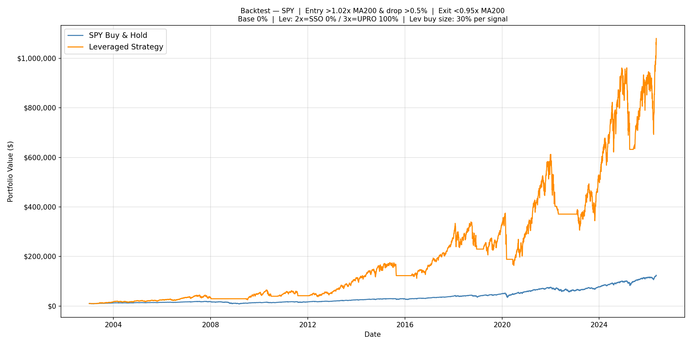
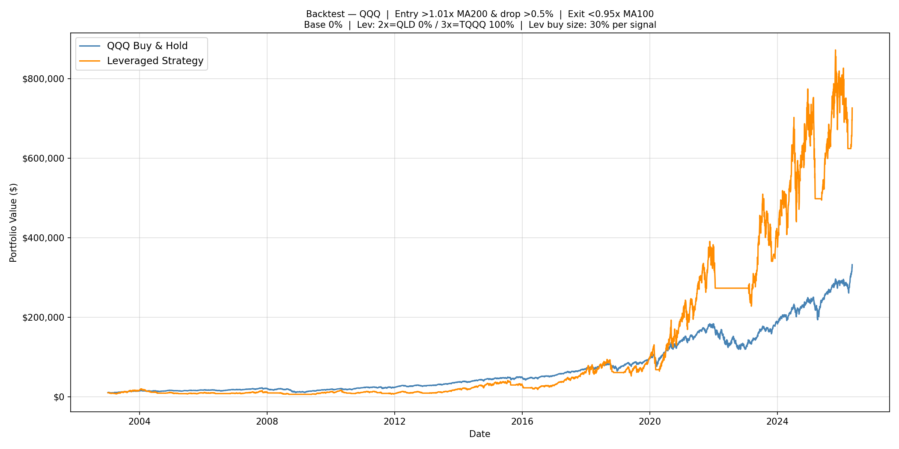
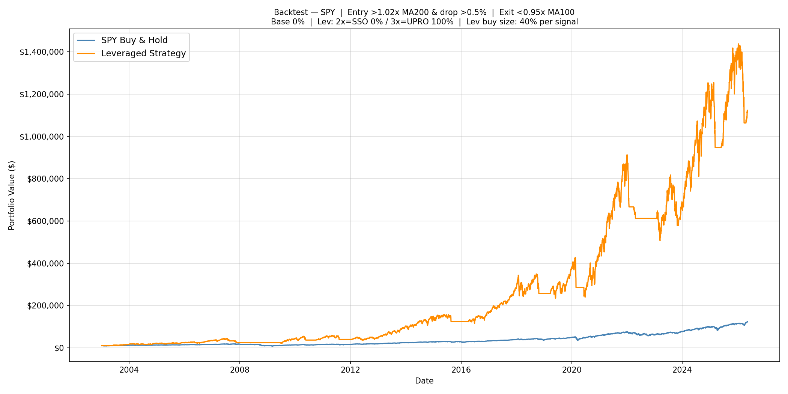
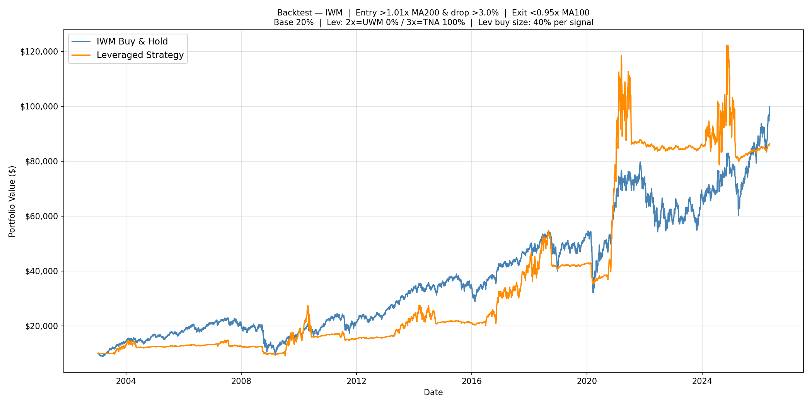
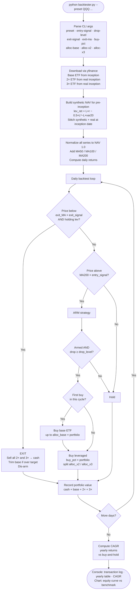
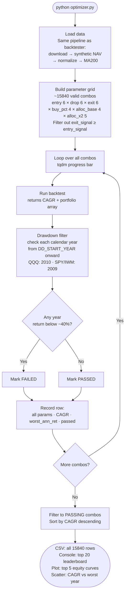

# Leveraged ETF Strategy Research

This project explores whether a disciplined dip-buying strategy using leveraged ETFs can beat simple buy-and-hold over the long run — and how far that edge holds up under different market conditions. We tested three major indices (NASDAQ-100, S&P 500, and Russell 2000), ran over 15,000 parameter combinations each, and extended the research to test a faster exit trigger using MA100 instead of MA200.

---

## Executive Summary

| Index | Strategy CAGR | Buy & Hold CAGR | Strategy edge | Worst strategy year | Avg trades/yr |
|---|---|---|---|---|---|
| QQQ (NASDAQ-100) | **24.75%** | 16.19% | +8.6pp | ~−39% | ~4 |
| SPY (S&P 500) | **22.21%** | 11.39% | +10.8pp | ~−39% | ~2 |
| IWM (Russell 2000) | **12.49%** | 10.31% | +2.2pp | ~−27% | ~2 |

> All results: $10,000 starting capital, 2003–2026, best-CAGR passing strategy per index.
> This is a low-frequency swing strategy — not day trading. Most years see fewer than 5 trades total, with positions held for weeks to months between entry and exit.

**Key findings:**
- The strategy delivers meaningful alpha over buy-and-hold for QQQ and SPY, with roughly comparable drawdown risk to buy-and-hold in bad years.
- IWM (Russell 2000) shows minimal edge — small-cap volatility causes too much decay in the 3× ETF.
- Using a faster MA100 exit instead of MA200 helps SPY (same CAGR, lower drawdown) but hurts QQQ and IWM significantly.
- The 3× leveraged ETF dominates across all indices — the 2× version rarely appears in top strategies.

---

## How the Strategy Works

The strategy never just buys and holds a leveraged ETF. Instead it uses two rules to decide *when* to buy and when to get out:

**Buying (the dip-buy cycle):**
1. Wait until the market is in a healthy uptrend — specifically, price must be a certain percentage above its 200-day moving average (MA200). This "arms" the strategy.
2. Once armed, wait for a single-day drop of a set size (e.g. 1%). That drop triggers a buy.
3. On the first buy in a cycle, a small position in the plain ETF (e.g. QQQ) is established as a stabilizer. Then cash is deployed into the leveraged ETF (e.g. TQQQ).
4. Each subsequent dip while armed puts more into the leveraged ETF only.

**Selling (the exit):**
- If price falls below the moving average by a set threshold, everything in the leveraged ETFs is sold back to cash. The plain ETF position is kept (and trimmed once if it's grown too large).
- After selling, the strategy goes back to waiting for a fresh uptrend signal before buying again.

**The logic in plain English:** Only buy leveraged ETFs when the trend is clearly up and the market pulls back. Exit fast when the trend breaks. Never hold a 3× ETF through a bear market.

---

## Parameters Explained

| Parameter | What it means |
|---|---|
| Entry signal | How far above MA200 price must be to arm the strategy (e.g. 1.04 = 4% above) |
| Drop level | Minimum single-day drop to trigger a buy (e.g. 0.01 = 1%) |
| Exit signal | Price relative to the exit MA that triggers selling (e.g. 0.95 = 5% below) |
| Buy pct | How much of the total portfolio to deploy per buy signal |
| Alloc base | Target allocation to the plain (unleveraged) ETF as a portfolio stabilizer |
| Alloc x2 / x3 | Split of leveraged spending between 2× and 3× ETFs |
| Exit MA | Which moving average to use for the exit trigger: MA50, MA100, or MA200 |

---

## Results by Index

> Period: **2003-01-01 → 2026-05-07** | Starting capital: **$10,000**
> Each index was optimized independently across 15,840+ parameter combinations.
> "Worst year" = worst single calendar-year return over the full period.

### QQQ (NASDAQ-100) — TQQQ

#### Best CAGR strategy
| Metric | Strategy | QQQ Buy & Hold |
|---|---|---|
| Entry signal | 1.03× MA200 | — |
| Drop level | 0.5% | — |
| Exit signal | 1.01× MA200 | — |
| Buy pct | 40% per signal | — |
| Allocation | 0% QQQ / 100% TQQQ | — |
| **CAGR** | **24.75%** | 16.19% |
| Worst year | ~−39% | −41.73% (2008) |

```bash
python backtester.py --preset QQQ --start 2003-01-01 --entry-signal 1.03 --drop-level 0.005 --exit-signal 1.01 --buy-pct 0.4 --alloc-base 0.0 --alloc-x2 0.0 --alloc-x3 1.0
```

#### Balanced strategy (lower drawdown)
| Metric | Strategy | QQQ Buy & Hold |
|---|---|---|
| Entry signal | 1.04× MA200 | — |
| Drop level | 1.0% | — |
| Exit signal | 1.01× MA200 | — |
| Buy pct | 30% per signal | — |
| Allocation | 0% QQQ / 100% TQQQ | — |
| **CAGR** | **19.51%** | 16.07% |
| Worst year | −24.77% | −41.73% (2008) |

```bash
python backtester.py --preset QQQ --start 2003-01-01 --entry-signal 1.04 --drop-level 0.010 --exit-signal 1.01 --buy-pct 0.3 --alloc-base 0.0 --alloc-x2 0.0 --alloc-x3 1.0
```

---

### SPY (S&P 500) — UPRO / SSO

#### Best CAGR strategy
| Metric | Strategy | SPY Buy & Hold |
|---|---|---|
| Entry signal | 1.02× MA200 | — |
| Drop level | 0.5% | — |
| Exit signal | 0.95× MA200 | — |
| Buy pct | 30% per signal | — |
| Allocation | 0% SPY / 100% UPRO | — |
| **CAGR** | **22.21%** | 11.39% |
| Worst year | ~−39% | −36.80% (2008) |

```bash
python backtester.py --preset SPY --start 2003-01-01 --entry-signal 1.02 --drop-level 0.005 --exit-signal 0.95 --buy-pct 0.3 --alloc-base 0.0 --alloc-x2 0.0 --alloc-x3 1.0
```

#### Balanced strategy (lower drawdown)
| Metric | Strategy | SPY Buy & Hold |
|---|---|---|
| Entry signal | 1.02× MA200 | — |
| Drop level | 1.0% | — |
| Exit signal | 0.95× MA200 | — |
| Buy pct | 40% per signal | — |
| Allocation | 0% SPY / 100% SSO (2×) | — |
| **CAGR** | **16.13%** | 11.35% |
| Worst year | −23.71% | −36.80% (2008) |

```bash
python backtester.py --preset SPY --start 2003-01-01 --entry-signal 1.02 --drop-level 0.010 --exit-signal 0.95 --buy-pct 0.4 --alloc-base 0.0 --alloc-x2 1.0 --alloc-x3 0.0
```

---

### IWM (Russell 2000) — TNA

#### Best CAGR strategy
| Metric | Strategy | IWM Buy & Hold |
|---|---|---|
| Entry signal | 1.05× MA200 | — |
| Drop level | 1.5% | — |
| Exit signal | 0.95× MA200 | — |
| Buy pct | 30% per signal | — |
| Allocation | 10% IWM / 100% TNA | — |
| **CAGR** | **12.49%** | 10.31% |
| Worst year | −27.13% | −34.14% (2008) |

```bash
python backtester.py --preset IWM --start 2003-01-01 --entry-signal 1.05 --drop-level 0.015 --exit-signal 0.95 --buy-pct 0.3 --alloc-base 0.1 --alloc-x2 0.0 --alloc-x3 1.0
```

#### Balanced strategy (lower drawdown)
| Metric | Strategy | IWM Buy & Hold |
|---|---|---|
| Entry signal | 1.04× MA200 | — |
| Drop level | 2.5% | — |
| Exit signal | 0.99× MA200 | — |
| Buy pct | 40% per signal | — |
| Allocation | 30% IWM / 100% TNA | — |
| **CAGR** | **10.21%** | 10.28% |
| Worst year | −13.13% | −34.14% (2008) |

```bash
python backtester.py --preset IWM --start 2003-01-01 --entry-signal 1.04 --drop-level 0.025 --exit-signal 0.99 --buy-pct 0.4 --alloc-base 0.3 --alloc-x2 0.0 --alloc-x3 1.0
```

---

## Performance Charts

### QQQ — Best CAGR strategy (MA200 exit)


### SPY — Best CAGR strategy (MA200 exit)


### IWM — Best CAGR strategy (MA200 exit)


---

## When This Strategy Works — and When It Doesn't

### What it needs to thrive
- **Sustained uptrends with periodic dips.** The MA200 filter keeps the strategy in cash during bear markets. When the trend is up and the market pulls back briefly, the leveraged ETF compounds over months or years before an exit is needed.
- **Clean, fast trend reversals.** The 2020 COVID crash is a good example — sharp drop, quick recovery. The strategy exited at the break, then re-entered cleanly into the recovery.
- **A good starting point.** Starting in cash during or just after a bear market (e.g. early 2009, early 2020) means the first buys coincide with a genuine recovery and the leveraged ETF compounds from a low base.

### What hurts it
- **Fast waterfall declines with multiple dips before the exit fires.** The MA200 is slow. If the market drops in stages, each dip can trigger a buy while the strategy is still armed — building up 3× exposure just before the worst leg down. The 2008 GFC is the clearest example.
- **Staircase-down bear markets with false recoveries.** After selling, a brief rally can re-arm the strategy. If the bear resumes, the strategy buys again into the decline. Multiple losing cycles deplete cash and slow the recovery. The 2000–2002 dot-com crash had this pattern.
- **Slow grinding drawdowns (e.g. 2022).** Sustained selloffs keep price below MA200 for months — the strategy correctly stays out, but any false rallies that trigger buys before the trend resumes result in small repeated losses.
- **Sequence-of-returns risk.** After a long bull run the strategy holds maximum leveraged exposure. A crash at that point causes maximum damage. Starting just before a peak is the worst possible timing.

---

## Extended Research: MA100 Exit

After the initial MA200 results, we tested replacing the exit trigger with a faster MA100 — keeping MA200 for all entry/arm decisions. The hypothesis: a faster exit MA would cut losses in sharp reversals without meaningfully hurting upside.

### Head-to-head: MA200 exit vs MA100 exit (best parameters per approach)

| Index | Exit MA | Best CAGR | vs B&H | Worst year | Chart |
|---|---|---|---|---|---|
| QQQ | MA200 | **24.75%** | +8.6pp | −38.6% | below |
| QQQ | MA100 | 20.15% | +3.9pp | −45.9%* | below |
| SPY | MA200 | 22.21% | +10.8pp | −39.4% | below |
| SPY | MA100 | **22.42%** | +11.0pp | **−33.0%** | below |
| IWM | MA200 | **12.49%** | +2.2pp | −27.1% | below |
| IWM | MA100 | 9.67% | −0.6pp | **−17.9%** | below |

> \* QQQ MA100 worst year falls in 2008–2009, before the DD filter cutoff (2010). The strategy still passes the optimizer filter; the bad year is pre-filter history.

### QQQ: MA200 vs MA100 exit



### SPY: MA200 vs MA100 exit



### IWM: MA200 vs MA100 exit



### Conclusions

**The exit MA and exit signal threshold are tightly coupled. You cannot swap MA100 for MA200 without re-optimizing the threshold — and even then the result varies by index.**

- **QQQ: MA200 wins clearly.** The MA200-optimized strategies use a high exit threshold (price just below MA200), which works because the MA200 is slow enough to stay well below price during normal dips. Switching to MA100 with the same threshold causes constant false exits during bull-market volatility, cutting CAGR from 24.75% to 20.15%.

- **SPY: MA100 is essentially a wash, with a slight drawdown benefit.** With a low exit threshold (0.95, meaning price must fall 5% *below* the exit MA), both MAs trigger at similar moments. MA100 exit slightly improves the worst year from −39% to −33% with no CAGR cost. This is the one case where MA100 exit makes sense.

- **IWM: MA100 exit hurts.** IWM's already-thin leveraged edge disappears with more frequent exits. The MA100-optimized strategy actually underperforms IWM buy-and-hold (9.67% vs 10.31% CAGR).

**Bottom line:** Use MA200 exit for QQQ and IWM. For SPY with a low exit threshold (≤ 0.97), MA100 exit offers a modest drawdown improvement at no CAGR cost.

---

## Risk Considerations

This research is based on historical backtests. Past performance does not guarantee future results. Key risks to be aware of:

- **Leveraged ETF decay.** 3× ETFs lose value to daily rebalancing in volatile or sideways markets. The synthetic pre-inception NAV used here models this but may not capture all real-world costs (borrowing rates, fees, tracking error).
- **The 2003–2026 window is mostly bullish.** The strategy's strong results are partly explained by the prolonged bull markets in this period. Performance in a structurally different decade could differ.
- **Sequence risk.** Starting the strategy near a market peak — when leveraged exposure is at maximum — produces the worst outcomes. Timing matters even with a rules-based system.

---

## Technical Reference

### Leveraged ETF Mapping

| Index | Base ETF | 2× ETF | 3× ETF |
|---|---|---|---|
| NASDAQ-100 | QQQ | QLD (since Jun 2006) | TQQQ (since Feb 2010) |
| S&P 500 | SPY | SSO (since Jun 2006) | UPRO (since Jun 2009) |
| Russell 2000 | IWM | UWM (since Jan 2007) | TNA (since Nov 2008) |

Data before each leveraged ETF's inception is simulated from the base ETF's daily returns using the standard leverage model:
```
lev_daily_ret = L × r  −  0.5 × (L² − L) × rolling_var20
```
The synthetic and real series are stitched at inception, scaled to match.

### Repository Structure

```
backtester.py                          # interactive backtester (CLI, supports --exit-ma 50/100/200)
charts/                                # equity curve PNGs embedded in this README
leveraged_qqq_exploration/
    optimizer.py                       # MA200 exit optimizer for QQQ
    optimizer_ma100_exit.py            # MA100 exit variant
    optimizer_results.csv              # all 15,840 combos
    ma100_exit_results.csv
    optimizer_equity.png / scatter.png
    ma100_exit_equity.png / scatter.png
leveraged_spy_exploration/             # same structure for SPY
leveraged_iwm_exploration/             # same structure for IWM
```

### Code Flow

#### Backtester (`backtester.py`)



#### Optimizer (`optimizer.py` / `optimizer_ma100_exit.py`)



### Running the Backtester

```bash
# MA200 exit (default)
python backtester.py --preset QQQ --entry-signal 1.03 --drop-level 0.005 --exit-signal 1.01 --buy-pct 0.4 --alloc-base 0.0 --alloc-x2 0.0 --alloc-x3 1.0

# MA100 exit
python backtester.py --preset SPY --exit-ma 100 --entry-signal 1.02 --drop-level 0.005 --exit-signal 0.95 --buy-pct 0.4 --alloc-base 0.0 --alloc-x2 0.0 --alloc-x3 1.0

# MA50 exit
python backtester.py --preset SPY --exit-ma 50 --entry-signal 1.02 --drop-level 0.005 --exit-signal 0.95 --buy-pct 0.4 --alloc-base 0.0 --alloc-x2 0.0 --alloc-x3 1.0

# Save chart to file
python backtester.py --preset QQQ ... --save-plot output.png
```

### Running the Optimizer

```bash
# MA200 exit (baseline)
cd leveraged_qqq_exploration && python optimizer.py
cd leveraged_spy_exploration && python optimizer.py
cd leveraged_iwm_exploration && python optimizer.py

# MA100 exit variant
cd leveraged_qqq_exploration && python optimizer_ma100_exit.py
cd leveraged_spy_exploration && python optimizer_ma100_exit.py
cd leveraged_iwm_exploration && python optimizer_ma100_exit.py
```

### Optimizer Filter Notes

The optimizer runs 15,840 parameter combinations and marks each as pass/fail based on whether any calendar year showed worse than −40% annual return. The filter only applies **from a cutoff year onward** (2010 for QQQ, 2009 for SPY/IWM) because data before the real leveraged ETF launched is synthetic and penalizing synthetic history would be unfair.

`worst_ann_ret` in the results CSV spans *all* years including pre-cutoff, so passing combos can show a worst return worse than −40% if that bad year was before the cutoff (typically 2008). This is why green dots can appear below the −40% line in the scatter plots.

### Adjusted vs Unadjusted Prices

All price data — daily closes, MA200, daily returns — uses **dividend-adjusted prices** (`auto_adjust=True` via yfinance). This matches the live `daily_signal` runner, so the backtest and live signals are computed on the same basis.

**Why adjusted?**

When a dividend is paid, the stock price drops by the dividend amount on the ex-dividend date. Without adjustment, that artificial drop looks like a real price dip and can falsely trigger the buy signal (drop ≥ threshold). Adjusted prices remove that noise retroactively, so the backtest and live signals only fire on genuine market dips.

**Why the MA200 looks different from Google Finance / Barchart**

Most charting sites (Google Finance, Barchart, TradingView) display MA200 computed from **unadjusted** prices. This produces a slightly higher MA200 value. The difference for QQQ/SPY is typically $1–3 on the MA200 level — small but visible. This is expected and not a bug.

**How often do dividends affect signals?**

QQQ and SPY pay dividends quarterly (~4× per year). The per-dividend price drop is roughly:

| ETF | Annual yield | Quarterly drop | As % of price |
|-----|-------------|----------------|---------------|
| QQQ | ~0.6% | ~$1.00–1.50 | ~0.15% |
| SPY | ~1.3% | ~$2.50–3.00 | ~0.33% |

The buy trigger requires a **0.5% same-day drop** minimum. A dividend-only drop of 0.15–0.33% is well below this threshold, so ex-dividend dates essentially never cause a false buy signal even with unadjusted prices. The adjustment is a belt-and-suspenders safeguard, not a critical necessity for QQQ/SPY.

**Live signal note**

The live (intraday) price is always the actual market price — it cannot be "adjusted" since adjustments are applied retroactively. On the ~4 ex-dividend days per year, there is a brief inconsistency between the unadjusted live price and the adjusted MA200/prev_close. Given the small dividend size relative to the signal thresholds, this is safe to ignore.

**Bottom line:** The ~$1–3 gap between your adjusted MA200 and what Google Finance shows is correct and expected. The backtest and live signal are internally consistent with each other, which is what matters.

### Dependencies

```bash
pip install yfinance pandas numpy matplotlib tqdm
```
