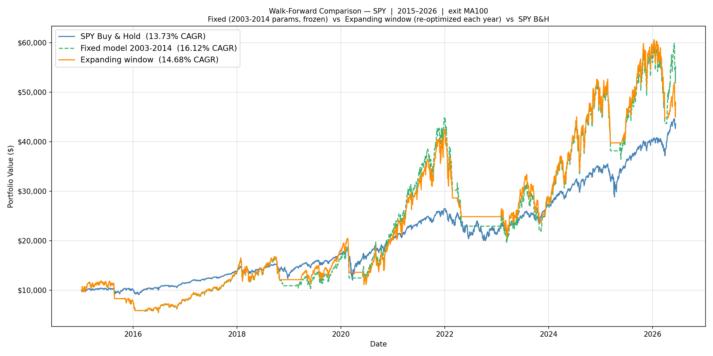
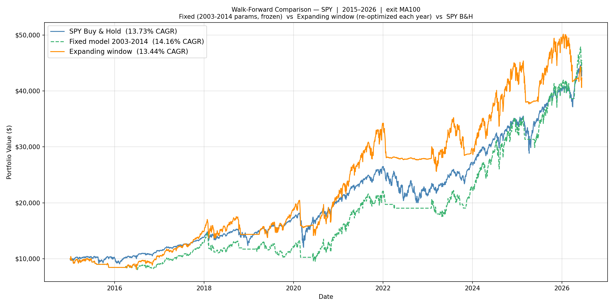

# Leveraged ETFs for the Long Run — A Trend-and-Dip Strategy, Honestly Walk-Forward Tested

A systematic study of whether a disciplined "buy dips only in confirmed uptrends, exit on trend break" rule applied to leveraged ETFs (TQQQ/UPRO, QLD/SSO) can beat buy-and-hold out-of-sample — across the NASDAQ-100, S&P 500, and Russell 2000, with a 72,000-combination grid search, several selection rules, and full expanding-window walk-forward validation.

> [!IMPORTANT]
> **The honest, out-of-sample headline (annual re-optimization, 2015–2026, no look-ahead):**
> - **QQQ works, decisively.** Highest-CAGR variant: **33.7% CAGR vs 19.4% buy-and-hold** (+14.3pp), worst year −22.6%. The recommended **Balanced (maxDD-capped) variant does even better out-of-sample: 34.2%**, same worst year, with a gentler in-sample drawdown profile.
> - **SPY is marginal.** Annually re-optimizing on CAGR *underperforms* buy-and-hold out-of-sample (12.3% vs 13.7%). Only a **structural exposure cap** (buy ≤ 50%) lifts it just past B&H (14.7%), and even then with −40% years. Treat SPY as marginal.
> - **IWM fails** out-of-sample (6.2% vs 9.6% B&H) and is not recommended.
>
> Full-history (in-sample, hindsight-optimized) upper bounds are higher — QQQ $10k→$3.99M — but **anchor on the walk-forward numbers.** They are what an investor re-optimizing each January would actually have earned.

---

## Contents

- [1. Recommendation (start here)](#1-recommendation-start-here)
- [2. Strategy](#2-strategy)
- [3. Methodology](#3-methodology)
- [4. Full-history grid search (in-sample upper bound)](#4-full-history-grid-search-in-sample-upper-bound)
- [5. Choosing the exit MA](#5-choosing-the-exit-ma)
- [6. The selection rules — the core contribution](#6-the-selection-rules--the-core-contribution)
- [7. Walk-forward validation (the honest test)](#7-walk-forward-validation-the-honest-test)
- [8. Drawdown and tail risk](#8-drawdown-and-tail-risk)
- [9. Risk and design honesty](#9-risk-and-design-honesty)
- [10. Technical reference](#10-technical-reference)

---

## 1. Recommendation (start here)

The strategy never holds a leveraged ETF unconditionally: it buys dips only while the base index is above its 200-day moving average, and sells all leverage the moment price breaks back below the exit MA. Within that fixed premise, a grid search tunes the parameters, and a **selection rule** decides which passing combo to trade.

### Trade QQQ. Pick a variant by how much drawdown you can stomach.

| | **Highest CAGR** | **Balanced — maxDD-capped** (recommended) | **Conservative — 2×** |
|---|---|---|---|
| Selection rule | top CAGR among survivors | top CAGR with real-period maxDD ≤ 50% | top Calmar = CAGR / \|maxDD\| |
| Converges to | **3×** (TQQQ), buy 100% | **3×**, buy 90% + 20% base cushion | **2×** (QLD) + 30% base cushion |
| QQQ walk-forward CAGR (2015–2026) | 33.7% | **34.2%** | 27.0% |
| QQQ walk-forward worst year | −22.6% | −22.6% | **−18.8%** |
| QQQ full-history worst year / max DD | −35.0% / −55.9% | −28.2% / −49.7% | **−22.3% / −34.2%** |
| Who it's for | max growth, can stomach −30%+ years | **best risk-adjusted growth** | wants the gentlest ride |

All three beat QQQ buy-and-hold (19.4% walk-forward) decisively. **The Balanced variant is the default recommendation:** capping the in-sample drawdown at 50% drops the single most overfit combo (buy 100%, no cushion) in favour of a near-identical one (buy 90% + a 20% base cushion) that earns *more* out-of-sample (34.2% vs 33.7%) at the same worst year and a shallower in-sample drawdown. If you want genuinely shallow drawdowns, the Conservative 2× variant roughly halves the worst year for ~7pp less CAGR.

### Live parameters for calendar year 2026

Trained on 2003-01-02 → 2025-12-31. A row labeled *year N* was trained on data through Dec 31 of *N−1* and is traded during *N*.

| Index · variant | Entry | Drop | Exit | Buy% | Allocation |
|---|---|---|---|---|---|
| **QQQ · Highest CAGR** | 1.04×MA200 | 0.0% (any non-up day) | 1.01×MA200 | 100% | 100% TQQQ (3×) |
| **QQQ · Balanced (recommended)** | 1.04×MA200 | 0.0% | 1.01×MA200 | 90% | 20% QQQ + TQQQ (3×) |
| **QQQ · Conservative (2×)** | 1.04×MA200 | 0.0% | 1.01×MA200 | 80% | 30% QQQ + QLD (2×) |
| **SPY · marginal — see §7** | 1.02×MA200 | 0.5% | 0.95×MA100 | 50% | 100% UPRO (3×) |

> **SPY caveat (read before trading SPY):** out-of-sample, annually re-optimizing SPY on CAGR *loses* to buy-and-hold (§7). The maxDD cap that rescues QQQ does **not** help SPY — SPY's in-sample drawdowns never reach the cap on the pre-2022 windows, so the cap is slack and picks the same combo that then loses −49% in 2022. Only a **structural** buy-size cap (≤50%, the SPY row above) nudges SPY just past B&H (14.7% vs 13.7%), and even that keeps −40% years. **QQQ is the strategy's real home; IWM is not recommended.**

### Re-optimize each January

```bash
# QQQ — one grid pass produces all three variants
python walkforward.py --preset QQQ --exit-ma 200 --select cagr,maxdd50,calmar --only-year <year>
# SPY (marginal — structural cap is its only OOS-positive lever)
python walkforward.py --preset SPY --exit-ma 100 --select buycap50 --only-year <year>
```

Park idle cash in a T-bill ETF (SGOV/BIL): the strategy is fully in cash after every exit, and accruing the 13-week T-bill rate added **+0.6pp** to QQQ's walk-forward CAGR (Highest 33.7→34.3%, Balanced 34.2→34.8%) with a better worst year, at zero added risk (`--cash-yield`).

---

## 2. Strategy

**Why not just buy and hold a 3× ETF?** Two compounding problems: (1) *volatility decay* — daily leverage reset erodes value in choppy markets (QQQ −10% then +11.1% nets flat; TQQQ −30% then +33.3% nets −6.7%); (2) *bear markets are ruinous* — a buy-and-hold TQQQ investor lost >99% in 2000–2002 and ~95% in 2008. The strategy holds leverage **only during confirmed uptrends** and exits on trend break, cutting the catastrophic tail and avoiding chop.

**Buying.** (1) *Arm* when the base ETF closes above `entry × MA200`. (2) Once armed, a single-day drop of at least `drop_level` fires a buy. (3) First buy of a cycle optionally fills a base-stock position to `alloc_base`, then deploys `min(buy_pct × total, cash)` into leverage, split between 2× and 3× by `alloc_x2 / alloc_x3`. (4) Each further dip while armed adds leverage only.

> `drop_level = 0.0` means "buy on any day that doesn't close up." Negative values (tested, down to −1%) mean "buy even on a mildly up day." For QQQ the optimum is `0.0` — above its trend threshold, waiting for a dip is pure drag.

**Selling.** If price falls below `exit × exit_MA` while holding leverage: sell all 2×/3× to cash, trim the base position back to target once, and dis-arm until a fresh uptrend signal appears.

| Parameter | Meaning |
|---|---|
| `entry_signal` | arm above `MA200 × entry` |
| `drop_level` | min single-day drop to trigger a buy (negative = buy on mildly-up days) |
| `exit_signal` | exit below `exit_MA × exit` |
| `buy_pct` | fraction of portfolio deployed per buy, capped by cash |
| `alloc_base` | one-time base-ETF cushion (filled on first buy, trimmed on first exit) |
| `alloc_x2 / alloc_x3` | split of the leveraged tranche between 2× and 3× (sum to 1) |
| `exit_ma` | exit MA period: 50 / 100 / 200 (arming always uses MA200) |

---

## 3. Methodology

**Universe and window.** QQQ/QLD/TQQQ, SPY/SSO/UPRO, IWM/UWM/TNA, all from **2003-01-01** (a fair common floor: IWM launched 2000, the real 3× ETFs 2009–2010). The dot-com 2000–2002 period is excluded from optimization because the leveraged series there is 100% synthetic and extreme (§8 stress-tests it separately). Data through **2026-06-11**.

**Synthetic leveraged NAV.** Before a real ETF existed, its NAV is modeled as
`lev_ret = L·r − 0.5·(L²−L)·var₂₀ − MER/252`, where the MER drag applies **only** to the synthetic pre-inception period (real prices already embed fees). Synthetic series are stitched to real prices at inception. All prices are dividend-adjusted.

**Two tools, one engine.** `optimizer.py` *finds* (scans all combos on one window, keeps every result); `walkforward.py` *validates* (re-runs the search each year, keeps the chosen pick, backtests the schedule); `backtester.py` *measures* (one parameter set, full precision, authoritative for any cited number). All three share **`optimizer_core.py`** — one data pipeline, one backtest loop, one drawdown filter, one grid — so they cannot drift apart. (The annual re-optimizer in the `daily_signal` companion project runs the identical engine.)

**The grid — 72,000 combinations.**

| Parameter | Values |
|---|---|
| `entry_signal` | 1.01, 1.02, 1.03, 1.04, 1.05, 1.06 |
| `drop_level` | −1.0%, −0.5%, 0.0%, 0.25%, 0.5%, 1.0%, 1.5%, 2.0% |
| `exit_signal` | 0.93, 0.94, 0.95, 0.97, 0.99, 1.00, 1.01, 1.02 |
| `buy_pct` | 10% … 100% (10 steps) |
| `alloc_base` | 0%, 10%, 20%, 30% |
| `alloc_x2` | 0%, 25%, 50%, 75%, 100% |

Constraint: `exit < entry`. The grid spans the full position-sizing range (up to 100%) and probes below the dip threshold (negative drops) so the optimizer's choices are interior, not pinned at an artificial edge.

**Drawdown filter.** A combo passes only if no calendar year from the ETF-inception cutoff onward (QQQ 2010, SPY/IWM 2009) lost more than **40%**. The filter — and the **real-period max-drawdown** used by every risk-managed selection rule — is enforced only on real (post-inception) data, because synthetic pre-inception leveraged drawdowns are punishingly large (a synthetic 3× SPY fell ~85% in 2008) and would distort the choice toward 2× regardless of real behaviour.

**Every window's grid is saved.** Walk-forward Phase 1 writes each training window's complete grid (all 72,000 combos, every metric) to `results/walkforward/grids/{preset}/*.csv.gz` (~1 MB/window). The expensive search runs **once per window**; any selection rule can then be browsed and re-derived offline in seconds with `walkforward.py --from-grids`.

**Sharpe** uses the historical 13-week T-bill (^IRX) as a daily-varying risk-free rate, so it properly penalizes failing to beat cash in high-rate years.

---

## 4. Full-history grid search (in-sample upper bound)

These are hindsight-optimized over the entire 23-year sample — an upper bound, **not** a forward expectation (see §7 for the honest numbers). Per-index best by exit MA, Highest-CAGR rule:

| Index | MA200 | MA100 | MA50 | Chosen exit MA |
|---|---|---|---|---|
| QQQ | **29.1%** | 26.4% | 24.2% | MA200 |
| SPY | 22.8% | 23.0% | 25.2%* | MA100 |
| IWM | 13.8% | 12.6% | 10.7% | MA200 |

\* SPY MA50 is highest in-sample but collapses out-of-sample (§5); MA100 is chosen.

**Authoritative backtests of the chosen full-history configs (2003 → 2026-06-11, $10k):**

| Config | CAGR | B&H | Worst year | Max DD | Final |
|---|---|---|---|---|---|
| QQQ Highest CAGR (3×, buy 100%) | **29.1%** | 16.2% | −35.0% | −55.9% | $3,987,903 |
| QQQ Balanced (3×, buy 90% + 20% base, maxDD-capped) | 28.1% | 16.2% | −28.2% | −49.7% | $3,332,673 |
| QQQ Conservative (2×, buy 80% + 30% base) | 20.8% | 16.2% | **−22.3%** | **−34.2%** | $830,467 |
| SPY Highest CAGR (3×, buy 80%) | 23.0% | 11.3% | −39.0% | −52.3% | $1,272,533 |
| SPY structural cap (3×, buy 50%) | 22.6% | 11.3% | −33.3% | −52.7% | $1,187,808 |
| SPY Conservative (2×, buy 90% + 30% base) | 15.0% | 11.3% | **−17.8%** | **−36.5%** | $266,498 |

With a T-bill cash sleeve, QQQ Highest-CAGR rises to 29.7%; in an Ontario taxable account at a $100k salary it nets ~25.1% after-tax (TFSA/RRSP: untaxed).


The heatmaps show median CAGR of all passing combos across parameter pairs. Wide bright regions (e.g. QQQ entry 1.03–1.05 × exit 0.99–1.01) are robust plateaus, not fragile spikes — the chosen optima sit inside them.

---

## 5. Choosing the exit MA

Arming always uses MA200 (the structural "confirmed bull market" signal). The *exit* MA is tuned per index, validated by walk-forward (annual re-opt, Highest-CAGR):

- **QQQ → MA200.** Walk-forward 33.7% (MA200) vs 32.9% (MA100): MA200 is slow enough to ignore normal bull-market volatility; faster exits cut profitable runs.
- **SPY → MA100.** MA100 is the balanced choice; MA200 exits too late through SPY's sharper breaks, and MA50 (highest *in-sample*) does not generalize.
- **IWM → MA200**, but moot — IWM fails regardless.

---

## 6. The selection rules — the core contribution

The grid search finds tens of thousands of passing combos per window. *Which one do you trade?* Earlier versions of this study always took **highest CAGR** — and that is exactly what overfits, because the highest-CAGR survivor is always the most aggressive one (buy 100%, 3×), sitting right against the −40% filter edge. The study now derives several rules **from one grid pass** and validates each out-of-sample:

1. **Highest CAGR** — top CAGR among survivors. Maximizes growth; accepts deep drawdowns.
2. **maxDD-capped** *(recommended balanced rule)* — the highest-CAGR combo whose **real-period** max drawdown stays within a ceiling (default 50%). This is a mild regularizer: it keeps essentially all the CAGR while discarding the single most drawdown-extreme combo. For QQQ it is the sweet spot — it *beats* uncapped Highest-CAGR out-of-sample (34.2% vs 33.7%) because the cap nudges buy 100% → buy 90% + a base cushion, which generalizes better.
3. **Structural buy-cap** — highest-CAGR combo with `buy_pct ≤ N` (e.g. 50%). Unlike the maxDD cap, this is independent of in-sample drawdown, so it limits exposure even against a tail the training data has never seen. It is the **only** rule that lifts SPY past buy-and-hold out-of-sample.
4. **Calmar (2×)** — top `CAGR / |real-period maxDD|`. The best return-per-unit-of-drawdown; it converges to 2× plus a base cushion on its own. It is the most conservative rule and the genuine low-drawdown choice — but it gives up ~7–8pp of CAGR, which is why it is **not** the default.

> **Why the maxDD cap, not Calmar, is the default balanced rule.** Calmar over-corrects: penalizing by the full drawdown ratio forces the pick all the way down to 2× and sheds a lot of return (QQQ 27.0% vs 34.2%). The maxDD cap keeps the upside (stays 3×) and only trims the worst-drawdown combos — a strictly better return/risk point for an investor who wants growth *and* some discipline.

> **The honest limit of any in-sample cap (the SPY lesson).** A maxDD cap can only react to drawdowns the training data has already seen. On every SPY window before 2022, the highest-CAGR combo's worst real drawdown was only ~−35%, so a 40–55% cap never binds — it picks the identical buy-100% 3× combo that then loses −49% in 2022. **An in-sample drawdown cap cannot bound an out-of-sample tail.** Only a *structural* lever — a hard buy-size cap, or simply lower leverage (2×) — limits the tail, because it constrains exposure regardless of what the backtest happened to contain.

---

## 7. Walk-forward validation (the honest test)

Each January, the optimizer is re-run on all prior data only, the pick is frozen, and traded for the next 12 months. No look-ahead. **Fixed** = 2015 parameters frozen through 2026; **Expanding** = re-optimized every year.

### QQQ (MA200) — the strategy works, and re-optimization adds real edge

| Variant | Fixed | **Expanding** | B&H | Worst year (exp) |
|---|---|---|---|---|
| Highest CAGR | 23.0% | **33.7%** | 19.4% | −22.6% |
| Balanced (maxDD ≤ 50%) | 29.1% | **34.2%** | 19.4% | −22.6% |
| Conservative (Calmar 2×) | 27.0% | 27.0% | 19.4% | **−18.8%** |

The Highest-CAGR schedule converges to `1.04 / 0.0 / 1.01 / buy 100%` and holds it unchanged from 2017 on — a stable, non-churning schedule. The Balanced (maxDD-capped) variant earns the most out-of-sample while trimming the in-sample drawdown; the Conservative 2× variant gives the shallowest worst year.

| Highest CAGR | Balanced (maxDD ≤ 50%) |
|---|---|
|  |  |

### SPY (MA100) — the edge is fragile

| Variant | Fixed | **Expanding** | B&H | Worst year (exp) |
|---|---|---|---|---|
| Highest CAGR | 16.1% | **12.3%** ✗ | 13.7% | −49.5% |
| maxDD ≤ 50% | 16.1% | **12.3%** ✗ | 13.7% | −49.5% |
| Structural buy-cap (≤50%) | 16.1% | **14.7%** | 13.7% | −40.5% |
| Conservative (Calmar 2×) | 14.2% | 13.4% | 13.7% | **−17.8%** |

**This is the key honest finding.** Annual CAGR re-optimization on SPY *underperforms* buy-and-hold out-of-sample, and the maxDD cap does not help (it is slack on the windows that matter, so it picks the identical failing combo). Only the **structural buy-cap** beats B&H (+0.95pp), and even that takes a −40.5% year in 2022. The Conservative 2× rule is the only thing that controls SPY's worst year (−17.8%), but it merely matches B&H. **Verdict: SPY is marginal — prefer QQQ.**

| Structural buy-cap (≤50%) | Conservative (Calmar 2×) |
|---|---|
|  |  |

### IWM (MA200) — not recommended

Expanding 6.2% vs 9.6% B&H — and *every* selection rule fails (maxDD≤50% 5.2%, Calmar 6.4%, buy-cap 1.0%). Small-cap LETF decay and unstable parameters; disclosed for completeness only.

---

## 8. Drawdown and tail risk

> **Directly answering "would this prevent an 80% drawdown?" — No in-sample method here guarantees it; only lower leverage meaningfully shrinks it.**

Crisis backtests of the QQQ Highest-CAGR config (3×) and the Conservative config (2×):

| Period | Highest-CAGR (3×) | Conservative (2×) |
|---|---|---|
| Dot-com 2000–2003 (100% synthetic) | CAGR −26.3%, worst −84.9%, **maxDD −92.1%** | CAGR −10.1%, worst −55.4%, **maxDD −76.8%** |
| GFC 2007–2010 | +24.7%, maxDD −38.8% | — |
| COVID 2019–2021 | +69.6%, Sharpe 1.20 | — |
| 2022 rate-hike 2021–2023 | +39.5% | — |

Three honest points:

1. **The strategy survives ordinary bears well** (it side-steps the GFC and excels in COVID/2022) because the MA200 exit moves it to cash. The catastrophic case is a *sustained, choppy secular bear* (dot-com), where repeated arm→buy→whipsaw-out cycles bleed capital, amplified by leverage.
2. **The 80%+ tail is outside all training data.** The optimizer trains on 2003-onward, which contains no dot-com-magnitude secular bear, so neither a selection rule nor an in-sample maxDD cap is calibrated against it.
3. **Leverage is the only effective lever on the tail.** Moving from 3× to 2× (the Conservative rule) cut the synthetic dot-com drawdown from −92% to −77%. To bound it further would require 2× exclusively, an explicit live circuit-breaker on portfolio drawdown, or simply not trading the strategy through a confirmed multi-year secular bear.

---

## 9. Risk and design honesty

- **Anchor on walk-forward, not full-history.** The 23-year backtest is hindsight-optimized. The 2015–2026 walk-forward (QQQ 33.7% Highest / 34.2% Balanced) is the realistic forward expectation.
- **SPY is marginal and IWM fails.** Stated plainly in §7. The strategy's durable edge is on QQQ.
- **An in-sample drawdown cap cannot bound an out-of-sample tail.** It only constrains what the backtest already contained (§6). The structural levers (buy-size cap, lower leverage) are the ones that limit an unseen tail.
- **3× requires stomaching −20% to −35% calendar years.** If you cannot, trade the Conservative 2× variant or stay unleveraged.
- **Taxes are the largest real cost.** In an Ontario taxable account at $100k salary, QQQ Highest-CAGR nets ~25% vs 29% pre-tax. Use TFSA → RRSP → taxable.
- **Synthetic-data dependence.** ~6–7 early years rely on the leverage-decay model; the dot-com numbers especially are approximations, not traded prices.

---

## 10. Technical reference

**Run the optimizer (one window, all combos):**
```bash
python optimizer.py --preset QQQ --exit-ma 200 --no-show
```

**Walk-forward all variants in one grid pass (saves every window's grid):**
```bash
python walkforward.py --preset QQQ --exit-ma 200 --select cagr,maxdd50,calmar \
  --start-year 2015 --end-year 2026 --no-show
```

**Browse / re-derive any rule from the saved grids (no re-search, seconds):**
```bash
python walkforward.py --preset QQQ --exit-ma 200 --select buycap50 --from-grids --no-show
```

**Selection / filter flags:** `--select` takes a comma-separated list of `cagr`, `maxdd{N}` (real-period maxDD ceiling, e.g. `maxdd50`), `buycap{N}` (structural buy-size cap, e.g. `buycap50`), `calmar` — one grid pass yields all. `--dd-limit 0.40` (calendar-year filter); `--cash-yield` (T-bill sleeve); `--from-grids` (re-derive from saved grids); `--no-save-grids` (skip grid dumps).

**Authoritative single-config backtest:**
```bash
python backtester.py --preset QQQ --start 2003-01-01 \
  --entry-signal 1.04 --drop-level 0.0 --exit-signal 1.01 \
  --buy-pct 1.0 --alloc-base 0 --alloc-x2 0 --alloc-x3 1 --no-show
```

**Repository layout:**
- `optimizer_core.py` — shared engine (data + synthetic NAV + MER, backtest loop, calendar-year DD filter, real-period maxDD, grid, parallel search). Single source of truth.
- `optimizer.py` — full-window grid-search CLI → `results/optimizer/{preset}/`
- `walkforward.py` — expanding-window validation → `results/walkforward/` (and per-window grids in `results/walkforward/grids/{preset}/`)
- `backtester.py` — authoritative single-config runner → `results/backtester/{preset}/`
- `param_heatmap.py` — robustness heatmaps
- `run_build.py` — reproduces the full result set (optimizers + multi-select walk-forwards)
- `results/README_DATA_LEDGER.md` — every figure in this paper with its source file

**Output filename tags:** `_ma{N}` (non-200 exit), `_sel{rule}` (non-CAGR selection, e.g. `_selmaxdd50`, `_selbuycap50`, `_selcalmar`), `_dd{N}` (non-40% filter), `_cy` (cash yield). Variants never collide.
