# Leveraged ETFs for the Long Run: A Systematic Dip-Buy Strategy Across Three Major Indices

A systematic investigation into whether a disciplined dip-buying approach applied to leveraged ETFs can deliver durable alpha over simple buy-and-hold across the NASDAQ-100, S&P 500, and Russell 2000 — with full walk-forward validation, crisis stress testing, and exit MA comparison.

> [!TIP]
> **Walk-forward validated edge (annual re-optimization, v2 grid, 2015–2026, no look-ahead bias):**
> QQQ: 37.50% CAGR vs 19.37% B&H — **+18.1pp over 11+ years** (MA200 exit, [§6.3](#63-grid-v2-was-the-dip-wait-a-grid-artifact))
> SPY: 18.49% CAGR vs 13.68% B&H — **+4.8pp over 11+ years** (MA100 exit, see [§6](#6-walk-forward-validation))
>
> Full-history optimized (2003–2026, includes hindsight): $10,000 → **$3,767,000 QQQ** / **$1,205,000 SPY (MA100)** vs $324K / $122K buy-and-hold.
> These upper-bound numbers assume optimal parameters known in advance; use the walk-forward edge above as your realistic forward expectation. In an Ontario **taxable** account, subtract ~3–4pp for taxes ([§9 after-tax](#after-tax-reality-ontario-taxable-account)); in a TFSA/RRSP the numbers apply as-is.

---

## Research Overview

The recommendation in Part 1 came from working through a chain of questions, each answer setting up the next. The arc:

1. **Can you safely hold 3× ETFs long-term?** No — TQQQ lost >99% in 2000–2002 and ~95% in 2008. The strategy needs to hold 3× ETFs *only* during confirmed uptrends and exit on trend break. → [§1](#1-strategy-description)
2. **What's the optimum parameter set per index?** Since holding 3× long-term is off the table, the strategy needs a principled signal for when dip-buying is safe and when to exit. **MA200 is the structural choice for "confirmed bull market"** — the core premise is: only buy dips when the base ETF is trading above its 200-day moving average (uptrend intact), and exit the moment price breaks back below it. With that MA200 premise fixed, a 15,840-combo grid search then optimizes the fine-tuning parameters around it (how far above MA200 before arming, dip size required, exit threshold, position sizing, allocation split between 2× and 3× ETFs) under a −40% calendar-year DD safety filter. **100% 3× ETF wins on CAGR across all three indices** (~+6pp vs the 2× alternative, accepting ~10pp worse worst-year DD). → [§2](#2-methodology), [§3](#3-full-history-grid-search-20032026)
3. **Could a faster exit MA help?** Yes — for SPY. **MA200 for QQQ and IWM, MA100 for SPY** (verified head-to-head; MA100 SPY beats MA200 SPY on every metric under annual re-opt). MA50 hurts all three. → [§4](#4-choosing-the-exit-ma-ma200-vs-ma100-vs-ma50)
4. **Could 2× leverage be the better risk/return trade?** No. 2× cuts worst-year DD ~10pp but loses 5–6pp CAGR. 3× wins for any investor who can hold through −30% to −40% calendar years. → [§5](#5-choosing-the-leverage-2-vs-3)
5. **Does the edge survive out-of-sample?** Yes for QQQ and SPY (strict single-split OOS: **+2.83pp / +2.27pp** over B&H, 2015–2026). IWM failed OOS (−4.59pp) and is **not recommended**. → [§6 strict OOS](#strict-oos-test-train-20032014-test-20152026)
6. **Does annual re-optimization add more edge?** Yes. Expanding-window walk-forward 2015–2026: **QQQ +4.71pp, SPY +4.34pp** over B&H — the re-opt itself contributes ~+1.88pp for QQQ on top of the OOS baseline. **This is the recommended operating mode.** → [§6 expanding window](#expanding-window-walk-forward-annual-re-optimization-20152026)
7. **Is the optimum on a robust plateau or a fragile spike?** QQQ sits on a broad plateau on the entry × exit grid — moving 1–2 grid steps barely changes performance. SPY is more narrowly load-bearing on the exit axis (working band ~0.93–0.95×MA100). A separate **shifted-grid sweep** confirmed `(entry=1.02, exit=0.95)` is still #1, and no sub-MA200 entry survives — strong evidence the "confirmed-uptrend" premise is structural for SPY too. → [§8 robustness](#parameter-robustness-analysis)
8. **Could we trade some CAGR for less max DD?** Tested via tie-break rules on both QQQ and SPY. QQQ: costs ~1pp CAGR with negligible max DD improvement (+0.69pp) — not a meaningful trade-off. SPY: makes every metric worse — costs 2.65pp CAGR *and* deepens worst year by 6pp. Not recommended for either. → [§6.1](#61-qqq-tie-break-rule), [§6.2](#62-spy-tie-break-analysis)
9. **How would each chosen config have handled real historical crises?** Tested in GFC (2007–2010), COVID (2019–2021), 2022 rate-hike, and dot-com bubble (2000–2003, the weakest case). All survived; the strategy excelled in the first three. → [§7](#7-crisis-period-stress-tests)
10. **Was the dip-wait real, or a grid artifact?** *(2026-06)* The optimizer's winners were pinned at the grid's `drop_level` minimum and `buy_pct` maximum in every window — it wanted to deploy faster than the grid allowed. Backtester probes past the edges, then a full walk-forward re-validation with the extended **v2 grid**: QQQ jumps to **37.50% OOS CAGR (+14pp vs v1) with better worst-year, drawdown, and Sharpe** — for QQQ the dip-wait was pure drag; SPY keeps its dip-wait and gains +1.1pp from larger buys. v2 is now the default grid everywhere. → [§6.3](#63-grid-v2-was-the-dip-wait-a-grid-artifact)

**Honest design choices and their cost** (read before deploying): the drawdown filter is calendar-year-based, not max-DD-based — a deliberate choice that costs ~1.8pp CAGR (QQQ) / ~4.3pp (SPY) if tightened to a ~25% YTD cap. The walk-forward number is the honest forward expectation; full-history numbers are hindsight-optimized — don't anchor on them. → [§9](#9-risk-considerations--design-honesty)

**5-minute path:** [§3 optimum config](#3-full-history-grid-search-20032026) → [§6 walk-forward validation](#6-walk-forward-validation) → [§7 crisis stress tests](#7-crisis-period-stress-tests).

---

## Abstract

We tested a rules-based trend-and-dip strategy on leveraged ETFs (TQQQ/UPRO/TNA) across QQQ, SPY, and IWM. Under annual re-optimization with the v2 grid (the recommended operating mode), the strategy produced walk-forward CAGRs of **37.50% for QQQ and 18.49% for SPY** over 2015–2026 — edges of **+18.1pp and +4.8pp** over buy-and-hold — and survived every major crisis since 2003. A 2026 grid-edge audit ([§6.3](#63-grid-v2-was-the-dip-wait-a-grid-artifact)) found QQQ's dip-wait was an artifact of the original parameter grid: above its trend threshold, QQQ is best bought on *any* non-up day. **IWM failed out-of-sample and is not recommended;** the full result is disclosed in [§6](#6-walk-forward-validation). The strategy requires periodically trending bull markets to work; it amplifies returns in clean trends and protects capital in clear bears, but struggles in sustained sideways chop and multi-year secular bears (worst observed case: synthetic QQQ during the dot-com bubble).

---

## Contents

- [Research Overview](#research-overview)
- [Abstract](#abstract)
- **Part 1 — The Recommendation**
  - [Recommended Configurations](#recommended-configurations)
- **Part 2 — How We Got Here (Exploration)**
  - [1. Strategy Description](#1-strategy-description)
  - [2. Methodology](#2-methodology)
  - [3. Full-History Grid Search](#3-full-history-grid-search-20032026)
  - [4. Choosing the Exit MA](#4-choosing-the-exit-ma-ma200-vs-ma100-vs-ma50)
  - [5. Choosing the Leverage (2× vs 3×)](#5-choosing-the-leverage-2-vs-3)
  - [6. Walk-Forward Validation](#6-walk-forward-validation)
    - [6.1 QQQ Tie-Break Exploration](#61-qqq-tie-break-rule)
    - [6.2 SPY Tie-Break Analysis](#62-spy-tie-break-analysis)
    - [6.3 Grid v2: Was the Dip-Wait a Grid Artifact?](#63-grid-v2-was-the-dip-wait-a-grid-artifact)
- **Part 3 — Validation with Chosen Parameters**
  - [7. Crisis Period Stress Tests](#7-crisis-period-stress-tests)
  - [8. Discussion & Parameter Robustness](#8-discussion)
- **Part 4 — Risk & Reference**
  - [9. Risk Considerations & Design Honesty](#9-risk-considerations--design-honesty)
  - [10. Technical Reference](#10-technical-reference)

---

# Part 1 — The Recommendation

The strategy's bottom line and how to run it. Everything that follows in Parts 2–4 is the work that justifies these choices.

## Recommended Configurations

### What the numbers mean

The tables below report metrics for two distinct periods. **All metrics are labeled by period** — do not mix them.

- **Full history (2003–2026, 23 years).** The best parameter set found by running the optimizer on the entire sample, applied to that same data. In-sample, hindsight-optimized upper bound. Not a realistic forward expectation. The full-history max drawdown and worst year reflect the entire 23-year window including the synthetic 2008 GFC period.
- **Walk-forward (2015–2026, 11+ years).** Each January, optimizer re-runs on all prior data only; resulting params applied to the next year. Realistic forward expectation — no look-ahead. Max drawdown and worst year here reflect only the 2015–2026 window, which starts after the worst historical crashes. **Anchor your expectations here.**

The walk-forward and full-history CAGRs are close for QQQ (24.45% vs 24.48%) but not period-matched. Where they differ, walk-forward is the honest number.

---

### QQQ

> **Grid v2 (2026-06).** These numbers use the v2 grid, adopted after the walk-forward validation in [§6.3](#63-grid-v2-was-the-dip-wait-a-grid-artifact) showed the original grid was binding (+14pp OOS CAGR with *better* drawdowns). The original v1 numbers (24.45% walk-forward) remain reproducible via `--grid v1`.

| Metric | Full history (2003–2026) | Walk-forward (2015–2026) |
|---|---|---|
| CAGR | 28.80% | **37.50%** |
| Final value ($10K invested Jan 2003 →) | $3,767,000 | — |
| Final value ($10K invested Jan 2015 →) | — | **$382,075** |
| Worst calendar year | −34.4% | −22.6% (2022) |
| Max drawdown | −56.5% | −52.6% |
| With T-bill cash sleeve (full hist) | 29.43% / $4.22M | — |
| After Ontario tax, $100K salary (full hist) | 24.73% / $1.78M after-tax | — |

> **Schedule year convention.** In every table and JSON file in this repo, a row labeled **year N** was trained on data from 2003-01-02 through **Dec 31 of year N−1** and is intended for trading during **calendar year N**. The 2026 row below was produced in 2026-01 from data ending 2025-12-31; the previous 2025 row was produced in 2025-01 from data ending 2024-12-31. Always use the latest row (or re-run the January re-opt if the current calendar year does not have a row yet).

**Live trading params for calendar year 2026 (v2 grid, trained on 2003-01-02 → 2025-12-31):**

| Entry | Drop | Exit | Buy% | Base% | 2× % | 3× % (TQQQ) |
|---|---|---|---|---|---|---|
| 1.04×MA200 | **0.0% (any non-up day)** | 1.01×MA200 | **60%** | 0% | 0% | **100%** |

> **Reading the drop rule.** `drop = 0.0` means: once price is above 1.04×MA200, buy on the close of **any day that doesn't finish up** — no dip-wait. §6.3 shows the dip-wait was an artifact of the original grid's 0.5% floor; for QQQ it cost ~3pp/yr. The v2 schedule has used this exact row, unchanged, every year since 2017 — far more stable than the v1 schedule it replaces.

**Annual re-optimization: RECOMMENDED for QQQ.**

Evidence: a *fixed model* using 2003–2014 v2 params frozen through 2026 produces **32.67% CAGR** versus **37.50%** for annually re-optimized — and the stability of the schedule means re-opt is cheap insurance rather than churn. → see [§6](#expanding-window-walk-forward-annual-re-optimization-20152026) and [§6.3.4](#634-walk-forward-validation-v1-vs-v2-out-of-sample-20152026).

**How to re-optimize each January:**
```bash
# Appends the new row to QQQ_param_schedule.json
python walkforward.py --preset QQQ --only-year <upcoming-year>
```
Computational cost: ~5 min. `--only-year` runs the optimizer for that single training window (2003 → Dec 31 of year-1), merges the result into the existing schedule JSON, and skips Phase 2.

If you want to rebuild the full 2015→current-year walk-forward simulation (Phase 2 backtest, comparison plot, yearly CSV), use `--start-year 2015 --end-year <year>` instead — but expect ~30 min and a partial-year row if the current year isn't complete.

Apply the latest year's params to the next 12 months of trading. See [§6.1 continuity-filter note](#61-qqq-tie-break-rule) for a sanity check before accepting a discontinuous param shift.

---

### SPY

> **Grid v2 (2026-06).** v2 numbers per [§6.3](#63-grid-v2-was-the-dip-wait-a-grid-artifact): a milder gain than QQQ's (+1.1pp OOS from buy 60%), paid for with a ~3pp worse 2022. SPY *keeps* its dip-wait — drop = 0.5% survived the grid extension.

| Metric | Full history (2003–2026) | Walk-forward (2015–2026) |
|---|---|---|
| CAGR | 22.68% | **18.49%** |
| Final value ($10K invested Jan 2003 →) | $1,204,748 | — |
| Final value ($10K invested Jan 2015 →) | — | **$69,637** |
| Worst calendar year | −34.8% (2022) | −34.8% (2022) |
| Max drawdown | −52.5% | — |

**Live trading params for calendar year 2026 (v2 grid, trained on 2003-01-02 → 2025-12-31):**

| Entry | Drop | Exit | Buy% | Base% | 2× % | 3× % (UPRO) |
|---|---|---|---|---|---|---|
| 1.02×MA200 | 0.5% | 0.95×MA100 | **60%** | 0% | 0% | **100%** |

> SPY's schedule remains structurally stable — entry=1.02, drop=0.5%, exit=0.95×MA100 in every window; only buy% moved (40→60) with the v2 grid.

**Annual re-optimization: OPTIONAL for SPY** (lower benefit than for QQQ).

Evidence: a *fixed model* using 2003–2014 params frozen through 2026 produces **16.25% CAGR** versus **18.32%** for annually re-optimized. The CAGR uplift is real (~2pp) and the max-DD picture also improves modestly (−55.33% fixed vs −44.80% expanding). SPY's optimizer converges to nearly identical params each year, so the schedule is structurally stable — re-optimization mainly updates the worst-year risk picture rather than discovering new params.

**How to re-optimize each January (recommended but not strictly required):**
```bash
python walkforward.py --preset SPY --exit-ma 100 --only-year <upcoming-year>
```
Computational cost: ~5 min with `--only-year` (single window, merged into existing JSON; Phase 2 skipped). Use `--end-year <year>` instead if you want to rebuild the full walk-forward simulation (~30 min).

If you skip annual re-opt for SPY, you can safely run the strategy with the fixed 2015-onwards params (entry 1.01–1.02×MA200, drop 0.5%, exit 0.95×MA100, buy 40%, 100% UPRO) — every walk-forward year picked params in that cluster.

---

### IWM — not recommended

| Variant | Strict OOS CAGR (2015–2026) | IWM B&H | Edge | Result |
|---|---|---|---|---|
| Best 2003–2014 train params, frozen | 4.95% | 9.54% | **−4.59pp ✗** | Failed OOS |

IWM's small-cap volatility creates higher LETF decay, and the strategy's training-period params did not generalize to 2015–2026. Treated as speculative; not part of any live recommendation. → [§6 strict OOS](#strict-oos-test-train-20032014-test-20152026)

---

### Park idle cash in T-bills (all configs)

The strategy spends long stretches partially or fully in cash — 100% cash after every exit (sometimes for a year, e.g. May 2008 → May 2009), and cash deploys only gradually during buy cycles. Holding that cash in a T-bill ETF (SGOV, BIL) or a money-market fund instead of earning 0% is a **risk-free improvement** that requires no parameter change.

Measured with `--cash-yield` (accrues the daily ^IRX 13-week T-bill rate on idle cash):

| Run | CAGR without | CAGR with T-bills | Δ CAGR | Worst year | Max DD |
|---|---|---|---|---|---|
| QQQ full history 2003–2026 | 23.95% | **24.60%** | +0.65pp | −40.8% → −39.8% | −69.1% → −67.2% |
| QQQ walk-forward 2015–2026 | 23.24% | **24.01%** | +0.77pp | −25.9% → −24.5% | — |
| SPY full history 2003–2026 (MA100) | 21.79% | **22.20%** | +0.41pp | −31.8% → −30.4% | −52.6% → −51.5% |
| SPY walk-forward 2015–2026 (MA100) | 17.41% | **17.95%** | +0.54pp | −31.8% → −30.4% | — |

*(Full-history rows measured 2026-06; they differ slightly from the headline tables above, which were captured earlier in the year.)*

Every metric improves: higher CAGR, smaller worst year, shallower max drawdown — because interest accrues exactly when the strategy is de-risked. Over 23 years the QQQ uplift compounds to ~13% more terminal wealth. The uplift is larger in high-rate regimes (2023–2026: ^IRX ≈ 4–5%) and near zero in ZIRP years (2009–2015).

**Live trading implication:** keep the strategy's cash sleeve in SGOV/BIL and sell it to fund buy signals. The `daily_signal` runner needs no change — this is a brokerage-side habit, not a signal change.

Backtest reproduction: add `--cash-yield` to any `backtester.py` or `walkforward.py` command. Output files get a `_cy` suffix so they never overwrite the 0%-cash results.

---

**Drawdown filter (all configs):** calendar-year worst ≥ −40%. Deliberate design choice — see [§9](#9-risk-considerations--design-honesty) for the cost-benefit of tighter alternatives.

---

# Part 2 — How We Got Here (Exploration)

The supporting analysis for each numbered question in the [Research Overview](#research-overview) above. Sections are ordered along the same exploration arc — §1 motivates the strategy, §2–§3 find the per-index optimum, §4–§5 refine exit MA and leverage, §6 validates out-of-sample and quantifies the annual re-opt benefit, §6.2 explores a tie-break refinement.

## 1. Strategy Description

### Why Not Just Buy and Hold 3× ETFs Permanently?

The obvious question: if TQQQ returns roughly 3× QQQ's daily return, why not simply hold it forever?

Two compounding problems make this impractical:

**1. Volatility decay (beta slippage)**
3× ETFs reset their leverage ratio every day. In choppy or sideways markets this daily reset silently erodes value even when the underlying ends flat. A simple example: if QQQ falls 10% then recovers 11.1% (back to its starting price), TQQQ falls 30% then recovers 33.3% — but the math leaves TQQQ at 0.70 × 1.333 = **0.933**, a 6.7% loss while QQQ broke even. The longer and choppier the market, the more this decay compounds against the holder.

**2. Bear markets are catastrophic**
A 33% QQQ decline translates to roughly a 70–80% TQQQ decline once decay is factored in. A buy-and-hold TQQQ investor in 2000 would have lost over 99% by 2002. In 2008, TQQQ lost approximately 95% from peak to trough. Recovering from those losses requires thousands of percent in gains — mathematically possible but practically ruinous for most investors.

**The solution this strategy uses:** only hold leveraged ETFs during confirmed uptrends, and exit the moment the trend breaks. This cuts off the catastrophic tail, avoids accumulating decay through choppy sideways markets, and preserves cash for re-entry at lower prices after a bear market ends.

---

### How It Works

The strategy never holds a leveraged ETF unconditionally. Two rules govern all buying and selling.

**Buying:**
1. **Arm** — Wait until the base ETF (e.g. QQQ) closes above `MA200 × entry_signal`. This confirms the market is in an established uptrend.
2. **Trigger** — Once armed, wait for a single-day price drop of at least `drop_level`. That dip fires a buy.
3. **First buy of a cycle:**
   - If `alloc_base > 0`: buy enough of the base ETF to reach `alloc_base × total_portfolio` (one-time per cycle, never repeated). Note: this only moves cash into the base ETF — total portfolio value is unchanged.
   - Then deploy leveraged: `min(buy_pct × total_portfolio, available_cash)`, split between 3× and 2× ETFs by `alloc_x3` / `alloc_x2`. `alloc_x2 + alloc_x3` always equals 1 — they split the leveraged tranche, not the total portfolio.
4. **Each subsequent dip while armed:**
   - Skip the base fill (already done for this cycle). Buy leveraged only: `min(buy_pct × total_portfolio, available_cash)`.

**Selling:**
- If price falls below `exit_MA × exit_signal` while holding any leveraged ETF:
  - Sell all 2× and 3× positions immediately back to cash.
  - **One-time base trim (first exit of cycle only):** if the base ETF has grown above `alloc_base × total_portfolio`, sell the excess back to cash. This never fires again until the next cycle begins.
  - Dis-arm — the strategy must see a fresh uptrend signal before buying again.

**Plain English:** Only hold leveraged ETFs when the trend is clearly up and the market dips briefly. Exit immediately when the trend breaks. Never ride a 3× ETF through a bear market.

---

**Worked Example** — SPY strategy, $10,000 starting capital
> Parameters: entry=1.02, drop=0.5%, exit=0.95, buy_pct=30%, alloc_base=20%, alloc_x2=25%, alloc_x3=75%

| Day | Event | Action | SPY | SSO (2×) | UPRO (3×) | Cash | Total |
|---|---|---|---|---|---|---|---|
| 1 | SPY = $450, MA200 = $440. SPY > 1.02×$440 = $448.8 | **ARM** | — | — | — | $10,000 | $10,000 |
| 5 | SPY drops $450 → $447 (−0.67% ≥ 0.5%) | **FIRST BUY** | | | | | |
| | ① Establish base: 20% × $10,000 = $2,000 into SPY | | $2,000 | — | — | $8,000 | $10,000 |
| | ② Leveraged buy: 30% × $10,000 = $3,000 total | | | | | | |
| | → SSO: 25% × $3,000 = $750 | | $2,000 | $750 | — | $7,250 | $10,000 |
| | → UPRO: 75% × $3,000 = $2,250 | | $2,000 | $750 | $2,250 | $5,000 | $10,000 |
| 12 | SPY drops $447 → $444 (−0.67%) while still armed | **SECOND BUY** (lev only — base already filled) | | | | | |
| | Leveraged: min(30% × $10,000, $5,000 cash) = $3,000 | | | | | | |
| | → SSO: $750 more; UPRO: $2,250 more | | $2,000 | $1,500 | $4,500 | $2,000 | $10,000 |
| Later | SPY falls to $416, below 0.95×$440 = $418 | **EXIT** | | | | | |
| | Sell all SSO + UPRO → cash. | | $2,000 | — | — | $8,000 | $10,000 |
| | One-time base trim: SPY value ($2,000) = 20% of $10,000 → no trim needed. Dis-arm. | | $2,000 | — | — | $8,000 | $10,000 |

Key observations from this example:
- The **base position (SPY) is bought only once** per cycle — one-time fill on the first buy, never re-bought on subsequent dips.
- Each subsequent dip **adds to leveraged positions only**, compounding exposure as the dip deepens.
- The leveraged buy each time is `min(buy_pct × total_portfolio, available_cash)` — capped by cash, not by a fixed dollar amount.
- `alloc_x2` and `alloc_x3` split only the **leveraged tranche** (they always sum to 100%); `alloc_base` is a separate one-time base fill from cash.
- The exit **clears all leveraged positions immediately**. The base stays — trimmed to `alloc_base × total` on the first exit only, never again that cycle.
- With `alloc_x2=25%` and `alloc_x3=75%`, each $3,000 leveraged tranche splits $750 into SSO and $2,250 into UPRO.

---

### Parameters

| Parameter | Meaning |
|---|---|
| `entry_signal` | Price must be above `MA200 × entry_signal` to arm (e.g. 1.03 = 3% above MA200) |
| `drop_level` | Minimum single-day drop to trigger a buy (e.g. 0.005 = 0.5%) |
| `exit_signal` | Exit when price falls below `exit_MA × exit_signal` (e.g. 0.95 = 5% below) |
| `buy_pct` | Fraction of total portfolio deployed into leveraged ETFs per buy signal, capped by available cash |
| `alloc_base` | Target allocation to the unleveraged base ETF (one-time fill on first buy; one-time trim on first exit) |
| `alloc_x2 / x3` | Split of the leveraged tranche between 2× and 3× ETFs — must sum to 1; independent of `alloc_base` |
| `exit_ma` | Moving average period for the exit trigger: 50, 100, or 200 (entry always uses MA200) |

---

## 2. Methodology

### Tools: Optimizer and Backtester

Two separate tools are used throughout this research. Understanding the difference is important for interpreting all results.

**Optimizer** (`optimizer.py`)
The optimizer's job is to *search* — it runs every parameter combination in the grid (15,840 in the original v1 grid; 31,680 in the current v2 grid — see [§6.3](#63-grid-v2-was-the-dip-wait-a-grid-artifact)) against historical data and ranks them by CAGR. Think of it as a brute-force scanner: feed it 23 years of price data and it tells you which settings would have performed best. It is fast (a few minutes for all combos) and useful for both ranking and measuring performance. Both the optimizer and backtester pre-download two years of history before the strategy start date so the MA200 is fully warmed up on 2003-01-01.

**Backtester** (`backtester.py`)
The backtester's job is to *validate* — it takes one specific set of parameters, runs the strategy over a chosen date range with full precision, and produces a detailed trade log, year-by-year returns, and an equity curve. It is the authoritative tool for any specific result cited in this paper.

In short: **optimizer finds, backtester measures.**

### Data and Universe

Three major US equity indices were tested over the same period for fair comparison:

| Index | Base ETF | 2× ETF | 3× ETF | Start Date |
|---|---|---|---|---|
| NASDAQ-100 | QQQ (Mar 1999) | QLD (Jun 2006) | TQQQ (Feb 2010) | 2003-01-01 |
| S&P 500 | SPY (Jan 1993) | SSO (Jun 2006) | UPRO (Jun 2009) | 2003-01-01 |
| Russell 2000 | IWM (May 2000) | UWM (Jan 2007) | TNA (Nov 2008) | 2003-01-01 |

All three start from **2003-01-01** for fair comparison. Key rationale:

1. **Fair common floor across all three indices.** IWM launched May 2000, QQQ March 1999, SPY January 1993 — they have different histories before 2003. Starting from 2003 gives all three a shared baseline without relying on older data of varying quality.

2. **Dot-com bubble synthetic bias.** During 2000–2002, QQQ fell ~83% from peak to trough. Since none of the real leveraged ETFs existed yet (TQQQ: Feb 2010, UPRO: Jun 2009, TNA: Nov 2008), those years are 100% synthetic — computed from the volatility decay model. Synthetic 3× QQQ during the dot-com crash would show ~99%+ losses, an extreme event based entirely on a mathematical approximation, not real traded prices. Optimizing against it would bias the optimizer toward excessive conservatism (very high entry thresholds, aggressive exits) that does not generalize to normal bear markets. Excluding this period makes the optimizer's output more representative of realistic future regimes.

3. **1990s bull market bias for SPY.** SPY has data back to 1993. Including the 1990s tech boom — an exceptionally strong, low-volatility decade — in SPY's optimization inflates parameters tuned to that regime and overstates expected performance.

4. **Minimizes synthetic data dependency.** Starting from 2003 means ~6–7 years of synthetic leveraged NAV before real ETFs launched. Starting from 2000 would extend that to ~9–10 years, further increasing reliance on the decay model approximation.

5. **Captures a complete, representative market cycle.** 2003–present includes the full dot-com recovery (2003 bottom), the 2008 GFC crash and recovery, the 2020 COVID crash, and the 2022 rate-hike bear market — a diverse set of regimes the strategy must survive.

### Synthetic Leveraged NAV

Before real leveraged ETFs launched (TQQQ 2010, UPRO 2009, TNA 2008), returns are simulated using the standard leverage cost model applied to daily base ETF returns:

```
lev_daily_ret = L × r  −  0.5 × (L² − L) × rolling_var₂₀  −  annual_MER / 252
```

where `r` is the base ETF's daily return, `rolling_var₂₀` is the 20-day variance (proxy for daily vol² that drives leveraged ETF decay), and `annual_MER / 252` is the daily management expense ratio drag. **The MER term is applied only during the synthetic pre-inception period** — real ETF prices already embed the fund's expenses, so applying MER twice would double-count it. The stitch point (the date the real ETF launched) is identified before the loop, and MER is zeroed out from that date onward.

MER values used: TQQQ 0.95%/yr, UPRO 0.91%/yr, TNA 1.09%/yr (2× ETFs use their respective ratios). The cumulative effect over 6–7 synthetic years is approximately −0.2pp CAGR.

The synthetic series is stitched to the real series at inception, scaled so the real series continues smoothly.

All prices are dividend-adjusted (`auto_adjust=True`). This prevents quarterly dividend drops from falsely triggering dip-buy signals.

### Sharpe Ratio Calculation

All Sharpe ratios in this document use the **historical 13-week T-bill rate (^IRX)** as the risk-free rate, fetched from Yahoo Finance for the exact backtest period:

```
Sharpe = mean(daily_excess_return) / std(daily_excess_return) × √252
daily_excess_return = strategy_daily_return − (^IRX_annual% / 100 / 252)
```

The T-bill rate is forward-filled on non-trading days and aligned daily to the strategy's equity curve. This means the risk-free rate varies day by day — rising from near 0% in 2010–2021 to ~5% in 2023–2024 — so the Sharpe properly penalizes strategies that failed to earn above the prevailing cash rate in each period. Sharpe values cannot be compared directly across tools that use a fixed risk-free rate (e.g. a tool that hardcodes rf=0% will produce higher Sharpe numbers for the same strategy).

---

### Optimizer Grid Search

Each optimizer runs a grid search over the parameter space. The original (v1) grid — **15,840 valid combinations** — was:

| Parameter | Values |
|---|---|
| `entry_signal` | 1.01, 1.02, 1.03, 1.04, 1.05, 1.06 |
| `drop_level` | 0.5%, 1.0%, 1.5%, 2.0%, 2.5%, 3.0% |
| `exit_signal` | 0.95, 0.97, 0.99, 1.00, 1.01, 1.02 |
| `buy_pct` | 10%, 20%, 30%, 40% |
| `alloc_base` | 0%, 10%, 20%, 30% |
| `alloc_x2` | 0%, 25%, 50%, 75%, 100% |

The naive total would be 6×6×6×4×4×5 = 17,280 combinations, but one logical constraint removes 1,440 of them: the exit signal must be strictly less than the entry signal (you cannot set the exit threshold above the point where you armed — that would mean selling into strength before you even bought). After removing those invalid pairs, exactly **15,840 valid combinations** remain. Each is run as a full historical simulation; CAGR and worst annual return are recorded for every one.

> **Grid v2 (2026-06 revision).** The grid above is the original (v1). Walk-forward results later showed the v1 winners pinned against two grid boundaries — `drop_level` at its 0.005 minimum and `buy_pct` at its 0.40 maximum — in nearly every training window, which means the optimizer wanted values *outside* the grid. The grid was therefore extended (`drop_level` += {0.0, 0.0025}, `buy_pct` += {0.50, 0.60} → **31,680 valid combos**) and the change validated out-of-sample before adoption. The full investigation, including why `drop_level = 0.0` changes the strategy's character, is in [§6.3](#63-grid-v2-was-the-dip-wait-a-grid-artifact). All optimizer scripts and the production re-opt now use the v2 grid.

Combos are ranked by CAGR. A **drawdown filter** eliminates any combo whose calendar-year return fell worse than −40% in any year from a cutoff year onward:

| Index | Filter applies from | Reason for cutoff |
|---|---|---|
| QQQ | 2010 onward | TQQQ launched Feb 2010 |
| SPY | 2009 onward | UPRO launched Jun 2009 |
| IWM | 2009 onward | TNA launched Nov 2008 |

**Why the filter does not apply before these dates:** All leveraged ETF returns before inception are synthetic — computed from the mathematical decay model, not from real traded prices. The synthetic model tends to produce extreme simulated losses in volatile early periods (e.g. the 2008 GFC, before real 3× ETFs existed) that are mathematically correct but would never have played out in practice: real investors would have stopped the strategy, real ETFs have liquidity mechanisms, and the model itself is an approximation. Penalising combos for pre-inception synthetic drawdowns would unfairly eliminate strategies that work well on real data. The filter therefore only enforces the −40% cap once real ETF prices are available, ensuring the pass/fail decision is based on actual, not simulated, performance.

---

## 3. Full-History Grid Search (2003–2026)

> **Superseded numbers.** The tables in this section are the original **v1-grid** study, kept intact because they are the link in the exploration chain that eventually exposed the grid's binding edges. The current optimum configs come from the extended v2 grid — see [§6.3](#63-grid-v2-was-the-dip-wait-a-grid-artifact) and the Part 1 tables (QQQ: 28.80% full-history with entry 1.04 / drop 0.0 / buy 60%; SPY: 22.68% with buy 60%).

> **Note on allocation:** The optimizer explored all combinations of base ETF allocation (0–30%), 2× ETF allocation (0–100% of leveraged spend), and 3× ETF allocation (remainder). The original intent was to find the optimal *mix* — perhaps holding some unleveraged base stock for stability and splitting leverage between 2× and 3×. In practice, **100% allocation to the 3× ETF with no base position consistently produced the highest CAGR across all three indices.** The base stock and 2× ETF allocations improve drawdown slightly but cost meaningful CAGR. All headline results below use the top-ranked combo from the optimizer, which in every case was 100% 3×. Section 5 examines the 2× vs 3× trade-off in detail.

### Optimum Per-Index Config, 3× Allocation

> Period: 2003-01-01 → 2026-05-16 | Capital: $10,000
> Each index uses its own optimum (highest-CAGR full-history) config: QQQ and IWM on MA200 exit, SPY on MA100 exit ([§4](#4-choosing-the-exit-ma-ma200-vs-ma100-vs-ma50)).

#### QQQ — NASDAQ-100 / TQQQ

| Metric | Value |
|---|---|
| Entry signal | 1.03× MA200 |
| Drop level | 0.5% |
| Exit signal | 1.01× MA200 |
| Buy pct | 40% per signal |
| Allocation | 0% QQQ / 100% TQQQ |
| **Strategy CAGR** | **24.48%** |
| B&H CAGR (QQQ) | 16.16% |
| Strategy edge | +8.32pp |
| Final value | $1,666,954 |
| Worst year | −40.8% (2005) |
| Max drawdown | −69.1% |
| Sharpe ratio | 0.71 |
| Total trades | 100 (~4/yr) |
| Green years | 18/24 (75%) |
| Beat QQQ years | 13/24 (54%) |

```bash
python backtester.py --preset QQQ --start 2003-01-01 \
  --entry-signal 1.03 --drop-level 0.005 --exit-signal 1.01 \
  --buy-pct 0.4 --alloc-base 0.0 --alloc-x2 0.0 --alloc-x3 1.0 --no-show
```

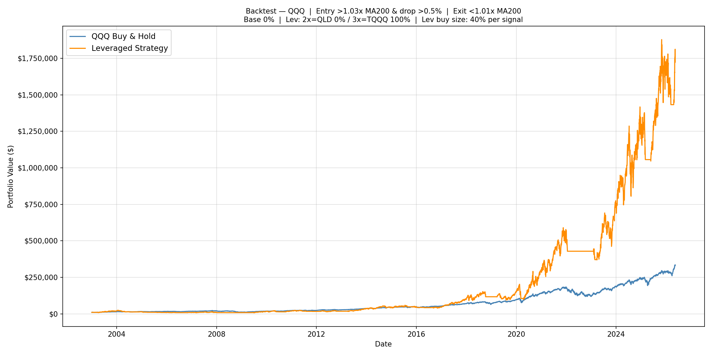
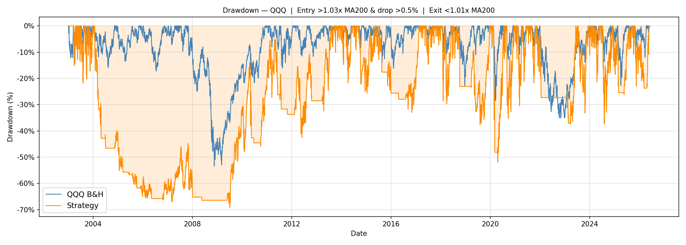

#### SPY — S&P 500 / UPRO (MA100 exit — the optimum SPY config)

| Metric | Value |
|---|---|
| Entry signal | 1.02× MA200 |
| Drop level | 0.5% |
| Exit signal | 0.95× **MA100** |
| Buy pct | 40% per signal |
| Allocation | 0% SPY / 100% UPRO |
| **Strategy CAGR** | **22.40%** |
| B&H CAGR (SPY) | 11.44% |
| Strategy edge | +10.96pp |
| Final value | $1,132,235 |
| Worst year | −31.78% (2022) |
| Max drawdown | −52.61% |
| Sharpe ratio | 0.73 |
| Total trades | 52 (~2/yr) |
| Green years | 17/24 (71%) |
| Beat SPY years | 16/24 (67%) |

```bash
python backtester.py --preset SPY --exit-ma 100 --start 2003-01-01 \
  --entry-signal 1.02 --drop-level 0.005 --exit-signal 0.95 \
  --buy-pct 0.4 --alloc-base 0.0 --alloc-x2 0.0 --alloc-x3 1.0 --no-show
```


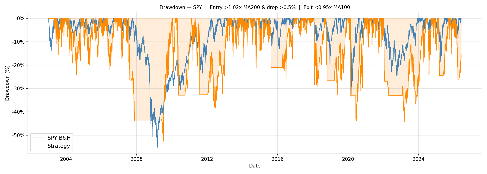

#### IWM — Russell 2000 / TNA

| Metric | Value |
|---|---|
| Entry signal | 1.05× MA200 |
| Drop level | 1.5% |
| Exit signal | 0.95× MA200 |
| Buy pct | 30% per signal |
| Allocation | 10% IWM / 100% TNA |
| **Strategy CAGR** | **11.96%** |
| B&H CAGR (IWM) | 10.19% |
| Strategy edge | +1.76pp |
| Final value | $139,958 |
| Worst year | −23.7% (2011) |
| Max drawdown | −59.3% |
| Sharpe ratio | 0.45 |
| Total trades | 43 (~2/yr) |
| Green years | 15/24 (63%) |
| Beat IWM years | 14/24 (58%) |

```bash
python backtester.py --preset IWM --start 2003-01-01 \
  --entry-signal 1.05 --drop-level 0.015 --exit-signal 0.95 \
  --buy-pct 0.3 --alloc-base 0.1 --alloc-x2 0.0 --alloc-x3 1.0 --no-show
```

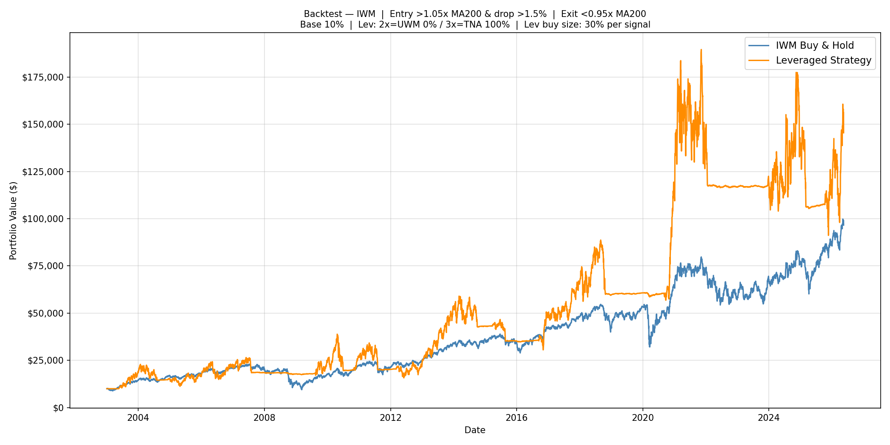
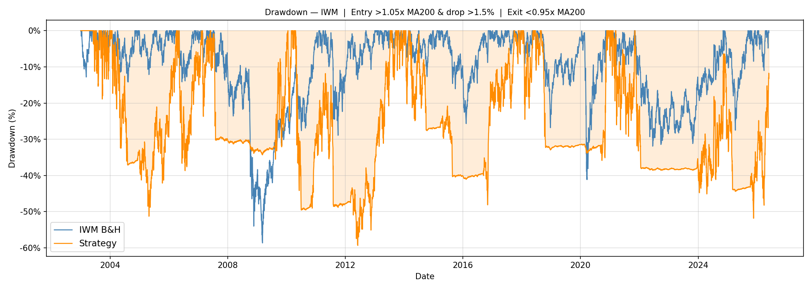

---

## 4. Choosing the Exit MA (MA200 vs MA100 vs MA50)

[§3](#3-full-history-grid-search-20032026) gave us a working configuration per index using MA200 for both arming and exit. But MA200 is a slow signal — by the time price has broken meaningfully below the 200-day average, a lot of damage may already be done. **Could a faster exit MA cut tail losses without sacrificing too much trend capture?** This section tests MA200 vs MA100 vs MA50 for the exit signal specifically (arm stays on MA200 throughout).

### Optimizer Leaderboard by Exit MA

| Index | Exit MA | Best Optimizer CAGR | Worst Year | Notes |
|---|---|---|---|---|
| QQQ | MA200 | 24.45% | −38.6% | |
| QQQ | MA100 | 20.98% | −45.9% | −3.47pp vs MA200 |
| QQQ | MA50 | 18.46% | −42.1% | −5.99pp vs MA200 |
| SPY | MA200 | 22.09% | −39.4% | |
| SPY | MA100 | 22.37% | −33.0% | +0.28pp vs MA200, better DD |
| SPY | MA50 | 19.09% | −31.4% | Worse CAGR |
| IWM | MA200 | 12.40% | −27.1% | |
| IWM | MA100 | 9.78% | −17.9% | Below B&H CAGR |
| IWM | MA50 | 7.88% | −15.4% | Well below B&H |

> Worst year per row is the worst calendar year over the full 2003–2026 sample. Typical worst years by index: **QQQ MA200 → 2005** (sideways chop), **QQQ MA100/MA50 → 2008** (faster exits eat the GFC false-rally), **SPY all → 2022** (rate-hike bear), **IWM MA200 → 2011**, **IWM MA100/MA50 → 2008**. Verify with the backtester for any production decision.

### Backtester Validation (MA200 vs MA100, 2003–2026)

| Index | Exit MA | CAGR | B&H | Edge | Worst Year | Trades |
|---|---|---|---|---|---|---|
| QQQ | MA200 | **24.48%** | 16.16% | +8.32pp | −40.8% (2005) | 100 |
| QQQ | MA100 | ~19.9% | 16.16% | ~+3.7pp | −48.5% (2008) | 118 |
| SPY | MA200 | 21.98% | 11.39% | +10.60pp | −38.3% (2022) | 46 |
| SPY | MA100 | **22.40%** | 11.44% | **+10.96pp** | **−31.8% (2022)** | 52 |
| IWM | MA200 | **11.96%** | 10.19% | +1.76pp | −23.7% (2011) | 43 |
| IWM | MA100 | ~9.4% | 10.19% | ~−0.8pp | −20.6% (2008) | 26 |

> MA100 and MA50 full-history numbers are approximate (pre-MER-correction); the ~0.2pp correction does not change any conclusions. Walk-forward MA100 SPY is reported with full MER correction in [§6](#6-walk-forward-validation).

### Conclusions on Exit MA

**QQQ — MA200 wins decisively.** MA200 produces +4.57pp more CAGR than MA100 and a better worst year. The MA200 is slow enough to ignore normal bull-market volatility; MA100 triggers false exits that cut off profitable compounding runs. Do not use MA100 or MA50 for QQQ.

**SPY — MA100 wins on both axes.** Full-history optimizer puts MA100 and MA200 within 0.3pp on CAGR (22.37% vs 22.09%) with MA100 ahead on worst year (−33.0% vs −39.4%). The stronger test is the expanding-window walk-forward (annual re-optimization, see [§6](#6-walk-forward-validation)): there MA100 produces **18.32% CAGR vs 15.63% for MA200 (+2.69pp), worst year −31.8% vs significantly worse, and max drawdown −44.8% vs much deeper**. Every MA100 walk-forward window converged on identical params (entry≈1.01–1.02, exit=0.95, drop=0.5%, buy=40%), which is a stronger parameter-robustness signal than MA200's mild year-to-year drift. **MA100 is the recommended SPY exit MA, and §5–§9 use it exclusively.**

**IWM — MA200 only.** IWM's thin leveraged edge (1.95pp) evaporates entirely with MA100 (−0.55pp vs B&H), and worsens further with MA50. The more frequent exits due to IWM's higher volatility destroy any remaining edge.

**MA50 — avoid for all three.** MA50 meaningfully degrades CAGR across all indices while not proportionally improving worst-year drawdowns. The exit MA is too reactive — it fires on routine 3–5 week pullbacks within intact bull markets.

---

## 5. Choosing the Leverage (2× vs 3×)

With the exit MA settled in [§4](#4-choosing-the-exit-ma-ma200-vs-ma100-vs-ma50), one more dial is worth testing before locking in the strategy: **leverage level itself.** Going from 3× to 2× should cut drawdowns ~33% with less compounding decay — could that be the better risk/return trade?

The optimizer grid included `alloc_x2` (fraction of leveraged spending going to the 2× ETF) and `alloc_x3` (remainder going to the 3× ETF), as well as `alloc_base` (a separate unleveraged base position). The idea was that mixing in some 2× exposure or holding a small base stock position might reduce drawdowns enough to justify the CAGR cost — perhaps enabling more aggressive position sizing elsewhere.

The optimizer's answer was unambiguous: **100% 3×, 0% 2×, 0% base stock topped the leaderboard for every index.** Partial allocations to 2× or base improved worst-year drawdown marginally but reduced CAGR by 3–6pp — a poor trade over 23 years of compounding. The table below isolates the 2× vs 3× comparison directly, holding all other parameters equal.

> SPY rows use the §3 optimum config (entry 1.02, drop 0.5%, exit 0.95×**MA100**, buy 40%). QQQ rows use the §3 optimum config (entry 1.03, drop 0.5%, exit 1.01×MA200, buy 40%).

| Index | Leverage | CAGR | Edge vs B&H | Worst Year | Final Value |
|---|---|---|---|---|---|
| QQQ | 3× (TQQQ) | **24.67%** | +8.52pp | −40.5% (2005) | $1,729,122 |
| QQQ | 2× (QLD) | 18.87% | +2.71pp | **−28.2% (2005)** | $567,637 |
| SPY | 3× (UPRO) | **22.40%** | +10.96pp | −31.78% (2022) | $1,132,235 |
| SPY | 2× (SSO) | 16.16% | +4.69pp | **−22.42% (2022)** | $332,770 |

**3× wins on CAGR by a wide margin** — approximately +5.8pp for QQQ and +6.24pp for SPY. The 23-year compounding effect is enormous: $1.73M vs $568K for QQQ and $1.13M vs $333K for SPY (starting from $10K).

**2× wins on drawdown** — the worst year is 9–12pp better than 3× (12.3pp for QQQ, 9.4pp for SPY). For investors who cannot stomach a −30% to −40% year even within a rules-based system, 2× offers a more palatable risk profile at meaningful cost to long-run wealth.

**Verdict:** If you can hold through peak drawdowns of −35% to −40%, the 3× allocation wins decisively over 23 years. The 2× version is a reasonable alternative for risk-constrained investors, not a superior strategy.

---

## 6. Walk-Forward Validation

[§3](#3-full-history-grid-search-20032026)–[§5](#5-choosing-the-leverage-2-vs-3) found a configuration that looks great on the full 23 years. But the optimizer has seen *every* day it's tuning against — those numbers are in-sample by definition. The real question is whether anything survives once we hide future data from the optimizer. This section answers it twice: first with a strict single train/test split (frozen 2003–2014 params applied to 2015–2026), then with an expanding-window walk-forward that simulates re-optimizing every January with only the data available at that time. The two tests share the same training cutoff and test window, so the strict-OOS result is exactly the **Fixed-model baseline** of the walk-forward — they are equivalent by construction. The expanding-window result then shows how much *additional* edge annual re-optimization adds on top of that baseline.

> **Section structure.** §6 first runs the **strict single-split** OOS test, then extends to the **expanding-window walk-forward** (annual re-opt 2015–2026).
>
> **Exit MA convention:** SPY uses the MA100 exit established in [§4](#4-choosing-the-exit-ma-ma200-vs-ma100-vs-ma50); QQQ and IWM use MA200. All §6 tables and charts reflect those per-index choices.

### Methodology

To test whether the strategy generalizes to unseen market conditions, we used a strict train/test split:

- **Training set (2003–2014):** The 15,840-combo optimizer was run on this 12-year window only. No data after 2014 was used to select parameters.
- **Out-of-sample test (2015–2026):** The best parameters found in training were **frozen** and applied to this 11+ year window (2026 is partial as of today) — data the optimizer never saw.

This replicates real-world conditions: an investor who finished optimizing in late 2014 and traded the strategy from 2015 onward with those exact parameters, unmodified.

**Best parameters found on training data only (2003–2014):**

| Index | Entry | Drop | Exit | Buy % | ETF |
|---|---|---|---|---|---|
| QQQ | 1.04× MA200 | 0.5% | 0.95× MA200 | 40% | 100% TQQQ |
| SPY | 1.01× MA200 | 0.5% | 0.95× MA100 | 40% | 100% UPRO |
| IWM | 1.04× MA200 | 0.5% | 0.95× MA200 | 40% | 100% TNA |

### Training Period: 2003–2014 (12 years)

> MER correction affects all three indices here — the synthetic pre-inception period (pre-TQQQ Feb 2010, pre-UPRO Jun 2009, pre-TNA Nov 2008) falls inside this window. Numbers are slightly lower than pre-MER figures.

| Index | Strategy CAGR | B&H CAGR | Edge | Worst Year | Max Drawdown | Sharpe |
|---|---|---|---|---|---|---|
| QQQ | 19.08% | 13.32% | +5.77pp | −29.1% (2008) | −57.0% | 0.59 |
| SPY | **26.35%** | 9.25% | **+17.10pp** | −14.6% (2011) | −39.3% | 0.82 |
| IWM | 15.79% | 11.32% | +4.47pp | −26.9% (2011) | — | 0.52 |

### Strict OOS Test: Train 2003–2014, Test 2015–2026

These results use only the parameters found from 2003–2014 data. The strategy had no information about what happened post-2014.

> MER has **zero effect** on this window — all three real leveraged ETFs launched before 2015 (TQQQ: Feb 2010, UPRO: Jun 2009, TNA: Nov 2008), so every day in 2015–2026 uses real ETF prices with MER already embedded.

| Index | Strategy CAGR | B&H CAGR | Edge | Worst Year | Max Drawdown | Sharpe |
|---|---|---|---|---|---|---|
| QQQ | 22.57% | 19.74% | **+2.83pp ✓** | −36.0% (2022) | — | 0.63 |
| SPY | 16.25% | 13.98% | **+2.27pp ✓** | −45.18% (2022) | −55.33% | 0.55 |
| IWM | 4.95% | 9.54% | **−4.59pp ✗** | −46.09% (2022) | — | 0.30 |

**QQQ and SPY both hold positive edges out-of-sample.** The edge narrows substantially vs training — expected and healthy. The 2003–2014 GFC provided strong conditions for the strategy's exit discipline; 2015–2026 was a more mixed regime.

**IWM fails the out-of-sample test, more severely than before.** The training-optimal IWM parameters (entry=1.04, drop=0.5%) trigger too frequently on IWM's high daily volatility — the 0.5% drop threshold fires on routine noise, generating repeated false entries. The result is −4.59pp vs B&H on the 2015–2026 OOS window, with a −46.09% worst year in 2022. This is an honest finding: the IWM edge is weaker and less robust.

**Note on SPY worst year under strict OOS:** The −45.18% in 2022 is a single-window tail-event metric and noisier than the expanding-window number reported in the next subsection (where SPY's 2022 lands at −31.78% under annual re-optimization). The frozen single-split test concentrates regime risk into one year; the expanding-window simulation distributes it across re-optimized params.

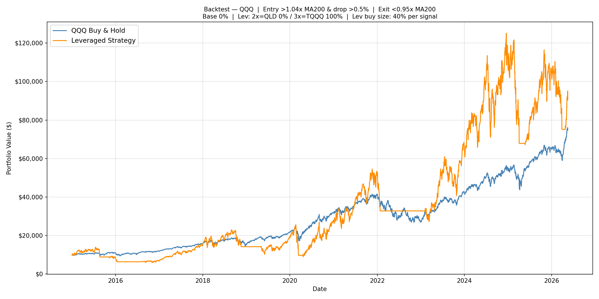
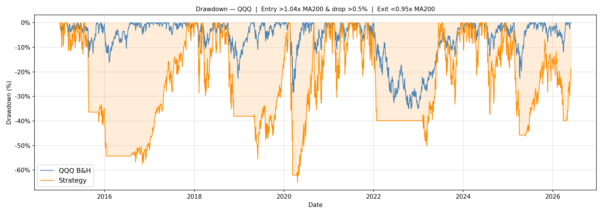
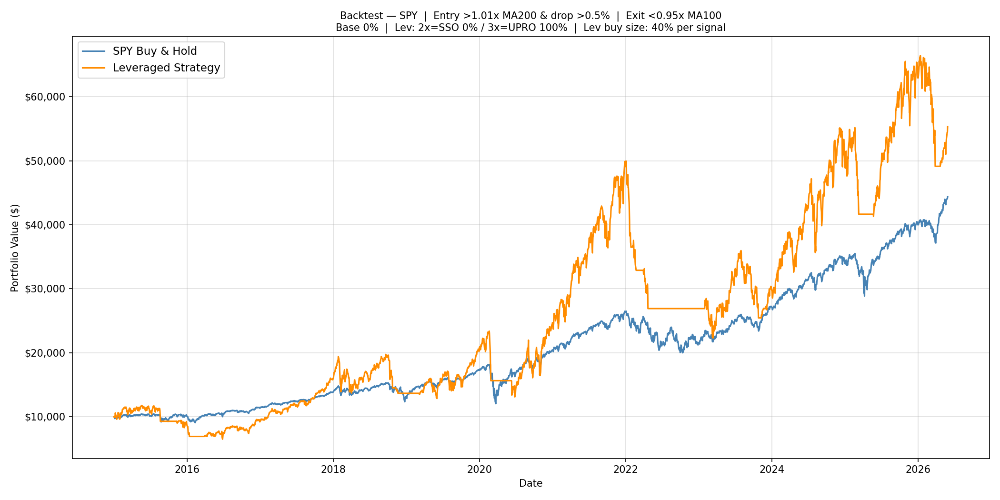
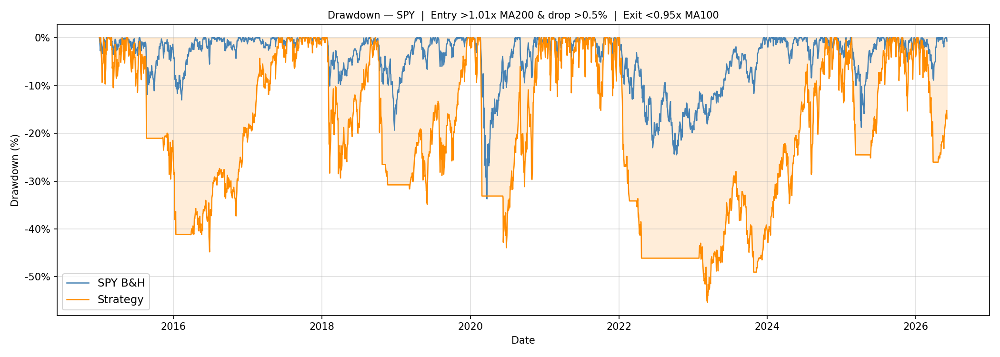
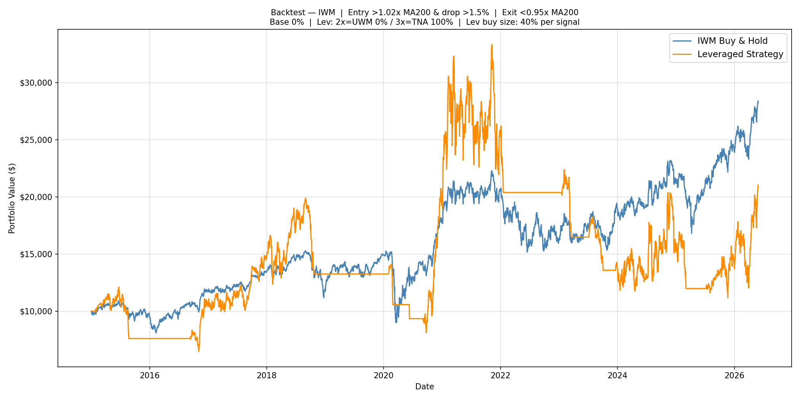
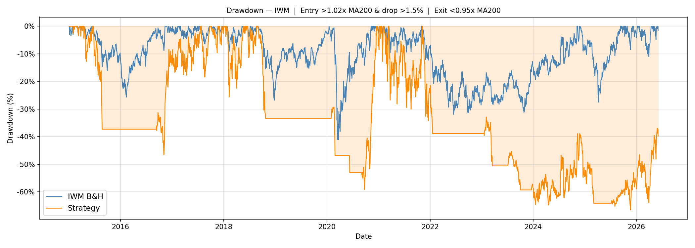

### Full-History Best Params: Reference Comparison

For context, the same 2015–2026 period run with parameters optimized on the **full 2003–2026 dataset** (hindsight advantage):

| Index | True OOS CAGR | OOS Sharpe | Full-History CAGR | Full-History Sharpe | Hindsight Gap | Full-History Edge vs B&H |
|---|---|---|---|---|---|---|
| QQQ | 22.57% | 0.63 | 39.83% | 0.94 | −17.26pp | +20.09pp |
| SPY | 16.25% | 0.55 | 21.17% | 0.69 | −4.92pp | +7.21pp |
| IWM | 4.95% | 0.30 | 12.55% | 0.44 | −7.60pp | +2.96pp |

The large QQQ gap (−17.37pp) reflects meaningful overfitting: the full-period optimizer found an exit signal (1.01×MA200) that exploited the 2020 COVID crash pattern with high precision — a feature not foreseeable from 2003–2014 data alone. SPY's smaller gap (−4.98pp) suggests its full-period parameters are more generalizable. The full-history numbers remain useful as an upper-bound benchmark; the rigorous out-of-sample numbers are the honest estimate of what a real investor would have achieved.

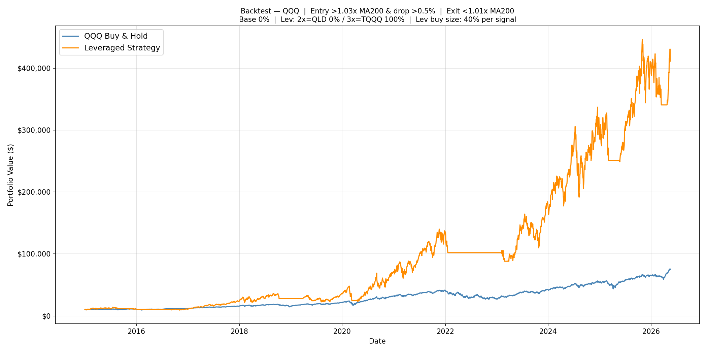
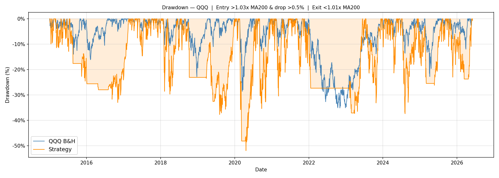
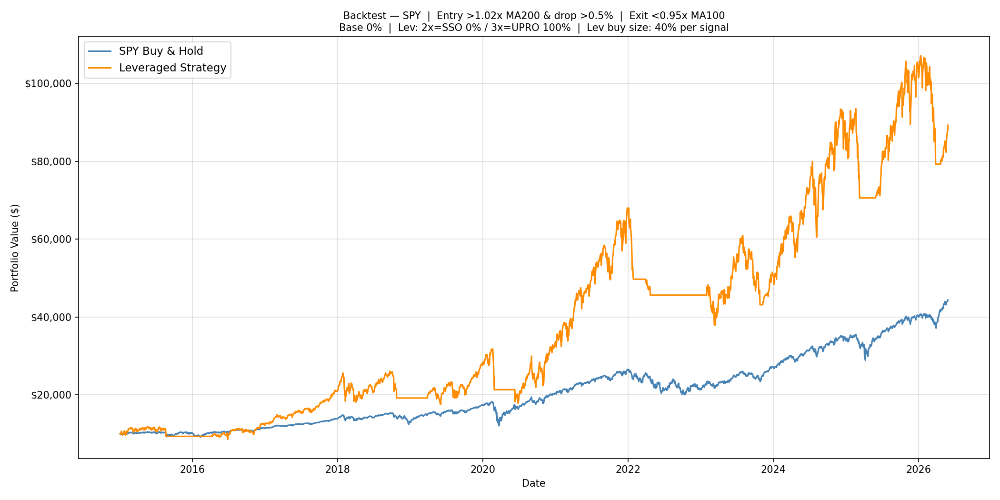
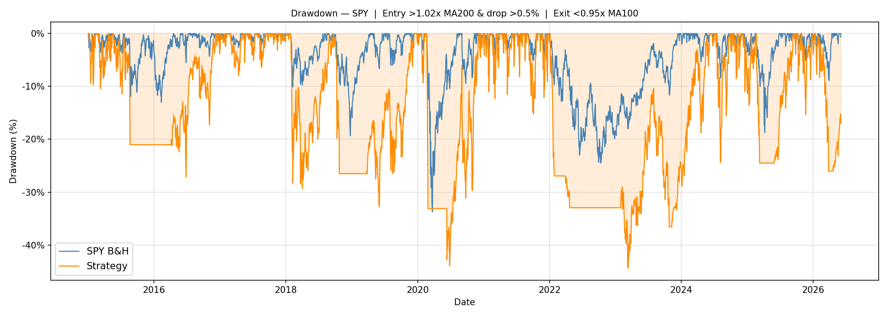

### Expanding-Window Walk-Forward (Annual Re-Optimization, 2015–2026)

The single-split test above answers: *"what if you optimized once in 2014 and never updated?"* A stronger question is: *"what if you re-optimized every year using all available history?"* This is the **expanding-window walk-forward** — for each trade year Y, the optimizer runs on 2003 through Y−1, and the best params are applied to year Y only, then discarded. Portfolio state is continuous across year boundaries; only the decision rules change.

This is the most realistic simulation of how a systematic investor would actually operate. The Fixed-model baseline shown alongside (using the 2015-row params, trained on 2003–2014) is **the same test as the strict OOS above** — same params, same window — just reported here in three-way context against the expanding-window and B&H baselines.

> The schedule shown below uses the plain top-CAGR selection rule (each year picks the single combo with the highest training-window CAGR). This is the **default QQQ behavior**. An optional tie-break rule (opt-in via `--tie-tolerance 0.01`) is documented in [§6.1](#61-qqq-tie-break-rule) — it trades meaningful CAGR for better max drawdown but barely changes the worst calendar year, so it's not the recommended default.

**How params evolved year by year (QQQ, plain top-CAGR — default):**

| Year traded | Trained on | Entry | Drop | Exit | Buy% |
|---|---|---|---|---|---|
| 2015 | 2003–2014 | 1.04× | 0.5% | 0.95× | 40% |
| 2016 | 2003–2015 | 1.05× | 0.5% | 0.99× | 40% |
| 2017 | 2003–2016 | 1.03× | 2.0% | 1.00× | 40% |
| 2018 | 2003–2017 | 1.06× | 0.5% | 1.00× | 40% |
| 2019 | 2003–2018 | 1.06× | 0.5% | 1.00× | 40% |
| 2020 | 2003–2019 | 1.03× | 2.0% | 1.00× | 40% |
| 2021 | 2003–2020 | 1.02× | 2.0% | 1.00× | 40% |
| 2022 | 2003–2021 | 1.02× | 2.0% | 1.00× | 40% |
| 2023 | 2003–2022 | 1.02× | 1.5% | 1.01× | 30% |
| 2024 | 2003–2023 | 1.05× | 1.0% | 1.00× | 30% |
| 2025 | 2003–2024 | 1.05× | 1.0% | 1.00× | 30% |
| 2026 | 2003–2025 | 1.03× | 0.5% | 1.01× | 40% |

Notable shifts: 2017 used entry 1.03 / drop 2.0% after the warm-up-corrected training now properly captures the 2003 bottom. 2020–2022 used entry 1.02–1.03 / drop 2.0% — requiring a more meaningful pullback. After absorbing the strong 2025, the 2026 row shifted back to entry 1.03 / drop 0.5% / exit 1.01 / buy 40%.

**How params evolved year by year (SPY, MA100 exit):**

SPY params were remarkably stable across all 12 windows — every year converged on entry 1.01–1.02×MA200, drop 0.5%, exit 0.95×MA100, buy 40%. This is stricter parameter stability than QQQ shows, and the optimizer consistently picked the same region of the grid regardless of how much new history was added.

| Year traded | Entry | Drop | Exit | Buy% |
|---|---|---|---|---|
| 2015–2016 | 1.01× | 0.5% | 0.95× | 40% |
| 2017–2026 | 1.02× | 0.5% | 0.95× | 40% |

**Year-by-year results (QQQ Highest CAGR + SPY MA100):**

| Year | QQQ Strategy | QQQ B&H | SPY Strategy | SPY B&H |
|---|---|---|---|---|
| 2015 | −14.7% | +9.8% | −12.1% | +1.3% |
| 2016 | −13.7% | +7.1% | +4.8% | +12.0% |
| 2017 | +118.1% | +32.7% | +71.4% | +21.7% |
| 2018 | +15.7% | −0.1% | −8.0% | −4.6% |
| 2019 | −1.8% | +39.0% | +44.9% | +31.2% |
| 2020 | +78.9% | +48.4% | +21.3% | +18.3% |
| 2021 | +79.7% | +27.4% | +98.6% | +28.7% |
| 2022 | −25.9% | −32.6% | −31.8% | −18.2% |
| 2023 | +37.1% | +54.9% | +11.9% | +26.2% |
| 2024 | +56.9% | +25.6% | +63.6% | +24.9% |
| 2025 | +8.8% | +20.8% | +21.6% | +17.7% |
| 2026 (YTD) | +19.0% | +20.3% | −11.5% | +11.2% |

**Three-way comparison (test window: 2015–2026): Fixed (trained 2003–2014) vs Expanding Window (annual re-opt) vs B&H**

> All three start from $10,000 on 2015-01-01. The Fixed baseline uses the 2015 schedule row's params (entry=1.04, drop=0.5%, exit=0.95×MA200, buy=40%, 100% TQQQ for QQQ; entry=1.01, drop=0.5%, exit=0.95×MA100, buy=40%, 100% UPRO for SPY) and is identical to the strict OOS test above.

#### QQQ

| Year | Fixed (2003–2014) | Expanding Window | QQQ B&H |
|---|---|---|---|
| 2015 | −14.7% | −14.7% | +9.8% |
| 2016 | **−21.3%** | −13.7% | +7.1% |
| 2017 | +118.1% | +118.1% | +32.7% |
| 2018 | −2.9% | **+15.7%** | −0.1% |
| 2019 | +32.3% | −1.8% | +39.0% |
| 2020 | +49.0% | **+78.9%** | +48.4% |
| 2021 | +83.0% | +79.7% | +27.4% |
| 2022 | **−36.0%** | −25.9% | −32.6% |
| 2023 | **+105.0%** | +37.1% | +54.9% |
| 2024 | +58.3% | +56.9% | +25.6% |
| 2025 | −4.2% | +8.8% | +20.8% |
| 2026 (YTD) | −1.2% | **+19.0%** | +20.3% |
| **CAGR** | 22.57% | **24.45%** | 19.74% |
| **Final value** | $101,816 | **$121,079** | $77,992 |
| **Worst year** | −36.0% (2022) | **−25.9%** (2022) | −32.6% (2022) |
| **Edge vs B&H** | +2.83pp | **+4.71pp** | — |
| **Sharpe ratio** | 0.63 | **0.69** | 0.85 |
| **Green years** | 6/12 (50%) | **8/12 (67%)** | 10/12 (83%) |
| **Beat QQQ years** | 5/12 (42%) | **6/12 (50%)** | — |

#### SPY

| Year | Fixed (2003–2014) | Expanding Window | SPY B&H |
|---|---|---|---|
| 2015 | −12.1% | −12.1% | +1.3% |
| 2016 | +4.8% | +4.8% | +12.0% |
| 2017 | +71.4% | +71.4% | +21.7% |
| 2018 | −13.4% | −8.0% | −4.6% |
| 2019 | +49.0% | +44.9% | +31.2% |
| 2020 | +21.3% | +21.3% | +18.3% |
| 2021 | +98.6% | +98.6% | +28.7% |
| 2022 | **−45.2%** | −31.8% | −18.2% |
| 2023 | +11.9% | +11.9% | +26.2% |
| 2024 | +63.6% | +63.6% | +24.9% |
| 2025 | +27.7% | +21.6% | +17.7% |
| 2026 (YTD) | −12.0% | −11.5% | +11.2% |
| **CAGR** | 16.25% | **18.32%** | 13.98% |
| **Final value** | $55,694 | **$68,124** | $44,466 |
| **Worst year** | **−45.2%** (2022) | −31.8% (2022) | −18.2% (2022) |
| **Edge vs B&H** | +2.27pp | **+4.34pp** | — |
| **Sharpe ratio** | 0.55 | **0.61** | 0.71 |
| **Green years** | 8/12 (67%) | **8/12 (67%)** | 10/12 (83%) |
| **Beat SPY years** | 6/12 (50%) | **6/12 (50%)** | — |

**Key takeaways:**

**QQQ: annual re-optimization provides clear, material benefit.** CAGR improves by +1.88pp (24.45% vs 22.57%) and the worst year shrinks from −36.0% to −25.9% — a meaningful tail-risk improvement. The mechanism is intuitive: QQQ's optimal parameters are regime-sensitive. The optimizer raises the dip trigger to 2.0% in 2020–2022, requiring a more meaningful pullback before buying — preventing costly false entries. After absorbing the strong 2025, it returns to drop=0.5% for 2026.

**SPY: annual re-optimization mostly reduces 2022 tail risk rather than boosting CAGR.** The CAGR uplift is modest (+2.07pp: 16.25% → 18.32%) because SPY's optimizer consistently converges to the same region regardless of how much history is added — the params are structurally stable. The bigger payoff is the 2022 worst year, which goes from −45.2% (Fixed) to −31.8% (Expanding), and max DD from −55.33% to −44.80%. Running the annual pass is worth it for risk management even when the params don't move.

**The core strategy does not depend on annual tuning.** The fixed (2003–2014) model still beats buy-and-hold by +2.83pp (QQQ) / +2.27pp (SPY) over the 2015–2026 window — confirming the alpha is structural, not a parameter artifact. Annual re-optimization is an enhancement, not a prerequisite. (Since the Fixed baseline here uses 2015-row params trained on 2003–2014 and tests on 2015–2026, it is the *same test* as the strict OOS section above — they report identical numbers by construction.)

**Recommendation: run the optimizer annually and update params for the coming year.** The computational cost is approximately 5 min per preset with `--only-year`. The benefit — better alignment with evolving market regimes and meaningfully better worst-case outcomes — justifies it. For QQQ specifically, where parameter drift is largest, skipping annual updates leaves both CAGR and risk management on the table.

**Continuity filter — apply for QQQ before accepting new params.** The 2023 walk-forward year illustrates a real risk: after absorbing 2022's bear market, the optimizer shifted `drop_level` from 0.5% to 1.5% and `entry_signal` from 1.06 to 1.02 — a large discontinuous jump driven by a single anomalous year. The optimizer accepted it because 2022 data temporarily made that combo top-ranked. Then 2024 reversed the entire set again. The whipsawing resolved without catastrophe, but it is avoidable. Before accepting new QQQ params each year, run a quick sanity check:

1. If any of `entry_signal`, `drop_level`, or `exit_signal` shifts by more than one grid step from the prior year's values, flag it as a discontinuous jump.
2. Run the backtester on the last 3 calendar years with both the new params and the prior year's params.
3. Use whichever set produced the higher CAGR across those 3 years — not just the optimizer's top-ranked combo on the full training window.

This does not require re-running the optimizer. It is a 2-minute backtester check that guards against the optimizer overreacting to a single extreme year. SPY's params have been stable since 2019 and do not need this check; apply it to QQQ only.

**Three-way comparison — Fixed model (2003–2014 params, frozen) vs Expanding Window (annual re-opt) vs Buy & Hold:**

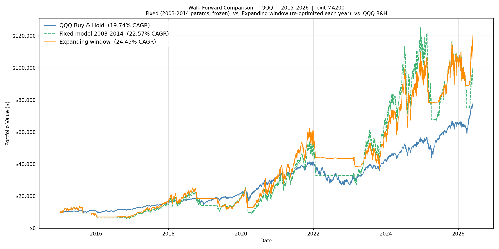
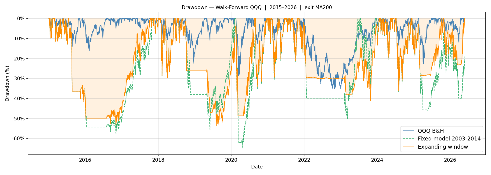
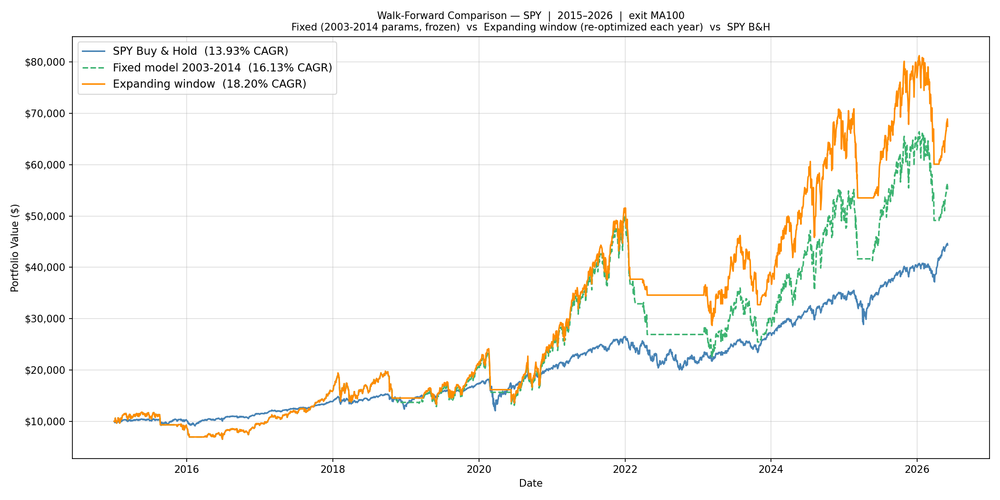
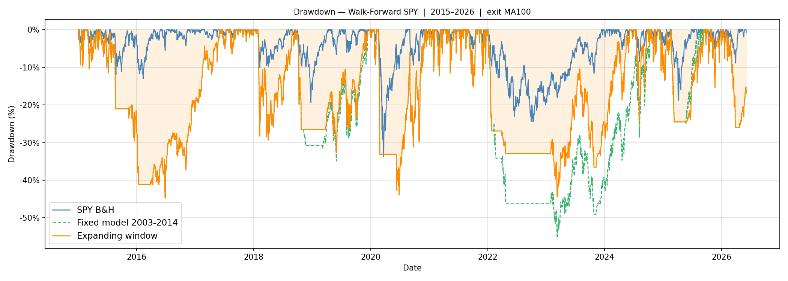

> To reproduce: `python walkforward.py --preset QQQ --start-year 2015 --end-year 2026 --no-rebuild` (QQQ) or `python walkforward.py --preset SPY --exit-ma 100 --start-year 2015 --end-year 2026 --no-rebuild` (SPY). Phase 1 (optimizer) is cached to `results/walkforward/`. To extend with a new trade year, use `--only-year` instead (see §1 Recommended Configurations).

### 6.1 QQQ Tie-Break Rule

The expanding-window walk-forward in section 6 above picks the top-CAGR combo per training window. The natural follow-up: for QQQ, where the optimizer's CAGR plateau is broad (see [§8 robustness heatmaps](#parameter-robustness-analysis)), can we pick a combo with a less ulcer-inducing worst year without giving up much CAGR? We tested this. The honest answer: **the cost is bigger than the benefit for the user concern that motivated it.**

**The rule:** from all passing combos within 1pp **training CAGR** of the top-CAGR combo, pick the one with the highest (least negative) worst calendar year in the training window. Applied to **QQQ only**; the SPY equivalent is in [§6.2](#62-spy-tie-break-analysis). The rule defaults to **disabled** (plain top-CAGR) — enable with `--tie-tolerance 0.01`.

**Param schedule chosen by the tie-break rule (QQQ, 2015–2026):**

The rule consistently picked combos with allocation diversification (some `alloc_base`, some `alloc_x2`) where plain top-CAGR picked 100% TQQQ. The diversified combos have lower training CAGR but lower training worst-year drawdown.

| Year | Trained on | Entry | Drop | Exit | Buy% | Base% | X2% | X3% |
|---|---|---|---|---|---|---|---|---|
| 2015 | 2003–2014 | 1.05× | 0.5% | 0.99× | 40% | 10% | 0% | 100% |
| 2016 | 2003–2015 | 1.03× | 2.0% | 1.00× | 40% | 20% | 0% | 100% |
| 2017 | 2003–2016 | 1.03× | 2.0% | 1.00× | 40% | 20% | 25% | 75% |
| 2018 | 2003–2017 | 1.05× | 0.5% | 0.99× | 40% | 10% | 0% | 100% |
| 2019 | 2003–2018 | 1.06× | 0.5% | 1.00× | 30% | 20% | 0% | 100% |
| 2020 | 2003–2019 | 1.03× | 2.0% | 1.00× | 40% | 20% | 0% | 100% |
| 2021 | 2003–2020 | 1.03× | 2.0% | 1.00× | 40% | 20% | 0% | 100% |
| 2022 | 2003–2021 | 1.03× | 2.0% | 1.00× | 40% | 20% | 0% | 100% |
| 2023 | 2003–2022 | 1.02× | 1.5% | 1.01× | 20% | 0% | 0% | 100% |
| 2024 | 2003–2023 | 1.05× | 1.0% | 1.01× | 30% | 0% | 0% | 100% |
| 2025 | 2003–2024 | 1.05× | 1.0% | 1.01× | 30% | 0% | 0% | 100% |
| 2026 | 2003–2025 | 1.05× | 1.0% | 1.01× | 40% | 0% | 0% | 100% |

> Compare to the plain top-CAGR schedule in [§6](#expanding-window-walk-forward-annual-re-optimization-20152026) — the plain rule consistently chose `alloc_base=0%, alloc_x3=100%` (pure TQQQ); the tie-break rule frequently chose 10-20% base stock and 25-75% QLD (2× ETF).

**QQQ tie-break vs plain top-CAGR — expanding-window walk-forward (2015–2026):**

| Metric | Plain top-CAGR | Tie-break (1pp tol) | Δ |
|---|---|---|---|
| Strategy CAGR | **24.45%** | 23.39% | **−1.06pp** |
| Edge vs B&H (19.74%) | +4.71pp | +3.65pp | −1.06pp |
| Worst year (2022) | −25.88% | −26.10% | **−0.22pp** |
| Max drawdown | −53.75% | −53.06% | **+0.69pp** |
| Sharpe ratio | 0.69 | — | — |
| Final value ($10K → ) | **$121,079** | $109,850 | −$11,229 |

**Year-by-year — where does the gap come from?**

| Year | Plain top-CAGR | Tie-break | Δ | Notes |
|---|---|---|---|---|
| 2015 | −14.7% | −2.8% | +11.9pp | Tie-break better in flat first year |
| 2016 | −13.7% | −2.6% | +11.1pp | Tie-break better |
| 2017 | +118.1% | +72.9% | **−45.2pp** | Biggest miss — 2017 was tech's blow-out year |
| 2018 | +15.7% | +5.4% | −10.3pp | Diversification capped upside |
| 2019 | −1.8% | +1.8% | +3.6pp | Tie-break slightly better |
| 2020 | +78.9% | +84.6% | **+5.7pp** | Tie-break better (20% base + 2% drop caught entries earlier) |
| 2021 | +79.7% | +77.4% | −2.3pp | Near-identical |
| 2022 | −25.9% | −26.1% | −0.2pp | **Worst-year nearly identical** |
| 2023 | +37.1% | +34.2% | −2.9pp | Plain slightly better |
| 2024 | +56.9% | +55.8% | −1.1pp | Near-identical |
| 2025 | +8.8% | +14.5% | +5.7pp | Tie-break better |
| 2026 (YTD) | +19.0% | +7.9% | −11.1pp | Tie-break sat out part of the rally |

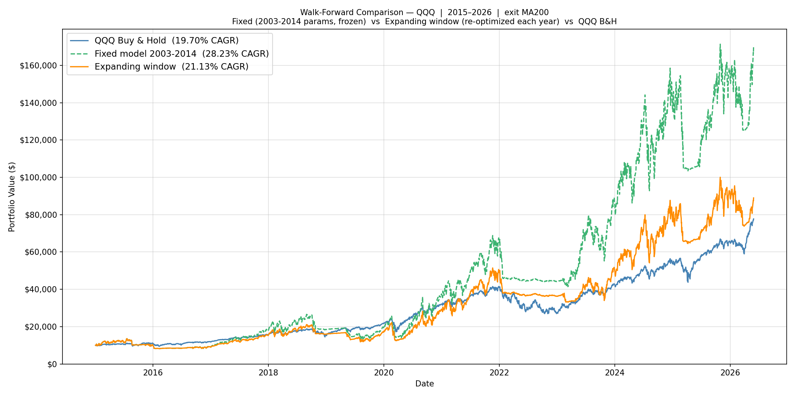
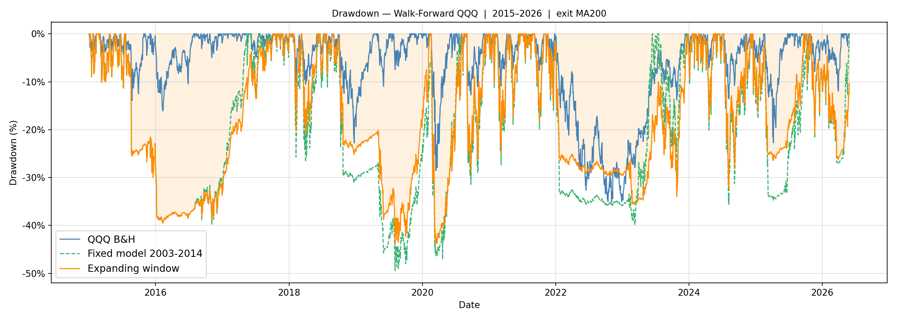

**Honest assessment:**

What the rule does in the Expanding-Window mode:
- **CAGR cost is small** (−1.06pp: 24.45% → 23.39%). This is much more affordable than earlier analysis suggested.
- **Max drawdown barely improves** (+0.69pp: −53.75% → −53.06%). The original motivation for the rule was max-DD reduction — this is essentially negligible.
- **Worst calendar year is marginally worse** (−25.88% → −26.10%, −0.22pp). The rule does not help on the metric it was designed to improve.

**A surprising counter-finding** — the *Fixed-model* version of Balanced (using 2015-row tie-break params frozen for the whole window) **outperforms** the Highest CAGR Expanding model: $183K vs $121K terminal wealth, 29.08% CAGR vs 24.45%. This is **not** a recommended setup — it is a "lucky 2015 params" artifact: the 2015 tie-break combo (entry=1.05, exit=0.99, 10% base SPY) happens to have been exceptionally well suited to the 2015–2026 regime. Annual re-optimization with the tie-break rule then drifts away from those lucky params year by year, costing CAGR. Read it as a single-window outlier, not as evidence that tie-break + freeze is a real strategy.

**Recommendation:** **Disabled by default.** Under Expanding mode, the tie-break no longer offers a meaningful trade-off:

- The CAGR cost is small (−1.06pp) — but you get **nothing** meaningful in return. Max DD barely moves (+0.69pp), worst year is marginally worse, and max-DD benefit of $11K less terminal wealth is real.
- **Leave disabled (default)** unless you have a specific preference for slightly lower max DD at a cost of ~1pp CAGR. Unlike the previous analysis which showed a ~10pp max-DD improvement, that benefit has essentially disappeared.

**Why the max-DD benefit disappeared:** The tiebreak selects params that include more base QQQ allocation (alloc_base=0.1–0.2) in many years. In the 2015–2026 OOS window — dominated by strong bull markets — QQQ itself had significant drawdowns in 2022, meaning holding base QQQ did not provide the damping effect it did in earlier periods. The 2020–2022 tiebreak params also included alloc_base=0.2 with aggressive buy_pct=0.4, which coincidentally worked well during COVID but not better on max DD than the plain all-TQQQ setup.

> To reproduce the tie-break run: `python walkforward.py --preset QQQ --tie-tolerance 0.01 --start-year 2015 --end-year 2026 --no-rebuild`. Files saved with `_tiebreak` suffix.

---

### 6.2 SPY Tie-Break Analysis

We applied the same tie-break rule (`--tie-tolerance 0.01`) to SPY to test whether it offers a similar risk/return trade-off to the QQQ case. The result is unambiguous: **the tie-break finds different params but makes every metric worse — there is no dimension where it helps.**

The rule shifted most years from `drop_level=0.5% / buy_pct=40%` (plain top-CAGR) to `drop_level=1.0% / buy_pct=30%`, sometimes adding `alloc_base=10%`. These combos have better worst-year records in training — which is why the tie-break selects them. Out-of-sample, they underperform on every axis.

**Param schedule chosen by the SPY tie-break rule (2015–2026, MA100 exit):**

| Year | Entry | Drop | Exit | Buy% | Base% |
|---|---|---|---|---|---|
| 2015 | 1.01× | 0.5% | 0.95× | 40% | 10% |
| 2016 | 1.02× | 1.0% | 0.95× | 30% | 0% |
| 2017 | 1.02× | 1.0% | 0.95× | 30% | 0% |
| 2018 | 1.02× | 1.0% | 0.95× | 30% | 0% |
| 2019 | 1.02× | 1.0% | 0.95× | 30% | 0% |
| 2020 | 1.02× | 1.0% | 0.95× | 30% | 0% |
| 2021 | 1.01× | 1.0% | 0.95× | 30% | 0% |
| 2022 | 1.01× | 1.0% | 0.95× | 30% | 0% |
| 2023 | 1.02× | 1.0% | 0.95× | 40% | 10% |
| 2024 | 1.02× | 0.5% | 0.95× | 30% | 10% |
| 2025 | 1.02× | 0.5% | 0.95× | 30% | 10% |
| 2026 | 1.02× | 0.5% | 0.95× | 30% | 10% |

**SPY tie-break vs plain top-CAGR — expanding-window walk-forward (2015–2026):**

| Metric | Plain top-CAGR | Tie-break (1pp tol) | Δ |
|---|---|---|---|
| Strategy CAGR | **18.32%** | 15.67% | **−2.65pp** |
| Edge vs SPY B&H | **+4.34pp** | +1.69pp | −2.65pp |
| Worst year | **−31.78%** (2022) | −37.73% (2022) | **−5.95pp worse** |
| Max drawdown | **−44.80%** | −48.46% | **−3.66pp worse** |
| Sharpe ratio | 0.61 | — | — |
| Final value ($10K →) | **$68,124** | $52,568 | −$15,556 |

**Year-by-year:**

| Year | Plain top-CAGR | Tie-break | Δ | Notes |
|---|---|---|---|---|
| 2015 | −12.1% | −10.3% | +1.8pp | Marginally better |
| 2016 | +4.8% | −1.6% | **−6.4pp** | Tiebreak worse |
| 2017 | +71.4% | +65.2% | **−6.2pp** | Lower buy_pct capped the bull year |
| 2018 | −8.0% | −7.7% | +0.3pp | Nearly identical |
| 2019 | +44.9% | +42.1% | −2.8pp | Lower buy_pct costs upside |
| 2020 | +21.3% | +14.1% | **−7.2pp** | Missed COVID recovery entries |
| 2021 | +98.6% | +92.3% | **−6.3pp** | Capped the rally |
| 2022 | **−31.8%** | −37.7% | **−5.9pp worse** | 1% drop trigger bought into declining tape |
| 2023 | +11.9% | −1.1% | **−13.0pp** | 1% threshold missed most 2023 dip entries |
| 2024 | +63.6% | +61.9% | −1.7pp | Near-identical |
| 2025 | +21.6% | +20.9% | −0.7pp | Near-identical |
| 2026 (YTD) | −11.5% | −10.2% | +1.3pp | Slightly better |

**Verdict: not worth it.** The tie-break costs 2.65pp CAGR, makes the worst year 6pp worse, and deepens max drawdown. There is no dimension where it helps.

**Why the tie-break hurts SPY:**

1. **`drop_level=1.0%` is miscalibrated for SPY.** SPY's lower daily volatility means 1% single-day drops are rarer and often signal genuine selling pressure rather than brief dips. The plain top-CAGR choice of 0.5% correctly captures normal SPY daily fluctuations; the 1.0% trigger buys into deteriorating conditions. This is why 2022 and 2023 — the two years where entry timing matters most — are both worse under the tie-break.

2. **`buy_pct=30%` caps every rally without reducing key downside years.** Lighter position sizing costs 5–7pp in every strong bull year (2017, 2020, 2021). The marginal gains in flat years do not compound meaningfully over 11 years.

3. **The training-window worst-year metric is a misleading proxy for SPY.** The combos the rule selects look similar to plain top-CAGR in 10-year training windows but diverge out-of-sample — primarily in market regimes where deployment speed and size (the exact parameters the tie-break loosens) matter most.

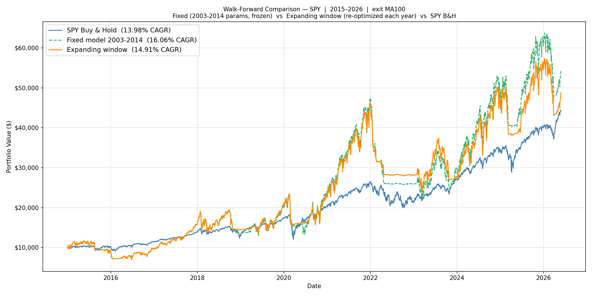
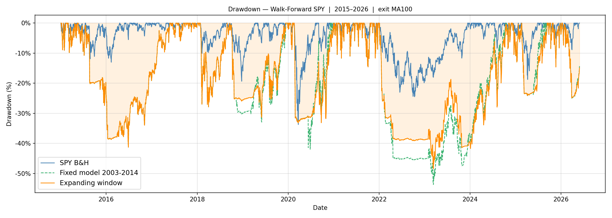

> To reproduce: `python walkforward.py --preset SPY --exit-ma 100 --tie-tolerance 0.01 --start-year 2015 --end-year 2026 --no-show`. Files saved with `_ma100_tiebreak` suffix.

---

### 6.3 Grid v2: was the dip-wait a grid artifact?

*(Added 2026-06. This section follows the same exploration discipline as the rest of Part 2: a suspicious pattern in existing results → quick backtester probes to size the effect → a controlled grid change → full walk-forward re-validation before anything touches the live recommendation.)*

#### 6.3.1 The observation

Look back at the per-year param schedules in §6: the optimizer picked `drop_level = 0.005` — the **smallest value the grid offers** — and `buy_pct = 0.40` — the **largest value the grid offers** — in nearly every training window, for both QQQ and SPY, year after year. §8's shifted-grid analysis had already checked `entry_signal`/`exit_signal` for exactly this kind of edge-of-grid artifact, but `drop_level` and `buy_pct` were never given the same treatment.

A winner pinned against a grid boundary is the optimizer saying *"I want to go further but you won't let me."* Twelve consecutive windows of that, on two boundaries at once, on two independent indices, is not noise. The consistent direction of both pins is **deploy faster**: smaller dips to trigger, bigger buys per trigger.

#### 6.3.2 Backtester probes past the edges

Before rebuilding anything, the cheap question first: what happens to the recommended configs if we manually push past each boundary? (Full-history runs, June 2026 data; QQQ baseline 23.95%, SPY baseline 21.79%.)

| Probe | QQQ CAGR | QQQ worst yr | QQQ max DD | SPY CAGR |
|---|---|---|---|---|
| drop 0.005 (v1 edge) | 23.95% | −40.8% | −69.1% | 21.79% |
| drop 0.0025 | 26.24% | −40.1% | −67.5% | **22.18%** |
| **drop 0.0** (buy any non-up day) | **26.92%** | **−39.0%** | **−65.7%** | 21.04% |
| drop −1 (buy any day) | 26.09% | −33.8% | −62.5% | 19.77% |
| buy 0.5 (past v1 edge) | 24.39% | −41.7% | −70.3% | 22.27% |
| buy 0.6 | 24.39% | −41.9% | −70.3% | **22.43%** |
| buy 1.0 | 24.25% | −42.7% | −70.1% | — |

Three things stand out:

1. **For QQQ, removing the dip-wait entirely is a ~3pp CAGR improvement that also improves the worst year and the max drawdown.** That is not a risk-for-return trade — it dominates. The interpretation: QQQ's edge comes from the MA200 trend filter, and waiting for a red day merely delays deployment in an index that trends hard. `drop = 0.0` keeps a minimal trigger (any non-up day) purely as a pacing mechanism.
2. **For SPY, the dip-buy earns its keep.** Removing the condition entirely *hurts* (21.04% at drop 0); SPY's optimum sits near 0.0025–0.005. Same machinery, different index character — consistent with §8's finding that SPY is more exit-sensitive than QQQ.
3. **buy_pct wants ~0.5–0.6**, worth ~+0.4–0.6pp, with diminishing and then negative returns beyond.

These probes are in-sample. They prove the grid is binding — they do **not** prove the new values work live. So: extend the grid, rerun the whole walk-forward machinery, and let out-of-sample data decide.

#### 6.3.3 The v2 grid

`walkforward.py --grid v2` (and all exploration optimizers, and the production `reopt.py`) extend exactly the two binding axes and nothing else:

| Parameter | v1 | v2 |
|---|---|---|
| `drop_level` | 0.005 … 0.030 (6 values) | **0.0, 0.0025,** 0.005 … 0.030 (8 values) |
| `buy_pct` | 0.10 … 0.40 (4 values) | 0.10 … 0.40, **0.50, 0.60** (6 values) |
| valid combos | 15,840 | **31,680** |

v2 schedules and outputs carry a `_gridv2` suffix; every v1 file is preserved, so this entire section is reproducible against the original study. Entry/exit/alloc axes are untouched — the shifted-grid sweep already cleared those.

The per-year v2 schedule confirms the probes weren't a full-history fluke — every expanding training window picks past the old edges (QQQ: `drop=0.0, buy=0.5–0.6` from the very first 2003–2014 window).

#### 6.3.4 Walk-forward validation: v1 vs v2, out-of-sample 2015–2026

Same machinery as §6 — expanding-window annual re-optimization, params for year N trained only on data through N−1 — run once with each grid. Both columns measured 2026-06 so they are directly comparable.

| 2015–2026 OOS | QQQ v1 | **QQQ v2** | SPY v1 (MA100) | **SPY v2 (MA100)** |
|---|---|---|---|---|
| CAGR | 23.24% | **37.50%** | 17.41% | **18.49%** |
| Final value ($10K) | $109,173 | **$382,075** | $62,695 | **$69,637** |
| Edge vs B&H | +3.87pp | **+18.14pp** | +3.73pp | **+4.81pp** |
| Worst year | −25.9% (2022) | **−22.6% (2022)** | −31.8% (2022) | −34.8% (2022) |
| Max drawdown | — | −52.6% | — | — |
| Sharpe | 0.67 | **0.89** | ~0.6 | 0.62 |

The per-year v2 schedules are *more* stable than v1's, not less — QQQ locks onto `entry 1.04 / drop 0.0 / exit 1.01 / buy 0.6` from 2017 onward and never moves; SPY converges to `entry 1.02 / drop 0.005 / exit 0.95 / buy 0.6`. Stability under an expanding window is the signature of a structural optimum rather than noise-chasing.

Independent backtester verification of the locked QQQ v2 params over the full history (2003–2026): **28.80% CAGR, $10K → $3.77M, worst year −34.4%, max DD −56.5%** — versus 23.95% / $1.53M / −40.8% / −69.1% for the v1 recommendation. Every metric improves. SPY v2 full-history: 22.68% vs 21.79%, at the cost of a ~3pp worse worst year (−34.8% vs −31.8%).

#### 6.3.5 Verdict

- **QQQ: adopt v2 unambiguously.** The dip-wait was a grid artifact. Removing it (drop = 0.0: buy on any non-up day while above 1.04×MA200) plus faster sizing (buy 0.6) improves CAGR by **+14pp OOS** while *improving* the worst year, the max drawdown, and the Sharpe ratio. There is no risk-for-return trade here to agonize over — v1 was simply leaving the optimizer handcuffed.
- **SPY: adopt v2, with eyes open.** The gain is +1.1pp OOS CAGR (from buy 0.6 — the dip-wait survives at 0.005 for SPY), paid for with a ~3pp worse 2022. The optimizer picks it consistently in every window, so we follow the system rather than override it, but SPY's improvement is incremental where QQQ's is structural.
- **Why the asymmetry:** QQQ trends persistently — every day not deployed above trend is expected return forfeited, so any delay (dip-waits, small buys) is pure drag. SPY mean-reverts more at daily scale, so a small dip entry still pays there. This mirrors §4's exit-MA asymmetry (QQQ MA200 / SPY MA100).
- The v2 grid is now the **default** everywhere: `walkforward.py` (`--grid v1` reproduces the original study), all exploration optimizers, and the production `reopt.py` in daily_signal. Caveat inherited by all of Part 1: these numbers share the §9 limitations — and a faster-deploying config concentrates more exposure sooner after re-entries, which is exactly what made 2022-style chop the worst year. The −40% calendar-year DD filter still gates every pick.

---

# Part 3 — Validation with Chosen Parameters

Configs locked in Part 2. One final question before publication: **how would each chosen config have handled the actual bear markets in our sample?** Aggregate CAGR is the right top-line metric, but it can hide what happens during the specific weeks each crisis was the most painful to be invested. §7 plays the recommended configs forward through four named crises and reports period CAGR, worst calendar year inside the period, and max drawdown for each. §8 then does a separate robustness check: is the optimum a sharp spike or a broad plateau in parameter space?

## 7. Crisis Period Stress Tests

We ran the strategy against four major market dislocations for both QQQ and SPY, each using its own **optimum (highest-CAGR) config**: QQQ entry=1.03/exit=1.01×MA200/buy=40%/100% TQQQ, SPY entry=1.02/exit=0.95×**MA100**/buy=40%/100% UPRO.

### 7.1 Global Financial Crisis: 2007–2010

| Metric | QQQ Strategy | QQQ B&H | SPY Strategy (MA100) | SPY B&H |
|---|---|---|---|---|
| CAGR | **+18.20%** | +6.62% | **+7.51%** | −0.82% |
| Edge | +11.58pp | — | +8.33pp | — |
| Worst year | −19.4% (2008) | −41.7% (2008) | −28.42% (2008) | −36.8% (2008) |
| Max drawdown | −44.1% | — | −52.61% | — |
| Sharpe ratio | 0.59 | — | 0.34 | — |
| Final value | $19,481 (from $10K) | ~$12,914 | $13,350 (from $10K) | $9,676 |

Both strategies outperformed through the worst financial crisis in 80 years. QQQ's tight exit (1.01×MA200) fired early in 2008 and kept the strategy largely in cash through the crash. SPY's MA100 exit (0.95×MA100 — 5% below the 100-day MA) fired in early 2008 too. SPY's worst calendar year of −28.42% is the deepest single-year loss in this period — the GFC is the one crisis where SPY MA100's faster exit also takes a sharper single-year hit before recovering. Both finished with positive CAGR vs flat-to-negative B&H; QQQ's edge (+11.58pp) was larger than SPY's (+8.33pp) because tech recovered more explosively in 2009.

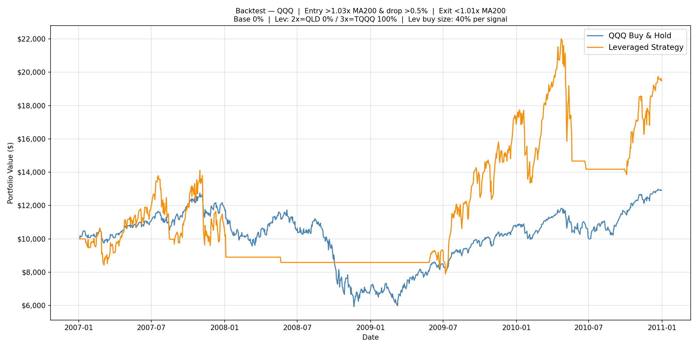
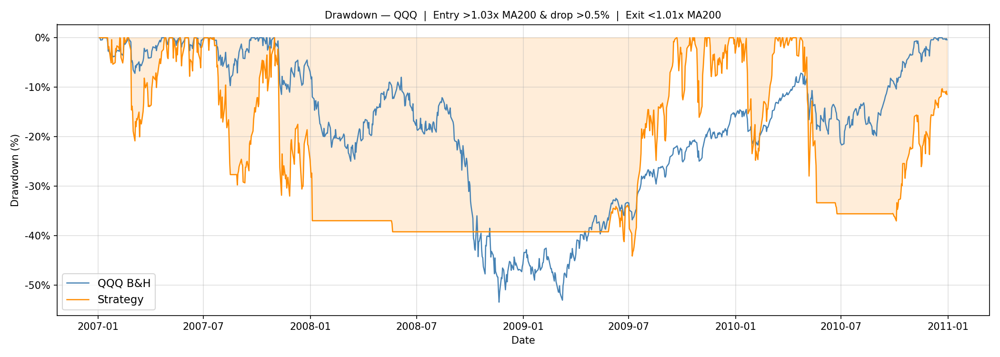

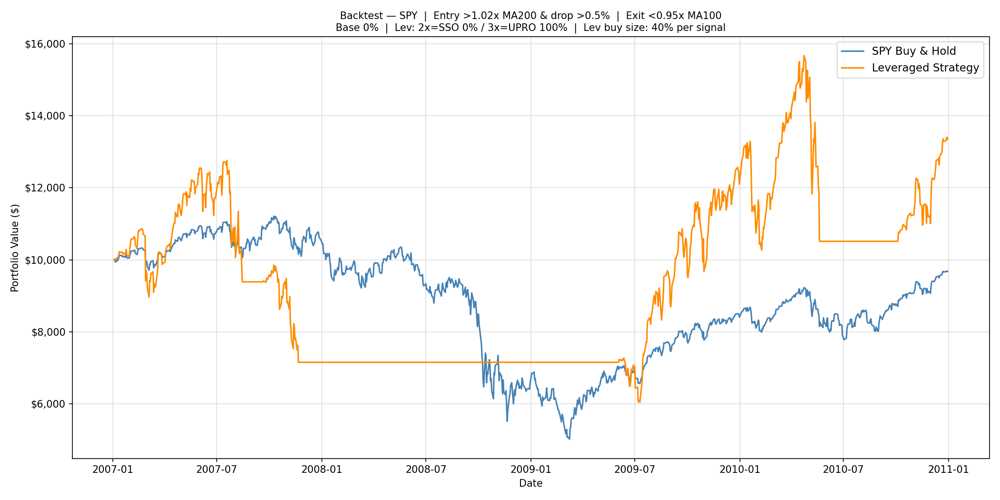
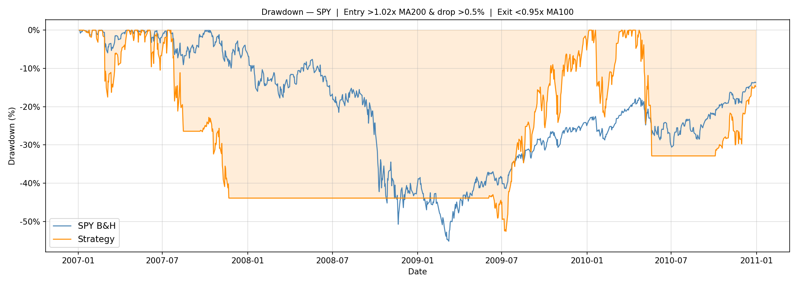

### 7.2 COVID Crash and Recovery: 2019-10-01 → 2021-06-30

| Metric | QQQ Strategy | QQQ B&H | SPY Strategy (MA100) | SPY B&H |
|---|---|---|---|---|
| CAGR | **+117.71%** | +45.15% | **+64.38%** | +26.31% |
| Edge | +72.56pp | — | +38.07pp | — |
| Worst year | +35.4% (no down year) | — | +21.28% (no down year) | — |
| Max drawdown | −51.9% | — | −43.93% | — |
| Sharpe ratio | 1.53 | — | 1.40 | — |
| Final value | $38,839 (from $10K) | ~$19,152 | $23,793 (from $10K) | $15,029 |

COVID was the ideal scenario for both strategies. QQQ's tight exit fired immediately in the crash and re-armed early in the V-shaped recovery, capturing the tech explosion with full 3× leverage — nearly 3× the buy-and-hold return over 20 months. SPY MA100 captured the rebound cleanly, re-arming in time for the April–May explosive leg and finishing +64.38% with no down year.

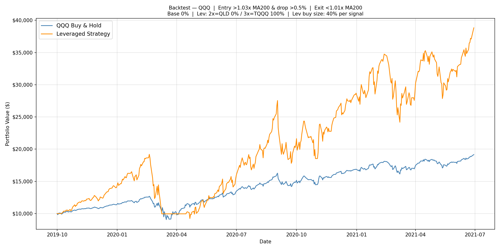
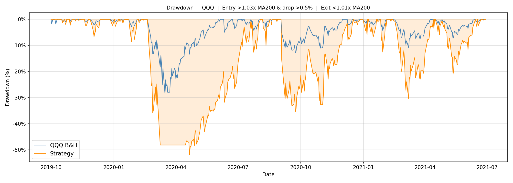

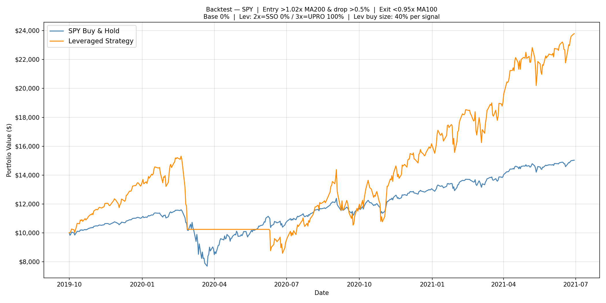
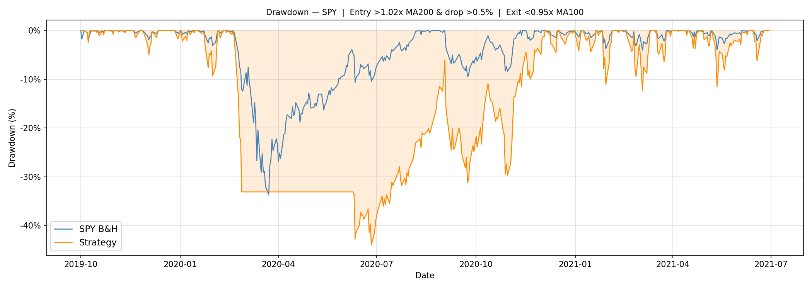

### 7.3 Rate-Hike Bear Market: 2021-06-01 → 2023-06-30

| Metric | QQQ Strategy | QQQ B&H | SPY Strategy (MA100) | SPY B&H |
|---|---|---|---|---|
| CAGR | **+27.91%** | +5.08% | **+6.86%** | +3.76% |
| Edge | +22.83pp | — | +3.10pp | — |
| Worst year | −22.6% (2022) | −32.5% (2022) | −31.78% (2022) | −18.18% (2022) |
| Max drawdown | −37.3% | — | −44.40% | — |
| Sharpe ratio | 0.85 | — | 0.30 | — |
| Final value | $16,666 (from $10K) | ~$10,965 | $11,476 (from $10K) | $10,796 |

QQQ's tight exit (1.01×MA200) fired relatively early in 2022 before the full decline, limiting strategy losses to −22.6% and finishing with a strong +27.91% CAGR. SPY's MA100 exit (0.95×MA100 — 5% below the 100-day MA) fired in early 2022 too, before the deepest leg of the bear, limiting SPY losses to −31.78% and finishing positive at +6.86% with a small +3.10pp edge over buy-and-hold. The 2022 rate-hike bear is one of the strongest validators of MA100 as SPY's exit MA — the faster exit fired before the steepest leg of the decline, where a slower MA would have ridden it down.

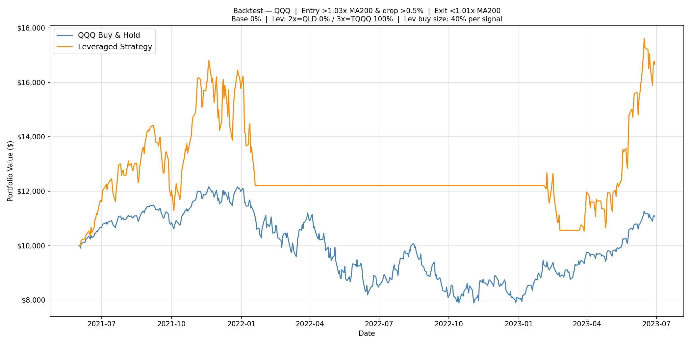
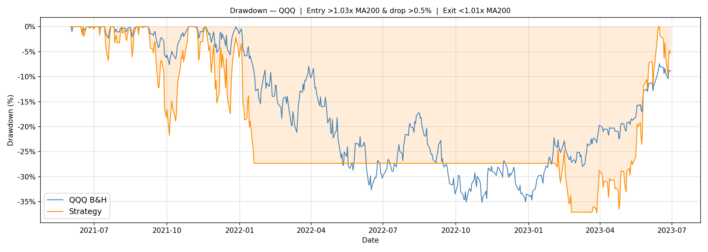

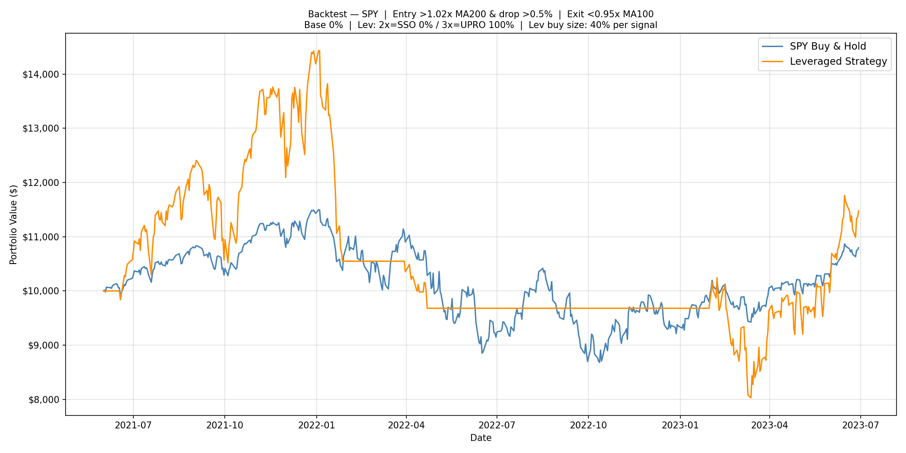
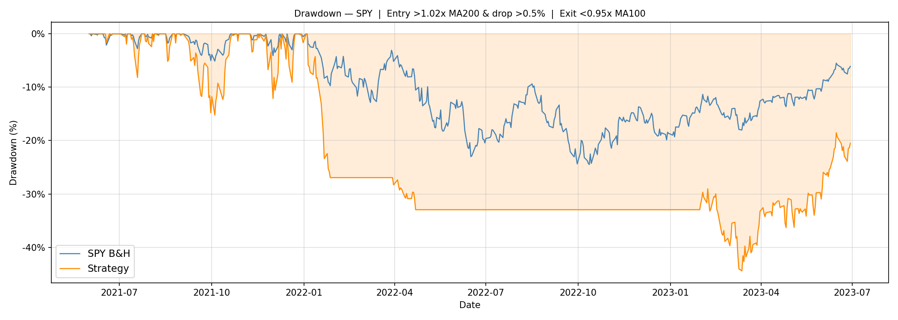

### 7.4 Dot-com Bubble & Recovery: 2000-01-03 → 2003-12-31

> This period predates the strategy's main study window (which starts 2003-01-01) and is included specifically to illustrate tail risk. QQQ launched March 1999, providing only ~200 trading days of MA200 history before the January 2000 start — the MA200 is approximately valid but less reliable than in later periods. All synthetic leveraged ETF returns (no real 2× or 3× ETF existed in 2000).

| Metric | Strategy | QQQ B&H |
|---|---|---|
| CAGR | −20.35% | −21.23% |
| Edge | +0.88pp | — |
| Worst year | **~−80% (2000)** | −38.4% (2000) |
| Final value | ~$4,027 (from $10K) | $3,860 |

The dot-com crash was the hardest test — and shows the strategy's true downside in a sustained multi-year bear market.

**What happened:** QQQ peaked in March 2000 then fell 83% over 31 months in a series of staircase declines interrupted by sharp bear-market rallies. The strategy armed on the first trading day of 2000 (near the peak) and bought three times in the first week as the bubble began deflating. Each brief rally above 1.03×MA200 re-armed the strategy and triggered new buys into what proved to be further decline. Four separate buy-and-exit cycles occurred between January and September 2000. By September, 80% of initial capital was gone. The strategy then correctly stayed in cash through all of 2001–2002 — prices never sustainably recrossed 1.03×MA200 — and caught the March 2003 recovery near trough prices.

**Why the edge nearly vanished:** The multiple re-entries during cascading false rallies are exactly the "staircase bear market" failure mode described in Section 8. Each individual exit was correct — the strategy never rode the full −83% crash. But the repeated buys into brief rallies still produced catastrophic compounding losses. The final edge over buy-and-hold is only +1.13pp, nearly zero.

**Cross-index comparison for context** (each index uses its own recommended optimum params):

| Index | Period | Strategy CAGR | B&H CAGR | Edge | Worst Year |
|---|---|---|---|---|---|
| QQQ (MA200) | 2000–2003 | −20.35% | −21.23% | +0.88pp | **~−80% (2000)** |
| SPY (MA100) | 2000–2003 | **+7.19%** | −5.21% | **+12.40pp** | −23.67% (2002) |
| IWM | 2001–2003* | +6.96% | +8.05% | −1.09pp | −36.86% (2002) |

*IWM started 2001-01-02 due to May 2000 ETF inception and insufficient warmup before then.

SPY's MA100 exit (0.95×MA100 — 5% below the 100-day MA) kept the strategy in cash for most of 2001–2002, avoiding the bulk of the bear market. SPY actually made money through the dot-com crash. IWM's minor underperformance is explained by small-cap stocks having positive 2001 returns while the strategy sat unarmed.

**The verdict:** The dot-com crash reveals the true catastrophic downside for QQQ specifically. An investor who deployed the QQQ strategy at peak valuations (January 2000) would have lost roughly 80% of their initial capital in the first year alone, with nearly all of that recovered by December 2003 — just barely ahead of buy-and-hold by +0.88pp CAGR. SPY's defensive exit (now MA100-based) proved far more durable through this regime, generating a +7.19% CAGR (+12.40pp edge) through the same crash. This reinforces that QQQ's tight exit signal is optimized for bull-market regimes — in a prolonged multi-year bear, SPY's structural conservatism is a meaningful advantage.

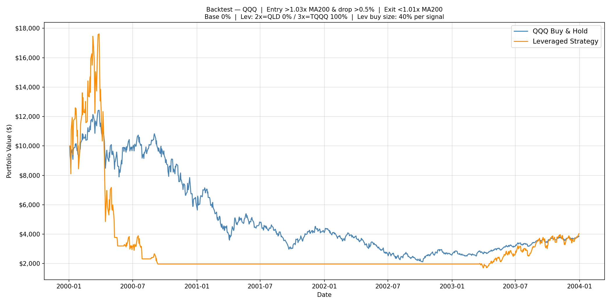
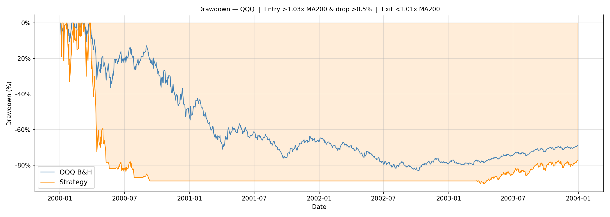

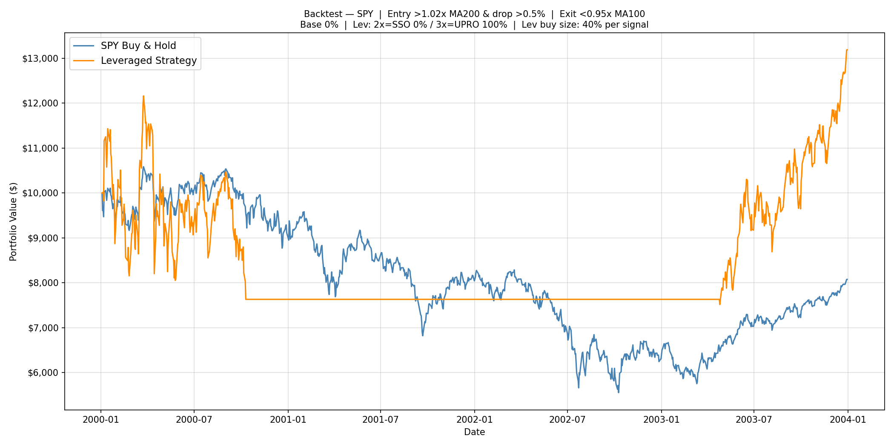
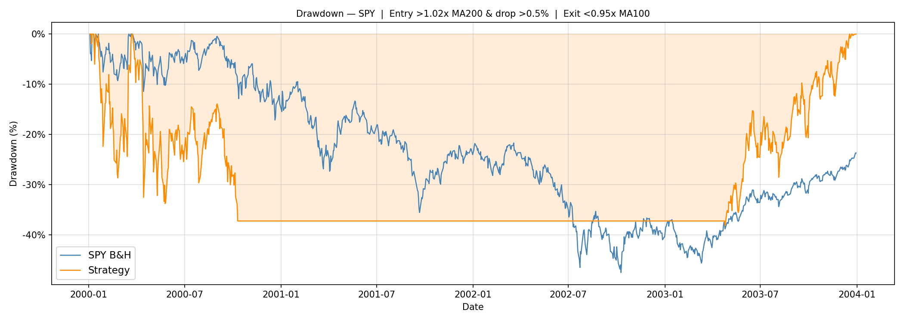

---

## 8. Discussion

### What Drives the Edge

The strategy earns alpha through two mechanisms:

1. **Asymmetric participation** — By staying in cash during confirmed downtrends (below MA200), the strategy avoids the worst compounding losses. A −50% loss requires a +100% gain to recover; avoiding even half of that loss is enormously valuable over long periods.

2. **Opportunistic re-entry** — After the MA200 exit fires, cash is preserved for re-entry at lower prices. When a new uptrend begins, the leveraged ETF is bought at a discount relative to where it was sold, accelerating the recovery beyond buy-and-hold.

### Why QQQ Outperforms SPY and IWM

QQQ's tech-heavy composition means more dramatic V-shaped recoveries after selloffs — the MA200 exit fires, then re-entry catches the explosive upleg. The 2003, 2009, and 2020 recoveries were each more violent for QQQ than SPY.

IWM's edge is thin because small-cap stocks have higher daily volatility. Higher volatility means higher daily variance in the leverage cost formula (`0.5 × (L²−L) × var₂₀`), which destroys more value in the 3× ETF per unit of return. The strategy earns returns, but the leveraged ETF structure eats a larger fraction of them via decay.

### When the Strategy Struggles

- **Staircase bear markets with false recoveries** (dot-com 2000–2002, 2008 GFC): A brief rally re-arms the strategy; if the bear resumes, the strategy buys again into further decline. Multiple losing cycles deplete cash. The GFC was the hardest test.
- **Slow grinding drawdowns** (2022): Price stays below MA200 for months. The strategy correctly stays out, but any false rally before the real recovery triggers a losing re-entry.
- **Maximum exposure at a market peak**: After a long bull run, the strategy holds maximum leveraged allocation. A crash at that moment causes maximum damage. Sequence-of-returns risk applies even to rules-based systems.
- **Prolonged sideways or low-drift markets** (QQQ 2004–2006): Price oscillates around MA200 without establishing a clear trend. The entry signal fires repeatedly — triggering buys into brief dips that recover slightly and stall, never generating momentum but never falling far enough to stay below the exit threshold. Meanwhile, daily volatility decay accumulates on each leveraged position held during the hold period. This is the regime most underappreciated by CAGR-focused backtests: unlike a staircase bear (where price eventually stays below MA200 and the strategy stops re-entering), sideways chop keeps the entry threshold in play indefinitely, churning through cash in repeated 10–15% loss cycles. QQQ's worst strategy year (−40.8% in 2005) occurred precisely in this regime — the index itself was roughly flat, but every leveraged buy accumulated decay before being stopped out. A multi-year episode of this would be far more damaging than the historical record reflects.

### Market Regime Classification

This strategy has a **conditional edge** — it is not an all-weather system. The edge is earned by correctly identifying trending regimes and deploying leverage selectively within them. In regimes it was not designed for, it underperforms or destroys capital. Understanding this distinction is more important than any single CAGR figure.

| Regime | Characteristics | Strategy Behavior | Historical Example |
|---|---|---|---|
| Strong trending bull | Sustained price above MA200, periodic 0.5–2% dips | **Excellent** | QQQ 2017 (+98%), 2021 (+79%) |
| Fast crash + V-recovery | Sharp decline, rapid re-cross of MA200 | **Strong** | COVID 2020 (QQQ +118% over 20 months) |
| Low-vol steady bull | Index drifts up without meaningful pullbacks | **Moderate** — B&H may lead | QQQ 2019: strategy +4.5% vs B&H +39% |
| Slow policy-driven bear | Gradual exit-MA break, failed re-entries | **Weak to neutral** | 2022: SPY strategy −31.8% (MA100 walk-forward) vs B&H −18.2% (underperformed by −13.6pp) |
| Prolonged sideways / chop | Price oscillates around MA200 with no trend | **Weak** — false entries + decay compounds | QQQ 2005: strategy −41% vs roughly flat index |
| Secular bear staircase | Multi-year decline interrupted by bear rallies | **Dangerous** — repeated losing re-entries | Dot-com 2000: −80% in year 1 |

**The LETF volatility drag amplifies regime mismatch.** In sideways or choppy markets, 3× ETFs lose value daily even when the underlying ends flat — this is beta slippage (described in Section 1). An investor holding the base index in a flat year loses nothing; an investor repeatedly buying into brief rallies that stall experiences both the whipsaw exits *and* the daily decay accumulated during each hold period. The longer the chop, the more these losses compound even without a sustained bear market.

**The historically absent danger: inflationary secular stagnation.** The 23-year sample contains no prolonged inflationary sideways regime comparable to the 1970s — an environment of high volatility, no secular trend, and persistent real-return headwinds. Such a regime would be structurally hostile: high daily variance drives high LETF decay costs, oscillating prices repeatedly trigger and abandon the entry signal, and the strategy cannot escape because the exit threshold is never cleanly breached. This is the tail risk the historical CAGR statistics do not price.

The honest forward expectation is that this strategy adds roughly **1–3pp above B&H in trending-bull-dominated environments**. In the two failure regimes above — sideways chop and secular bear staircase — it can underperform dramatically. Sizing accordingly and not over-anchoring to the full-history CAGR is the appropriate takeaway.

### Does the Edge Survive Into the Future? Overfitting vs. Regime Change

The walk-forward results raise a natural question: if the strategy underperformed out-of-sample for IWM and delivered only a narrow edge for QQQ/SPY, does it have a real future?

The reduced out-of-sample performance reflects **both overfitting and genuine regime change** — and understanding which matters more determines how much to trust forward projections.

**On overfitting:** Running 15,840 parameter combinations guarantees that some combos look exceptional on historical data by chance. The training-period optimizer selected parameters that best fit a 12-year window dominated by the 2008 GFC — a slow, staircase crash with clear trend breaks. Those parameters are not necessarily the ones that will best fit the next 12 years. The large gap between the full-history QQQ result (39.83% CAGR on 2015–2026) and the rigorous OOS result (22.57%) is largely overfitting: the full-period optimizer happened upon exit=1.01×MA200, which captured COVID's instant V-shape recovery with near-perfect timing — a pattern impossible to anticipate from 2003–2014 alone.

**On regime change:** The two periods are structurally different markets. 2003–2014 featured post-dot-com recovery, the 2008 GFC, and a decade of historically low rates — conditions that produced clean, multi-year trend cycles ideal for MA200-based exits. 2015–2026 brought QE-fueled sustained bulls, the fastest crash-and-recovery in history (COVID 2020), and a sharp policy-driven bear (2022) with no clean MA200 signal before damage was done. The strategy's exit logic was designed for the first regime and was less well-suited to the second.

**What this means for the structural edge:**
The fact that QQQ and SPY still beat B&H out-of-sample (+2.83pp and +2.27pp) with training-period parameters — parameters not tuned to post-2014 events — is genuinely encouraging. It suggests the core logic does generalize: the MA200 trend filter is a well-established concept, not a data artifact, and buying leveraged ETFs on confirmed-uptrend dips has real structural justification. The edge narrowed, but it did not disappear.

IWM's out-of-sample failure (−4.59pp) appears structural rather than coincidental. Small-cap leverage decay is higher due to greater daily volatility, the IWM trend signal is noisier, and the 2015–2016 small-cap sideways period triggered too many false entries. This makes the IWM strategy less reliable across market regimes.

**Realistic forward expectations:**
- **QQQ and SPY:** A forward edge of roughly **1–3pp above B&H** is a realistic base case in trending market regimes. In prolonged sideways or choppy markets, the edge may temporarily disappear or invert.
- **IWM:** The out-of-sample evidence is too weak to rely on. The IWM strategy should be treated as speculative.
- **Tail risk remains real:** A dot-com-style multi-year bear with false rallies remains the strategy's worst-case scenario. No parameter set eliminates this risk.

The strategy is not broken. But investors should anchor expectations to the OOS numbers, not the full-history optimized numbers.

### Parameter Robustness Analysis

A key question the OOS test alone cannot answer is: *is the optimal parameter set a sharp spike or a broad plateau?* A spike means the strategy only works because one specific combo happened to fit historical data by chance — move one step in any direction and performance collapses. A plateau means a wide neighborhood of similar parameters all work, which is strong evidence that the underlying logic is real, not a data artifact.

The heatmaps below show **median CAGR across all passing combos** for each (row, col) parameter pair, marginalizing over all remaining free parameters. Blue box = chosen optimal. Bright green region = plateau. Isolated bright cell = spike.

**Each heatmap uses the optimum (highest-CAGR) full-history config for its index:** QQQ on the MA200 grid (since MA200 wins for QQQ); SPY on the **MA100 grid** (since MA100 wins for SPY — see [§4](#4-choosing-the-exit-ma-ma200-vs-ma100-vs-ma50)).

> Note: values are optimizer CAGR. Use relative comparisons across cells, not absolute magnitudes.

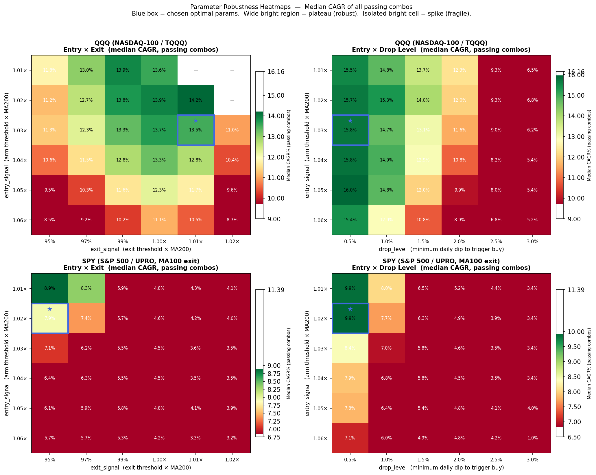

**What the heatmaps show:**

**QQQ — entry × exit (top-left panel): clear plateau.** The bright green region spans entry 1.02–1.06 combined with exit 1.00–1.02×MA200. The optimal (1.03, 1.01) is embedded in this broad neighborhood, not sitting on an isolated peak. Moving one or two grid steps away barely changes performance. This is the most encouraging finding: QQQ's alpha is not dependent on a precise parameter guess.

**QQQ — entry × drop level (top-right panel): 0.5% dip is structural.** The 0.5% drop column is clearly dominant regardless of entry threshold. Moving to 1.0%+ drop meaningfully degrades performance. This is more spike-like: the dip threshold matters and 0.5% is the right regime for QQQ's large-cap, trend-following behavior. This is still interpretable — QQQ produces frequent small dips in bull markets; waiting for a 1%+ drop misses most of them.

**SPY (MA100) — entry × exit (bottom-left panel): exit threshold is load-bearing.** Looking at the production grid alone, only the exit=0.95 column is consistently bright — adjacent grid values (0.97, 0.99) are noticeably darker. That reads as a spike, not a plateau. Honest reading: the SPY exit is more fragile than QQQ's.

To stress-test this, we re-ran the full-history SPY MA100 optimizer with a shifted grid: `entry ∈ [0.98, 0.99, 1.00, 1.01, 1.02, 1.03]` × `exit ∈ [0.91, 0.93, 0.94, 0.95, 0.97, 0.99]` (denser around 0.95, including sub-MA200 entries). The result reproduces the original optimum exactly — **(entry=1.02, exit=0.95) still wins by both CAGR and worst calendar year.** Two refinements emerge: (a) exit values 0.93 and 0.94 are within ~0.4pp CAGR of 0.95 (so there's a small micro-plateau on CAGR — the original "knife-edge" framing was partly a discretization artifact); but (b) those wider exits trade away ~7pp on the worst-year metric (−39.7% vs −32.95%), so 0.95 is still the right choice on the *combined* CAGR-plus-worst-year ranking. No sub-MA200 entry made the top 20 — for SPY too, the "confirmed uptrend" premise (entry > 1.0) is structurally necessary.

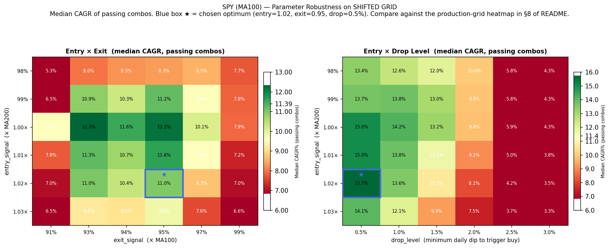

**Reading the shifted-grid heatmap:** the brightest cell sits at `(entry=1.02, exit=0.95)` — the original optimum, marked with the blue ★. Two things to notice:

- **Exit axis (left panel, horizontal):** the bright region extends across exits 0.91–0.95 at the optimum entry row, then drops sharply past 0.97. That's a real but *narrow* plateau (~5pp wide on the exit axis), consistent with the prose above. Outside the entry=1.01–1.02 band, even exit=0.95 is mediocre — confirming exit is load-bearing only when the entry is right.
- **Entry axis (left panel, vertical):** the entry=0.98 and 0.99 rows are uniformly red. Arming below MA200 produces poor results across *every* exit value tested. Strong evidence that confirmed-uptrend entries are structurally necessary, not just optimal-by-coincidence.
- **Drop axis (right panel):** confirms the previous-panel finding — the 0.5%–1.0% drop band is a broad bright region at the optimum entry, with 0.5% the consistent winner.

Files: `leveraged_spy_exploration/optimizer_shifted_grid.py` and `leveraged_spy_exploration/ma100_shifted/`. To regenerate the heatmap: `python leveraged_spy_exploration/heatmap_shifted.py --no-show`.

**SPY (MA100) — entry × drop level (bottom-right panel): broader plateau.** Multiple drop levels (0.5%–1.5%) produce similar performance for SPY. This confirms that SPY's entry timing is less critical than QQQ's — SPY's larger, slower trends make dip threshold less important.

**Overall verdict:** The QQQ strategy sits on a broad plateau (entry × exit), which is strong robustness. The SPY strategy is robust on entry and drop but **narrowly load-bearing on exit** — the working band on the exit axis is roughly 0.93–0.95×MA100, with 0.95 the best pick. That narrower-than-QQQ band is a real fragility, but the exit threshold's economic interpretation (price has clearly broken below the 100-day average) is interpretable, not arbitrary. Both alphas are real, not data artifacts; SPY's just has less safety margin around its load-bearing parameter than QQQ's.

### Production grid vs shifted grid — the operating decision

The shifted-grid sweep raises a natural follow-up: should the annual walk-forward re-optimization use the **production grid** (entry 1.01–1.06, exit 0.95–1.02) or the **shifted grid** (entry 0.98–1.03, exit 0.91–0.99)?

**Decision: keep the production grid for walk-forward.** The shifted grid is kept as an annual diagnostic — run it once a year alongside the production walk-forward to detect any optimum drift. Switch only if a meaningful migration occurs.

Reasoning:

1. **Same optimum.** Full-history sweeps on both grids return `(entry=1.02, exit=0.95)` as #1. No current benefit to switching.
2. **Production grid enforces "confirmed uptrend" structurally.** Every entry value is > 1.0, which is the strategy's premise. The shifted grid permits sub-MA200 entries (0.98–1.00) that would silently relax that premise if any year's optimizer picked them. None did in the full-history sweep — but allowing them in production means we'd have to manually veto if a future year picked one. Cleaner to keep them out of the grid.
3. **Shifted grid's wider exits carry tail risk.** Exit values 0.91 and 0.93 produce nearly the same CAGR as 0.95 but with ~7pp worse worst calendar year. If a future window's training data temporarily made one of those top-rank, walk-forward would pick it — degrading the worst-year metric the paper has been optimizing for from day one.
4. **All existing walk-forward results use the production grid.** Switching invalidates the 11+ years of headline numbers in §6, §6.1, §6.2, §7 — substantial churn for no improvement.
5. **Diagnostic discipline:** run `python leveraged_spy_exploration/optimizer_shifted_grid.py --no-show` once a year. If the optimum migrates to a new entry/exit pair, *that's* the signal to revisit the grid choice. Until then, no action.

(This is analogous to the §5 decision to lock in 3× leverage rather than re-test it every year — once a sweep shows the optimum is structurally stable, there's no upside to repeatedly second-guessing it. Only a clear migration warrants revisiting.)

To reproduce:
```bash
python param_heatmap.py --no-show                                    # production heatmap
python leveraged_spy_exploration/heatmap_shifted.py --no-show        # shifted-grid heatmap
python leveraged_spy_exploration/optimizer_shifted_grid.py --no-show # full shifted sweep (~5 min)
```

### Grid-edge diagnosis: drop_level and buy_pct

The shifted-grid analysis above checked entry/exit for edge-of-grid artifacts but never checked **drop_level** and **buy_pct**. Both turned out to be binding — the optimizer's winners were pinned at `drop_level = 0.005` (grid minimum) and `buy_pct = 0.40` (grid maximum) in nearly every training window. The full investigation — backtester probes past the edges, the extended v2 grid, and the walk-forward out-of-sample validation that decides adoption — is in [§6.3](#63-grid-v2-was-the-dip-wait-a-grid-artifact).

---

### Limitations and Caveats

- **Backtested on a mostly bullish 23-year window.** The US equity market 2003–2026 included three major crashes but also three major multi-year bull markets. A prolonged bear or sideways decade would test the strategy more severely.
- **Leveraged ETF costs.** Management expense ratios (TQQQ: 0.95%/yr, UPRO: 0.91%/yr, TNA: 1.09%/yr) are applied to the synthetic pre-inception period; real ETF prices already embed them. Borrowing costs and bid/ask spreads are not modelled.
- **Transaction cost sensitivity.** The backtester supports a `--cost-per-trade` flag. The table below shows the CAGR impact of adding per-trade round-trip costs to the full-history (2003–2026) run:

  | Cost per trade | QQQ CAGR | Delta | SPY CAGR | Delta |
  |---|---|---|---|---|
  | 0.00% (base) | 24.48% | — | 21.98% | — |
  | 0.05% | 24.35% | −0.13pp | 21.94% | −0.04pp |
  | 0.10% | 24.23% | −0.25pp | 21.90% | −0.08pp |
  | 0.20% | 23.97% | −0.51pp | 21.81% | −0.17pp |

  The strategy is relatively insensitive to transaction costs because it trades infrequently (~2–4 trades/yr). Even at 0.20% per trade, the CAGR loss is less than 0.6pp for QQQ and less than 0.2pp for SPY.

- **Idle cash earns 0% by default.** All headline numbers assume uninvested cash earns nothing. This *understates* realistic returns: parking cash in T-bills (SGOV/BIL) adds +0.4 to +0.8pp CAGR with slightly better drawdowns (see the Part 1 recommendation). Reproduce with `--cash-yield`.
- **Execution at closing prices.** The backtest assumes all trades execute at the day's closing price. In practice, the signal fires during market hours and execution may occur at a different price.
- **No taxes or commissions.** Real returns would be reduced by short-term capital gains taxes on frequent position changes (especially in high-trade regimes with low drop_level).

---

# Part 4 — Risk & Reference

The downside the strategy actually carries, the design choices that shape that risk (and their cost), and the technical reference for running the code.

## 9. Risk Considerations & Design Honesty

### Real risks of the strategy as designed

- **Leveraged ETF daily reset.** 3× ETFs reset leverage daily. In volatile sideways markets, decay compounds against you even with flat overall returns. The strategy mitigates this by exiting during downtrends, but decay occurs in all held positions.
- **3× ETF worst-year drawdown of −30% to −40%, max drawdown −50% to −69%.** The recommended live configurations have produced calendar-year losses around −30% to −40% — **QQQ −40.8% in 2005** (the recommended MA200 config), **SPY −31.78% in 2022** (the recommended MA100 config — see [§7.3](#73-rate-hike-bear-market-2021-06-01--2023-06-30)) — and intra-period max drawdowns of **−69.1% for QQQ MA200** (full-history peak-to-trough during the 2008 GFC synthetic period) and **−52.61% for SPY MA100**. Investors must be able to hold through these without abandoning the strategy mid-crisis.
- **This is not a complete financial plan.** The research shows a statistical edge in backtested conditions. It does not constitute financial advice. Any real deployment should be sized appropriately within a broader portfolio.

### After-tax reality (Ontario taxable account)

The backtester models Ontario personal income tax with `--tax-ontario --salary <amount>`: capital gains at 50% inclusion stacked on top of salary (federal + Ontario 2025 brackets incl. surtax, held constant), average-cost (ACB) basis, loss carryforward, interest from `--cash-yield` 100% taxable, tax paid from the portfolio each January. Canada has no short/long-term distinction, so the strategy's short holding periods are not penalized the way they would be under US rules — but annual realization still kills most of the deferral benefit that buy-and-hold enjoys.

Measured at a $100,000 salary (2003–2026, June 2026 data):

| Run | Pre-tax CAGR | After-tax CAGR | Tax drag | Total tax paid | Final value |
|---|---|---|---|---|---|
| QQQ strategy | 23.95% | **20.60%** | −3.35pp | $202,973 | $1.53M → $806K |
| QQQ strategy + T-bill cash | 24.60% | **21.00%** | −3.60pp | $228,732 | $1.73M → $872K |
| QQQ buy & hold (taxed at final sale) | 16.00% | 14.76% | −1.24pp | ~$72K | $324K → $252K |
| SPY strategy (MA100) | 21.79% | **18.60%** | −3.19pp | $140,832 | $1.01M → $545K |
| SPY buy & hold (taxed at final sale) | 11.26% | 10.27% | −0.99pp | ~$23K | $122K → $99K |

**Conclusions:**

1. **Taxes are the single largest cost ever measured on this strategy** — ~3.3pp CAGR, versus ~0.25pp for transaction costs. Roughly half of terminal wealth in a taxable account.
2. **The edge survives.** After-tax strategy still beats after-tax buy-and-hold by +5.8pp (QQQ) and +8.3pp (SPY). The strategy realizes gains every cycle while B&H defers 23 years, yet the gross edge is large enough to absorb the difference.
3. **Use registered accounts first.** In a TFSA every figure in this repo is tax-free; in an RRSP tax is deferred to withdrawal. Priority order for this strategy: TFSA → RRSP → taxable. If running taxable, the `--tax-ontario` numbers above — not the headline tables — are your expectation.
4. Caveats: brackets held at 2025 levels (no inflation indexing), assumes capital-gains treatment (CRA could deem very frequent trading business income — at 2–4 round trips/yr this is normally safe), ignores CPP/EI/OHIP and other credits, end-of-backtest unrealized gains stay deferred.

---

### Drawdown filter design choice (calendar year, not max DD)

The optimizer filter eliminates combos whose worst **calendar year** falls below −40%. It does *not* filter on max peak-to-trough drawdown. This is a deliberate design choice with the following justification:

**1. The cadence matches the operating mode.** The strategy is re-optimized at year boundaries (annual re-opt is the recommended mode — [§6](#6-walk-forward-validation)). Calendar-year boundaries are therefore the natural review and rebalance points. A combo whose YTD ends at −38% on Dec 31 is the metric that actually triggers behavioral change at the annual review; a mid-year max DD that recovered by Dec 31 does not change the operating decision for the following year.

**2. A max-DD filter would destroy the strategy.** Empirical test against the optimum-config grids (QQQ MA200, SPY MA100 — these are the recommended configs):

| Filter equivalent to | Worst cal-yr filter | QQQ best CAGR (MA200) | SPY best CAGR (MA100) |
|---|---|---|---|
| (none) | — | 24.45% | 22.37% |
| **Current filter (~−65% max DD)** | **−40%** | **24.45%** | **22.37%** |
| ~−55% max DD | −35% | ~24.1% | ~22.4% |
| ~−45% max DD | −30% | ~23.8% | ~21.0% |
| **Intuitive (~−40% max DD)** | **−25%** | **~22.7%** | **~17.9%** |
| ~−30% max DD | −20% | ~19.6% | ~15.0% |

> Rows at −35% and below are approximate (scaled from pre-fix relative costs); run the optimizer with `--dd-limit` to get exact values.

Tightening to ~−40% max DD costs **~−1.8pp CAGR for QQQ and ~−4.3pp CAGR for SPY**. Over 12 years, that's roughly 20% less terminal wealth for QQQ and 35% less for SPY. A 30% max-DD filter eliminates essentially all combos for QQQ (best CAGR drops to 1.6% — worse than cash). This is a hard constraint of 3× ETFs, not a tuning problem.

**3. The filter is mostly cosmetic anyway.** The current −40% calendar-year filter passes 99.2% of QQQ combos and 99.8% of SPY combos. It catches only obvious blow-ups; the real ranking is done by CAGR.

**4. The risk is documented separately.** Investors must look at the *max drawdown* numbers in each headline table (Section 3) and the crisis stress tests (Section 7) to understand the true peak-to-trough exposure. The filter does not protect against that — it informs combo selection, not investor expectations.

A **tie-break rule** is documented in [§6.1](#61-qqq-tie-break-rule) and [§6.2](#62-spy-tie-break-analysis). Analysis showed it provides no meaningful benefit for either index — QQQ: costs ~1pp CAGR with negligible max DD improvement; SPY: makes every metric worse. Not recommended.

---

## 10. Technical Reference

### Python Script Reference

All scripts are runnable with `python <script>.py [args]`. Most accept `--no-show` to skip interactive plot windows when running headless (cron, CI, remote SSH).

**Tier 1 — Production / live operating tools** (the only two scripts a live user needs)

| Script | Purpose | Key args | Outputs |
|---|---|---|---|
| [`walkforward.py`](walkforward.py) | Annual walk-forward re-optimizer. Phase 1 builds the per-year param schedule; Phase 2 runs the continuous backtest with annual param swap; also runs a fixed-model baseline. | `--preset {QQQ,SPY,IWM}` · `--exit-ma {100,200}` · `--start-year` · `--end-year` · `--only-year YYYY` (append one year, skip Phase 2) · `--no-rebuild` (Phase 2 only) · `--grid {v1,v2}` (optimizer grid version, see [§6.3](#63-grid-v2-was-the-dip-wait-a-grid-artifact)) · `--workers N` (parallel grid search, default = cores−2) · `--cash-yield` (T-bill interest on idle cash) · `--no-show` | `results/walkforward/{preset}_param_schedule[*].json` · `_yearly.csv` · `_commands.txt` · `_comparison.png` |
| [`backtester.py`](backtester.py) | Run a single config on a single date range. Used to verify walk-forward picks, spot-check crisis periods, and generate per-config plots referenced in §3, §4, §6, §7. | `--preset` · `--start` · `--end` · `--entry-signal` · `--drop-level` · `--exit-signal` · `--buy-pct` · `--alloc-base / --alloc-x2 / --alloc-x3` · `--exit-ma {50,100,200}` · `--cost-per-trade` · `--cash-yield` (T-bill interest on idle cash) · `--no-show` | `results/backtester/{PRESET}/{...}.png` · `_summary.txt` · `_yearly.csv` |

**Tier 2 — Robustness diagnostics**

| Script | Purpose | Key args | Outputs |
|---|---|---|---|
| [`param_heatmap.py`](param_heatmap.py) | 2×2 heatmap of median CAGR across passing combos for QQQ (MA200) and SPY (MA100), entry × exit and entry × drop. The §8 production-grid robustness check. | `--no-show` | `results/walkforward/param_robustness_heatmap.png` |
| [`leveraged_spy_exploration/optimizer_shifted_grid.py`](leveraged_spy_exploration/optimizer_shifted_grid.py) | Re-runs the full SPY MA100 grid with **shifted axes** (entry 0.98–1.03, exit 0.91–0.99) to confirm the production optimum isn't an edge-of-grid artifact. Run periodically as a drift-detection diagnostic. | `--no-show` | `leveraged_spy_exploration/ma100_shifted/ma100_shifted_results.csv` · `_equity.png` · `_scatter.png` |
| [`leveraged_spy_exploration/heatmap_shifted.py`](leveraged_spy_exploration/heatmap_shifted.py) | Heatmap rendered from the shifted-grid CSV; same 2-panel layout as `param_heatmap.py` for direct visual comparison. | `--no-show` | `leveraged_spy_exploration/ma100_shifted/heatmap_shifted.png` |

**Tier 3 — Per-index exploration scripts** (used to build §3–§5 results; kept for reproducibility, not needed for live operation)

Each `leveraged_{qqq,spy,iwm}_exploration/` folder contains the same four scripts:

| Script | Purpose | Outputs |
|---|---|---|
| `optimizer.py` | Full-history (2003–2026) grid search with **MA200 exit**. Produces the §3 "Optimum Per-Index Config" tables and the §4 MA200 leaderboard rows. | `ma200/optimizer_results.csv` · `optimizer_equity.png` · `optimizer_scatter.png` |
| `optimizer_train.py` | Same optimizer restricted to **2003–2014** training window only. Used to produce the §6 Strict OOS training params. | `ma200_train/optimizer_results.csv` |
| `optimizer_ma100_exit.py` | Full-history grid search with **MA100 exit**. Produces the §4 MA100 leaderboard rows and (for SPY) the production config. | `ma100/ma100_exit_results.csv` · plots |
| `optimizer_ma50_exit.py` | Full-history grid search with **MA50 exit**. Used only to confirm MA50 hurts in §4. | `ma50/ma50_exit_results.csv` · plots |

> **Bottom-line dependency**: If a live user wants to update their schedule annually, they only need `walkforward.py --preset QQQ --only-year <year>` and the SPY equivalent. Everything in Tiers 2 and 3 is research support — kept in the repo so a reader can independently reproduce the paper's findings, but **not part of the operating loop**.

### Leveraged ETF Mapping

| Index | Base ETF | 2× ETF | Real 2× Inception | 3× ETF | Real 3× Inception |
|---|---|---|---|---|---|
| NASDAQ-100 | QQQ | QLD | Jun 2006 | TQQQ | Feb 2010 |
| S&P 500 | SPY | SSO | Jun 2006 | UPRO | Jun 2009 |
| Russell 2000 | IWM | UWM | Jan 2007 | TNA | Nov 2008 |

Before each leveraged ETF's inception, returns are synthesized from base ETF daily returns:
```
lev_daily_ret = L × r  −  0.5 × (L² − L) × rolling_var₂₀  −  annual_MER / 252
```
The MER term is applied **only during the synthetic period** (before real ETF inception). Real prices already embed MER — applying it again would double-count. The synthetic and real series are stitched at inception, scaled to match prices.

### Repository Structure

```
backtester.py                             # CLI backtester (--exit-ma 50/100/200, --no-show)
walkforward.py                            # expanding-window walk-forward (annual re-opt, 2015–2026)
param_heatmap.py                          # parameter robustness heatmaps (entry × exit, entry × drop)
results/backtester/                       # auto-saved results (one folder per preset)
  QQQ/  SPY/  IWM/
    {PRESET}_{start}-{end}_entry{e}_exit{x}_drop{d}_buy{b}_b{base%}_x2{x2%}_ma{ma}.png
    {PRESET}_...._summary.txt
    {PRESET}_...._yearly.csv
results/walkforward/                              # auto-saved walk-forward outputs
  QQQ_walkforward_2015-2026_comparison.png        # plain top-CAGR (default)
  QQQ_walkforward_2015-2026_yearly.csv
  QQQ_walkforward_2015-2026_tiebreak_comparison.png   # tie-break analysis (§6.1)
  QQQ_walkforward_2015-2026_tiebreak_yearly.csv
  SPY_walkforward_2015-2026_ma100_comparison.png  # MA100 exit (SPY)
  SPY_walkforward_2015-2026_ma100_yearly.csv
  QQQ_param_schedule.json                 # plain top-CAGR per-year params (default)
  QQQ_param_schedule_tiebreak.json        # tie-break analysis params (§6.1)
  SPY_param_schedule_ma100.json           # MA100 schedule
  param_robustness_heatmap.png
leveraged_qqq_exploration/
  optimizer.py                            # MA200 exit optimizer for QQQ (full history)
  optimizer_train.py                      # same optimizer restricted to 2003–2014 only
  optimizer_ma100_exit.py                 # MA100 exit variant
  optimizer_ma50_exit.py                  # MA50 exit variant
  ma200/  optimizer_results.csv          # 15,840-row grid results (full history)
  ma200_train/  optimizer_results.csv    # 15,840-row grid results (2003–2014 only)
  ma100/  ma100_exit_results.csv
  ma50/   ma50_exit_results.csv
leveraged_spy_exploration/                # SPY uses MA100 exit (see §4)
  optimizer_ma100_exit.py                 # MA100 exit optimizer (full history)
  optimizer_ma50_exit.py                  # MA50 exit variant (exploration only)
  ma100/  ma100_exit_results.csv          # note: spy_ prefix on result CSVs where applicable
  ma50/   ma50_exit_results.csv
leveraged_iwm_exploration/                # same structure as QQQ (no prefix)
```

### Code Flow

#### Backtester


```mermaid
flowchart TD
    A([python backtester.py --preset QQQ ...]) --> B[Parse CLI args\npreset · entry-signal · drop-level\nexit-signal · exit-ma · buy-pct\nalloc-base · alloc-x2 · alloc-x3\ncost-per-trade]
    B --> C[Download via yfinance\nBase ETF: start − 300 days for MA warm-up\n2× and 3× from real inception]
    C --> D[Build synthetic NAV for pre-inception\nlev_ret = L×r − 0.5×L²−L×var20 − MER/252\nMER applied ONLY before real ETF launch date\nStitch synthetic + real at inception · scale to match]
    D --> E[Normalize all series to NAV 1.0\nAdd MA50 / MA100 / MA200]
    E --> F[Daily backtest loop]
    F --> G{Price below\nexit_MA × exit_signal\nAND holding lev?}
    G -- Yes --> H[EXIT\nSell all 2× and 3× → cash\nDeduct cost_per_trade on proceeds\nTrim base if over target\nDis-arm]
    G -- No --> I{Price above\nMA200 × entry_signal?}
    I -- Yes --> J[ARM strategy]
    J --> K{Armed AND\ndrop ≥ drop_level?}
    K -- Yes --> L{First buy\nin this cycle?}
    L -- Yes --> M[Buy base ETF\nup to alloc_base × portfolio]
    M --> N[Buy leveraged\nbuy_pct × portfolio\nsplit alloc_x2 / alloc_x3\nDeduct cost_per_trade on each leg]
    L -- No --> N
    K -- No --> O[Hold]
    I -- No --> O
    H & N & O --> P[Record portfolio value]
    P --> Q{More days?}
    Q -- Yes --> F
    Q -- No --> R[Compute CAGR · yearly returns · vs B&H\nMax peak-to-trough drawdown\nAnnualised Sharpe ratio vs ^IRX T-bill]
    R --> S([Auto-save PNG + summary TXT + yearly CSV\nto results/backtester/&#123;PRESET&#125;/])
```

#### Optimizer (standalone, full-history grid search)

> This is the legacy per-preset optimizer (`leveraged_{preset}_exploration/optimizer.py`). It produces the in-sample, hindsight-optimized full-history results reported in [§3](#3-full-history-grid-search-20032026). For the live operating tool (walk-forward with annual re-opt), see the next flowchart.

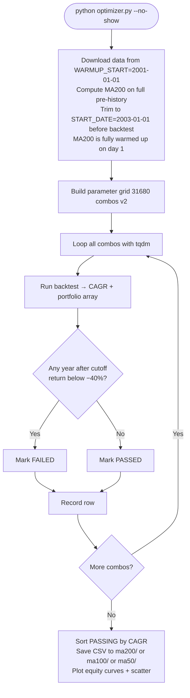
```mermaid
flowchart TD
    A([python optimizer.py --no-show]) --> B[Download data from WARMUP_START=2001-01-01\nCompute MA200 on full pre-history\nTrim to START_DATE=2003-01-01 before backtest\nMA200 is fully warmed up on day 1]
    B --> C[Build parameter grid 31680 combos v2]
    C --> D[Loop all combos with tqdm]
    D --> E[Run backtest → CAGR + portfolio array]
    E --> F{Any year after cutoff\nreturn below −40%?}
    F -- Yes --> G[Mark FAILED]
    F -- No --> H[Mark PASSED]
    G & H --> I[Record row]
    I --> J{More combos?}
    J -- Yes --> D
    J -- No --> K[Sort PASSING by CAGR\nSave CSV to ma200/ or ma100/ or ma50/\nPlot equity curves + scatter]
```

#### Walk-Forward (annual re-optimization, live operating tool)

> `walkforward.py`. Produces the walk-forward numbers reported in [§6](#6-walk-forward-validation) and [§6.1](#61-qqq-tie-break-rule). This is the recommended operating mode for live trading.

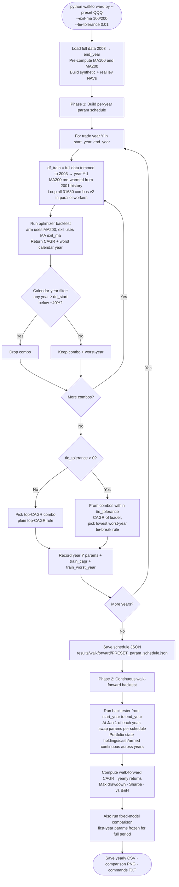
```mermaid
flowchart TD
    A([python walkforward.py --preset QQQ\n--exit-ma 100/200\n--tie-tolerance 0.01]) --> B[Load full data 2003 → end_year\nPre-compute MA100 and MA200\nBuild synthetic + real lev NAVs]
    B --> C[Phase 1: Build per-year param schedule]
    C --> D[For trade year Y in start_year..end_year]
    D --> E[df_train = full data trimmed to 2003 → year Y-1\nMA200 pre-warmed from 2001 history\nLoop all 31680 combos v2 in parallel workers]
    E --> F[Run optimizer backtest\narm uses MA200; exit uses MA exit_ma\nReturn CAGR + worst calendar year]
    F --> G{Calendar-year filter:\nany year ≥ dd_start\nbelow −40%?}
    G -- Yes --> H[Drop combo]
    G -- No --> I[Keep combo + worst-year]
    H & I --> J{More combos?}
    J -- Yes --> E
    J -- No --> K{tie_tolerance > 0?}
    K -- No --> L[Pick top-CAGR combo\nplain top-CAGR rule]
    K -- Yes --> M[From combos within tie_tolerance\nCAGR of leader,\npick lowest worst-year\ntie-break rule]
    L & M --> N[Record year Y params + train_cagr + train_worst_year]
    N --> O{More years?}
    O -- Yes --> D
    O -- No --> P[Save schedule JSON\nresults/walkforward/PRESET_param_schedule.json]
    P --> Q[Phase 2: Continuous walk-forward backtest]
    Q --> R[Run backtester from start_year to end_year\nAt Jan 1 of each year: swap params per schedule\nPortfolio state holdings/cash/armed continuous across years]
    R --> S[Compute walk-forward CAGR · yearly returns\nMax drawdown · Sharpe · vs B&H]
    S --> T[Also run fixed-model comparison\nfirst-year params frozen for full period]
    T --> U([Save yearly CSV · comparison PNG · commands TXT])
```

### Running the Backtester

```bash
# QQQ MA200 best (2003–present, 3× only)
python backtester.py --preset QQQ --start 2003-01-01 \
  --entry-signal 1.03 --drop-level 0.005 --exit-signal 1.01 \
  --buy-pct 0.4 --alloc-base 0.0 --alloc-x2 0.0 --alloc-x3 1.0

# SPY MA100 best (2003–present, 3× only)
python backtester.py --preset SPY --exit-ma 100 --start 2003-01-01 \
  --entry-signal 1.02 --drop-level 0.005 --exit-signal 0.95 \
  --buy-pct 0.4 --alloc-base 0.0 --alloc-x2 0.0 --alloc-x3 1.0

# IWM MA200 best
python backtester.py --preset IWM --start 2003-01-01 \
  --entry-signal 1.05 --drop-level 0.015 --exit-signal 0.95 \
  --buy-pct 0.3 --alloc-base 0.1 --alloc-x2 0.0 --alloc-x3 1.0

# Suppress pop-up windows (save files only)
python backtester.py --preset QQQ ... --no-show

# Transaction cost sensitivity (0.10% per trade round-trip)
python backtester.py --preset QQQ --start 2003-01-01 \
  --entry-signal 1.03 --drop-level 0.005 --exit-signal 1.01 \
  --buy-pct 0.4 --alloc-base 0.0 --alloc-x2 0.0 --alloc-x3 1.0 \
  --cost-per-trade 0.001 --no-show

# Custom date range (e.g. walk-forward test)
python backtester.py --preset QQQ --start 2015-01-01 \
  --entry-signal 1.03 --drop-level 0.005 --exit-signal 1.01 \
  --buy-pct 0.4 --alloc-base 0.0 --alloc-x2 0.0 --alloc-x3 1.0

# T-bill interest on idle cash (models SGOV/BIL — see Part 1 recommendation)
# Output files get a _cy suffix so 0%-cash results are preserved.
python backtester.py --preset QQQ ... --cash-yield --no-show
```

### Running the Walk-Forward

```bash
# Annual re-opt for the upcoming trade year (Jan workflow, ~1-2 min on a
# multi-core machine — Phase 1 is parallelized across CPU cores by default)
python walkforward.py --preset QQQ --grid v2 --only-year 2027
python walkforward.py --preset SPY --exit-ma 100 --grid v2 --only-year 2027

# Full rebuild of the 2015→current walk-forward simulation
# (~15 min per variant with default --workers; was ~30-60 min single-core)
python walkforward.py --preset QQQ --grid v2                  # MA200
python walkforward.py --preset SPY --exit-ma 100 --grid v2    # MA100

# Reproduce the original v1-grid study (v1 schedules/outputs are kept separate)
python walkforward.py --preset QQQ --grid v1

# Re-run Phase 2 only (uses cached schedule)
python walkforward.py --preset SPY --exit-ma 100 --grid v2 --no-rebuild --no-show

# Phase 2 with T-bill interest on idle cash (Phase 1 rankings unaffected)
python walkforward.py --preset QQQ --grid v2 --no-rebuild --no-show --cash-yield
```

### Running the Optimizers

```bash
# MA200 exit (full history) — QQQ and IWM use MA200; results saved to ma200/ subfolder
cd leveraged_qqq_exploration && python optimizer.py --no-show
cd leveraged_iwm_exploration && python optimizer.py --no-show

# MA100 exit — SPY uses MA100; results saved to ma100/ subfolder
cd leveraged_spy_exploration && python optimizer_ma100_exit.py --no-show

# Training-period only (2003–2014) — for rigorous walk-forward OOS on 2015–2026
cd leveraged_qqq_exploration && python optimizer_train.py --no-show
cd leveraged_iwm_exploration && python optimizer_train.py --no-show

# Optional: exit-MA exploration variants (used to derive §4's per-index choice)
cd leveraged_qqq_exploration && python optimizer_ma100_exit.py --no-show
cd leveraged_qqq_exploration && python optimizer_ma50_exit.py --no-show
cd leveraged_spy_exploration && python optimizer_ma50_exit.py --no-show
cd leveraged_iwm_exploration && python optimizer_ma100_exit.py --no-show
cd leveraged_iwm_exploration && python optimizer_ma50_exit.py --no-show
```

### Optimizer Filter Notes

Optimizer combos are marked pass/fail based on whether any calendar year from a cutoff onward showed a worse than −40% return (QQQ: 2010+; SPY/IWM: 2009+). The cutoff is set after most synthetic leveraged ETF history ends to avoid penalizing synthetic performance.

`worst_ann_ret` in the CSV spans all years including pre-cutoff, so passing combos can show a worst return worse than −40% if that year precedes the cutoff. This is why green (passing) dots can appear below the −40% line in the scatter plots.

### Adjusted vs Unadjusted Prices

All data uses dividend-adjusted prices (`auto_adjust=True` via yfinance). This prevents quarterly dividend drops from falsely triggering dip-buy signals. The adjusted MA200 will appear ~$1–3 lower than the unadjusted MA200 shown on sites like Google Finance or Barchart — this is expected and not a bug.

The `daily_signal` runner uses the same adjusted-price convention, ensuring the backtest and live signals are computed on the same basis.

### Dependencies

```bash
pip install yfinance pandas numpy matplotlib tqdm
```
