# Leveraged ETFs for the Long Run — A Trend-and-Dip Strategy, Honestly Walk-Forward Tested

A systematic study of whether a disciplined "buy dips only in confirmed uptrends, exit on trend break" rule applied to leveraged ETFs (TQQQ/UPRO, QLD/SSO) can beat buy-and-hold out-of-sample — across the NASDAQ-100, S&P 500, and Russell 2000, with a 72,000-combination grid search, several selection rules, and full expanding-window walk-forward validation.

> [!IMPORTANT]
> **The honest, out-of-sample headline (annual re-optimization, 2015–2026, no look-ahead):**
> - **QQQ works, decisively.** The **Aggressive** variant (top-CAGR rule): **33.7% CAGR vs 19.4% buy-and-hold** (+14.3pp), worst year −22.6%. The recommended **Balanced (maxDD-capped) variant does even better out-of-sample: 34.2%**, same worst year, with a gentler in-sample drawdown profile.
> - **SPY works modestly — on a faster exit.** Annually re-optimizing on CAGR still *underperforms* buy-and-hold out-of-sample (12.3% vs 13.7%). But pairing a **structural exposure cap** (buy ≤ 50%) with the faster **MA50** exit lifts it to **16.7% vs 13.7% B&H** (+3.0pp) — though still with −44% years. Tradeable but high-drawdown.
> - **IWM fails** out-of-sample (6.2% vs 9.6% B&H) and is not recommended.
>
> Full-history (in-sample, hindsight-optimized) upper bounds are higher — QQQ $10k→$3.99M — but **anchor on the walk-forward numbers.** They are what an investor re-optimizing each January would actually have earned.

---

## Contents

- [1. Recommendation (start here)](#1-recommendation-start-here)
- [2. Strategy](#2-strategy)
- [3. Methodology](#3-methodology)
- [4. Full-history grid search (in-sample upper bound)](#4-full-history-grid-search-in-sample-upper-bound)
- [5. Choosing the exit MA](#5-choosing-the-exit-ma)
- [6. The selection rules — the core contribution](#6-the-selection-rules--the-core-contribution)
- [7. Walk-forward validation (the honest test)](#7-walk-forward-validation-the-honest-test)
- [8. Drawdown and tail risk](#8-drawdown-and-tail-risk)
- [9. Risk and design honesty](#9-risk-and-design-honesty)
- [10. Technical reference](#10-technical-reference)

---

## 1. Recommendation (start here)

The strategy never holds a leveraged ETF unconditionally: it buys dips only while the base index is above its 200-day moving average, and sells all leverage the moment price breaks back below the exit MA. Within that fixed premise, a grid search tunes the parameters, and a **selection rule** decides which passing combo to trade.

> **Variant naming = Tier — Mechanism (leverage).** The *tier* is the risk appetite (Aggressive / Balanced / Conservative); the *mechanism* is the selection rule that produces it, so the name is self-documenting:
> - **Aggressive — Max-CAGR (3×):** highest CAGR, no risk cap.
> - **Balanced — DD-Capped (3×):** highest CAGR subject to in-sample drawdown ≤ 50% — **QQQ's** balanced rule.
> - **Balanced — Buy-Capped (3×):** highest CAGR subject to a structural buy-size cap ≤ 50% — **SPY's** balanced rule (its in-sample drawdown is too small for the DD-cap to bind, §6).
> - **Conservative — Calmar (2×):** best CAGR-per-unit-drawdown; converges to 2×.
>
> The two "Balanced" variants share a tier but use *different* mechanisms — DD-Capped for QQQ, Buy-Capped for SPY — because each index's data makes a different cap the one that actually works (§6).

### Trade QQQ. Pick a variant by how much drawdown you can stomach.

| | **Aggressive — Max-CAGR (3×)** | **Balanced — DD-Capped (3×)** (recommended) | **Conservative — Calmar (2×)** |
|---|---|---|---|
| Selection rule | top CAGR among survivors | top CAGR with real-period maxDD ≤ 50% | top Calmar = CAGR / \|maxDD\| |
| Converges to | **3×** (TQQQ), buy 100% | **3×**, buy 90% + 20% base cushion | **2×** (QLD) + 30% base cushion |
| QQQ walk-forward CAGR (2015–2026) | 33.7% | **34.2%** | 27.0% |
| QQQ walk-forward worst year | −22.6% | −22.6% | **−18.8%** |
| QQQ full-history worst year / max DD | −35.0% / −55.9% | −28.2% / −49.7% | **−22.3% / −34.2%** |
| **Trades per year** (full history) | **~1.8** (43 total / 23 yrs) | ~2.1 | ~2.0 |
| Who it's for | max growth, can stomach −30%+ years | **best risk-adjusted growth** | wants the gentlest ride |

> **You barely trade.** Every variant acts only **~2 times a year** — across the full 23-year history the Aggressive variant placed **43** orders total (22 buys, 21 exits ≈ one round-trip a year), Balanced 50, Conservative 47. The busiest single calendar year ever was **5 trades**. You are in cash or simply holding on ~99% of days; this is a low-turnover, tax-efficient rule you check daily but rarely act on — *not* active trading. (Computed by [`crisis_analysis.py`](crisis_analysis.py); cross-checks `backtester.py`'s trade log.)

> **"buy 90% + 20% base" doesn't sum to 110% — `buy_pct` is capped by cash.** Each buy deploys `min(buy_pct × total, cash_on_hand)` into leverage, *after* the one-time base cushion is funded. So Balanced puts 20% in base ($2k of $10k), leaving $8k, then `min(90%, 80% of cash)` = 80% into TQQQ → **20% base + 80% leverage = 100% invested, never more.** You're never over 100% deployed: the 3× lives *inside* the ETF (you don't borrow). `buy_pct` is just the per-signal sizing ceiling — high values mean "deploy all remaining cash on the first dip," low values (SPY's 20%) genuinely scale in over several dips.

All three beat QQQ buy-and-hold (19.4% walk-forward) decisively. **The Balanced variant is the default recommendation:** capping the in-sample drawdown at 50% drops the single most overfit combo (buy 100%, no cushion) in favour of a near-identical one (buy 90% + a 20% base cushion) that earns *more* out-of-sample (34.2% vs 33.7%) at the same worst year and a shallower in-sample drawdown. If you want genuinely shallow drawdowns, the Conservative 2× variant roughly halves the worst year for ~7pp less CAGR.

### SPY — a secondary, higher-risk satellite

SPY also beats buy-and-hold out-of-sample, but **only** on its Balanced (buy-cap, MA50) variant, and the edge is thinner with deeper drawdowns than QQQ:

| | **SPY · Balanced — Buy-Capped (3×)** (the one to trade) | SPY · Conservative — Calmar (2×) |
|---|---|---|
| Selection rule | top CAGR with buy ≤ 50%, **MA50** exit | top Calmar, MA50 exit |
| SPY walk-forward CAGR (2015–2026) | **16.7%** | 14.0% |
| vs SPY buy-and-hold (13.7%) | **+3.0pp** | +0.3pp |
| Worst year | −44.0% | **−22.9%** |
| **Trades per year** (full history) | ~2.5 (59 total / 23 yrs) | ~2 |

SPY's buy-cap fires more *buys* than QQQ (it scales in 20% at a time) but still exits only ~10 times in 23 years — about the same low turnover.

Trade the **Balanced (buy-cap)** variant if you want SPY exposure; the Conservative 2× only matches B&H, at a gentler ride. SPY's Aggressive (top-CAGR) and maxDD-capped rules *fail* out-of-sample (§5, §7) — the structural buy-cap on the faster MA50 exit is the single lever that works. **QQQ remains the stronger, lower-stress engine; treat SPY as a satellite, and IWM is not recommended at all.**

### Live parameters for calendar year 2026

Trained on 2003-01-02 → 2025-12-31. A row labeled *year N* was trained on data through Dec 31 of *N−1* and is traded during *N*.

| Index · variant | Entry | Drop | Exit | Buy% | Allocation |
|---|---|---|---|---|---|
| **QQQ · Aggressive — Max-CAGR (3×)** | 1.04×MA200 | 0.0% (any non-up day) | 1.01×MA200 | 100% | 100% TQQQ (3×) |
| **QQQ · Balanced — DD-Capped (3×)** (recommended) | 1.04×MA200 | 0.0% | 1.01×MA200 | 90% | 20% QQQ + TQQQ (3×) |
| **QQQ · Conservative — Calmar (2×)** | 1.04×MA200 | 0.0% | 1.01×MA200 | 80% | 30% QQQ + QLD (2×) |
| **SPY · Balanced — Buy-Capped (3×) — see §7** | 1.02×MA200 | 0.25% | 0.94×MA50 | 20% | 100% UPRO (3×) |

> **SPY caveat (read before trading SPY):** out-of-sample, annually re-optimizing SPY on CAGR *loses* to buy-and-hold (§7), and the maxDD cap that rescues QQQ does **not** help (it is slack on the pre-2022 windows). What works is the combination in the row above — a **structural buy-size cap (≤50%) on the faster MA50 exit** — which beats B&H by +3.0pp (16.7% vs 13.7%) but still rides **−44% years**. SPY is tradeable yet high-risk; **QQQ remains the strategy's real home, and IWM is not recommended.**

### Re-optimize each January

```bash
# QQQ — one grid pass produces all three variants
python walkforward.py --preset QQQ --exit-ma 200 --select cagr,maxdd50,calmar --only-year <year>
# SPY (structural buy-cap on the faster MA50 exit — its OOS-positive lever)
python walkforward.py --preset SPY --exit-ma 50 --select buycap50 --only-year <year>
```

Park idle cash in a T-bill ETF (SGOV/BIL): the strategy is fully in cash after every exit, and accruing the 13-week T-bill rate added **+0.6pp** to QQQ's walk-forward CAGR (Aggressive 33.7→34.3%, Balanced 34.2→34.8%) with a better worst year, at zero added risk (`--cash-yield`).

---

## 2. Strategy

**Why not just buy and hold a 3× ETF?** Two compounding problems: (1) *volatility decay* — daily leverage reset erodes value in choppy markets (QQQ −10% then +11.1% nets flat; TQQQ −30% then +33.3% nets −6.7%); (2) *bear markets are ruinous* — a buy-and-hold TQQQ investor lost >99% in 2000–2002 and ~95% in 2008. The strategy holds leverage **only during confirmed uptrends** and exits on trend break, cutting the catastrophic tail and avoiding chop.

**Buying.** (1) *Arm* when the base ETF closes above `entry × MA200`. (2) Once armed, a single-day drop of at least `drop_level` fires a buy. (3) First buy of a cycle optionally fills a base-stock position to `alloc_base`, then deploys `min(buy_pct × total, cash)` into leverage, split between 2× and 3× by `alloc_x2 / alloc_x3`. (4) Each further dip while armed adds leverage only.

> `drop_level = 0.0` means "buy on any day that doesn't close up." Negative values (tested, down to −1%) mean "buy even on a mildly up day." For QQQ the optimum is `0.0` — above its trend threshold, waiting for a dip is pure drag.

**Selling.** If price falls below `exit × exit_MA` while holding leverage: sell all 2×/3× to cash, trim the base position back to target once, and dis-arm until a fresh uptrend signal appears.

| Parameter | Meaning |
|---|---|
| `entry_signal` | arm above `MA200 × entry` |
| `drop_level` | min single-day drop to trigger a buy (negative = buy on mildly-up days) |
| `exit_signal` | exit below `exit_MA × exit` |
| `buy_pct` | fraction of portfolio deployed per buy, capped by cash |
| `alloc_base` | one-time base-ETF cushion (filled on first buy, trimmed on first exit) |
| `alloc_x2 / alloc_x3` | split of the leveraged tranche between 2× and 3× (sum to 1) |
| `exit_ma` | exit MA period: 50 / 100 / 200 (arming always uses MA200) |

### A worked example (illustrative)

To make the rules concrete, here is a toy run with **made-up parameters and prices** (not the production values — see §1 for those). Suppose the optimizer handed us:

> `entry 1.02 · drop 1.0% · exit 0.97 · buy 30% · base 10% · split 50/50 (2× / 3×)`

and QQQ's 200-day average is sitting flat at **$300**, so the two trigger levels are:
- **Arm threshold** = 1.02 × 300 = **$306** — price must close above this to count as a confirmed uptrend.
- **Exit threshold** = 0.97 × 300 = **$291** — closing below this while holding leverage forces a full exit.

Start with **$10,000 cash**, not armed:

| Day | QQQ close | What the rule sees | Action | Holdings after |
|---|---|---|---|---|
| 1 | **$304** | below $306 | not a confirmed uptrend → **stay in cash** | $10,000 cash |
| 2 | **$315** | closes above $306 | **ARM** — but it's an *up* day, and we only buy dips → no purchase | $10,000 cash |
| 3 | **$313** | −0.6% dip | dip smaller than the 1% `drop` trigger → **wait** | $10,000 cash |
| 4 | **$309.5** | −1.1% dip, still above $306 | **FIRST BUY** → (a) fill base to 10% = **$1,000 QQQ**; (b) deploy 30% of $10k = **$3,000** into leverage, split → **$1,500 QLD + $1,500 TQQQ** | ~$6,000 cash · $1,000 QQQ · $1,500 QLD · $1,500 TQQQ |
| 5 | **$314** | up day | no dip → **hold and let it ride** | (unchanged, values drift with price) |
| 6 | **$310** | −1.3% dip, still above $306 | **ADD** → another ~30%-of-portfolio tranche into 2×/3× (base is *not* topped up again — only the first buy does that) | ~$3,000 cash · more QLD/TQQQ |
| 7 | **$289** | below $291 exit | **EXIT** → sell *all* QLD + TQQQ to cash, trim QQQ base back to 10%, **dis-arm** | ~mostly cash, awaiting next arm |

The edge lives in steps 4–6: the strategy scales *into* leverage on dips **only while the uptrend is confirmed**, then step 7 dumps everything to safety the instant the trend breaks — which is exactly how it sidesteps the deep bear markets that wipe out a buy-and-hold 3× position. After step 7 it waits, in cash, until price reclaims $306 to begin a fresh cycle.

---

## 3. Methodology

**The whole study in five steps** (so the rest of this section has context):

1. **Search.** Grid-search all 72,000 parameter combos over full history (2003–2026), separately for each candidate exit MA (50 / 100 / 200) and each index — producing the raw return/risk landscape (§4).
2. **Pick the exit MA.** Choose one exit MA per index from that landscape, then *confirm it out-of-sample* (§5).
3. **Walk forward.** At the chosen MA, re-run the full grid search on an **expanding** window each year — train on 2003→2014, then 2003→2015, … 2003→2025 (12 windows). Save every window's complete 72k grid (§7).
4. **Select a combo.** A grid yields 72k passing combos — *which one do you actually trade?* Apply a **selection rule** to each window's grid (Highest-CAGR, maxDD-capped, buy-capped, or Calmar) to collapse 72k combos into one pick per year (§6).
5. **Judge honestly.** Score each rule's year-by-year schedule against buy-and-hold **out-of-sample** (§7), stress-test the optima for robustness with heatmaps (§4) and for tail risk with crisis backtests (§8). The walk-forward number — not the hindsight one — is the verdict.

The rest of this section is the machinery those steps rely on.

**Universe and window.** QQQ/QLD/TQQQ, SPY/SSO/UPRO, IWM/UWM/TNA, all from **2003-01-01** (a fair common floor: IWM launched 2000, the real 3× ETFs 2009–2010). The dot-com 2000–2002 period is excluded from optimization because the leveraged series there is 100% synthetic and extreme (§8 stress-tests it separately). Data through **2026-06-11**.

**Synthetic leveraged NAV.** Before a real ETF existed, its NAV is modeled as
`lev_ret = L·r − 0.5·(L²−L)·var₂₀ − MER/252`, where the MER drag applies **only** to the synthetic pre-inception period (real prices already embed fees). Synthetic series are stitched to real prices at inception. All prices are dividend-adjusted.

**Two tools, one engine.** `optimizer.py` *finds* (scans all combos on one window, keeps every result); `walkforward.py` *validates* (re-runs the search each year, keeps the chosen pick, backtests the schedule); `backtester.py` *measures* (one parameter set, full precision, authoritative for any cited number). All three share **`optimizer_core.py`** — one data pipeline, one backtest loop, one drawdown filter, one grid — so they cannot drift apart. (The annual re-optimizer in the `daily_signal` companion project runs the identical engine.)

**The grid — 72,000 combinations.**

| Parameter | Values |
|---|---|
| `entry_signal` | 1.01, 1.02, 1.03, 1.04, 1.05, 1.06 |
| `drop_level` | −1.0%, −0.5%, 0.0%, 0.25%, 0.5%, 1.0%, 1.5%, 2.0% |
| `exit_signal` | 0.93, 0.94, 0.95, 0.97, 0.99, 1.00, 1.01, 1.02 |
| `buy_pct` | 10% … 100% (10 steps) |
| `alloc_base` | 0%, 10%, 20%, 30% |
| `alloc_x2` | 0%, 25%, 50%, 75%, 100% |

Constraint: `exit < entry`. The grid spans the full position-sizing range (up to 100%) and probes below the dip threshold (negative drops) so the optimizer's choices are interior, not pinned at an artificial edge.

**Drawdown filter.** A combo passes only if no calendar year from the ETF-inception cutoff onward (QQQ 2010, SPY/IWM 2009) lost more than **40%**. The filter — and the **real-period max-drawdown** used by every risk-managed selection rule — is enforced only on real (post-inception) data, because synthetic pre-inception leveraged drawdowns are punishingly large (a synthetic 3× SPY fell ~85% in 2008) and would distort the choice toward 2× regardless of real behaviour.

**Every window's grid is saved.** Walk-forward Phase 1 writes each training window's complete grid (all 72,000 combos, every metric) to `results/walkforward/grids/{preset}/*.csv.gz` (~1 MB/window). The expensive search runs **once per window**; any selection rule can then be browsed and re-derived offline in seconds with `walkforward.py --from-grids`.

**Sharpe** uses the historical 13-week T-bill (^IRX) as a daily-varying risk-free rate, so it properly penalizes failing to beat cash in high-rate years.

---

## 4. Full-history grid search (in-sample upper bound)

These are hindsight-optimized over the entire 23-year sample — an upper bound, **not** a forward expectation (see §7 for the honest numbers). Per-index best by exit MA, Highest-CAGR rule:

| Index | MA200 | MA100 | MA50 | Chosen exit MA |
|---|---|---|---|---|
| QQQ | **29.1%** | 26.4% | 24.2% | MA200 |
| SPY | 22.8% | 23.0% | **25.2%** | MA50 |
| IWM | 13.8% | 12.6% | 10.7% | MA200 |

SPY's in-sample winner is **MA50**, and it stays the best choice out-of-sample *once exposure is capped by the buy-cap rule SPY actually trades* (§5). The lesson: the exit MA and the selection rule have to be chosen together — judged under the plain Highest-CAGR rule, MA50's −56% tail misleadingly favours the slower MA100.

**Authoritative backtests of the chosen full-history configs (2003 → 2026-06-11, $10k):**

| Config | CAGR | B&H | Worst year | Max DD | Final |
|---|---|---|---|---|---|
| QQQ Aggressive — Max-CAGR (3×, buy 100%) | **29.1%** | 16.2% | −35.0% | −55.9% | $3,987,903 |
| QQQ Balanced — DD-Capped (3×, buy 90% + 20% base) | 28.1% | 16.2% | −28.2% | −49.7% | $3,332,673 |
| QQQ Conservative — Calmar (2×, buy 80% + 30% base) | 20.8% | 16.2% | **−22.3%** | **−34.2%** | $830,467 |
| SPY Aggressive — Max-CAGR (3×, buy 100%, MA50) | 25.2% | 11.3% | −32.6% | −52.1% | $1,948,312 |
| SPY Balanced — Buy-Capped (3×, buy 20%, MA50) | 24.4% | 11.3% | −37.5% | −51.5% | $1,674,711 |
| SPY Conservative — Calmar (2×, buy 30%, MA50) | 16.0% | 11.3% | **−22.6%** | **−28.9%** | $324,196 |

With a T-bill cash sleeve, QQQ Aggressive rises to 29.7%; in an Ontario taxable account at a $100k salary it nets ~25.1% after-tax (TFSA/RRSP: untaxed).

### Reading the robustness heatmaps

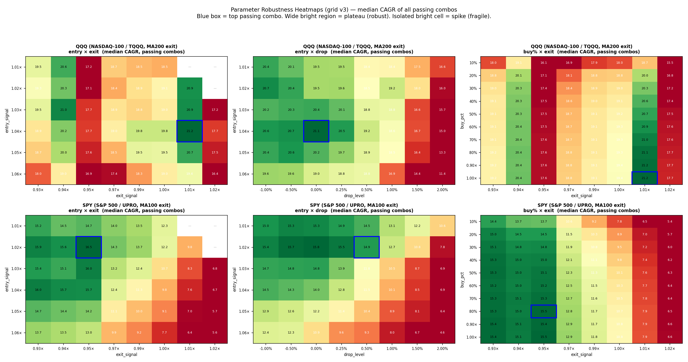

**Why bother?** A grid search hands you one "best" combo — but a best combo is worthless if it's a fragile **spike**: a lucky point that scores high while everything around it scores poorly. That is the fingerprint of overfitting, and it will not survive into live trading. We want the opposite — an optimum sitting in the middle of a broad region where *most* nearby combos are also good, so small parameter errors (or a slightly different future) don't sink you. These heatmaps test exactly that.

**How a cell is computed.** Each panel fixes two parameters as its axes (e.g. `entry × exit`) and lets the *other four* (`drop`, `buy%`, `alloc_base`, `alloc_x2`) vary freely. A single cell — say `entry = 1.04, exit = 1.01` — pools **every passing combo** with that entry and exit (up to 8 × 10 × 4 × 5 ≈ **1,600 combos**, one for each setting of the free params) and colors the cell by their **median** CAGR. The median, not the maximum, is deliberate: if each cell showed its *best* combo, the whole map would glow and prove nothing. The median answers the robustness question directly — *"if I land in this region but get the other knobs wrong, how do I typically do?"*

**How to read it.**
- **Wide bright zone** = a plateau: the strategy is forgiving here — you can be off on the other parameters and still do well. *Robust.*
- **Lone bright cell in a dark field** = a spike: only one fragile combination works. *Overfit — avoid.*
- **Blue box** = where the single highest-CAGR combo actually sits. The whole point of the figure is to confirm that box lands *inside* a bright plateau, not on a spike — i.e. that the optimum we trade is also a robust one. For QQQ it does: entry 1.03–1.05 × exit 0.99–1.01 is a broad bright plateau, and the optimum sits in it.

---

## 5. Choosing the exit MA

**Why this is its own decision.** The strategy uses moving averages in two *different* roles, and they are deliberately not the same MA:
- **Arming** — deciding we're in a confirmed uptrend and may start buying — always uses the slow **MA200**. Fixed for every index.
- **Exiting** — dumping *all* leverage the moment the trend breaks — uses a **tunable** exit MA. That is what this section picks.

The exit MA controls *how fast you bail*. A **fast** MA (50-day) sells at the first wobble: it shrinks drawdowns but whipsaws you out of healthy pullbacks and back in higher. A **slow** MA (200-day) rides through normal volatility but surrenders more before it concedes the trend is over. Neither is universally right — the ideal exit speed depends on how choppy each index's uptrends are — so we grid-search all three (MA50 / MA100 / MA200) for every index and let the evidence decide.

**How we decide — two stages, because the in-sample winner is a trap.** Picking the MA with the best full-history CAGR (§4) would just be overfitting to the past. So:
1. **In-sample screen** — full-history best CAGR per MA (§4 table). Narrows the field.
2. **Out-of-sample tiebreak** — the expanding-window walk-forward (§7): whichever MA's annually-re-optimized schedule actually wins 2015–2026. **Crucially, judge it under the *same selection rule you intend to trade*** — for SPY that distinction flips the answer (see below).

| Index | In-sample winner | Out-of-sample (expanding walk-forward CAGR) | B&H | Chosen |
|---|---|---|---|---|
| QQQ | MA200 (29.1%) | MA100 32.9% · **MA200 33.7%** | 19.4% | **MA200** |
| SPY | **MA50** (25.2%) | **MA50 13.3%** · MA100 12.3% · MA200 8.9% | 13.7% | **MA50** |
| IWM | MA200 (13.8%) | MA200 only (fails OOS) | 9.6% | MA200 |

*(The OOS column above is scored under the plain Highest-CAGR rule. SPY's choice additionally accounts for its production rule — see its bullet.)*

- **QQQ → MA200, cleanly.** It wins *both* stages, and with a shallower worst year than MA100 (−22.6% vs −31.9%). Faster exits just chop off profitable runs.
- **SPY → MA50 — and the path here is the real lesson.** In-sample, SPY's best MA is **MA50** (25.2%). Out-of-sample under the plain Highest-CAGR rule, MA50 still posts the highest CAGR of the three (13.3%) — but with a brutal **−56% drawdown in 2022**, which is why an earlier version of this study flinched and picked the gentler MA100. That was a mistake, because **the exit MA cannot be judged in isolation from the selection rule you will actually trade.** SPY trades the structural **buy-cap** (§6), which caps exposure and tames that tail. Re-run the MA bake-off under *that* rule and MA50 wins outright: **buycap50 → MA50 16.7% vs MA100 14.7%**, beating B&H (13.7%) by +3.0pp instead of +1.0pp, with the 2022 tail cut from −56% to −44%. So SPY's exit MA is **MA50**. (MA200 is dropped either way — it exits too late, dragging CAGR to 8.9%, well under B&H.)
- **IWM → MA200** by in-sample default; only MA200 was walk-forward-tested because IWM fails out-of-sample regardless of MA.

---

## 6. The selection rules — the core contribution

The grid search finds tens of thousands of passing combos per window. *Which one do you trade?* Earlier versions of this study always took **highest CAGR** — and that is exactly what overfits, because the highest-CAGR survivor is always the most aggressive one (buy 100%, 3×), sitting right against the −40% filter edge. The study now derives several rules **from one grid pass** and validates each out-of-sample:

1. **Max-CAGR** → the **Aggressive** variant — top CAGR among survivors. Maximizes growth; accepts deep drawdowns.
2. **DD-Capped** → the **Balanced** variant *for QQQ* — the highest-CAGR combo whose **real-period** max drawdown stays within a ceiling (default 50%). This is a mild regularizer: it keeps essentially all the CAGR while discarding the single most drawdown-extreme combo. For QQQ it is the sweet spot — it *beats* the uncapped Aggressive variant out-of-sample (34.2% vs 33.7%) because the cap nudges buy 100% → buy 90% + a base cushion, which generalizes better.
3. **Buy-Capped** → the **Balanced** variant *for SPY* — highest-CAGR combo with `buy_pct ≤ N` (e.g. 50%). Unlike the DD-cap, this is independent of in-sample drawdown, so it limits exposure even against a tail the training data has never seen. It lifts SPY **furthest** past buy-and-hold out-of-sample (16.7% vs 13.7%, on the MA50 exit — §5, §7), and is the basis of SPY's production variant.
4. **Calmar** → the **Conservative** variant — top `CAGR / |real-period maxDD|`. The best return-per-unit-of-drawdown; it converges to 2× plus a base cushion on its own. It is the most conservative rule and the genuine low-drawdown choice — but it gives up ~7–8pp of CAGR, which is why it is **not** the default.

> **Why each index ships only *one* of the two caps.** The DD-cap and the buy-cap are alternative ways to rein in the aggressive combo, and for any given index **one binds and the other is redundant.** *QQQ:* its highest-CAGR combo really does draw ~50%+ in-sample, so the **DD-cap binds** and even improves OOS return (34.2%); the buy-cap also works but is strictly *dominated* (33.3% < 34.2% for the same purpose), so QQQ doesn't ship it. *SPY:* its highest-CAGR combo only draws ~−35% in-sample, *under* the ceiling, so the **DD-cap is slack** — it re-picks the same combo that loses −56% in 2022 — and only the **structural buy-cap** actually constrains exposure. Hence QQQ Balanced = DD-Capped, SPY Balanced = Buy-Capped.

> **Why the maxDD cap, not Calmar, is the default balanced rule.** Calmar over-corrects: penalizing by the full drawdown ratio forces the pick all the way down to 2× and sheds a lot of return (QQQ 27.0% vs 34.2%). The maxDD cap keeps the upside (stays 3×) and only trims the worst-drawdown combos — a strictly better return/risk point for an investor who wants growth *and* some discipline.

> **The honest limit of any in-sample cap (the SPY lesson).** A maxDD cap can only react to drawdowns the training data has already seen. On every SPY window before 2022, the highest-CAGR combo's worst real drawdown was only ~−35%, so a 40–55% cap never binds — it picks the identical buy-100% 3× combo that then loses −56% in 2022 (MA50 exit; −49% on MA100). **An in-sample drawdown cap cannot bound an out-of-sample tail.** Only a *structural* lever — a hard buy-size cap, or simply lower leverage (2×) — limits the tail, because it constrains exposure regardless of what the backtest happened to contain.

---

## 7. Walk-forward validation (the honest test)

Each January, the optimizer is re-run on all prior data only, the pick is frozen, and traded for the next 12 months. No look-ahead. **Fixed** = 2015 parameters frozen through 2026; **Expanding** = re-optimized every year.

### QQQ (MA200) — the strategy works, and re-optimization adds real edge

| Variant | Fixed | **Expanding** | B&H | Worst year (exp) |
|---|---|---|---|---|
| Aggressive — Max-CAGR (3×) | 23.0% | **33.7%** | 19.4% | −22.6% |
| Balanced — DD-Capped (3×) | 29.1% | **34.2%** | 19.4% | −22.6% |
| Conservative — Calmar (2×) | 27.0% | 27.0% | 19.4% | **−18.8%** |

The Aggressive schedule converges to `1.04 / 0.0 / 1.01 / buy 100%` and holds it unchanged from 2017 on — a stable, non-churning schedule. The Balanced (DD-Capped) variant earns the most out-of-sample while trimming the in-sample drawdown; the Conservative 2× variant gives the shallowest worst year.

| Aggressive — Max-CAGR (3×) | Balanced — DD-Capped (3×) |
|---|---|
| 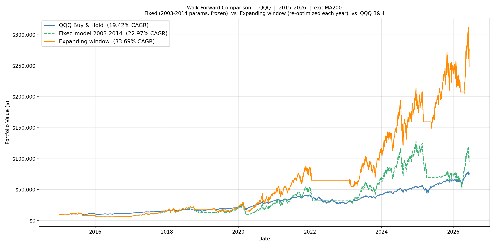 | 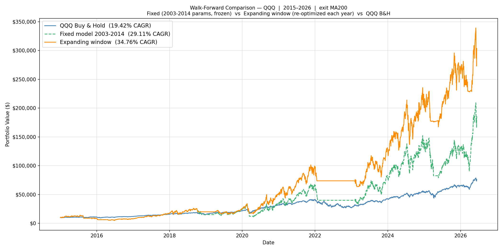 |
| 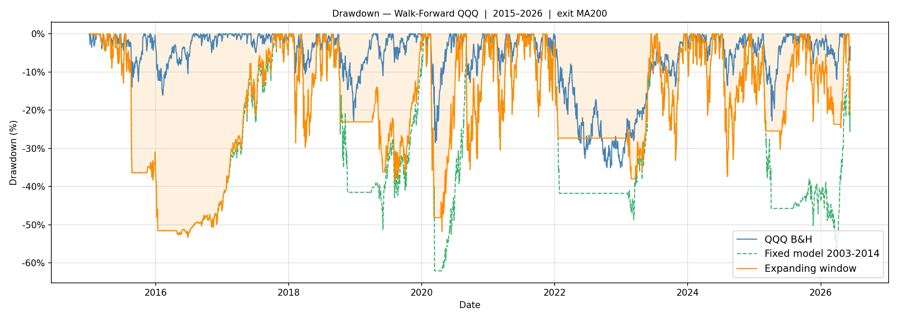 | 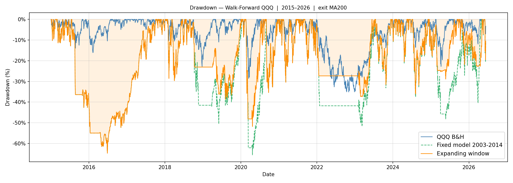 |

*Top row: equity curves. Bottom row: the **drawdown (underwater) curves** — how far below its prior peak each strategy sits at every moment. This is the lived experience of holding the strategy, and the honest companion to any return chart: the leveraged variants spend long stretches 30–50% underwater even while compounding far ahead of B&H.*

### SPY (MA50) — modest but real, on a faster exit

| Variant | Fixed | **Expanding** | B&H | Worst year (exp) |
|---|---|---|---|---|
| Aggressive — Max-CAGR (3×) | 17.9% | **13.3%** ✗ | 13.7% | −56.5% |
| DD-Capped ≤ 50% *(not shipped — slack)* | 17.9% | **13.3%** ✗ | 13.7% | −56.5% |
| **Balanced — Buy-Capped (3×)** | 17.9% | **16.7%** | 13.7% | −44.0% |
| Conservative — Calmar (2×) | 12.4% | **14.0%** | 13.7% | −22.9% |

**The honest finding, updated.** Plain CAGR re-optimization on SPY still *underperforms* buy-and-hold out-of-sample (13.3%), and the maxDD cap still does not help (slack on the windows that matter → identical failing combo). But on the **faster MA50 exit** the structural **buy-cap beats B&H by +3.0pp (16.7% vs 13.7%)**, and even the conservative Calmar 2× now edges B&H (14.0%) at a far gentler −22.9% worst year. Note the **Fixed** 2014-frozen model does best of all (17.9%): SPY rewards a *stable structural rule* more than aggressive annual re-optimization. The standing catch is the buy-cap variant's **−44% drawdowns**. **Verdict: SPY is tradeable but high-risk — beats B&H by a real but modest margin; QQQ remains the stronger, lower-stress engine.**

> **Why MA50, not the MA100 of earlier versions:** the exit MA was originally chosen under the Highest-CAGR rule, where MA50's −56% tail looked disqualifying. But SPY trades the buy-cap, and *under the buy-cap* MA50 beats MA100 (16.7% vs 14.7%) with the tail capped to −44%. The exit MA and the selection rule have to be chosen together (§5).

| Balanced — Buy-Capped (3×) | Conservative — Calmar (2×) |
|---|---|
| 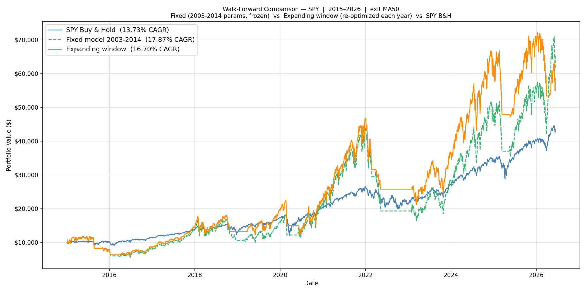 | 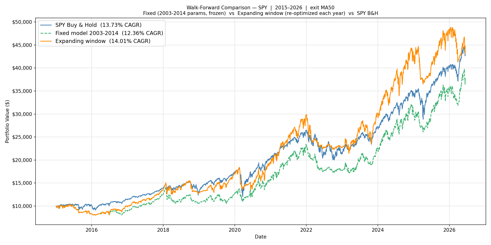 |
| 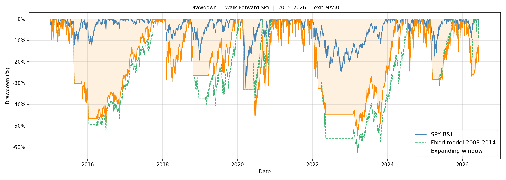 | 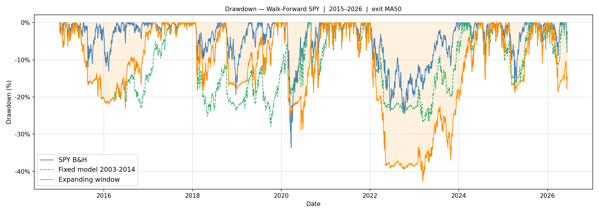 |

*Top row: equity curves. Bottom row: drawdown (underwater) curves (MA50 exit). The buy-cap variant's +3pp edge over B&H comes with −44% drawdowns; only the Conservative 2× rule keeps the underwater curve shallow (−22.9%) — the reason SPY is tradeable-but-risky rather than a clear win.*

### IWM (MA200) — not recommended

Expanding 6.2% vs 9.6% B&H — and *every* selection rule fails (maxDD≤50% 5.2%, Calmar 6.4%, buy-cap 1.0%). Small-cap LETF decay and unstable parameters; disclosed for completeness only.

---

## 8. Drawdown and tail risk

This is the section that should drive your choice of variant — more than the headline CAGR. A leveraged strategy lives or dies by how it behaves in the four crises below, so each one gets a chart and a market-history walk-through, not just a row of numbers.

> **Directly answering "would this prevent an 80% drawdown?"** For QQQ's **Aggressive** 3× config, no — only lower leverage shrinks that tail. The **Conservative** 2× roughly halves the worst drawdowns. And SPY's **Balanced (buy-cap)** config is structurally the most tail-resistant of all, because it deploys only ≤20% per dip — the *same* structural lever that lets it beat buy-and-hold (§6) also bounds its tail. The single most important finding of this whole study: **only structural exposure limits an unseen tail; an in-sample drawdown cap cannot.**

### The four crises at a glance

Each cell is **`period return · max drawdown`** — both measured *within that crisis window only*: the cumulative total return over the window (not annualized), then `·`, then the worst peak-to-trough fall suffered at any point inside it. A strategy can end green yet still have been deeply underwater (see COVID). All three QQQ variants and SPY Balanced, each next to its plain-index **buy & hold (1×)** benchmark; generated by [`crisis_analysis.py`](crisis_analysis.py).

| Crisis (window)<br><sub>cells = **total return · max drawdown**</sub> | QQQ Aggressive · Max-CAGR (3×) | QQQ Balanced · DD-Capped (3×) | QQQ Conservative · Calmar (2×) | _QQQ buy & hold (1×)_ | SPY Balanced · Buy-Capped (3×) | _SPY buy & hold (1×)_ |
|---|---|---|---|---|---|---|
| **Dot-com** 2000–2003 *(100% synthetic)* | −70.7% · **−92.1%** | −64.7% · −89.5% | −36.8% · −76.6% | _−61.5% · −83.0%_ | **+10.8% · −43.9%** | _−19.2% · −47.5%_ |
| **GFC** 2007–2009 | +64.7% · −38.8% | +52.8% · −39.7% | +38.5% · **−32.4%** | _−2.5% · −53.4%_ | +4.7% · −51.5% | _−23.1% · −55.2%_ |
| **COVID** 2020 | +103.9% · −51.8% | +97.0% · −45.5% | +65.0% · **−32.6%** | _+46.0% · −28.6%_ | +22.6% · −41.9% | _+17.2% · −33.7%_ |
| **2022 rate-hike** Nov'21–mid'23 | +8.9% · −38.0% | +7.0% · −35.9% | +4.7% · **−26.7%** | _−3.5% · −35.1%_ | −16.3% · −48.5% | _−1.0% · −24.5%_ |
| Full history 2003–2026 maxDD | −55.9% | −49.7% | **−34.2%** | _−53.4%_ | −51.5% | _−55.2%_ |

*The italic **buy & hold (1×)** columns are the plain index over the same window — the benchmark answering "would I just have been better off holding the index?" The strategy clears it comfortably in the GFC, COVID, and 2022 (and over the full record wins by a landslide — §7: 33.7% vs 19.4% CAGR). The **one** place it fails the benchmark is the dot-com secular bear, where the 3× variants (−71% / −65%) trail even 1× QQQ B&H (−61.5%) — the documented worst case, not hidden.*

Three patterns jump out before we even look at the charts: (1) the QQQ variants *side-step or profit from* every crisis **except** the dot-com secular bear, while **QQQ buy-and-hold loses in three of the four** (−61% dot-com, −2.5% GFC, −3.5% in 2022) — the MA exit is what turns those losses into gains. (2) The **Conservative 2×** column has the shallowest *strategy* drawdown in every crisis, the direct payoff for giving up ~7pp of CAGR. (3) SPY Balanced beats SPY buy-and-hold in the secular crash (dot-com +10.8% vs −19.2%) and COVID, but the grind-down bears (GFC, 2022) expose its deep drawdowns — and note SPY buy-and-hold's own drawdowns (−47% to −55%) are nearly as deep as the leveraged strategy's, because the 20% buy-cap keeps real exposure low.

### The timing rule vs. just holding the leveraged ETF

The 1× columns above ask *"should I index instead?"* This table asks the sharper question — *"does the MA timing rule actually earn its keep, or could I just buy and hold the 3× ETF?"* QQQ Aggressive is full 3× at buy 100%, so it differs from holding **TQQQ** by *nothing but the timing rule* — a clean isolation. (SPY Balanced only deploys 20%, so its row is "recommended SPY strategy vs holding **UPRO**," not a pure leverage match.)

| Crisis (window)<br><sub>cells = **total return · max drawdown**</sub> | QQQ Aggressive (3×, **timed**) | Hold TQQQ (3×, **no timing**) | SPY Balanced (**timed**) | Hold UPRO (3×, **no timing**) |
|---|---|---|---|---|
| **Dot-com** 2000–2003 | −70.7% · −92.1% | **−100.0% · −100.0%** | +10.8% · −43.9% | −85.0% · −94.2% |
| **GFC** 2007–2009 | +64.7% · −38.8% | −80.2% · −96.9% | +4.7% · −51.5% | −90.7% · −97.5% |
| **COVID** 2020 | +103.9% · −51.8% | +100.1% · −69.9% | +22.6% · −41.9% | +7.2% · −76.8% |
| **2022 rate-hike** Nov'21–mid'23 | +8.9% · −38.0% | −46.9% · −81.7% | −16.3% · −48.5% | −31.3% · −63.9% |
| **Full history 2003–2026** | **29.1% CAGR · −55.9% maxDD** | 24.6% CAGR · −96.9% maxDD | **24.4% CAGR · −51.5% maxDD** | 14.8% CAGR · −97.5% maxDD |

This is the strategy's real reason to exist. Holding the leveraged ETF straight through is a **wipeout in every decisive bear** — TQQQ −100% in the dot-com bust, −80% in the GFC (a −97% drawdown), −47% in 2022 — because daily-reset volatility decay plus an un-dodged crash compound against you. And it isn't just a risk story: over the full 23 years the **timed strategy earns *more* than buy-and-hold of the same leveraged ETF** (QQQ 29.1% vs 24.6%, SPY 24.4% vs 14.8% CAGR) at **roughly half the max drawdown** (−56% vs −97%). The MA exit adds return *and* cuts risk — the rare free lunch, and the entire point of not just holding TQQQ.

### Dot-com crash, 2000–2003 — the one case the strategy can't beat

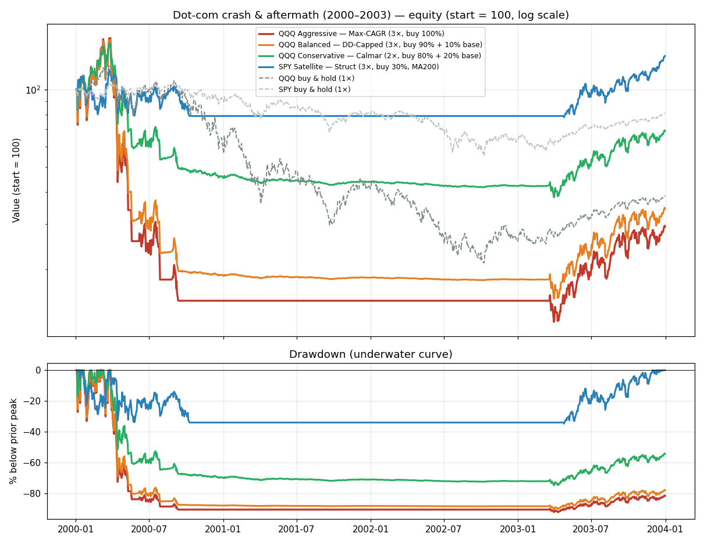

The Nasdaq-100 fell ~83% top-to-bottom (Mar 2000 → Oct 2002) — but not in a straight line. It was a 2.5-year *grind* punctuated by ferocious bear rallies (the Nasdaq had multiple +30–40% bounces on the way down). That is precisely the environment that breaks this strategy: each rally lifted QQQ back above its MA200, **re-armed** the rule, and triggered fresh leveraged dip-buys — only for the next leg down to break the MA and force an exit at a loss. Repeat that whipsaw a dozen times with 3× leverage and you get **−92%**. Dropping to 2× only softens it to −77%: *leverage itself is the tail driver here, not the timing rule.* The lone survivor is **SPY Balanced (+10.8%)**, because deploying just 20% per dip on a fast MA50 exit keeps total exposure small enough that the whipsaws can't compound into ruin. (Caveat: this window is **100% synthetic** leveraged data — real TQQQ/UPRO launched 2009–2010 — and SPY here is both a different index *and* a far smaller exposure, so read it as "the buy-cap structure survives," not "SPY beats QQQ.")

### Global Financial Crisis, 2007–2009 — the trend filter doing its job

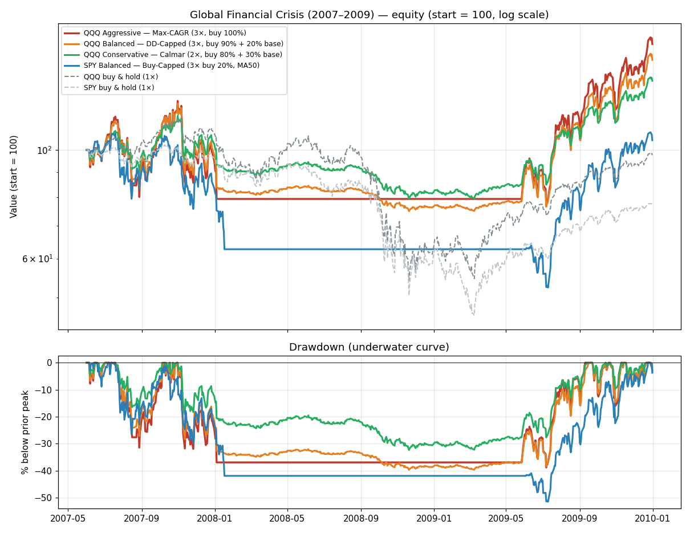

Markets topped in October 2007 and fell ~55% into March 2009 — but as a more *decisive* downtrend than dot-com. The MA200 broke cleanly in late 2007/early 2008, the strategy moved to cash, and it **sat out the catastrophic autumn-2008 collapse** entirely (the long flat stretch in the equity panel), then re-armed into the explosive 2009 recovery. The result is the headline case *for* the strategy: **QQQ Aggressive +64.7% across a window where buy-and-hold lost ~54%**, with the drawdown held to −38.8%. The asterisk is **SPY Balanced**: +4.7% but a **−51.5% drawdown, deeper than any QQQ variant**. Its deep 0.93×MA50 exit plus repeated 20% dip-buys got chopped in the violent late-2008 swings before the exit fully disengaged — the first sign that SPY's faster, deeper exit is a higher-drawdown animal.

### COVID crash, 2020 — too fast to dodge, fast enough to recover

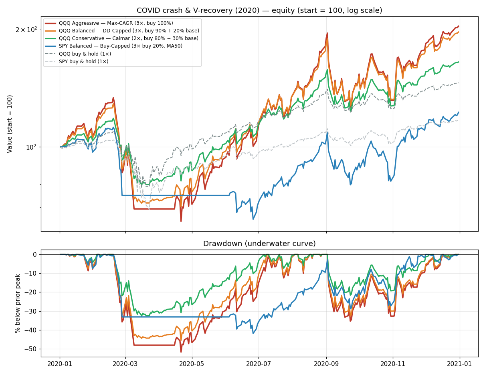

The COVID crash was the fastest bear in history: the S&P fell ~34% in about five weeks (Feb 19 → Mar 23 2020). It was **so abrupt that the MA200 exit could not get ahead of it** — QQQ Aggressive took a brutal ~−52% *intra-crash* drawdown before the trend broke and it sold to cash near the lows. But the recovery was just as violent and V-shaped, and because the rule **re-arms and re-levers** the moment the uptrend reconfirms, it rode the rebound back up: 2020 finished **+103.9%** (Aggressive) / +65% (Conservative). The dual lesson: a *gap-down* crash will hurt you before any trend filter can react — but the rule's mechanical willingness to buy back in is what captures the recovery a shaken discretionary trader usually misses.

### 2022 rate-hike bear, Nov 2021 – mid 2023 — a mild rhyme of dot-com

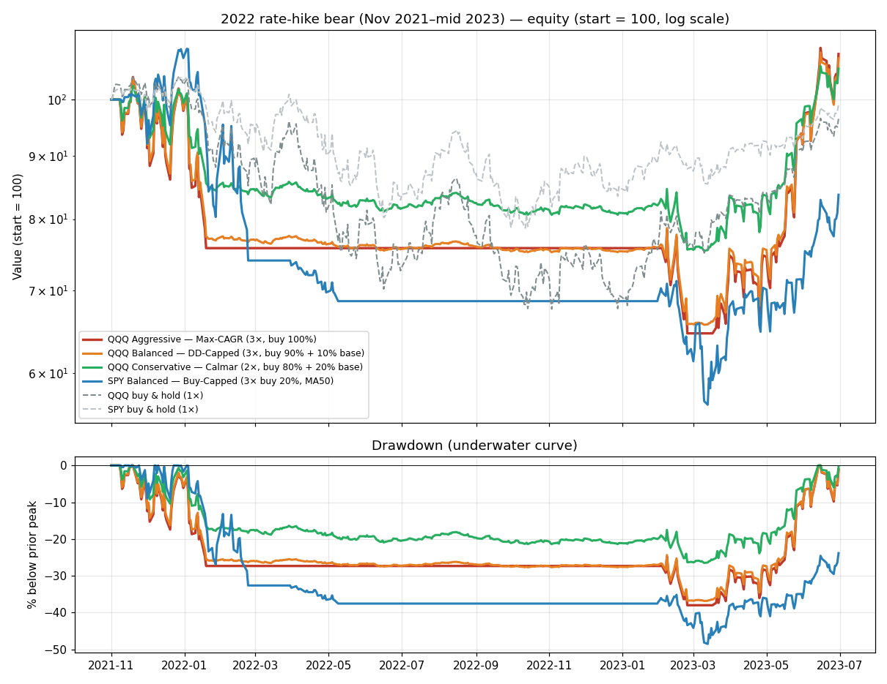

The Fed's hiking cycle drove a slow, choppy ~35% Nasdaq decline through 2022 — a series of lower highs and failed rallies, structurally the same whipsaw pattern as dot-com but milder and shorter. QQQ's slow MA200 exited early and kept it **mostly in cash through 2022**, so it ended the window slightly *positive* (+8.9% Aggressive, +4.7% Conservative) at a −38% drawdown. **SPY Balanced was the worst performer (−16.3%, −48.5% maxDD)**: the faster MA50 exit plus repeated 20% dip-buys into a grinding decline produced exactly the whipsaw losses that cap SPY's edge — this is the live illustration of the **−44% walk-forward worst year** that makes SPY "tradeable but high-risk" (§7).

### What the four crises teach

1. **Ordinary bears: the MA exit works.** In the GFC, COVID, and 2022 the trend filter moved QQQ to cash before (or quickly after) the worst, so all three QQQ variants ended *positive* across every one of those windows. This is the strategy's core value: it sidesteps the bears that wipe out a buy-and-hold leveraged position.
2. **The catastrophic case is a sustained, choppy secular bear** (dot-com), where repeated arm→buy→whipsaw-out cycles bleed capital — and 3× leverage turns that bleed into a −92% wound. That tail is **outside all training data** (the optimizer trains on 2003-onward, which contains no dot-com-scale secular bear), so neither a selection rule nor an in-sample maxDD cap is calibrated against it.
3. **Only *structural* exposure limits the tail.** Moving QQQ 3×→2× cut the dot-com drawdown −92%→−77%; SPY's ≤20% buy-cap held the *same* secular bear to −44% while still beating B&H out-of-sample. To bound QQQ's tail further you would need lower leverage, a hard circuit-breaker on portfolio drawdown, or simply refusing to trade through a confirmed multi-year secular bear.
4. **Pick your variant by your worst-case stomach, using the crisis charts — not the CAGR.** Conservative 2× has the shallowest drawdown in every single crisis; Aggressive 3× has the deepest but the highest growth; SPY Balanced is uniquely tail-safe in a secular crash yet uniquely fragile in a grind-down bear.

For reference, the full 23-year equity and underwater curves of the two headline configs:

| QQQ Aggressive · Max-CAGR (3×) — 2003–2026 | SPY Balanced · Buy-Capped (3×, MA50) — 2003–2026 |
|---|---|
| 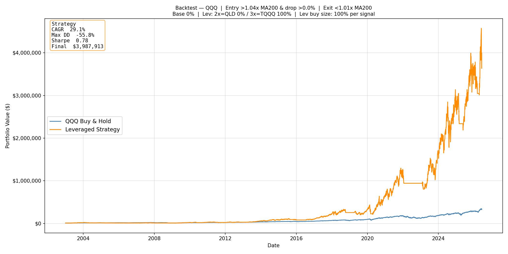 | 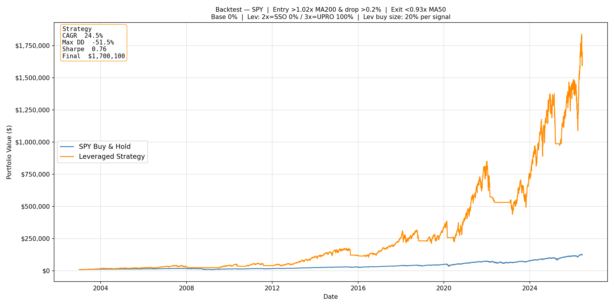 |
| 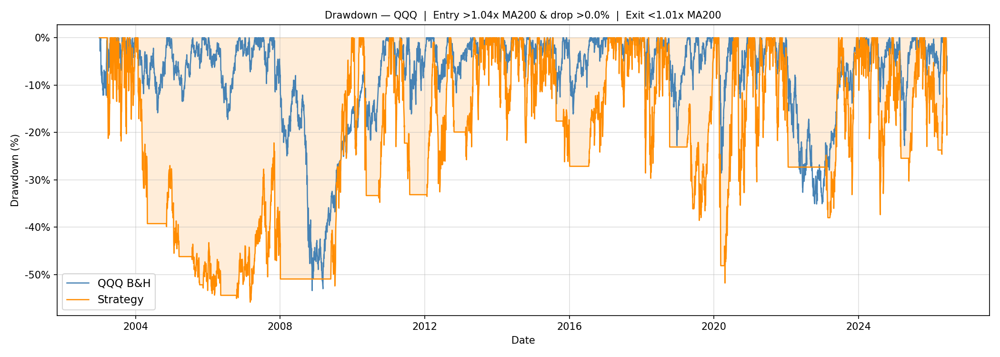 | 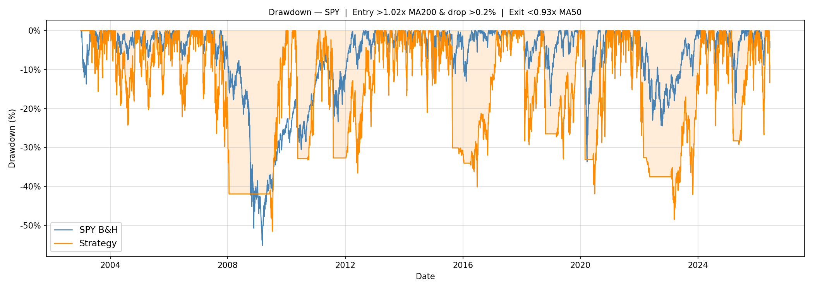 |

*Even the configs that beat buy-and-hold spend years 30–50% below their prior peak — the lived cost of leverage. The QQQ 3× curve is the more violent ride; the SPY buy-cap curve is shallower in normal times precisely because only 20% is deployed per dip.*

---

## 9. Risk and design honesty

- **Anchor on walk-forward, not full-history.** The 23-year backtest is hindsight-optimized. The 2015–2026 walk-forward (QQQ 33.7% Aggressive / 34.2% Balanced) is the realistic forward expectation.
- **SPY is modest-but-real; IWM fails.** On the MA50 exit with the buy-cap, SPY beats B&H by ~3pp out-of-sample (§7) — worth trading, but with −44% drawdowns and far less margin than QQQ. IWM loses outright. The strategy's durable edge is still QQQ.
- **An in-sample drawdown cap cannot bound an out-of-sample tail.** It only constrains what the backtest already contained (§6). The structural levers (buy-size cap, lower leverage) are the ones that limit an unseen tail.
- **3× requires stomaching −20% to −35% calendar years.** If you cannot, trade the Conservative 2× variant or stay unleveraged.
- **Taxes are the largest real cost.** In an Ontario taxable account at $100k salary, QQQ Aggressive nets ~25% vs 29% pre-tax. Use TFSA → RRSP → taxable.
- **Synthetic-data dependence.** ~6–7 early years rely on the leverage-decay model; the dot-com numbers especially are approximations, not traded prices.

---

## 10. Technical reference

**Run the optimizer (one window, all combos):**
```bash
python optimizer.py --preset QQQ --exit-ma 200 --no-show
```

**Walk-forward all variants in one grid pass (saves every window's grid):**
```bash
python walkforward.py --preset QQQ --exit-ma 200 --select cagr,maxdd50,calmar \
  --start-year 2015 --end-year 2026 --no-show
```

**Browse / re-derive any rule from the saved grids (no re-search, seconds):**
```bash
python walkforward.py --preset QQQ --exit-ma 200 --select buycap50 --from-grids --no-show
```

**Selection / filter flags:** `--select` takes a comma-separated list of `cagr`, `maxdd{N}` (real-period maxDD ceiling, e.g. `maxdd50`), `buycap{N}` (structural buy-size cap, e.g. `buycap50`), `calmar` — one grid pass yields all. `--dd-limit 0.40` (calendar-year filter); `--cash-yield` (T-bill sleeve); `--from-grids` (re-derive from saved grids); `--no-save-grids` (skip grid dumps).

**Authoritative single-config backtest:**
```bash
python backtester.py --preset QQQ --start 2003-01-01 \
  --entry-signal 1.04 --drop-level 0.0 --exit-signal 1.01 \
  --buy-pct 1.0 --alloc-base 0 --alloc-x2 0 --alloc-x3 1 --no-show
```

**Repository layout:**
- `optimizer_core.py` — shared engine (data + synthetic NAV + MER, backtest loop, calendar-year DD filter, real-period maxDD, grid, parallel search). Single source of truth.
- `optimizer.py` — full-window grid-search CLI → `results/optimizer/{preset}/`
- `walkforward.py` — expanding-window validation → `results/walkforward/` (and per-window grids in `results/walkforward/grids/{preset}/`)
- `backtester.py` — authoritative single-config runner → `results/backtester/{preset}/`
- `param_heatmap.py` — robustness heatmaps
- `run_build.py` — reproduces the full result set (optimizers + multi-select walk-forwards)
- `results/README_DATA_LEDGER.md` — every figure in this paper with its source file

**Output filename tags:** `_ma{N}` (non-200 exit), `_sel{rule}` (non-CAGR selection, e.g. `_selmaxdd50`, `_selbuycap50`, `_selcalmar`), `_dd{N}` (non-40% filter), `_cy` (cash yield). Variants never collide.

---

## Appendix — full reference (expand when you forget a detail)

<details>
<summary><b>A · Parameter glossary — what every knob means</b></summary>

Every strategy is just these eight numbers. Arming (deciding we're in an uptrend) **always** uses MA200; only the *exit* MA is tunable.

| Parameter | CLI flag | Meaning | Range tested | QQQ / SPY value |
|---|---|---|---|---|
| `entry_signal` | `--entry-signal` | **Arm** (allow buying) when price > `MA200 × entry`. Higher = wait for a stronger uptrend. | 1.01–1.06 | 1.04 / 1.02 |
| `drop_level` | `--drop-level` | Once armed, a single-day fall ≥ this fires a buy. `0` = buy any non-up day; **negative** = buy even on a mildly-up day. | −1.0% … +2.0% | 0.0% / 0.25% |
| `exit_signal` | `--exit-signal` | **Sell all leverage** when price < `exit_MA × exit`. Lower = exit later (ride deeper). | 0.93–1.02 | 1.01 / 0.93–0.94 |
| `buy_pct` | `--buy-pct` | Per-buy deployment ceiling: each buy puts `min(buy_pct × total, cash)` into leverage. **Capped by cash**, so `buy_pct + alloc_base` can read past 100% on paper (e.g. 90% + 20%) yet still total ≤100% invested — the cushion is funded first, leverage gets the rest. | 10%–100% | 100% / 20% |
| `alloc_base` | `--alloc-base` | One-time un-leveraged base-ETF cushion, filled on the first buy of a cycle and trimmed back on the first exit. | 0%–30% | 0% / 0% |
| `alloc_x2` | `--alloc-x2` | Share of the **leveraged tranche** put in the 2× ETF (QLD/SSO). | 0%–100% | — |
| `alloc_x3` | `--alloc-x3` | Share of the leveraged tranche in the 3× ETF (TQQQ/UPRO). `alloc_x2 + alloc_x3 = 1`. | 0%–100% | 100% / 100% |
| `exit_ma` | `--exit-ma` | MA period for the **exit** signal only (50 / 100 / 200). Arming always uses MA200. | 50 / 100 / 200 | 200 / 50 |

</details>

<details>
<summary><b>B · Every shipped variant's exact parameters (so you never re-derive them)</b></summary>

Full-history (2003 → 2026) optimizer picks — these match the §4 backtests and the chart filenames. The **live trade-year row in §1** is re-optimized each January and has been essentially identical; trade that one when it differs.

| Variant | entry | drop | exit | buy% | base | x2 | x3 | exit MA | Holds |
|---|---|---|---|---|---|---|---|---|---|
| **QQQ Aggressive — Max-CAGR** | 1.04 | 0.0% | 1.01 | 100% | 0% | 0% | 100% | MA200 | TQQQ (3×) |
| **QQQ Balanced — DD-Capped** | 1.04 | 0.0% | 1.01 | 90% | 20% | 0% | 100% | MA200 | QQQ + TQQQ (3×) |
| **QQQ Conservative — Calmar** | 1.04 | 0.0% | 1.01 | 80% | 30% | 100% | 0% | MA200 | QQQ + QLD (2×) |
| **SPY Balanced — Buy-Capped** | 1.02 | 0.25% | 0.93 | 20% | 0% | 0% | 100% | MA50 | UPRO (3×) |

*To reproduce any row:* `python backtester.py --preset QQQ --entry-signal 1.04 --drop-level 0.0 --exit-signal 1.01 --buy-pct 1.0 --alloc-base 0 --alloc-x2 0 --alloc-x3 1 --exit-ma 200`. Swap in the row's values (SPY uses `--exit-ma 50`).

</details>

<details>
<summary><b>C · File-by-file reference — what each file does, how to run it, where it writes</b></summary>

| File | What it is | Typical command | Output |
|---|---|---|---|
| `optimizer_core.py` | **The engine.** Data download + synthetic-NAV/MER model, the backtest loop, the −40% calendar-year DD filter, real-period maxDD, the grid, and the parallel search. Single source of truth — imported by everything else, not run directly. | *(imported)* | — |
| `optimizer.py` | Grid-search **one** training window, keeping every combo (the raw return/risk landscape). | `python optimizer.py --preset QQQ --exit-ma 200 --no-show` | `results/optimizer/{preset}/` |
| `walkforward.py` | **The honest test.** Re-runs the grid each year on an expanding window, freezes the pick, backtests the schedule. Saves every window's full grid so any rule re-derives in seconds (`--from-grids`). | `python walkforward.py --preset QQQ --exit-ma 200 --select cagr,maxdd50,calmar` | `results/walkforward/` (+ `grids/`) |
| `backtester.py` | **Authoritative single-config run** — full precision, with a trade log, transaction costs, T-bill cash-yield, and Ontario tax. The source of any cited CAGR/maxDD/trade count. | `python backtester.py --preset QQQ --entry-signal 1.04 …` | `results/backtester/{preset}/` |
| `crisis_analysis.py` | **Trade-frequency stats (§1) + per-crisis comparison figures (§8).** Counts buys/exits per variant and plots each crisis. | `python crisis_analysis.py` | `results/crisis/` |
| `param_heatmap.py` | Parameter robustness heatmaps (§4) — shows the optimum sits on a broad plateau, not a fragile spike. | `python param_heatmap.py` | `results/optimizer/param_robustness_heatmap.png` |
| `run_backtests.py` | Runs the backtester validation **suite** for each optimizer's top combo (full history, +cash-yield, +Ontario tax, 2× comparison, and the four crisis windows). | `python run_backtests.py` | `results/backtester/{preset}/` |
| `run_build.py` | Sequential driver that **reproduces the entire result set** (optimizers + multi-select walk-forwards). One parent process so it's easy to stop. | `python run_build.py` | all of `results/` |
| `results/README_DATA_LEDGER.md` | Working scratch: every figure and number in this paper mapped to its source file. | *(read)* | — |
| **`daily_signal/`** (companion repo) | Runs the **identical engine** (`optimizer_core.py` is vendored there) to send live BUY/SELL/HOLD Telegram signals 3×/day and re-optimize every January. | see its README | `config/params.json` |

**Common flags (most tools):** `--no-show` (don't pop plot windows), `--cash-yield` (accrue T-bill interest on idle cash), `--tax-ontario --salary N` (model an Ontario taxable account), `--preset {QQQ,SPY,IWM}`, `--exit-ma {50,100,200}`.

</details>

<details>
<summary><b>D · Command-line flags for every script</b></summary>

Exhaustive per-script reference. `crisis_analysis.py`, `run_backtests.py`, and `run_build.py` take **no flags** — run them as-is (`python <file>.py`).

#### `optimizer.py` — grid-search one window

| Flag | Type / default | What it does |
|---|---|---|
| `--preset` | QQQ \| SPY \| IWM · **QQQ** | Which base/2×/3× ETF set to search. |
| `--exit-ma` | 50 \| 100 \| 200 · **200** | MA period for the **exit** signal (arming always uses MA200). |
| `--grid` | v1 \| v2 \| v3 \| v3cap · **v3** | Parameter grid (defined in `optimizer_core.GRID_AXES`). v3 = the 72k production grid; others reproduce historical studies. |
| `--end` | date · **data end** | Data end date, **exclusive**. Use e.g. `2014-12-31` to search only a training window. |
| `--workers` | int · **CPU cores − 2** | Parallel worker processes. Results are identical regardless of count. |
| `--top` | int · **20** | Number of leaderboard rows to print and save. |
| `--no-show` | flag | Don't open interactive plot windows (files still saved). |

#### `walkforward.py` — expanding-window validation (the honest test)

| Flag | Type / default | What it does |
|---|---|---|
| `--preset` | QQQ \| SPY \| IWM · **QQQ** | ETF set. |
| `--start-year` | int · **2015** | First trade year scored out-of-sample. |
| `--end-year` | int · **2026** | Last trade year. |
| `--capital` | float · **10000** | Starting capital for the Phase-2 backtest. |
| `--exit-ma` | 50 \| 100 \| 200 · **200** | Exit MA period (arm/entry always MA200). |
| `--workers` | int · **CPU cores − 2** | Parallel workers for the Phase-1 grid search. |
| `--grid` | v1…v3cap · **v3** | Optimizer grid version. |
| `--select` | csv · **cagr,maxdd50,buycap50** | Selection rule(s) applied to each window's survivors, comma-separated to derive several **in one grid pass**: `cagr` (Aggressive), `maxdd{N}` (DD-Capped, e.g. `maxdd50`), `buycap{N}` (Buy-Capped, e.g. `buycap50`), `calmar` (Conservative). |
| `--from-grids` | flag | Re-derive the schedule(s) from per-window grids saved earlier (seconds, no re-search). |
| `--no-save-grids` | flag | Don't write each window's full grid to `results/walkforward/grids/`. |
| `--max-dd` | float · **1.0** | Hard real-period maxDD ceiling for the Phase-1 filter (e.g. `0.50` rejects combos drawing worse than −50%). 1.0 = off. |
| `--dd-limit` | float · **0.40** | Calendar-year loss cap for the pass/fail filter (e.g. `0.30` rejects any combo that lost >30% in a year). |
| `--cash-yield` | flag | Accrue daily T-bill (^IRX) interest on idle cash in Phase 2 (models SGOV/BIL). |
| `--no-rebuild` | flag | Skip Phase 1 if the schedule JSON already exists. |
| `--only-year` | int · None | Optimize only this single trade year (train 2003→year−1) and merge into the schedule — the annual re-opt. |
| `--no-show` | flag | Suppress plot windows. |

#### `backtester.py` — authoritative single-config run

| Flag | Type / default | What it does |
|---|---|---|
| `--preset` | QQQ \| SPY \| IWM · **QQQ** | ETF set. |
| `--start` | date · **preset inception** | Backtest start (e.g. `2003-01-01`, or `2007-06-01` for a crisis window). |
| `--end` | date · **today** | Backtest end. |
| `--capital` | float · **10000** | Starting capital. |
| `--entry-signal` | float · **1.04** | Arm when price > `MA200 × entry`. |
| `--drop-level` | float · **0.01** | Min single-day drop to fire a buy (`0.0` = any non-up day; negative = buy on mildly-up days). |
| `--exit-signal` | float · **1.00** | Exit when price < `exit_MA × exit`. |
| `--buy-pct` | float · **0.20** | Fraction of portfolio deployed per buy. |
| `--alloc-base` | float · **0.20** | One-time base-ETF cushion (filled first buy, trimmed first exit). |
| `--alloc-x2` | float · **0.00** | Share of the leveraged tranche in the 2× ETF. |
| `--alloc-x3` | float · **1.00** | Share in the 3× ETF (`x2 + x3 = 1`). |
| `--exit-ma` | 50 \| 100 \| 200 · **200** | Exit-signal MA period. |
| `--cost-per-trade` | float · **0.0** | One-way transaction cost as a fraction of trade value (e.g. `0.001` = 0.1%), charged on every buy and sell. |
| `--cash-yield` | flag | Accrue T-bill interest on idle cash. |
| `--tax-ontario` | flag | Model an Ontario taxable account (50% CG inclusion, interest 100% taxable, loss carry-forward, tax paid each January). **Not** for TFSA/RRSP. |
| `--salary` | float · **100000** | Employment income the gains stack on (sets the marginal rate). Only with `--tax-ontario`. |
| `--save-plot` | path · None | Save the chart to this path instead of showing it. |
| `--no-show` | flag | Suppress the interactive plot window. |

#### `param_heatmap.py` — robustness heatmaps

| Flag | Type / default | What it does |
|---|---|---|
| `--grid` | str · **v3** | Grid version whose saved optimizer results to summarize. |
| `--no-show` | flag | Suppress plot window (PNG still saved). |

</details>
